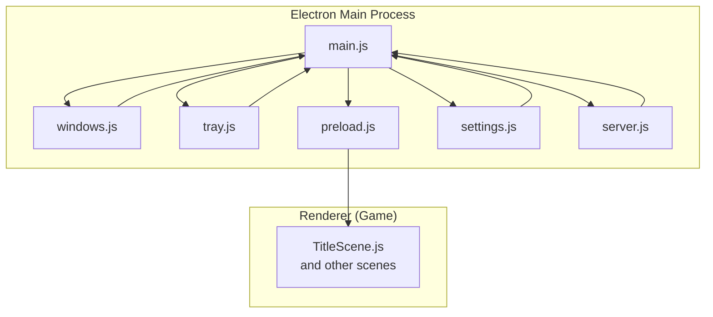
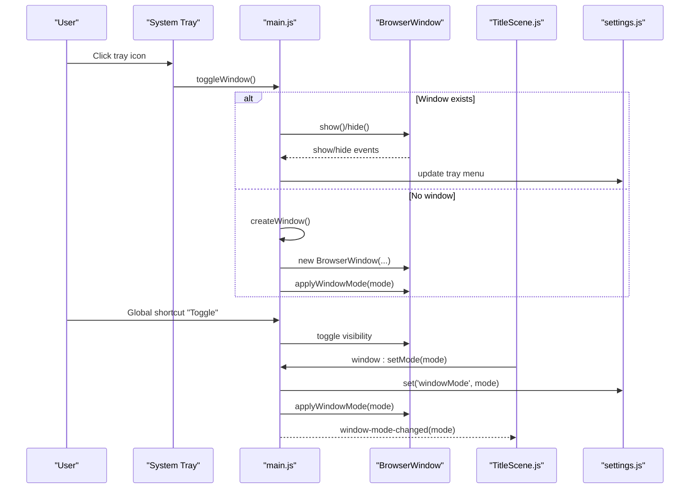
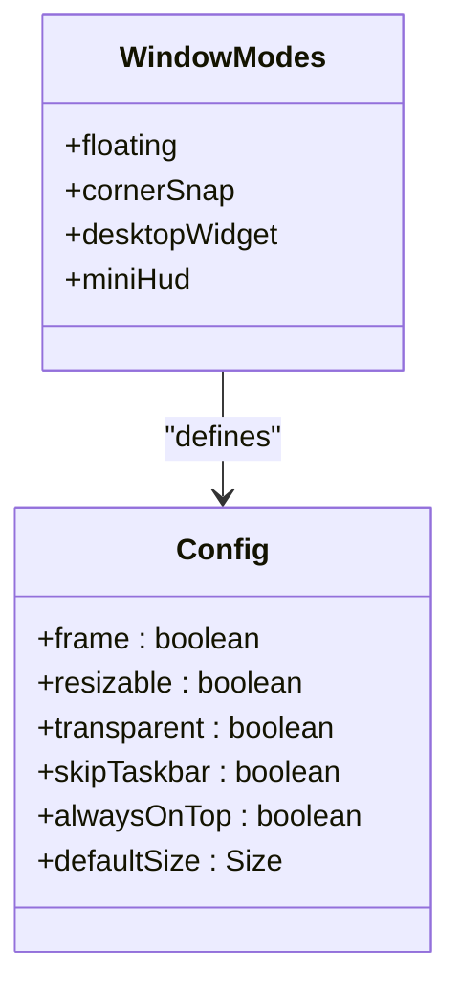
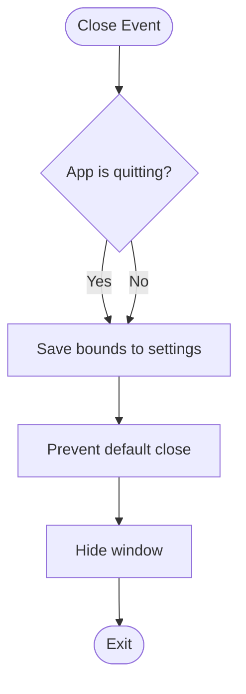
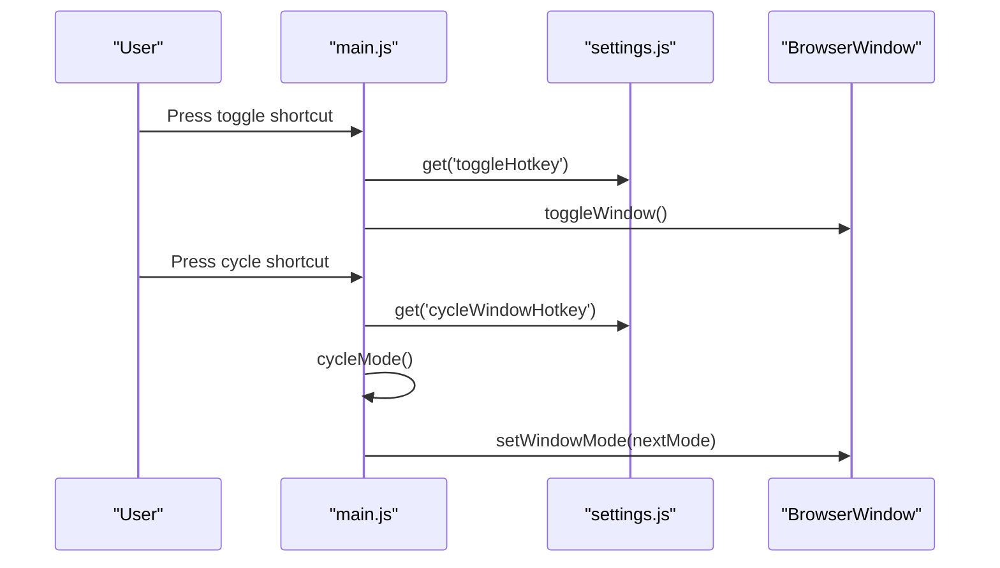
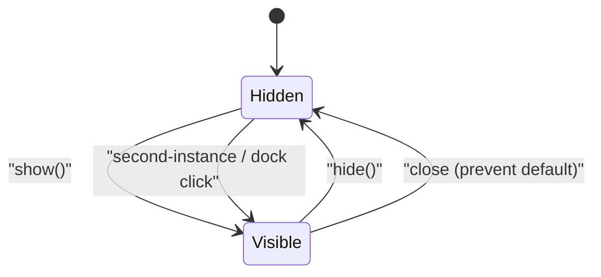
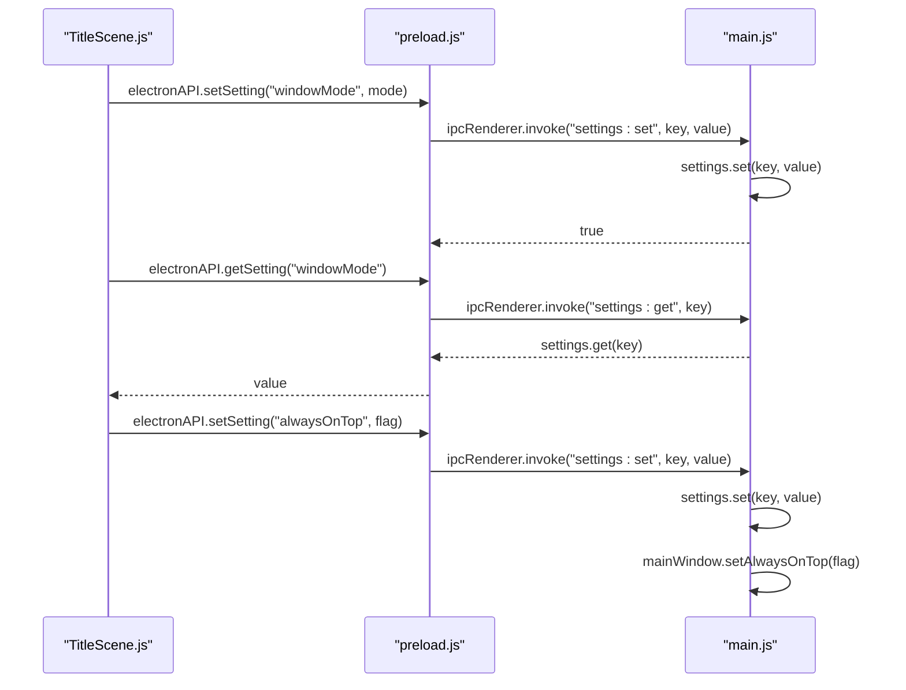
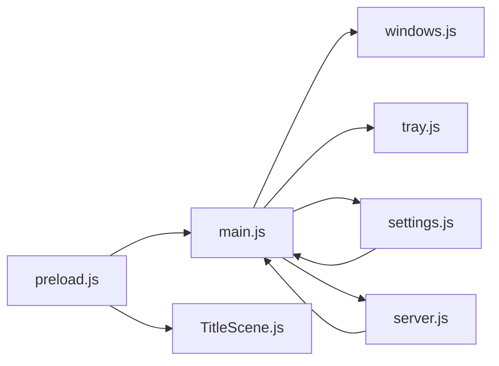

# Window Management

<cite>
**Referenced Files in This Document**
- [main.js](file://electron/main.js)
- [windows.js](file://electron/windows.js)
- [settings.js](file://electron/settings.js)
- [tray.js](file://electron/tray.js)
- [preload.js](file://electron/preload.js)
- [server.js](file://electron/server.js)
- [TitleScene.js](file://src/scenes/TitleScene.js)
- [en.js](file://src/locales/en.js)
</cite>

## Table of Contents
1. [Introduction](#introduction)
2. [Project Structure](#project-structure)
3. [Core Components](#core-components)
4. [Architecture Overview](#architecture-overview)
5. [Detailed Component Analysis](#detailed-component-analysis)
6. [Dependency Analysis](#dependency-analysis)
7. [Performance Considerations](#performance-considerations)
8. [Troubleshooting Guide](#troubleshooting-guide)
9. [Conclusion](#conclusion)

## Introduction
This document explains the Vibe-Coder desktop window management system built with Electron. It covers window modes (floating, corner snap, desktop widget, mini HUD), state persistence (position, size, bounds), global shortcuts for toggling and cycling modes, lifecycle management (minimize-to-tray, focus handling), frameless/transparency options, configuration, resize constraints, cross-platform differences, IPC communication, and integration with the main application state.

## Project Structure
The window management system spans several Electron modules and integrates with the renderer via a preload bridge and settings store.

**Diagram sources**
- [main.js](file://electron/main.js#L1-L274)
- [windows.js](file://electron/windows.js#L1-L130)
- [settings.js](file://electron/settings.js#L1-L51)
- [tray.js](file://electron/tray.js#L1-L176)
- [preload.js](file://electron/preload.js#L1-L43)
- [server.js](file://electron/server.js#L1-L183)
- [TitleScene.js](file://src/scenes/TitleScene.js#L2445-L2463)

**Section sources**
- [main.js](file://electron/main.js#L1-L274)
- [windows.js](file://electron/windows.js#L1-L130)
- [settings.js](file://electron/settings.js#L1-L51)
- [tray.js](file://electron/tray.js#L1-L176)
- [preload.js](file://electron/preload.js#L1-L43)
- [server.js](file://electron/server.js#L1-L183)
- [TitleScene.js](file://src/scenes/TitleScene.js#L2445-L2463)

## Core Components
- Main window creation and lifecycle: manages bounds, close behavior, focus, and tray updates.
- Window mode manager: applies mode-specific settings and positions.
- Settings store: persists window mode, bounds, always-on-top, corner position, and hotkeys.
- Tray integration: dynamic menu reflecting window state and allowing quick actions.
- Preload bridge: exposes safe IPC APIs to the renderer.
- Global shortcuts: toggle visibility and cycle modes.
- XP server integration: forwards XP events to the renderer and tray.

**Section sources**
- [main.js](file://electron/main.js#L20-L79)
- [windows.js](file://electron/windows.js#L60-L106)
- [settings.js](file://electron/settings.js#L3-L35)
- [tray.js](file://electron/tray.js#L92-L159)
- [preload.js](file://electron/preload.js#L4-L37)
- [server.js](file://electron/server.js#L44-L73)

## Architecture Overview
The main process creates the BrowserWindow, registers global shortcuts, sets up IPC handlers, and applies window modes. The renderer communicates via the preload bridge. The tray reflects runtime state and allows quick actions.

**Diagram sources**
- [main.js](file://electron/main.js#L81-L120)
- [windows.js](file://electron/windows.js#L60-L106)
- [tray.js](file://electron/tray.js#L92-L159)
- [TitleScene.js](file://src/scenes/TitleScene.js#L2445-L2463)

## Detailed Component Analysis

### Window Modes
The system defines four modes with distinct characteristics:
- Floating: resizable, frame, normal taskbar presence, default size 800x600.
- Corner Snap: fixed size 400x300, always-on-top, non-resizable, snapped to a corner.
- Desktop Widget: frameless, transparent, skip taskbar, centered, always behind other windows (special handling).
- Mini HUD: frameless, transparent, skip taskbar, always-on-top, small size 200x150.

**Diagram sources**
- [windows.js](file://electron/windows.js#L4-L41)

Behavioral highlights:
- Corner snapping uses saved corner position and places the window near monitor edges.
- Desktop widget centers on screen and uses platform-specific visibility behavior on macOS.
- Mini HUD is always-on-top and positioned by default in the bottom-right corner.

**Section sources**
- [windows.js](file://electron/windows.js#L4-L41)
- [windows.js](file://electron/windows.js#L60-L106)
- [windows.js](file://electron/windows.js#L115-L127)

### Window State Persistence
- Bounds persistence: on close, the main process saves current window bounds to settings and prevents actual closure by hiding the window instead.
- Restore behavior: on startup or mode change, the system restores saved bounds for floating mode or applies mode-specific sizes and positions.
- Corner position: persisted separately for corner snap mode.

**Diagram sources**
- [main.js](file://electron/main.js#L56-L68)

**Section sources**
- [main.js](file://electron/main.js#L20-L24)
- [main.js](file://electron/main.js#L56-L68)
- [windows.js](file://electron/windows.js#L94-L100)

### Global Shortcut System
- Toggle: default CommandOrControl+Shift+V; toggles window visibility.
- Cycle window mode: default CommandOrControl+Shift+W; cycles through modes.
- Shortcuts are registered at startup and unregistered on quit.

**Diagram sources**
- [main.js](file://electron/main.js#L160-L171)
- [settings.js](file://electron/settings.js#L32-L35)

**Section sources**
- [main.js](file://electron/main.js#L160-L171)
- [settings.js](file://electron/settings.js#L32-L35)

### Window Lifecycle Management
- Minimize-to-tray: on close, the window is hidden instead of closed; subsequent clicks on the tray icon show the window.
- Focus handling: showing the window focuses it; restoring from tray focuses it.
- Single instance: second instances bring the existing window to front.
- macOS activation: re-shows the window when clicking the dock icon.

**Diagram sources**
- [main.js](file://electron/main.js#L81-L93)
- [main.js](file://electron/main.js#L244-L256)
- [main.js](file://electron/main.js#L234-L242)

**Section sources**
- [main.js](file://electron/main.js#L56-L79)
- [main.js](file://electron/main.js#L81-L93)
- [main.js](file://electron/main.js#L244-L256)
- [main.js](file://electron/main.js#L234-L242)

### Frameless Windows and Transparency
- Desktop widget and mini HUD use frameless windows with transparency.
- Desktop widget is placed behind other windows; on macOS, it uses workspace visibility to behave like a desktop widget.
- Floating and corner snap windows retain frames and standard behavior.

**Section sources**
- [windows.js](file://electron/windows.js#L23-L40)
- [windows.js](file://electron/windows.js#L80-L94)
- [main.js](file://electron/main.js#L40-L45)

### Resize Constraints and Cross-Platform Differences
- Resizable flag is mode-specific; corner snap and mini HUD disable resizing.
- Always-on-top is applied per mode and can be toggled independently.
- Corner snapping uses screen geometry and respects saved corner position.
- Desktop widget visibility differs on macOS via workspace settings.

**Section sources**
- [windows.js](file://electron/windows.js#L60-L106)
- [windows.js](file://electron/windows.js#L115-L127)

### IPC Communication for Window Operations
The preload bridge exposes safe APIs to the renderer:
- Window controls: minimize, maximize, close.
- Settings: get and set keys.
- Game state: send updates for tray.
- Server state: get server status and toggle server mode.
- Event listeners: receive XP events and window mode changes.

Renderer-to-main IPC handlers:
- window:minimize, window:maximize, window:close.
- settings:get, settings:set.
- window:setMode, window:toggleAlwaysOnTop.
- server:getState, server:toggle.
- game:state.

**Diagram sources**
- [preload.js](file://electron/preload.js#L4-L37)
- [main.js](file://electron/main.js#L173-L203)
- [settings.js](file://electron/settings.js#L39-L46)

**Section sources**
- [preload.js](file://electron/preload.js#L4-L37)
- [main.js](file://electron/main.js#L173-L203)
- [settings.js](file://electron/settings.js#L39-L46)

### Integration with Main Application State
- Tray menu reflects current window mode, always-on-top state, server status, and game stats.
- XP events from the built-in server are forwarded to the renderer and tray.
- Game state updates are sent from the renderer to the main process to refresh tray content.

**Section sources**
- [tray.js](file://electron/tray.js#L92-L159)
- [server.js](file://electron/server.js#L44-L73)
- [main.js](file://electron/main.js#L128-L144)

## Dependency Analysis
The main process orchestrates window creation, mode application, tray updates, and IPC. The renderer interacts via the preload bridge. Settings drive persistence and UI configuration.

**Diagram sources**
- [main.js](file://electron/main.js#L1-L274)
- [windows.js](file://electron/windows.js#L1-L130)
- [settings.js](file://electron/settings.js#L1-L51)
- [tray.js](file://electron/tray.js#L1-L176)
- [preload.js](file://electron/preload.js#L1-L43)
- [server.js](file://electron/server.js#L1-L183)
- [TitleScene.js](file://src/scenes/TitleScene.js#L2445-L2463)

**Section sources**
- [main.js](file://electron/main.js#L1-L274)
- [windows.js](file://electron/windows.js#L1-L130)
- [settings.js](file://electron/settings.js#L1-L51)
- [tray.js](file://electron/tray.js#L1-L176)
- [preload.js](file://electron/preload.js#L1-L43)
- [server.js](file://electron/server.js#L1-L183)
- [TitleScene.js](file://src/scenes/TitleScene.js#L2445-L2463)

## Performance Considerations
- Avoid frequent re-application of window modes; batch updates when changing multiple properties.
- Minimize unnecessary tray menu rebuilds; cache current state and update only changed items.
- Persist bounds sparingly; save on close and mode changes rather than continuously.
- Use platform-specific hints (e.g., macOS workspace visibility) judiciously to reduce overhead.

## Troubleshooting Guide
- Window does not hide on close:
  - Ensure the close handler prevents default and hides the window.
  - Verify settings persistence for window bounds.
- Global shortcuts not working:
  - Confirm shortcuts are registered at startup and not unregistered prematurely.
  - Check settings for correct hotkey values.
- Mode not applying:
  - Confirm mode selection and settings persistence.
  - Verify applyWindowMode is invoked after mode changes.
- Tray menu not updating:
  - Ensure updateTrayMenu is called on show/hide and state changes.
  - Confirm callbacks are stored and invoked correctly.
- Desktop widget not behind other windows:
  - On macOS, verify setVisibleOnAllWorkspaces is used appropriately.
- Renderer not receiving mode changes:
  - Confirm window-mode-changed events are sent and listeners are attached.

**Section sources**
- [main.js](file://electron/main.js#L56-L79)
- [main.js](file://electron/main.js#L160-L171)
- [windows.js](file://electron/windows.js#L60-L106)
- [tray.js](file://electron/tray.js#L92-L159)
- [preload.js](file://electron/preload.js#L28-L30)

## Conclusion
The Vibe-Coder window management system provides flexible, persistent, and cross-platform window behavior. Users can toggle visibility, cycle modes, pin windows, and integrate with a desktop widget or HUD. The system balances simplicity and power through a clean separation of concerns: main process handles window lifecycle and modes, settings persist state, the tray reflects runtime conditions, and the renderer communicates via a secure IPC bridge.