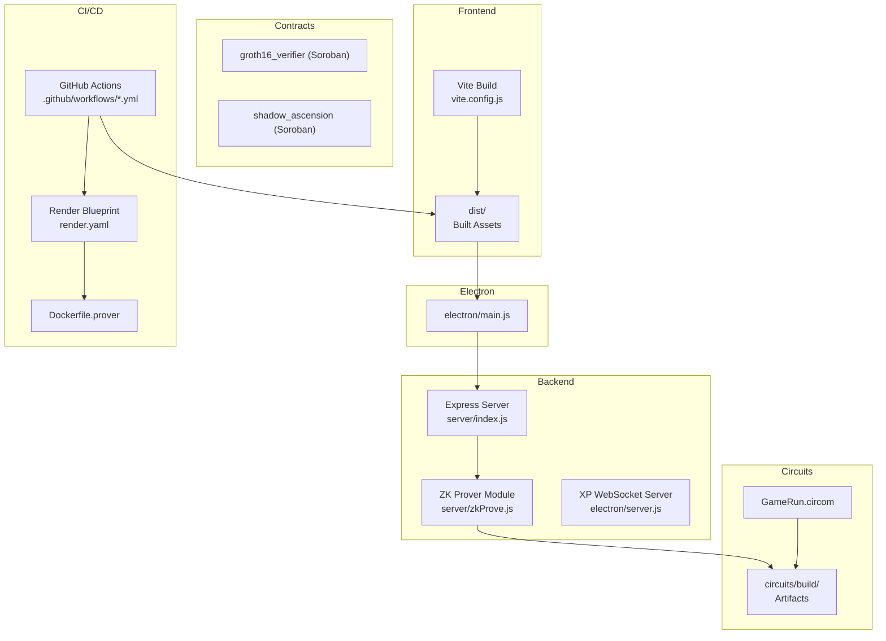
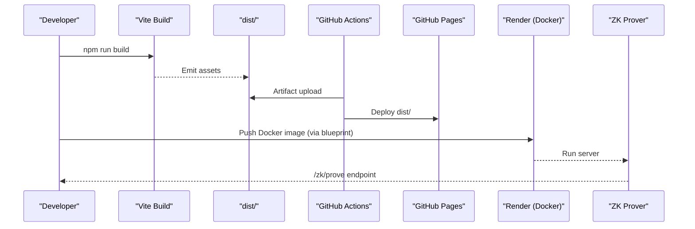
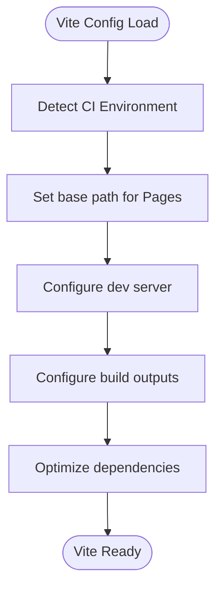
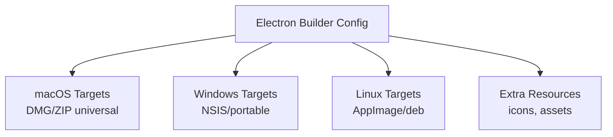
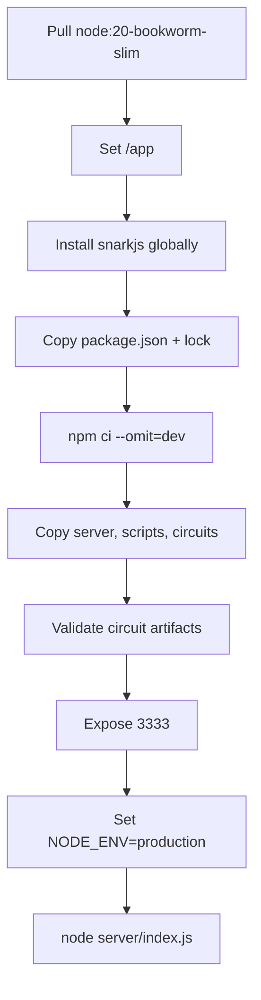
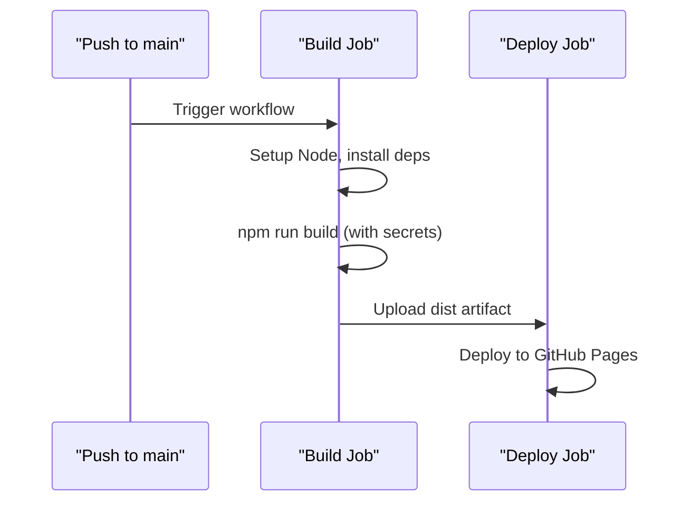
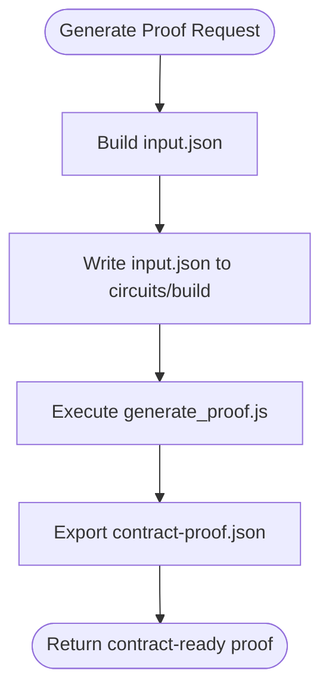
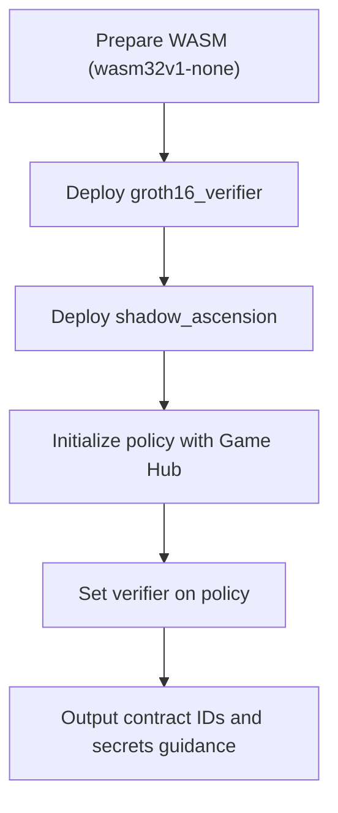
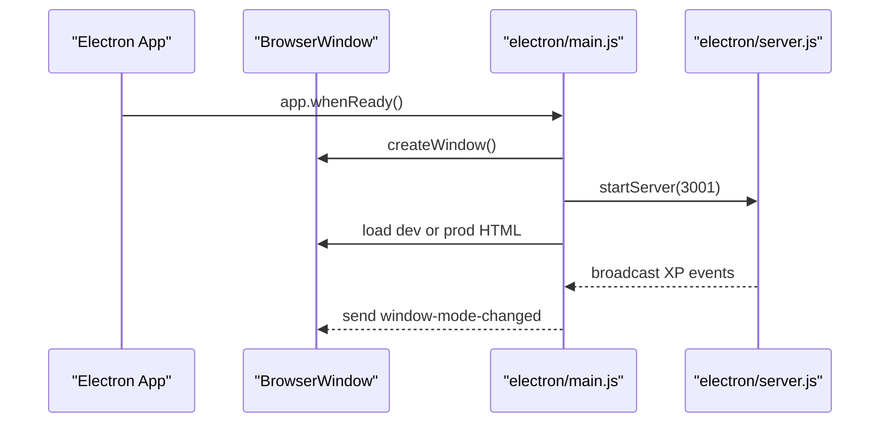
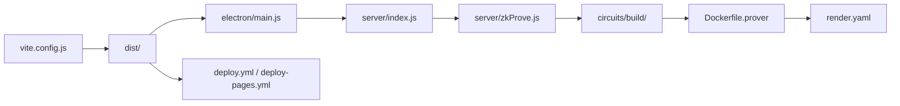

# Build & Deployment

<cite>
**Referenced Files in This Document**
- [package.json](file://package.json)
- [vite.config.js](file://vite.config.js)
- [Dockerfile.prover](file://Dockerfile.prover)
- [render.yaml](file://render.yaml)
- [electron/main.js](file://electron/main.js)
- [electron/server.js](file://electron/server.js)
- [.github/workflows/deploy.yml](file://.github/workflows/deploy.yml)
- [.github/workflows/deploy-pages.yml](file://.github/workflows/deploy-pages.yml)
- [server/zkProve.js](file://server/zkProve.js)
- [scripts/zk/generate_proof.js](file://scripts/zk/generate_proof.js)
- [scripts/zk/build_circuit.sh](file://scripts/zk/build_circuit.sh)
- [scripts/deploy_contracts_testnet.sh](file://scripts/deploy_contracts_testnet.sh)
- [.env](file://.env)
- [.env.example](file://.env.example)
- [README.md](file://README.md)
</cite>

## Table of Contents
1. [Introduction](#introduction)
2. [Project Structure](#project-structure)
3. [Core Components](#core-components)
4. [Architecture Overview](#architecture-overview)
5. [Detailed Component Analysis](#detailed-component-analysis)
6. [Dependency Analysis](#dependency-analysis)
7. [Performance Considerations](#performance-considerations)
8. [Troubleshooting Guide](#troubleshooting-guide)
9. [Conclusion](#conclusion)
10. [Appendices](#appendices)

## Introduction
This document provides comprehensive build and deployment guidance for Vibe-Coder. It covers:
- Vite frontend build configuration, environment-specific builds, and production optimizations
- Multi-platform Electron packaging for Windows, macOS, and Linux
- Docker containerization strategy for the ZK prover service, including ptau file management and proof generation workflows
- GitHub Actions CI/CD pipeline for automated testing, building, and deployment to GitHub Pages and Render
- Contract deployment process for Soroban testnet and mainnet, including network configuration and transaction signing
- Environment-specific configurations, secrets management, deployment troubleshooting, rollback procedures, and monitoring setup

## Project Structure
Vibe-Coder is organized into frontend, backend, contracts, circuits, scripts, Electron app, and CI/CD configuration. Key areas:
- Frontend: Vite-based single-page application built into the dist directory
- Backend: Express server with WebSocket endpoints and a ZK prover module
- Contracts: Rust-based Soroban smart contracts (verifier and policy)
- Circuits: Circom-based ZK circuit and related build artifacts
- Scripts: Automation for ZK builds, proof generation, and contract deployments
- Electron: Desktop app wrapper around the built frontend
- CI/CD: GitHub Actions workflows for GitHub Pages and Render deployment

**Diagram sources**
- [vite.config.js](file://vite.config.js#L1-L34)
- [server/zkProve.js](file://server/zkProve.js#L1-L68)
- [electron/server.js](file://electron/server.js#L1-L183)
- [electron/main.js](file://electron/main.js#L1-L274)
- [scripts/zk/build_circuit.sh](file://scripts/zk/build_circuit.sh#L1-L57)
- [.github/workflows/deploy.yml](file://.github/workflows/deploy.yml#L1-L68)
- [render.yaml](file://render.yaml#L1-L15)
- [Dockerfile.prover](file://Dockerfile.prover#L1-L26)

**Section sources**
- [README.md](file://README.md#L115-L158)
- [package.json](file://package.json#L1-L135)

## Core Components
- Vite build configuration defines base path for GitHub Pages, dev server behavior, output directories, and dependency optimization.
- Electron packaging configuration controls app metadata, targets, icons, and resources for macOS, Windows, and Linux.
- Dockerfile.prover packages the ZK prover service with pre-built circuit artifacts and exposes the /zk/prove endpoint.
- GitHub Actions workflows build the frontend and deploy to GitHub Pages and Render.
- ZK prover module orchestrates input preparation, proof generation, and contract-ready output.
- Contract deployment script automates Soroban testnet deployment and initialization.

**Section sources**
- [vite.config.js](file://vite.config.js#L1-L34)
- [package.json](file://package.json#L52-L133)
- [Dockerfile.prover](file://Dockerfile.prover#L1-L26)
- [.github/workflows/deploy.yml](file://.github/workflows/deploy.yml#L1-L68)
- [server/zkProve.js](file://server/zkProve.js#L1-L68)
- [scripts/deploy_contracts_testnet.sh](file://scripts/deploy_contracts_testnet.sh#L1-L70)

## Architecture Overview
The build and deployment architecture integrates frontend, backend, contracts, and CI/CD:

**Diagram sources**
- [vite.config.js](file://vite.config.js#L1-L34)
- [.github/workflows/deploy.yml](file://.github/workflows/deploy.yml#L23-L68)
- [render.yaml](file://render.yaml#L1-L15)
- [Dockerfile.prover](file://Dockerfile.prover#L1-L26)

## Detailed Component Analysis

### Vite Build Configuration
- Automatic base path calculation for GitHub Pages using the repository name from environment variables.
- Development server configuration with explicit allowed filesystem paths for local assets.
- Output directories configured for production distribution.
- Dependency optimization for specific packages.

**Diagram sources**
- [vite.config.js](file://vite.config.js#L1-L34)

**Section sources**
- [vite.config.js](file://vite.config.js#L1-L34)

### Environment-Specific Builds and Production Optimizations
- CI detection enables automatic base path for GitHub Pages.
- Production builds emit optimized assets to dist with deterministic asset directories.
- Electron packaging includes extra resources and platform-specific targets.

**Section sources**
- [vite.config.js](file://vite.config.js#L5-L12)
- [package.json](file://package.json#L52-L133)

### Electron Packaging (Windows, macOS, Linux)
- App metadata and product name defined in build configuration.
- Platform-specific targets:
  - macOS: DMG and ZIP universal builds with dark mode support.
  - Windows: NSIS installer and portable executable.
  - Linux: AppImage and deb packages.
- Extra resources include icon and packaged assets.
- Electron main process loads dev or production HTML depending on environment.

**Diagram sources**
- [package.json](file://package.json#L52-L133)
- [electron/main.js](file://electron/main.js#L18-L54)

**Section sources**
- [package.json](file://package.json#L52-L133)
- [electron/main.js](file://electron/main.js#L1-L274)

### Docker Containerization Strategy for ZK Prover
- Uses a slim Node.js 20 base image.
- Installs snarkjs globally for proof generation.
- Copies server, scripts, and circuits directories.
- Validates presence of pre-built circuit artifacts before startup.
- Exposes port 3333 and sets production environment.
- Render blueprint defines health checks and environment variables.

**Diagram sources**
- [Dockerfile.prover](file://Dockerfile.prover#L1-L26)
- [render.yaml](file://render.yaml#L1-L15)

**Section sources**
- [Dockerfile.prover](file://Dockerfile.prover#L1-L26)
- [render.yaml](file://render.yaml#L1-L15)

### GitHub Actions CI/CD Pipeline
- Two workflows:
  - deploy.yml: Builds frontend with optional contract and prover URLs from secrets, uploads dist, and deploys to GitHub Pages.
  - deploy-pages.yml: Minimal build and deploy workflow for GitHub Pages.
- Permissions and concurrency settings ensure safe deployments.

**Diagram sources**
- [.github/workflows/deploy.yml](file://.github/workflows/deploy.yml#L1-L68)
- [.github/workflows/deploy-pages.yml](file://.github/workflows/deploy-pages.yml#L1-L52)

**Section sources**
- [.github/workflows/deploy.yml](file://.github/workflows/deploy.yml#L1-L68)
- [.github/workflows/deploy-pages.yml](file://.github/workflows/deploy-pages.yml#L1-L52)

### ZK Prover Workflow and ptau Management
- Pre-built circuit artifacts are required (final zkey and WASM).
- The prover module validates inputs, writes input.json, executes proof generation, and exports contract-ready proof.
- The build script compiles the circuit, manages ptau files (downloads or generates), and performs Groth16 setup.

**Diagram sources**
- [server/zkProve.js](file://server/zkProve.js#L1-L68)
- [scripts/zk/generate_proof.js](file://scripts/zk/generate_proof.js#L1-L46)

**Section sources**
- [server/zkProve.js](file://server/zkProve.js#L1-L68)
- [scripts/zk/generate_proof.js](file://scripts/zk/generate_proof.js#L1-L46)
- [scripts/zk/build_circuit.sh](file://scripts/zk/build_circuit.sh#L1-L57)

### Contract Deployment for Soroban Testnet and Mainnet
- The deployment script builds WASM for testnet using wasm32v1-none, deploys verifier and policy contracts, initializes policy with Game Hub, and sets verifier.
- Requires stellar CLI, a funded testnet account, and proper environment setup.
- After successful deployment, contract IDs are exported to environment and GitHub secrets for production builds.

**Diagram sources**
- [scripts/deploy_contracts_testnet.sh](file://scripts/deploy_contracts_testnet.sh#L1-L70)

**Section sources**
- [scripts/deploy_contracts_testnet.sh](file://scripts/deploy_contracts_testnet.sh#L1-L70)

### Electron Desktop App Integration
- The Electron main process creates the window, handles dev vs production loading, registers global shortcuts, and manages a built-in XP WebSocket server.
- Supports toggling server mode between built-in and external, and forwarding XP events to the renderer.

**Diagram sources**
- [electron/main.js](file://electron/main.js#L1-L274)
- [electron/server.js](file://electron/server.js#L1-L183)

**Section sources**
- [electron/main.js](file://electron/main.js#L1-L274)
- [electron/server.js](file://electron/server.js#L1-L183)

## Dependency Analysis
- Frontend build depends on Vite and emits to dist.
- Electron app depends on built dist assets and server-side modules.
- ZK prover depends on pre-built circuits and snarkjs.
- CI/CD depends on GitHub Actions and Render blueprint for containerized deployment.

**Diagram sources**
- [vite.config.js](file://vite.config.js#L1-L34)
- [electron/main.js](file://electron/main.js#L1-L274)
- [server/zkProve.js](file://server/zkProve.js#L1-L68)
- [scripts/zk/build_circuit.sh](file://scripts/zk/build_circuit.sh#L1-L57)
- [Dockerfile.prover](file://Dockerfile.prover#L1-L26)
- [render.yaml](file://render.yaml#L1-L15)
- [.github/workflows/deploy.yml](file://.github/workflows/deploy.yml#L1-L68)

**Section sources**
- [package.json](file://package.json#L1-L135)
- [vite.config.js](file://vite.config.js#L1-L34)

## Performance Considerations
- Use Vite’s optimized build for production to minimize bundle sizes and improve load times.
- Electron packaging includes only necessary files and resources; exclude large assets selectively to reduce installer size.
- Docker image installs only production dependencies to reduce image size and attack surface.
- CI caching for Node modules reduces build times in GitHub Actions.

[No sources needed since this section provides general guidance]

## Troubleshooting Guide
- GitHub Pages base path issues: Ensure repository name is correctly detected in CI to compute the base path.
- Missing circuit artifacts: The ZK prover requires pre-built zkey and WASM; verify build artifacts exist before starting the prover.
- Contract deployment failures: Confirm stellar CLI is installed, testnet account has funds, and wasm32v1-none target is used for Soroban.
- Electron dev vs production: Verify dev server is running when in development mode; otherwise, the app loads from dist.
- XP server connectivity: Confirm XP WebSocket server is reachable and broadcasting events to the game.

**Section sources**
- [vite.config.js](file://vite.config.js#L5-L12)
- [server/zkProve.js](file://server/zkProve.js#L46-L67)
- [scripts/deploy_contracts_testnet.sh](file://scripts/deploy_contracts_testnet.sh#L17-L27)
- [electron/main.js](file://electron/main.js#L48-L54)

## Conclusion
This guide consolidates the build and deployment processes for Vibe-Coder across frontend, backend, contracts, and CI/CD. By leveraging Vite for frontend builds, Electron for desktop distribution, Docker for ZK prover containerization, and GitHub Actions for automated deployments, teams can reliably deliver updates to GitHub Pages and Render. Proper environment configuration, secrets management, and robust troubleshooting practices ensure smooth operations across environments.

[No sources needed since this section summarizes without analyzing specific files]

## Appendices

### Environment Variables and Secrets
- Frontend variables:
  - VITE_SHADOW_ASCENSION_CONTRACT_ID: Contract ID for the policy after deployment
  - VITE_ZK_PROVER_URL: URL of the ZK prover service
  - VITE_API_URL: Base URL for backend APIs
- Backend variables (local or Render):
  - SUPABASE_URL, SUPABASE_ANON_KEY, SUPABASE_SERVICE_ROLE_KEY
  - SEP-10 authentication and JWT settings
- GitHub Actions secrets:
  - VITE_SHADOW_ASCENSION_CONTRACT_ID
  - VITE_ZK_PROVER_URL

**Section sources**
- [.env](file://.env#L1-L5)
- [.env.example](file://.env.example#L1-L37)
- [.github/workflows/deploy.yml](file://.github/workflows/deploy.yml#L40-L45)

### Rollback Procedures
- GitHub Pages: Re-run a previous successful workflow or redeploy a known-good artifact from the workflow run.
- Render: Roll back to a prior container image tag or redeploy the last known-good version.
- Contracts: Record contract IDs and redeploy previous WASM versions if necessary; coordinate with Game Hub and verifier contracts.

[No sources needed since this section provides general guidance]

### Monitoring Setup
- Health checks:
  - Render: Health check path configured in the blueprint
  - ZK Prover: Expose a /health endpoint returning status, client count, and uptime
- Logging:
  - Electron main process logs server state and events
  - Express server logs XP broadcasts and client connections

**Section sources**
- [render.yaml](file://render.yaml#L11-L11)
- [electron/server.js](file://electron/server.js#L135-L142)
- [server/zkProve.js](file://server/zkProve.js#L46-L67)