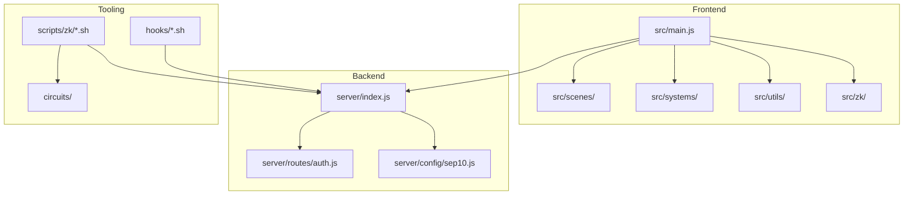
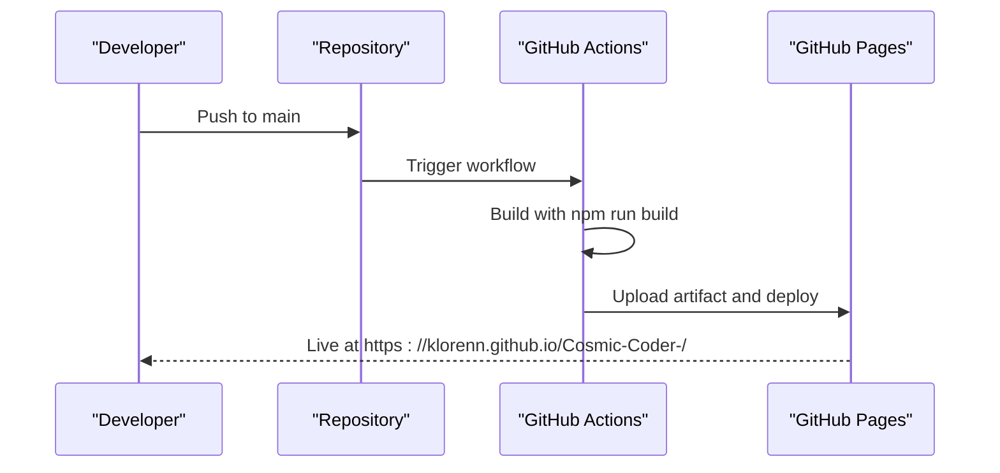
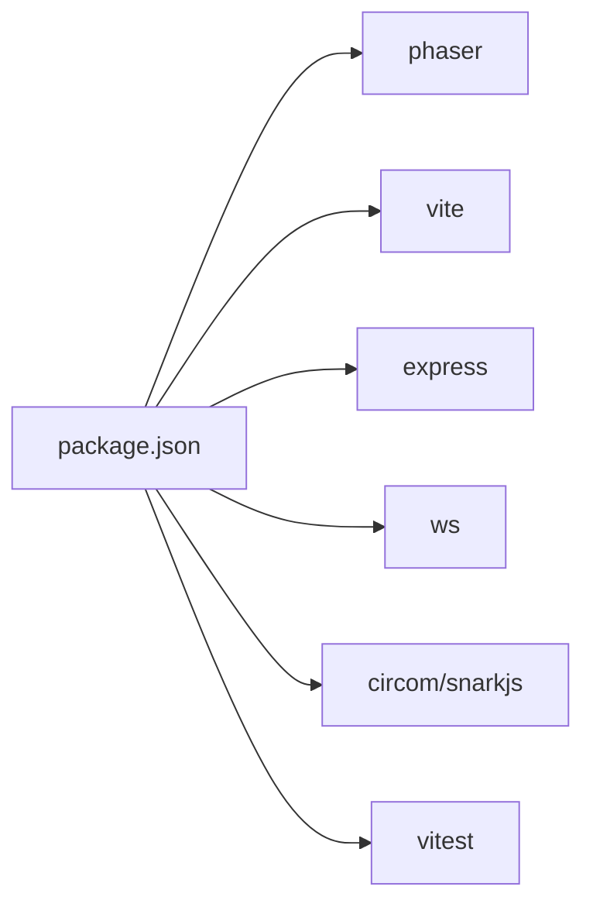

# Contribution Guidelines

<cite>
**Referenced Files in This Document**
- [README.md](file://README.md)
- [SETUP.md](file://SETUP.md)
- [CHANGELOG.md](file://CHANGELOG.md)
- [package.json](file://package.json)
- [.github/workflows/deploy.yml](file://.github/workflows/deploy.yml)
- [.github/workflows/deploy-pages.yml](file://.github/workflows/deploy-pages.yml)
- [src/main.js](file://src/main.js)
- [server/index.js](file://server/index.js)
- [hooks/vibe-coder-hook.sh](file://hooks/vibe-coder-hook.sh)
- [scripts/zk/build_circuit.sh](file://scripts/zk/build_circuit.sh)
- [src/__tests__/CombatEdgeCases.test.js](file://src/__tests__/CombatEdgeCases.test.js)
</cite>

## Table of Contents
1. [Introduction](#introduction)
2. [Project Structure](#project-structure)
3. [Core Components](#core-components)
4. [Architecture Overview](#architecture-overview)
5. [Detailed Component Analysis](#detailed-component-analysis)
6. [Dependency Analysis](#dependency-analysis)
7. [Performance Considerations](#performance-considerations)
8. [Troubleshooting Guide](#troubleshooting-guide)
9. [Conclusion](#conclusion)
10. [Appendices](#appendices)

## Introduction
This document defines how to contribute effectively to Vibe-Coder. It covers the entire contribution lifecycle: forking and cloning, branching and commit hygiene, pull requests, reviews, and merges. It also documents coding standards for JavaScript, Rust, and shell scripts, issue and feature processes, documentation and translation expectations, community interaction norms, governance and maintainer roles, changelog and release practices, and licensing/IP considerations.

## Project Structure
Vibe-Coder is a front-end game built with Phaser and Vite, with a Node.js XP server, optional Electron packaging, and ZK tooling for on-chain ranked runs. The repository includes:
- Front-end game code under src/, with scenes, systems, utilities, and ZK integration
- Backend server under server/ (Express + WebSocket)
- ZK tooling under scripts/zk/ and circuits/
- Shell hooks under hooks/
- Documentation under docs/ and public/docs/
- GitHub Actions workflows for deployment

**Diagram sources**
- [src/main.js](file://src/main.js#L1-L464)
- [server/index.js](file://server/index.js#L1-L246)
- [hooks/vibe-coder-hook.sh](file://hooks/vibe-coder-hook.sh#L1-L24)
- [scripts/zk/build_circuit.sh](file://scripts/zk/build_circuit.sh#L1-L57)

**Section sources**
- [README.md](file://README.md#L115-L135)

## Core Components
- Front-end game engine (Phaser 3) and runtime configuration
- XP server (Express + WebSocket) for real-time coding activity integration
- Hook scripts for IDE/AI tools
- ZK prover toolchain (Circom/snarkjs) and contracts for on-chain ranked runs
- GitHub Actions for automated deployment to GitHub Pages

**Section sources**
- [README.md](file://README.md#L139-L146)
- [package.json](file://package.json#L1-L135)

## Architecture Overview
The project follows a clear separation of concerns:
- Front-end game initializes, loads runtime config, and connects to the XP server when appropriate
- Backend exposes REST endpoints for auth, progress, leaderboard, and ZK proof generation
- Hooks send structured events to the XP server, which broadcasts them to connected clients
- ZK scripts orchestrate circuit compilation and Groth16 trusted setup

**Diagram sources**
- [.github/workflows/deploy.yml](file://.github/workflows/deploy.yml#L1-L68)
- [.github/workflows/deploy-pages.yml](file://.github/workflows/deploy-pages.yml#L1-L52)

**Section sources**
- [README.md](file://README.md#L149-L153)
- [.github/workflows/deploy.yml](file://.github/workflows/deploy.yml#L1-L68)

## Detailed Component Analysis

### Contribution Workflow: Fork, Clone, Branch, Commit, PR
- Fork the repository on GitHub.
- Clone locally using HTTPS or SSH.
- Create a feature branch following naming conventions described below.
- Commit changes with clear messages following the commit message standards.
- Push the branch and open a Pull Request against the default branch.

Branch naming conventions:
- Feature branches: feature/short-description
- Bug fixes: fix/issue-id-short-description
- Docs: docs/area-description
- Chore: chore/context

Commit message standards:
- Use imperative mood and concise subject line.
- Reference related issue numbers (e.g., Fixes #123).
- Keep the body focused on motivation and impact; link to relevant files.

Pull Request process:
- Open a PR early if work is in progress (draft).
- Ensure CI passes and tests are green.
- Request review from maintainers; address feedback promptly.
- Squash and rebase commits before merging.

Merge criteria:
- All checks must pass.
- Code must adhere to style guides.
- Changes must be minimal and focused.
- Changelog entries updated for user-visible changes.

**Section sources**
- [README.md](file://README.md#L1-L158)
- [CHANGELOG.md](file://CHANGELOG.md#L1-L465)

### Coding Standards

JavaScript (game and server):
- Follow existing patterns: modular exports, clear function names, minimal global state, explicit error handling.
- Use consistent indentation and spacing; avoid magic numbers where logic warrants constants.
- Prefer immutable updates for state where applicable; mutate carefully and document intent.
- Validate inputs at API boundaries and in utilities.

Example patterns to emulate:
- Centralized configuration and runtime config loading
- WebSocket broadcasting with structured payloads
- Controlled XP emission and event categorization

**Section sources**
- [src/main.js](file://src/main.js#L1-L464)
- [server/index.js](file://server/index.js#L1-L246)

Rust (contracts):
- Use idiomatic Rust: Option/Result handling, borrowing, and minimal unsafe code.
- Keep functions pure where possible; isolate side effects.
- Export only necessary items; document public APIs.
- Follow crate-level conventions and module organization.

Note: Review the contracts and zk_types modules for patterns and structure.

**Section sources**
- [README.md](file://README.md#L127-L131)

Shell scripts:
- Use POSIX-compliant sh/bash; shebangs included.
- Fail fast with set -e; validate prerequisites.
- Provide helpful error messages and detect version mismatches.
- Keep scripts idempotent and safe to rerun.

Examples to follow:
- ZK build script for circuit compilation and trusted setup
- Hook scripts for sending events to the XP server

**Section sources**
- [scripts/zk/build_circuit.sh](file://scripts/zk/build_circuit.sh#L1-L57)
- [hooks/vibe-coder-hook.sh](file://hooks/vibe-coder-hook.sh#L1-L24)

### Issue Reporting, Feature Requests, Bug Fixes
Issue reporting:
- Search existing issues to avoid duplicates.
- Provide a clear title, steps to reproduce, expected vs. actual behavior, and environment details.
- Attach logs, screenshots, or minimal reproducible examples when helpful.

Feature requests:
- Describe the problem being solved and the proposed solution.
- Explain the user impact and potential trade-offs.
- Link to related discussions or designs.

Bug fix workflow:
- Create a failing test case first (if applicable).
- Fix the root cause with minimal changes.
- Add or update tests; update the changelog for user-visible fixes.

**Section sources**
- [SETUP.md](file://SETUP.md#L109-L143)
- [src/__tests__/CombatEdgeCases.test.js](file://src/__tests__/CombatEdgeCases.test.js#L1-L355)

### Documentation and Translation Contributions
Documentation contributions:
- Update relevant docs in docs/ and public/docs/.
- Keep examples current with code changes.
- For user-facing docs, ensure clarity and completeness.

Translation support:
- Translations are maintained alongside the base guide (e.g., _en.md, _es.md).
- Keep translations synchronized with the canonical English version.
- Avoid breaking links and ensure assets remain accessible.

**Section sources**
- [README.md](file://README.md#L1-L158)

### Community Interaction Standards
- Be respectful and inclusive; follow the project’s tone of encouraging productivity through coding.
- Use clear, constructive language in discussions.
- Acknowledge different perspectives and experiences.
- Stay on topic; avoid flamewars or off-topic derailments.

[No sources needed since this section provides general guidance]

### Governance Model, Maintainers, and Decision-Making
- Maintainers review PRs, approve changes, and ensure quality and alignment with project goals.
- Decisions are made collaboratively; critical changes may require consensus among maintainers.
- Contributors who demonstrate reliability and deep understanding may be invited to become maintainers.

[No sources needed since this section provides general guidance]

### Changelog Maintenance and Release Procedures
Changelog maintenance:
- Record notable changes per release in CHANGELOG.md with dates.
- Group entries into Added, Changed, Fixed, Removed, Security.
- Keep summaries concise; link to test additions where applicable.

Versioning and releases:
- Version is managed in package.json; increment according to semantic versioning.
- Releases are published when the main branch is stable and tested.
- Automated deployments occur on pushes to main via GitHub Actions.

**Section sources**
- [CHANGELOG.md](file://CHANGELOG.md#L1-L465)
- [package.json](file://package.json#L1-L135)
- [.github/workflows/deploy.yml](file://.github/workflows/deploy.yml#L1-L68)

### Licensing and Contributor Agreements
- The project is licensed under MIT as declared in package.json.
- By contributing, you agree that your contributions will be licensed under the project’s license.
- Ensure you have the right to license your contributions and that no third-party IP is introduced without permission.

**Section sources**
- [package.json](file://package.json#L29-L30)

## Dependency Analysis
The project’s runtime and build dependencies are declared in package.json. Key areas:
- Front-end: Phaser, Vite, and related tooling
- Backend: Express, WebSocket server, JWT utilities
- ZK tooling: Circom, snarkjs, and Rust-based contracts
- Testing: Vitest

**Diagram sources**
- [package.json](file://package.json#L31-L51)

**Section sources**
- [package.json](file://package.json#L1-L135)

## Performance Considerations
- Keep front-end loops efficient; avoid unnecessary DOM updates.
- Minimize WebSocket traffic; batch events when possible.
- Validate and sanitize inputs to prevent expensive operations.
- Use caching and memoization for repeated computations where beneficial.

[No sources needed since this section provides general guidance]

## Troubleshooting Guide
Common setup and integration issues:
- XP server connectivity: ensure the XP server is running and reachable; verify ports and firewall rules.
- Hook execution: confirm scripts are executable and properly linked; test with manual invocation.
- Mobile orientation: ensure landscape orientation is enforced on mobile devices.
- WebSocket reconnections: the XP server includes safeguards; check for connection state indicators.

**Section sources**
- [SETUP.md](file://SETUP.md#L109-L143)
- [src/main.js](file://src/main.js#L448-L462)
- [server/index.js](file://server/index.js#L56-L61)

## Conclusion
By following these guidelines, contributors can collaborate efficiently, maintain high-quality code, and keep the project aligned with its mission of blending coding productivity with engaging gameplay. Adhering to standards, communicating clearly, and focusing on user impact ensures sustainable progress.

[No sources needed since this section summarizes without analyzing specific files]

## Appendices

### A. Example Contribution Checklist
- Branch naming: feature/short-description
- Commit message: imperative, reference issues
- PR checklist: description, tests, changelog entry, screenshots/logs if needed
- Merge: approvals, passing checks, clean history

[No sources needed since this section provides general guidance]