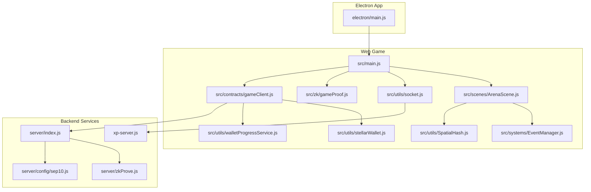
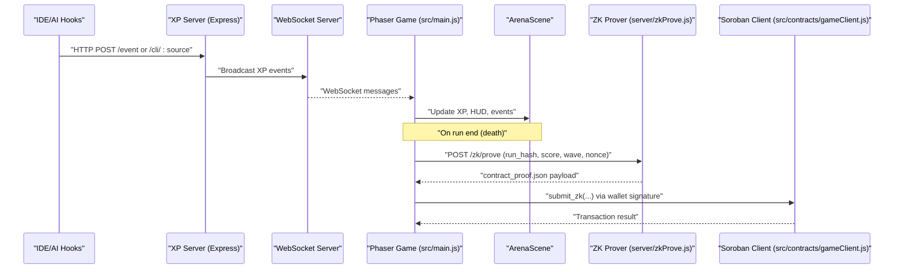
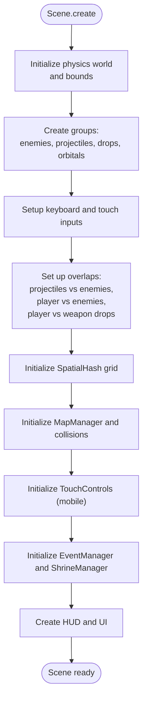
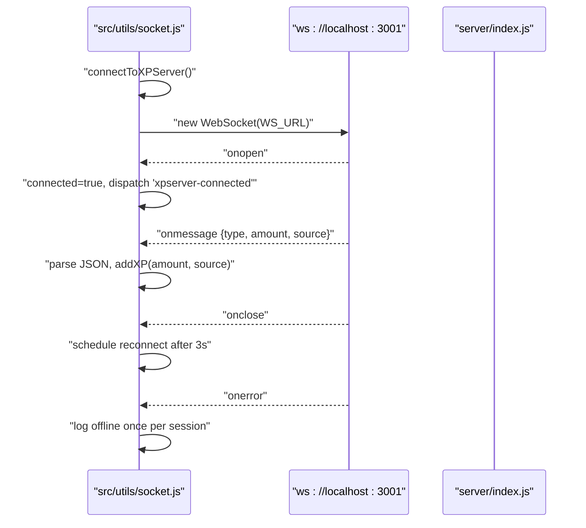
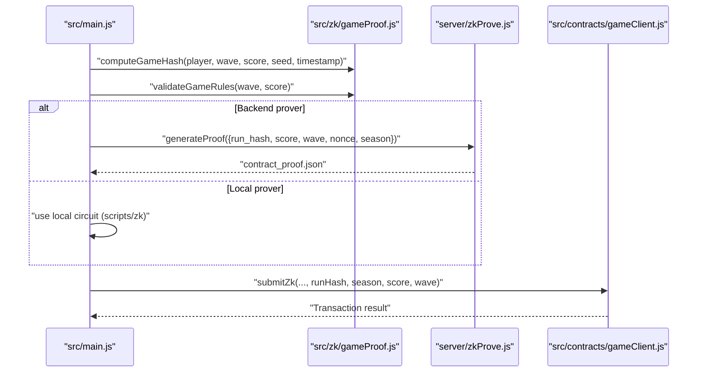
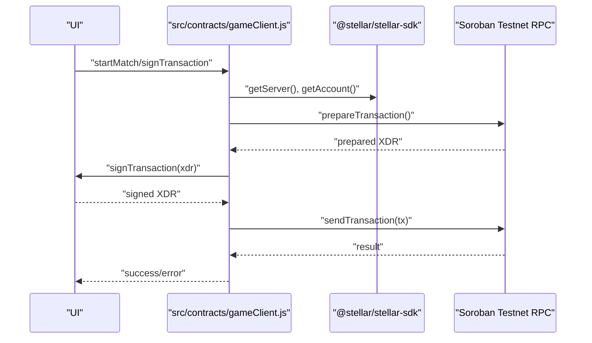
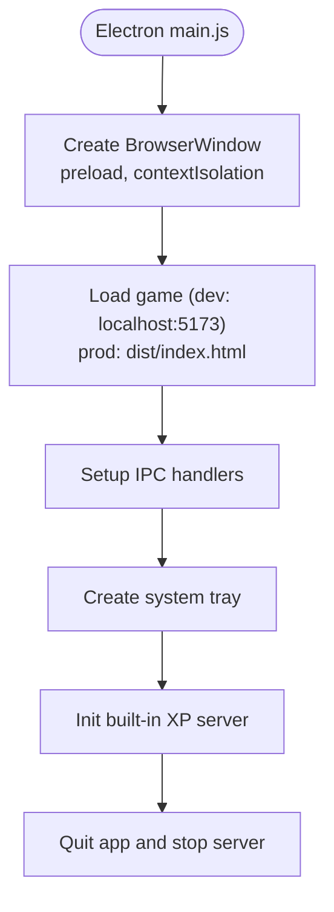
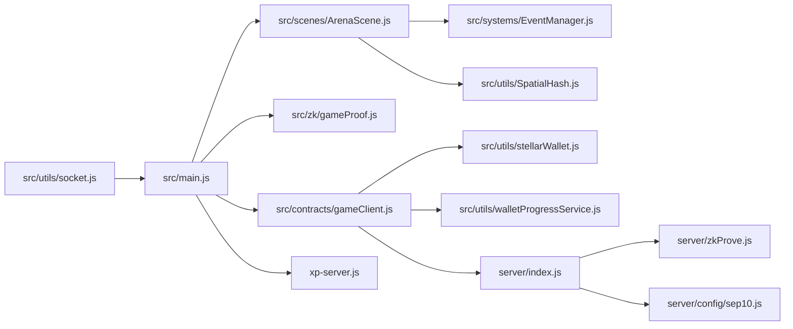

# Debugging & Profiling

<cite>
**Referenced Files in This Document**
- [README.md](file://README.md)
- [package.json](file://package.json)
- [src/main.js](file://src/main.js)
- [src/scenes/ArenaScene.js](file://src/scenes/ArenaScene.js)
- [src/systems/EventManager.js](file://src/systems/EventManager.js)
- [src/utils/SpatialHash.js](file://src/utils/SpatialHash.js)
- [src/utils/socket.js](file://src/utils/socket.js)
- [src/zk/gameProof.js](file://src/zk/gameProof.js)
- [src/contracts/gameClient.js](file://src/contracts/gameClient.js)
- [src/utils/stellarWallet.js](file://src/utils/stellarWallet.js)
- [src/utils/walletProgressService.js](file://src/utils/walletProgressService.js)
- [server/index.js](file://server/index.js)
- [server/zkProve.js](file://server/zkProve.js)
- [server/config/sep10.js](file://server/config/sep10.js)
- [electron/main.js](file://electron/main.js)
- [xp-server.js](file://xp-server.js)
</cite>

## Table of Contents
1. [Introduction](#introduction)
2. [Project Structure](#project-structure)
3. [Core Components](#core-components)
4. [Architecture Overview](#architecture-overview)
5. [Detailed Component Analysis](#detailed-component-analysis)
6. [Dependency Analysis](#dependency-analysis)
7. [Performance Considerations](#performance-considerations)
8. [Troubleshooting Guide](#troubleshooting-guide)
9. [Conclusion](#conclusion)
10. [Appendices](#appendices)

## Introduction
This document provides comprehensive debugging and profiling guidance for Vibe-Coder development. It covers:
- Phaser game engine debugging: scene management, sprite rendering, collision detection, and performance profiling
- WebSocket debugging for real-time XP broadcasting and message flow
- ZK proof debugging: circuit compilation, proof generation, and verification
- Blockchain debugging with Soroban contract interactions, transaction simulation, and network connectivity
- Browser developer tools, Node.js debugging, and Electron application inspection
- Logging strategies, error tracking, and production monitoring

## Project Structure
The repository is a hybrid web/Electron application with integrated XP server, ZK prover, and blockchain contract client. Key areas for debugging:
- Frontend game logic and scenes (Phaser)
- WebSocket XP server and client
- ZK prover backend and circuit integration
- Soroban contract client and SEP-10 authentication

**Diagram sources**
- [electron/main.js](file://electron/main.js#L1-L274)
- [src/main.js](file://src/main.js#L1-L464)
- [src/scenes/ArenaScene.js](file://src/scenes/ArenaScene.js#L1-L4972)
- [src/systems/EventManager.js](file://src/systems/EventManager.js#L1-L393)
- [src/utils/SpatialHash.js](file://src/utils/SpatialHash.js#L1-L141)
- [src/utils/socket.js](file://src/utils/socket.js#L1-L121)
- [src/zk/gameProof.js](file://src/zk/gameProof.js#L1-L78)
- [src/contracts/gameClient.js](file://src/contracts/gameClient.js#L1-L401)
- [src/utils/stellarWallet.js](file://src/utils/stellarWallet.js#L1-L115)
- [src/utils/walletProgressService.js](file://src/utils/walletProgressService.js#L1-L140)
- [server/index.js](file://server/index.js#L1-L246)
- [server/zkProve.js](file://server/zkProve.js#L1-L68)
- [server/config/sep10.js](file://server/config/sep10.js#L1-L87)
- [xp-server.js](file://xp-server.js#L1-L106)

**Section sources**
- [README.md](file://README.md#L115-L135)
- [package.json](file://package.json#L1-L135)

## Core Components
- Phaser game initialization and configuration, including physics and scene registration
- ArenaScene with enemy spawning, combat, HUD, and spatial hashing for collision detection
- EventManager for mid-run chaos events and HUD timers
- WebSocket client for XP broadcasting and live coding integration
- ZK game hash computation and rule validation
- Soroban contract client for start_match, submit_result, submit_zk, and leaderboard queries
- Backend servers: Express-based XP server and ZK prover, plus SEP-10 configuration

**Section sources**
- [src/main.js](file://src/main.js#L15-L37)
- [src/scenes/ArenaScene.js](file://src/scenes/ArenaScene.js#L288-L470)
- [src/systems/EventManager.js](file://src/systems/EventManager.js#L1-L393)
- [src/utils/socket.js](file://src/utils/socket.js#L1-L121)
- [src/zk/gameProof.js](file://src/zk/gameProof.js#L1-L78)
- [src/contracts/gameClient.js](file://src/contracts/gameClient.js#L1-L401)
- [server/index.js](file://server/index.js#L1-L246)
- [server/zkProve.js](file://server/zkProve.js#L1-L68)
- [server/config/sep10.js](file://server/config/sep10.js#L1-L87)
- [xp-server.js](file://xp-server.js#L1-L106)

## Architecture Overview
End-to-end flow for live XP, ZK ranked submission, and blockchain interactions.

**Diagram sources**
- [src/utils/socket.js](file://src/utils/socket.js#L18-L104)
- [server/index.js](file://server/index.js#L99-L125)
- [server/zkProve.js](file://server/zkProve.js#L46-L67)
- [src/contracts/gameClient.js](file://src/contracts/gameClient.js#L258-L273)
- [src/main.js](file://src/main.js#L448-L463)

## Detailed Component Analysis

### Phaser Game Engine Debugging
Focus areas:
- Scene lifecycle and camera behavior
- Sprite rendering and hitboxes
- Collision detection using spatial hashing
- Event-driven XP and HUD updates

Recommended debugging steps:
- Enable Phaser arcade debug overlays to visualize hitboxes and physics bodies
- Inspect camera bounds, zoom, and deadzone settings
- Temporarily increase logging in scene creation and update loops
- Use browser DevTools Timeline to profile frame time and identify spikes

**Diagram sources**
- [src/scenes/ArenaScene.js](file://src/scenes/ArenaScene.js#L288-L470)
- [src/utils/SpatialHash.js](file://src/utils/SpatialHash.js#L116-L139)

**Section sources**
- [src/main.js](file://src/main.js#L15-L37)
- [src/scenes/ArenaScene.js](file://src/scenes/ArenaScene.js#L288-L470)
- [src/systems/EventManager.js](file://src/systems/EventManager.js#L327-L343)
- [src/utils/SpatialHash.js](file://src/utils/SpatialHash.js#L1-L141)

### WebSocket Debugging (XP Broadcasting)
Key points:
- Client connects only on localhost to avoid "WebSocket connection failed" on hosted pages
- Automatic reconnection with exponential backoff
- Message parsing and XP accumulation with source attribution

Common issues:
- Server not running on port 3001
- CORS misconfiguration
- Malformed event payloads

**Diagram sources**
- [src/utils/socket.js](file://src/utils/socket.js#L18-L104)
- [server/index.js](file://server/index.js#L58-L86)

**Section sources**
- [src/utils/socket.js](file://src/utils/socket.js#L1-L121)
- [server/index.js](file://server/index.js#L58-L86)
- [src/main.js](file://src/main.js#L448-L463)

### ZK Proof Debugging
Workflow:
- Compute game hash at run end
- Validate game rules (score vs wave)
- Request proof from backend or generate locally
- Submit ZK to Soroban with anti-replay nonce

Common failure points:
- Missing or invalid run hash (must be 64 hex chars)
- Circuit not built or missing keys
- Backend timeout or missing dependencies
- Contract argument mismatch (ScVal types)

**Diagram sources**
- [src/zk/gameProof.js](file://src/zk/gameProof.js#L29-L63)
- [server/zkProve.js](file://server/zkProve.js#L46-L67)
- [src/contracts/gameClient.js](file://src/contracts/gameClient.js#L213-L249)

**Section sources**
- [src/zk/gameProof.js](file://src/zk/gameProof.js#L1-L78)
- [server/zkProve.js](file://server/zkProve.js#L1-L68)
- [src/contracts/gameClient.js](file://src/contracts/gameClient.js#L99-L121)

### Blockchain Debugging (Soroban)
Areas to verify:
- Contract ID configuration
- Wallet connection and transaction signing
- Transaction simulation for read-only calls
- Network passphrase and RPC endpoint

**Diagram sources**
- [src/contracts/gameClient.js](file://src/contracts/gameClient.js#L33-L63)
- [src/utils/stellarWallet.js](file://src/utils/stellarWallet.js#L104-L114)

**Section sources**
- [src/contracts/gameClient.js](file://src/contracts/gameClient.js#L1-L401)
- [src/utils/stellarWallet.js](file://src/utils/stellarWallet.js#L1-L115)
- [server/config/sep10.js](file://server/config/sep10.js#L1-L87)

### Electron Application Inspection
- DevTools availability in development mode
- IPC communication between main and renderer
- Tray menu and window mode toggles
- Built-in XP server lifecycle

**Diagram sources**
- [electron/main.js](file://electron/main.js#L20-L79)
- [electron/main.js](file://electron/main.js#L174-L203)
- [electron/main.js](file://electron/main.js#L205-L242)

**Section sources**
- [electron/main.js](file://electron/main.js#L1-L274)

## Dependency Analysis
High-level dependencies among major components.

**Diagram sources**
- [src/utils/socket.js](file://src/utils/socket.js#L1-L121)
- [src/main.js](file://src/main.js#L1-L464)
- [src/scenes/ArenaScene.js](file://src/scenes/ArenaScene.js#L1-L4972)
- [src/systems/EventManager.js](file://src/systems/EventManager.js#L1-L393)
- [src/utils/SpatialHash.js](file://src/utils/SpatialHash.js#L1-L141)
- [src/zk/gameProof.js](file://src/zk/gameProof.js#L1-L78)
- [src/contracts/gameClient.js](file://src/contracts/gameClient.js#L1-L401)
- [src/utils/stellarWallet.js](file://src/utils/stellarWallet.js#L1-L115)
- [src/utils/walletProgressService.js](file://src/utils/walletProgressService.js#L1-L140)
- [server/index.js](file://server/index.js#L1-L246)
- [server/zkProve.js](file://server/zkProve.js#L1-L68)
- [server/config/sep10.js](file://server/config/sep10.js#L1-L87)
- [xp-server.js](file://xp-server.js#L1-L106)

**Section sources**
- [package.json](file://package.json#L31-L42)

## Performance Considerations
- Phaser profiling
  - Use browser DevTools Performance panel to record frames and inspect long tasks
  - Monitor draw calls and sprite batching; reduce overlapping translucent sprites
  - Profile collision detection by temporarily disabling spatial hashing and comparing frame times
- WebSocket throughput
  - Measure message frequency and payload sizes; batch XP events when possible
  - Monitor connection stability and reconnection delays
- ZK computation
  - Identify slow steps in proof generation; cache intermediate artifacts when safe
  - Validate circuit inputs early to fail fast
- Blockchain interactions
  - Use simulateTransaction for read-only calls to avoid fees
  - Batch operations and reuse prepared transactions

[No sources needed since this section provides general guidance]

## Troubleshooting Guide

### Phaser Scene and Rendering
- Symptom: Sprites clipping or hitboxes misaligned
  - Action: Verify player body size adjustments and minimum hurt box logic
  - Reference: [src/scenes/ArenaScene.js](file://src/scenes/ArenaScene.js#L721-L743)
- Symptom: Camera not following player smoothly
  - Action: Adjust deadzone and follow easing parameters
  - Reference: [src/scenes/ArenaScene.js](file://src/scenes/ArenaScene.js#L310-L317)
- Symptom: Slow frame rates with many enemies
  - Action: Confirm spatial hashing is active and collision checks are O(n) average
  - Reference: [src/utils/SpatialHash.js](file://src/utils/SpatialHash.js#L116-L139)

**Section sources**
- [src/scenes/ArenaScene.js](file://src/scenes/ArenaScene.js#L721-L743)
- [src/scenes/ArenaScene.js](file://src/scenes/ArenaScene.js#L310-L317)
- [src/utils/SpatialHash.js](file://src/utils/SpatialHash.js#L116-L139)

### WebSocket and XP Broadcasting
- Symptom: "WebSocket connection failed" on hosted pages
  - Cause: Client only connects on localhost to avoid cross-origin issues
  - Reference: [src/utils/socket.js](file://src/utils/socket.js#L18-L20)
- Symptom: No XP events received
  - Action: Ensure XP server is running and broadcasting; check CORS headers
  - References: [server/index.js](file://server/index.js#L14-L20), [xp-server.js](file://xp-server.js#L20-L30)
- Symptom: Frequent reconnections
  - Action: Investigate server availability and network latency; review reconnection logic
  - Reference: [src/utils/socket.js](file://src/utils/socket.js#L74-L96)

**Section sources**
- [src/utils/socket.js](file://src/utils/socket.js#L18-L20)
- [server/index.js](file://server/index.js#L14-L20)
- [xp-server.js](file://xp-server.js#L20-L30)
- [src/utils/socket.js](file://src/utils/socket.js#L74-L96)

### ZK Proof and Verification
- Symptom: Missing circuit artifacts or "Circuit not built"
  - Action: Run circuit build script and ensure zkey files exist
  - Reference: [server/zkProve.js](file://server/zkProve.js#L49-L54)
- Symptom: Backend proof generation fails
  - Action: Check input.json validity and snarkjs availability; verify timeout and working directory
  - Reference: [server/zkProve.js](file://server/zkProve.js#L57-L62)
- Symptom: Contract rejects submit_zk
  - Action: Validate run hash length, nonce uniqueness, and game rules
  - References: [src/zk/gameProof.js](file://src/zk/gameProof.js#L51-L63), [src/contracts/gameClient.js](file://src/contracts/gameClient.js#L225-L230)

**Section sources**
- [server/zkProve.js](file://server/zkProve.js#L49-L54)
- [server/zkProve.js](file://server/zkProve.js#L57-L62)
- [src/zk/gameProof.js](file://src/zk/gameProof.js#L51-L63)
- [src/contracts/gameClient.js](file://src/contracts/gameClient.js#L225-L230)

### Blockchain and Wallet
- Symptom: Contract ID not set
  - Action: Configure VITE_SHADOW_ASCENSION_CONTRACT_ID in runtime config or environment
  - Reference: [src/contracts/gameClient.js](file://src/contracts/gameClient.js#L11-L14)
- Symptom: Wallet not connected or sign fails
  - Action: Verify Freighter availability and cached address; check network passphrase
  - References: [src/utils/stellarWallet.js](file://src/utils/stellarWallet.js#L26-L33), [src/utils/stellarWallet.js](file://src/utils/stellarWallet.js#L104-L114)
- Symptom: Simulation errors on read-only calls
  - Action: Inspect simulated return values and handle missing fields gracefully
  - Reference: [src/contracts/gameClient.js](file://src/contracts/gameClient.js#L280-L327)

**Section sources**
- [src/contracts/gameClient.js](file://src/contracts/gameClient.js#L11-L14)
- [src/utils/stellarWallet.js](file://src/utils/stellarWallet.js#L26-L33)
- [src/utils/stellarWallet.js](file://src/utils/stellarWallet.js#L104-L114)
- [src/contracts/gameClient.js](file://src/contracts/gameClient.js#L280-L327)

### Logging and Monitoring
- Console logs
  - Use targeted logs for connection events, XP additions, and scene transitions
  - References: [src/main.js](file://src/main.js#L455-L461), [src/scenes/ArenaScene.js](file://src/scenes/ArenaScene.js#L288-L290)
- Backend error handling
  - Centralized error handler logs server errors and returns structured JSON
  - Reference: [server/index.js](file://server/index.js#L232-L239)
- Production readiness
  - Integrate structured logging and metrics collection
  - Monitor WebSocket client counts and ZK proof durations

**Section sources**
- [src/main.js](file://src/main.js#L455-L461)
- [src/scenes/ArenaScene.js](file://src/scenes/ArenaScene.js#L288-L290)
- [server/index.js](file://server/index.js#L232-L239)

## Conclusion
This guide consolidates practical debugging and profiling strategies across the Phaser game engine, WebSocket XP pipeline, ZK proof system, and Soroban blockchain interactions. By leveraging the referenced components and diagrams, developers can efficiently isolate issues, optimize performance, and maintain robust production workflows.

[No sources needed since this section summarizes without analyzing specific files]

## Appendices

### Browser Developer Tools Tips
- Performance: Record frames, identify long tasks, and inspect GPU compositing
- Memory: Take heap snapshots to detect leaks in long sessions
- Network: Inspect WebSocket frames and HTTP endpoints for XP and ZK flows
- Elements: Toggle debug overlays for hitboxes and camera boundaries

[No sources needed since this section provides general guidance]

### Node.js and Electron Debugging
- Attach debugger to Electron main process for IPC and server lifecycle
- Use Node inspector for backend services (XP server and ZK prover)
- Enable DevTools in development builds for renderer debugging

**Section sources**
- [electron/main.js](file://electron/main.js#L48-L51)

### Quick Checks Checklist
- Phaser
  - Physics debug enabled?
  - SpatialHash active and inserting entities?
  - Camera bounds and zoom appropriate?
- WebSocket
  - Client only on localhost?
  - Server running and broadcasting?
  - Payloads valid JSON?
- ZK
  - Circuit artifacts present?
  - run_hash 64 hex chars?
  - Nonce unique per submission?
- Blockchain
  - Contract ID configured?
  - Wallet connected and signed?
  - RPC endpoint reachable?

[No sources needed since this section provides general guidance]