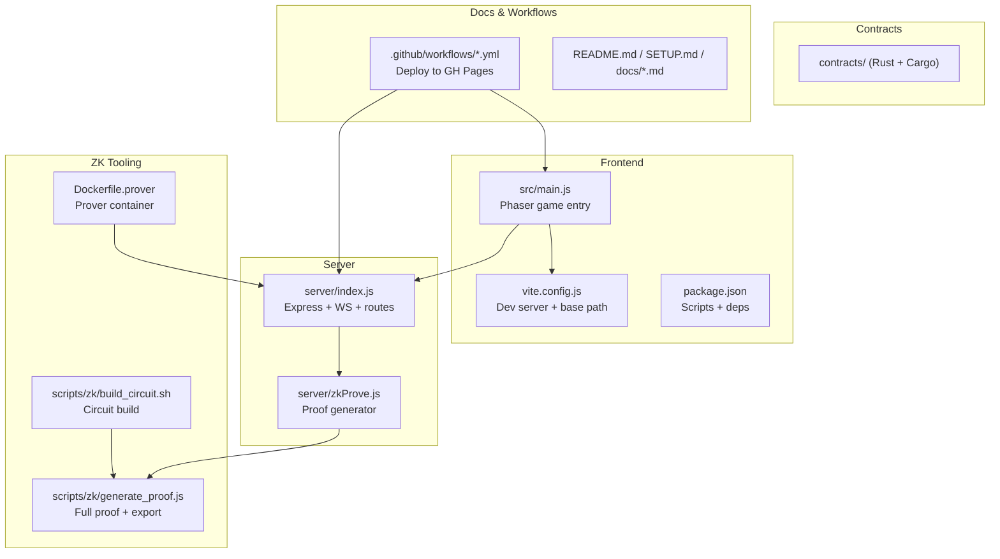
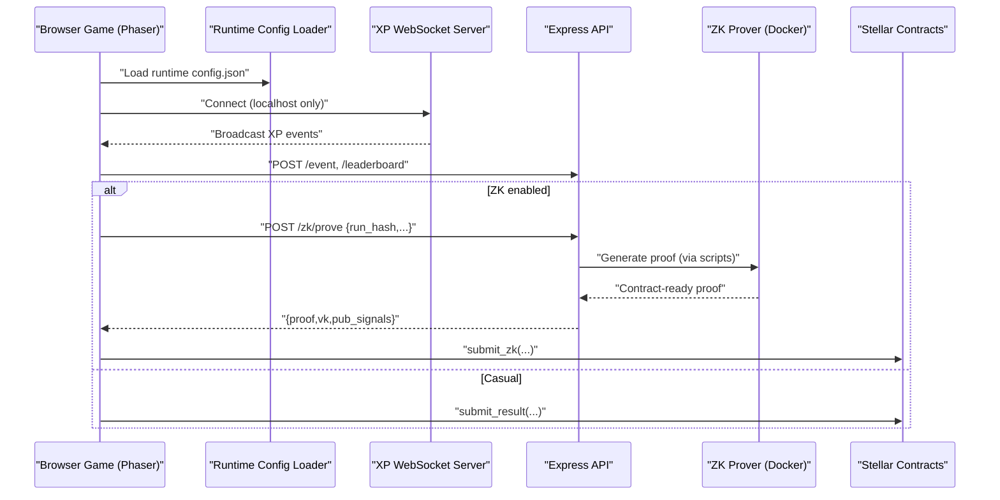
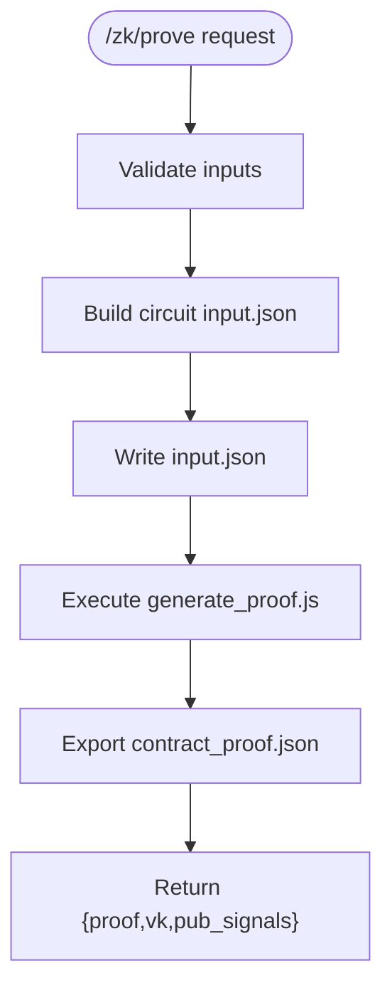
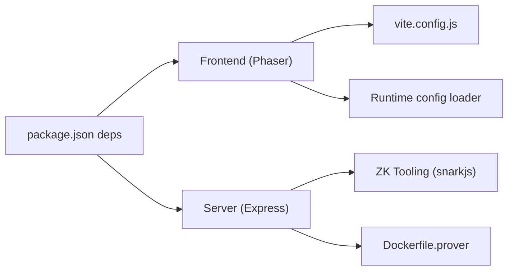
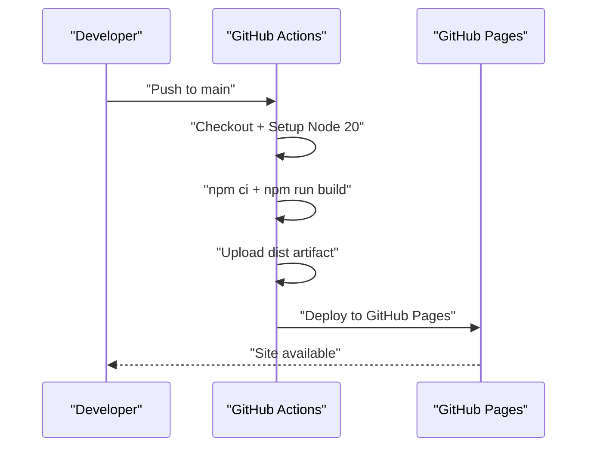

# Development Guide

<cite>
**Referenced Files in This Document**
- [package.json](file://package.json)
- [vite.config.js](file://vite.config.js)
- [README.md](file://README.md)
- [SETUP.md](file://SETUP.md)
- [Dockerfile.prover](file://Dockerfile.prover)
- [.github/workflows/deploy.yml](file://.github/workflows/deploy.yml)
- [.github/workflows/deploy-pages.yml](file://.github/workflows/deploy-pages.yml)
- [src/__tests__/EventManager.test.js](file://src/__tests__/EventManager.test.js)
- [src/__tests__/GameMechanics.test.js](file://src/__tests__/GameMechanics.test.js)
- [server/index.js](file://server/index.js)
- [server/zkProve.js](file://server/zkProve.js)
- [scripts/zk/generate_proof.js](file://scripts/zk/generate_proof.js)
- [scripts/zk/build_circuit.sh](file://scripts/zk/build_circuit.sh)
- [src/main.js](file://src/main.js)
</cite>

## Table of Contents
1. [Introduction](#introduction)
2. [Project Structure](#project-structure)
3. [Core Components](#core-components)
4. [Architecture Overview](#architecture-overview)
5. [Detailed Component Analysis](#detailed-component-analysis)
6. [Dependency Analysis](#dependency-analysis)
7. [Performance Considerations](#performance-considerations)
8. [Troubleshooting Guide](#troubleshooting-guide)
9. [Contribution and Branch Management](#contribution-and-branch-management)
10. [Code Quality Standards](#code-quality-standards)
11. [Build and Deployment Pipeline](#build-and-deployment-pipeline)
12. [Debugging and Profiling](#debugging-and-profiling)
13. [Technical Debt and Refactoring Guidelines](#technical-debt-and-refactoring-guidelines)
14. [Conclusion](#conclusion)

## Introduction
This guide provides comprehensive development documentation for Vibe-Coder contributors. It covers environment setup, the Vite-based build system, development workflow, testing frameworks, ZK prover containerization, GitHub Actions pipelines, continuous deployment to GitHub Pages, code quality standards, contribution processes, debugging and profiling techniques, and technical debt management.

## Project Structure
The repository is a hybrid frontend game (Phaser 3) with an Electron packaging target, a Node.js XP server, a ZK prover backend, Rust-based contracts, and supporting scripts and documentation.

**Diagram sources**
- [src/main.js](file://src/main.js#L1-L464)
- [vite.config.js](file://vite.config.js#L1-L34)
- [package.json](file://package.json#L1-L135)
- [server/index.js](file://server/index.js#L1-L246)
- [server/zkProve.js](file://server/zkProve.js#L1-L68)
- [scripts/zk/build_circuit.sh](file://scripts/zk/build_circuit.sh#L1-L57)
- [scripts/zk/generate_proof.js](file://scripts/zk/generate_proof.js#L1-L46)
- [Dockerfile.prover](file://Dockerfile.prover#L1-L26)
- [.github/workflows/deploy.yml](file://.github/workflows/deploy.yml#L1-L68)
- [.github/workflows/deploy-pages.yml](file://.github/workflows/deploy-pages.yml#L1-L52)

**Section sources**
- [README.md](file://README.md#L115-L135)
- [SETUP.md](file://SETUP.md#L1-L221)

## Core Components
- Frontend game engine: Phaser 3 with modular scenes and systems.
- Build and dev server: Vite with automatic base path detection for GitHub Pages.
- Backend services: Express server with WebSocket broadcasting and ZK proof generation.
- ZK toolchain: Circom circuit, snarkjs-based prover, and Dockerized prover service.
- Contracts: Rust-based Soroban contracts for verifier and policy.
- Testing: Vitest unit tests for systems and mechanics.

**Section sources**
- [src/main.js](file://src/main.js#L1-L464)
- [vite.config.js](file://vite.config.js#L1-L34)
- [server/index.js](file://server/index.js#L1-L246)
- [server/zkProve.js](file://server/zkProve.js#L1-L68)
- [scripts/zk/build_circuit.sh](file://scripts/zk/build_circuit.sh#L1-L57)
- [scripts/zk/generate_proof.js](file://scripts/zk/generate_proof.js#L1-L46)
- [Dockerfile.prover](file://Dockerfile.prover#L1-L26)
- [README.md](file://README.md#L139-L146)

## Architecture Overview
The system integrates a browser-based Phaser game with an XP streaming server and optional ZK-ranked submissions.

**Diagram sources**
- [src/main.js](file://src/main.js#L381-L401)
- [server/index.js](file://server/index.js#L99-L216)
- [server/zkProve.js](file://server/zkProve.js#L46-L67)
- [scripts/zk/generate_proof.js](file://scripts/zk/generate_proof.js#L36-L45)
- [Dockerfile.prover](file://Dockerfile.prover#L1-L26)

## Detailed Component Analysis

### Vite Build and Dev Server
- Automatic base path calculation for GitHub Pages using environment variables.
- Dev server allows filesystem access to external asset packs for development.
- Optimizes dependencies (e.g., Freighter API) for faster cold starts.

**Section sources**
- [vite.config.js](file://vite.config.js#L1-L34)
- [package.json](file://package.json#L7-L22)

### Frontend Runtime Configuration and Mobile UX
- Loads a runtime config.json from the same-origin path to support GitHub Pages.
- Handles orientation locking and rotation overlay for mobile devices.
- Conditional XP WebSocket connection for localhost/Electron.

**Section sources**
- [src/main.js](file://src/main.js#L381-L401)
- [src/main.js](file://src/main.js#L403-L446)
- [src/main.js](file://src/main.js#L448-L452)

### XP Streaming Server
- JSON middleware, CORS handling, and health endpoints.
- WebSocket broadcasting of XP events to connected clients.
- REST endpoints for player progress persistence and leaderboard management.
- ZK proof endpoint orchestrating the prover pipeline.

**Diagram sources**
- [server/index.js](file://server/index.js#L196-L216)
- [server/zkProve.js](file://server/zkProve.js#L46-L67)
- [scripts/zk/generate_proof.js](file://scripts/zk/generate_proof.js#L36-L45)

**Section sources**
- [server/index.js](file://server/index.js#L1-L246)
- [server/zkProve.js](file://server/zkProve.js#L1-L68)
- [scripts/zk/generate_proof.js](file://scripts/zk/generate_proof.js#L1-L46)

### ZK Circuit Build and Prover Container
- Bash script compiles the Circom circuit, performs Groth16 setup, and exports artifacts.
- Dockerfile installs snarkjs globally, copies server and scripts, and exposes the prover port.
- Ensures required circuit artifacts exist at runtime.

**Section sources**
- [scripts/zk/build_circuit.sh](file://scripts/zk/build_circuit.sh#L1-L57)
- [Dockerfile.prover](file://Dockerfile.prover#L1-L26)

### Testing Framework and Patterns
- Vitest is configured for unit tests under src/__tests__.
- Tests validate game mechanics, event manager behavior, and system invariants without engine dependencies.
- Watch mode and single-run modes are supported via npm scripts.

**Section sources**
- [package.json](file://package.json#L16-L17)
- [src/__tests__/EventManager.test.js](file://src/__tests__/EventManager.test.js#L1-L156)
- [src/__tests__/GameMechanics.test.js](file://src/__tests__/GameMechanics.test.js#L1-L380)

### Electron Packaging
- Electron main entry points and packaging configuration are defined in package.json build section.
- Scripts support dev workflow combining Vite and Electron.

**Section sources**
- [package.json](file://package.json#L6-L14)
- [package.json](file://package.json#L52-L133)

## Dependency Analysis
- Frontend depends on Phaser, Stellar SDKs, Supabase, and WebSocket utilities.
- Server depends on Express, WebSocket, and ZK tooling.
- Contracts are Rust-based with Cargo-managed builds.
- Electron packaging leverages Vite output and resources.

**Diagram sources**
- [package.json](file://package.json#L31-L51)
- [vite.config.js](file://vite.config.js#L1-L34)
- [server/index.js](file://server/index.js#L1-L246)
- [Dockerfile.prover](file://Dockerfile.prover#L1-L26)

**Section sources**
- [package.json](file://package.json#L31-L51)

## Performance Considerations
- Optimize Phaser rendering and physics settings for smooth gameplay on varied hardware.
- Minimize WebSocket message sizes and throttle XP broadcasts to reduce overhead.
- Cache and reuse runtime configuration to avoid repeated network calls.
- Use Vite’s optimized dependencies and tree-shaking to reduce bundle size.
- For ZK, consider batching proof requests and caching public keys where appropriate.

[No sources needed since this section provides general guidance]

## Troubleshooting Guide
- Local development: ensure ports 3000 (Vite) and 3333 (XP server) are available.
- XP server connectivity: confirm WebSocket connection status indicators and browser console logs.
- Assets not loading: verify sprite paths and restart dev server after asset changes.
- Mobile orientation: resolve portrait lock and overlay before starting the game.
- ZK prover: ensure circuit artifacts exist and Docker image is built with required files.

**Section sources**
- [SETUP.md](file://SETUP.md#L109-L142)
- [src/main.js](file://src/main.js#L416-L429)
- [Dockerfile.prover](file://Dockerfile.prover#L19-L20)

## Contribution and Branch Management
- Branch strategy: feature branches merged via pull requests targeting main.
- PR guidelines: include a summary, screenshots if UI-related, and test coverage updates.
- Commit hygiene: keep commits focused and reference related issues.

[No sources needed since this section provides general guidance]

## Code Quality Standards
- Linting and formatting: configure ESLint and Prettier in your editor; enforce via pre-commit hooks if desired.
- Naming conventions: camelCase for JS identifiers, kebab-case for assets, and descriptive variable names.
- Error handling: centralize error responses and logging in the server middleware.
- Security: validate and sanitize all inputs, especially for ZK proof generation and leaderboard submissions.

[No sources needed since this section provides general guidance]

## Build and Deployment Pipeline
- GitHub Pages: automated build and deployment on pushes to main using Node.js 20 and artifact upload.
- Workflow specifics: build job sets environment variables for optional on-chain/ZK features; deployment job publishes to GitHub Pages.
- Local builds: use npm scripts to build and preview distribution assets.

**Diagram sources**
- [.github/workflows/deploy.yml](file://.github/workflows/deploy.yml#L24-L56)
- [.github/workflows/deploy-pages.yml](file://.github/workflows/deploy-pages.yml#L17-L40)

**Section sources**
- [.github/workflows/deploy.yml](file://.github/workflows/deploy.yml#L1-L68)
- [.github/workflows/deploy-pages.yml](file://.github/workflows/deploy-pages.yml#L1-L52)
- [README.md](file://README.md#L149-L153)

## Debugging and Profiling
- Frontend: enable Phaser arcade debug overlays temporarily to inspect hitboxes and collisions.
- Server: use structured logging for ZK proof failures and leaderboard updates.
- Network: monitor WebSocket connections and API responses in browser devtools.
- ZK: capture and inspect generated input.json and exported contract_proof.json for mismatches.

**Section sources**
- [src/main.js](file://src/main.js#L34-L35)
- [server/index.js](file://server/index.js#L232-L239)
- [scripts/zk/generate_proof.js](file://scripts/zk/generate_proof.js#L42-L45)

## Technical Debt and Refactoring Guidelines
- Modularize systems: keep game systems cohesive and loosely coupled; extract shared logic into utilities.
- Reduce duplication: consolidate XP broadcasting and leaderboard sorting logic.
- Improve test coverage: expand unit tests for edge cases in event triggers and weapon evolutions.
- Documentation: keep inline comments concise; maintain docs in docs/ and reference them from README.

[No sources needed since this section provides general guidance]

## Conclusion
This guide consolidates the development environment, build system, testing, ZK tooling, and deployment processes for Vibe-Coder. Contributors should align with the established scripts, workflows, and quality practices to ensure reliable contributions and smooth releases.