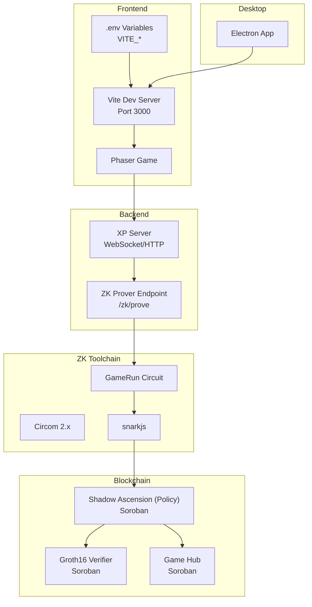

# Environment Setup

<cite>
**Referenced Files in This Document**
- [package.json](file://package.json)
- [.env.example](file://.env.example)
- [SETUP.md](file://SETUP.md)
- [vite.config.js](file://vite.config.js)
- [README.md](file://README.md)
- [DEPLOY_ZK_STEPS.md](file://docs/DEPLOY_ZK_STEPS.md)
- [HACKATHON_DO_THIS.md](file://docs/HACKATHON_DO_THIS.md)
- [Cargo.toml](file://contracts/Cargo.toml)
- [shadow_ascension/Cargo.toml](file://contracts/shadow_ascension/Cargo.toml)
- [groth16_verifier/Cargo.toml](file://contracts/groth16_verifier/Cargo.toml)
- [GameRun.circom](file://circuits/GameRun.circom)
- [build_circuit.sh](file://scripts/zk/build_circuit.sh)
- [zkProve.js](file://server/zkProve.js)
- [main.js](file://electron/main.js)
</cite>

## Table of Contents
1. [Introduction](#introduction)
2. [System Requirements](#system-requirements)
3. [Environment Variables](#environment-variables)
4. [Package Scripts](#package-scripts)
5. [Vite Configuration](#vite-configuration)
6. [Step-by-Step Installation](#step-by-step-installation)
7. [IDE Setup and Debugging](#ide-setup-and-debugging)
8. [Development Workflow Best Practices](#development-workflow-best-practices)
9. [Architecture Overview](#architecture-overview)
10. [Troubleshooting](#troubleshooting)
11. [Conclusion](#conclusion)

## Introduction
This document provides comprehensive environment setup guidance for Vibe-Coder development. It covers system prerequisites, environment configuration, dependency installation, build scripts, development server configuration, and best practices for local and ZK-enabled development. It also explains how to configure the frontend for different environments (development, testnet, production) and outlines the integration points between the frontend, backend, and blockchain components.

## System Requirements
- Node.js: Version 18 or higher is required for development and building the frontend.
- Rust toolchain: Required for building Soroban smart contracts targeting wasm32v1-none.
- Circom: Version 2.x is required for compiling the ZK circuit; the project specifies pragma circom 2.1.4.
- snarkjs: Required for Groth16 trusted setup, R1CS compilation, and proof generation.
- Git: For cloning the repository and managing branches.
- Operating System: macOS, Linux, or Windows with a compatible shell for running scripts.

These requirements are derived from the project's scripts, documentation, and dependency declarations.

**Section sources**
- [SETUP.md](file://SETUP.md#L20-L23)
- [build_circuit.sh](file://scripts/zk/build_circuit.sh#L3-L4)
- [GameRun.circom](file://circuits/GameRun.circom#L4-L4)
- [DEPLOY_ZK_STEPS.md](file://docs/DEPLOY_ZK_STEPS.md#L21-L25)

## Environment Variables
The project uses a .env.example file to define environment variables consumed by the frontend (Vite) and backend services. The most important variables are:

- VITE_SHADOW_ASCENSION_CONTRACT_ID: The Soroban contract ID for the policy contract (shadow_ascension) used in ZK ranked submissions.
- VITE_ZK_PROVER_URL: The URL of the ZK prover service used to generate Groth16 proofs for ranked submissions.
- VITE_API_URL: The base URL for the backend API (authentication, progress, etc.).

Backend-related variables (for local .env or Render environment variables) include:
- SUPABASE_URL and SUPABASE_ANON_KEY: Supabase configuration for user data.
- SUPABASE_SERVICE_ROLE_KEY: Optional service role key for server-side operations.
- SEP10_ENABLED: Enables SEP-10 authentication.
- SEP10_SERVER_SECRET_KEY: Secret key for signing SEP-10 challenges.
- SECRET_SEP10_SIGNING_SEED: Alias for the signing seed.
- JWT_SECRET and SECRET_SEP10_JWT_SECRET: JWT secrets for authentication.
- SEP10_HOME_DOMAIN and SEP10_HOME_DOMAINS: Domain(s) used for SEP-10.
- SEP10_WEB_AUTH_DOMAIN: The domain used for web authentication.
- SEP10_NETWORK_PASSPHRASE: Network passphrase for Testnet.
- SEP10_CHALLENGE_TIMEOUT and SEP10_AUTH_TIMEOUT: Timeout values for authentication flows.
- JWT_EXPIRY_SEC and SEP10_JWT_TIMEOUT: Token expiry settings.

Notes:
- For production deployments, use Render environment variables or repository secrets for sensitive values.
- The frontend reads VITE_* variables at build time; ensure they are present in the appropriate environment.

**Section sources**
- [.env.example](file://.env.example#L7-L13)
- [.env.example](file://.env.example#L19-L36)

## Package Scripts
The project defines several npm scripts to streamline development, building, testing, and ZK workflows:

- dev: Starts the Vite development server for the frontend.
- build: Builds the frontend for production.
- preview: Previews the production build locally.
- server: Runs the XP server (WebSocket/HTTP) used for real-time XP events and ZK prover endpoint.
- electron: Launches the Electron app.
- electron:dev: Runs Vite and Electron concurrently for desktop development.
- electron:build: Builds the frontend and packages the Electron app.
- electron:pack: Creates a distributable Electron build.
- test: Runs unit tests with Vitest.
- test:watch: Starts Vitest in watch mode.
- zk:build: Compiles the ZK circuit and performs Groth16 trusted setup.
- zk:proof: Generates a ZK proof using the prover script.
- zk:args: Prepares contract arguments from the generated proof.
- zk:e2e: Executes end-to-end ZK workflow.

These scripts orchestrate the entire development lifecycle, from frontend dev server to ZK proof generation and Electron packaging.

**Section sources**
- [package.json](file://package.json#L7-L22)

## Vite Configuration
Vite is configured to serve the frontend during development and to build optimized assets for production. Key configuration aspects include:

- Base path: Automatically derives a base path for GitHub Pages when running in CI, otherwise defaults to relative paths.
- Dev server: Runs on port 3000 and opens the browser automatically. It allows access to specific directories for loading local assets during development.
- Build output: Outputs to dist with assets in assets/.
- Dependency optimization: Includes @stellar/freighter-api in optimizeDeps to improve cold start performance.

These settings ensure smooth development with hot reload and proper asset resolution.

**Section sources**
- [vite.config.js](file://vite.config.js#L11-L33)

## Step-by-Step Installation
Follow these steps to set up the development environment:

1. Prerequisites
   - Install Node.js 18+.
   - Install Rust toolchain and add the wasm32v1-none target for Soroban contracts.
   - Install Circom 2.x and snarkjs globally.
   - Ensure Git is available.

2. Clone and Install Dependencies
   - Clone the repository and install Node.js dependencies.

3. Start the Frontend and Backend
   - Open two terminal windows.
   - Terminal 1: Start the Vite dev server.
   - Terminal 2: Start the XP server (used for real-time XP and ZK prover endpoint).

4. Configure Environment Variables
   - Copy .env.example to .env and fill in the required variables (VITE_SHADOW_ASCENSION_CONTRACT_ID, VITE_ZK_PROVER_URL, VITE_API_URL).
   - For backend authentication, configure SEP-10 and JWT variables as needed.

5. Build ZK Circuit (Optional)
   - Run the ZK build script to compile the circuit and perform trusted setup.
   - Ensure the circuit artifacts are present in circuits/build.

6. Desktop App (Optional)
   - Use the Electron scripts to run or package the desktop app.

7. Testing
   - Run unit tests with Vitest and watch mode for continuous feedback.

**Section sources**
- [SETUP.md](file://SETUP.md#L24-L46)
- [DEPLOY_ZK_STEPS.md](file://docs/DEPLOY_ZK_STEPS.md#L19-L31)
- [package.json](file://package.json#L7-L22)

## IDE Setup and Debugging
Recommended IDE setup and debugging configurations:

- VS Code
  - Install recommended extensions for JavaScript/TypeScript, ESLint, Prettier, and any Stellar-related extensions.
  - Configure tasks and launch configurations for:
    - Running Vite dev server.
    - Starting the XP server.
    - Running Electron in development mode.
    - Executing ZK scripts (build, proof generation).
  - Use breakpoints in both frontend and backend code for debugging.

- Browser DevTools
  - Use the browser console and network tab to inspect WebSocket connections, API calls, and asset loading.
  - Enable source maps for better debugging experience.

- Electron Debugging
  - Use Electron’s main process logging and renderer process DevTools.
  - The Electron main process loads the dev server in development mode and handles window management and system tray interactions.

- Backend Debugging
  - For the XP server and ZK prover, enable logging and inspect request/response payloads.
  - Use curl or Postman to test endpoints exposed by the XP server.

**Section sources**
- [main.js](file://electron/main.js#L48-L54)

## Development Workflow Best Practices
- Keep dependencies updated: Regularly update Node.js packages and Rust crates to benefit from security patches and performance improvements.
- Use separate terminals for frontend and backend services to avoid conflicts.
- Leverage hot reload: Vite’s fast refresh improves iteration speed during development.
- Validate environment variables: Ensure .env is properly configured before starting services.
- Test ZK flow: After building the circuit and starting the prover, test the end-to-end ZK submission flow.
- Desktop app development: Use electron:dev for simultaneous frontend and Electron development.
- CI/CD: For GitHub Pages, ensure repository secrets are configured for VITE_SHADOW_ASCENSION_CONTRACT_ID and VITE_ZK_PROVER_URL.

[No sources needed since this section provides general guidance]

## Architecture Overview
The environment integrates multiple components:

- Frontend (Vite): Serves the Phaser-based game and consumes environment variables for contract IDs and prover URLs.
- Backend (XP Server): Provides WebSocket/HTTP endpoints for XP events and exposes a ZK prover endpoint.
- Blockchain (Soroban): Smart contracts for policy, verifier, and Game Hub integration.
- ZK Toolchain: Circom circuit compilation and snarkjs proof generation.
- Desktop App (Electron): Bundles the game as a desktop application.

**Diagram sources**
- [vite.config.js](file://vite.config.js#L11-L33)
- [README.md](file://README.md#L40-L85)
- [DEPLOY_ZK_STEPS.md](file://docs/DEPLOY_ZK_STEPS.md#L1-L90)
- [build_circuit.sh](file://scripts/zk/build_circuit.sh#L1-L57)
- [zkProve.js](file://server/zkProve.js#L1-L68)
- [main.js](file://electron/main.js#L48-L54)

## Troubleshooting
Common issues and resolutions:

- CONNECTING status persists
  - Ensure the XP server is running and listening on the expected port.
  - Verify firewall settings and that port 3333 is accessible.

- XP not appearing in the game
  - Confirm the hook script is executable and properly configured.
  - Manually test the hook and check the browser console for WebSocket errors.

- Assets not loading in development
  - Verify asset paths and restart the dev server.
  - Perform a hard refresh to reload textures.

- ZK circuit build failures
  - Ensure Circom 2.x is installed and in PATH.
  - Confirm snarkjs is installed globally.
  - Check that the powers of tau file downloads or generates correctly.

- Electron app not loading dev content
  - Confirm the dev server is running on the expected port.
  - Check Electron main process logs for errors.

**Section sources**
- [SETUP.md](file://SETUP.md#L109-L142)
- [build_circuit.sh](file://scripts/zk/build_circuit.sh#L16-L28)

## Conclusion
With the correct system requirements, environment variables configured, and the provided scripts and configurations, you can develop, test, and deploy Vibe-Coder effectively. The setup supports local development, ZK-enabled ranked submissions, and desktop distribution. Following the best practices and troubleshooting tips will help maintain a smooth development experience.

[No sources needed since this section summarizes without analyzing specific files]