# Testing Framework

<cite>
**Referenced Files in This Document**
- [package.json](file://package.json)
- [vite.config.js](file://vite.config.js)
- [src/__tests__/EventManager.test.js](file://src/__tests__/EventManager.test.js)
- [src/__tests__/SaveManager.test.js](file://src/__tests__/SaveManager.test.js)
- [src/__tests__/RebirthManager.test.js](file://src/__tests__/RebirthManager.test.js)
- [src/__tests__/GameMechanics.test.js](file://src/__tests__/GameMechanics.test.js)
- [src/__tests__/SpatialHash.test.js](file://src/__tests__/SpatialHash.test.js)
- [src/__tests__/ShrineManager.test.js](file://src/__tests__/ShrineManager.test.js)
- [src/__tests__/RunModifiers.test.js](file://src/__tests__/RunModifiers.test.js)
- [src/__tests__/CombatEdgeCases.test.js](file://src/__tests__/CombatEdgeCases.test.js)
- [src/systems/EventManager.js](file://src/systems/EventManager.js)
- [src/systems/SaveManager.js](file://src/systems/SaveManager.js)
- [src/systems/RebirthManager.js](file://src/systems/RebirthManager.js)
- [src/systems/RunModifiers.js](file://src/systems/RunModifiers.js)
- [src/utils/SpatialHash.js](file://src/utils/SpatialHash.js)
- [src/utils/socket.js](file://src/utils/socket.js)
- [src/zk/gameProof.js](file://src/zk/gameProof.js)
- [server/zkProve.js](file://server/zkProve.js)
- [server/db/supabase.js](file://server/db/supabase.js)
- [server/routes/auth.js](file://server/routes/auth.js)
- [server/middleware/jwtAuth.js](file://server/middleware/jwtAuth.js)
- [server/auth/challenge.js](file://server/auth/challenge.js)
- [server/auth/token.js](file://server/auth/token.js)
- [contracts/shadow_ascension/src/lib.rs](file://contracts/shadow_ascension/src/lib.rs)
- [contracts/shadow_ascension/src/tests.rs](file://contracts/shadow_ascension/src/tests.rs)
- [scripts/zk/generate_proof.js](file://scripts/zk/generate_proof.js)
- [scripts/zk/contract_args_from_proof.js](file://scripts/zk/contract_args_from_proof.js)
- [scripts/e2e_zk.sh](file://scripts/e2e_zk.sh)
</cite>

## Table of Contents
1. [Introduction](#introduction)
2. [Project Structure](#project-structure)
3. [Core Components](#core-components)
4. [Architecture Overview](#architecture-overview)
5. [Detailed Component Analysis](#detailed-component-analysis)
6. [Dependency Analysis](#dependency-analysis)
7. [Performance Considerations](#performance-considerations)
8. [Troubleshooting Guide](#troubleshooting-guide)
9. [Conclusion](#conclusion)
10. [Appendices](#appendices)

## Introduction
This document describes the testing framework for Vibe-Coder, focusing on unit and integration testing strategies across frontend game systems and backend services. It explains the Vitest-based setup, test patterns for game systems (Event Manager, Save Manager, Rebirth Manager), and outlines approaches for testing WebSocket communication, ZK proof generation, and blockchain contract interactions. It also covers mocking strategies for external dependencies, best practices for asynchronous and event-driven code, coverage expectations, CI testing, and debugging failed tests.

## Project Structure
The repository organizes tests alongside the source code under src/__tests__. The frontend game systems live under src/systems and src/utils, while backend services are under server. ZK tooling and contracts are under scripts/zk and contracts respectively.

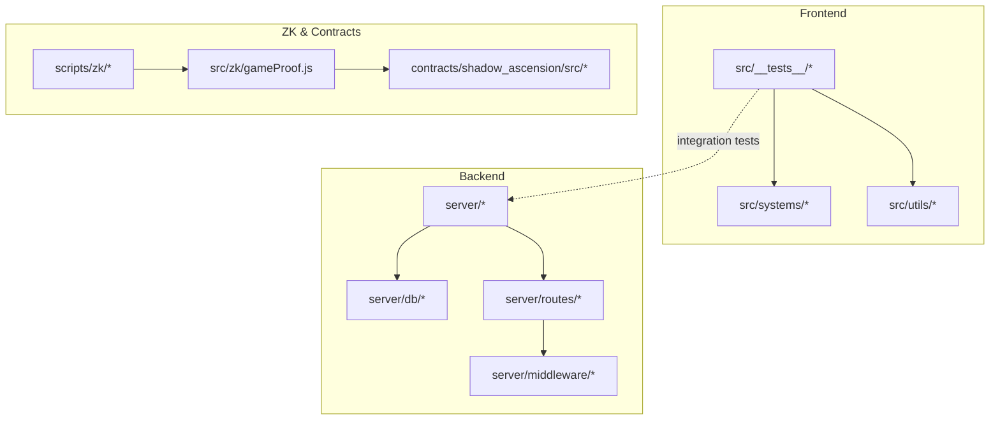

**Diagram sources**
- [src/systems/EventManager.js](file://src/systems/EventManager.js)
- [src/systems/SaveManager.js](file://src/systems/SaveManager.js)
- [src/systems/RebirthManager.js](file://src/systems/RebirthManager.js)
- [src/systems/RunModifiers.js](file://src/systems/RunModifiers.js)
- [src/utils/SpatialHash.js](file://src/utils/SpatialHash.js)
- [src/utils/socket.js](file://src/utils/socket.js)
- [src/zk/gameProof.js](file://src/zk/gameProof.js)
- [server/zkProve.js](file://server/zkProve.js)
- [server/db/supabase.js](file://server/db/supabase.js)
- [server/routes/auth.js](file://server/routes/auth.js)
- [server/middleware/jwtAuth.js](file://server/middleware/jwtAuth.js)
- [server/auth/challenge.js](file://server/auth/challenge.js)
- [server/auth/token.js](file://server/auth/token.js)
- [contracts/shadow_ascension/src/lib.rs](file://contracts/shadow_ascension/src/lib.rs)
- [contracts/shadow_ascension/src/tests.rs](file://contracts/shadow_ascension/src/tests.rs)
- [scripts/zk/generate_proof.js](file://scripts/zk/generate_proof.js)
- [scripts/zk/contract_args_from_proof.js](file://scripts/zk/contract_args_from_proof.js)

**Section sources**
- [package.json](file://package.json#L16-L17)
- [vite.config.js](file://vite.config.js#L1-L34)

## Core Components
- Test runner and scripts: Vitest is configured via npm scripts for running and watching tests.
- Frontend test suite: Unit tests for game systems and utilities validate deterministic logic and data structures.
- Backend test suite: Tests cover server routes, middleware, and database interactions.
- ZK and blockchain: Contract tests and end-to-end ZK scripts support integration verification.

Key capabilities demonstrated by the existing tests:
- EventManager: Validates event definitions, triggers, and scene effect application.
- SaveManager: Validates localStorage-backed persistence, save/load/clear and summaries.
- RebirthManager: Validates milestone logic, rebirth progression, and stat multipliers.
- GameMechanics: Validates XP curves, player stats scaling, spawn pools, weapon balance, evolution recipes, enemy balance, and crit chance.
- SpatialHash: Validates spatial partitioning correctness and neighbor queries.
- ShrineManager: Validates shrine definitions, gamble outcomes, chaos effects, and buff tracking.
- RunModifiers: Validates modifier selection, combined effects, and lookup.

**Section sources**
- [package.json](file://package.json#L16-L17)
- [src/__tests__/EventManager.test.js](file://src/__tests__/EventManager.test.js#L1-L156)
- [src/__tests__/SaveManager.test.js](file://src/__tests__/SaveManager.test.js#L1-L213)
- [src/__tests__/RebirthManager.test.js](file://src/__tests__/RebirthManager.test.js#L1-L296)
- [src/__tests__/GameMechanics.test.js](file://src/__tests__/GameMechanics.test.js#L1-L380)
- [src/__tests__/SpatialHash.test.js](file://src/__tests__/SpatialHash.test.js#L1-L147)
- [src/__tests__/ShrineManager.test.js](file://src/__tests__/ShrineManager.test.js#L1-L236)
- [src/__tests__/RunModifiers.test.js](file://src/__tests__/RunModifiers.test.js#L1-L136)

## Architecture Overview
The testing architecture separates concerns into:
- Unit tests for pure logic and data structures (frontend systems and utilities).
- Integration tests for backend services (routes, middleware, DB).
- End-to-end tests for ZK proof generation and blockchain contract submission.

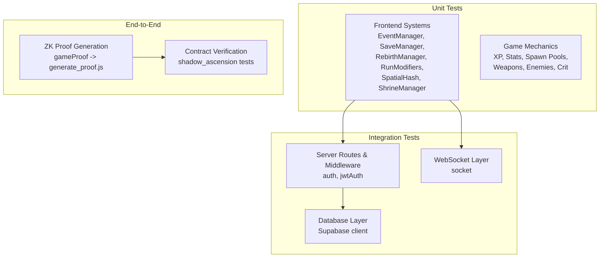

**Diagram sources**
- [src/systems/EventManager.js](file://src/systems/EventManager.js)
- [src/systems/SaveManager.js](file://src/systems/SaveManager.js)
- [src/systems/RebirthManager.js](file://src/systems/RebirthManager.js)
- [src/systems/RunModifiers.js](file://src/systems/RunModifiers.js)
- [src/utils/SpatialHash.js](file://src/utils/SpatialHash.js)
- [src/utils/socket.js](file://src/utils/socket.js)
- [src/zk/gameProof.js](file://src/zk/gameProof.js)
- [server/routes/auth.js](file://server/routes/auth.js)
- [server/middleware/jwtAuth.js](file://server/middleware/jwtAuth.js)
- [server/db/supabase.js](file://server/db/supabase.js)
- [scripts/zk/generate_proof.js](file://scripts/zk/generate_proof.js)
- [contracts/shadow_ascension/src/tests.rs](file://contracts/shadow_ascension/src/tests.rs)

## Detailed Component Analysis

### EventManager Testing Patterns
EventManager tests validate:
- Event definitions integrity and uniqueness.
- Trigger conditions (active event, wave thresholds).
- Scene effect application and clearing.

Recommended patterns:
- Use factory helpers to construct minimal scene mocks.
- Assert side effects on scene properties.
- Verify idempotent operations (e.g., clearing effects).

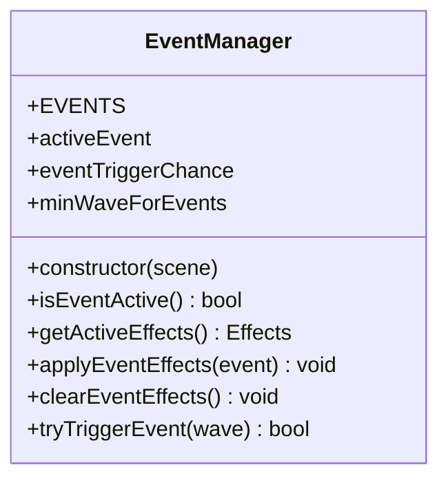

**Diagram sources**
- [src/systems/EventManager.js](file://src/systems/EventManager.js)

**Section sources**
- [src/__tests__/EventManager.test.js](file://src/__tests__/EventManager.test.js#L1-L156)

### SaveManager Testing Patterns
SaveManager tests validate:
- Human-friendly timestamps.
- localStorage-backed persistence lifecycle (save, load, has, clear).
- Data normalization and versioning.
- Error handling for quota and corrupted data.

Recommended patterns:
- Stub global localStorage with an in-memory store.
- Use beforeEach/afterEach to reset mocks.
- Validate serialized shapes and version stamps.

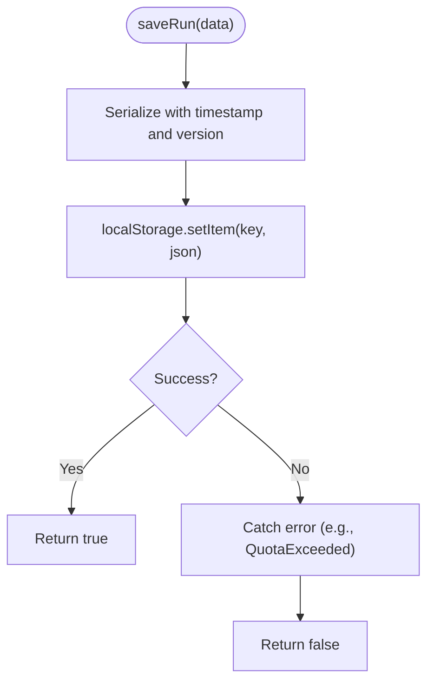

**Diagram sources**
- [src/systems/SaveManager.js](file://src/systems/SaveManager.js)

**Section sources**
- [src/__tests__/SaveManager.test.js](file://src/__tests__/SaveManager.test.js#L1-L213)

### RebirthManager Testing Patterns
RebirthManager tests validate:
- Milestone definitions and ordering.
- Load/save from localStorage.
- Eligibility checks and milestone progression.
- Stat multipliers and starting weapon calculations.

Recommended patterns:
- Mock localStorage globally for isolated tests.
- Parameterize wave and kill inputs to test progression.
- Verify caps and cumulative stats.

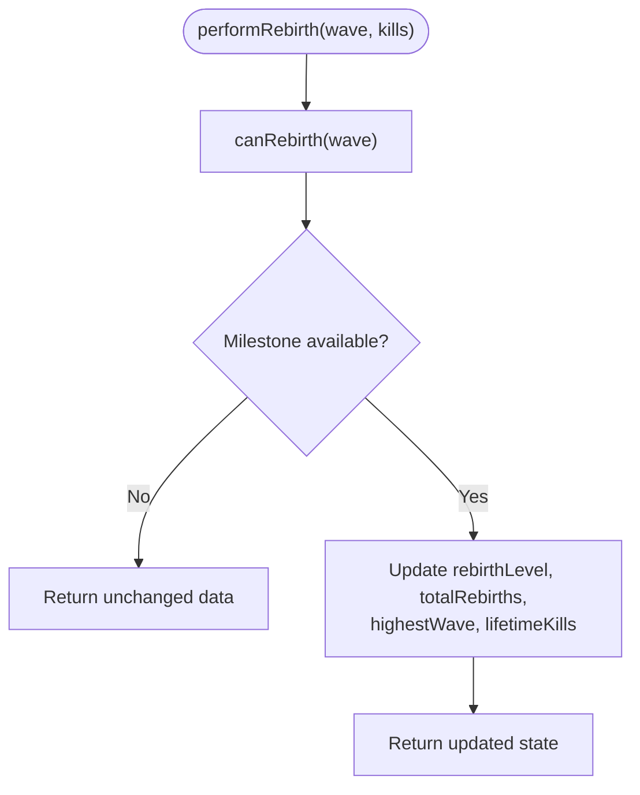

**Diagram sources**
- [src/systems/RebirthManager.js](file://src/systems/RebirthManager.js)

**Section sources**
- [src/__tests__/RebirthManager.test.js](file://src/__tests__/RebirthManager.test.js#L1-L296)

### Game Mechanics Validation
GameMechanics tests validate:
- XP curve monotonicity and known values.
- Player stats scaling with bonuses and rebirth multipliers.
- Spawn pool composition and growth.
- Weapon and evolution recipe integrity.
- Enemy balance and crit chance.

Recommended patterns:
- Mirror formulas in tests to validate mathematical invariants.
- Use targeted assertions for edge cases (flooring, caps, weights).

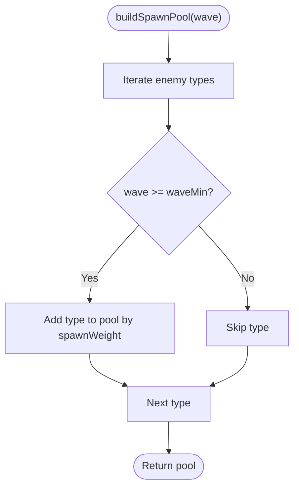

**Diagram sources**
- [src/__tests__/GameMechanics.test.js](file://src/__tests__/GameMechanics.test.js#L84-L96)

**Section sources**
- [src/__tests__/GameMechanics.test.js](file://src/__tests__/GameMechanics.test.js#L1-L380)

### SpatialHash Testing Patterns
SpatialHash tests validate:
- Cell coordinate mapping.
- Insertion and retrieval of active entities.
- Nearby queries with precise distance checks.

Recommended patterns:
- Use beforeEach to instantiate with a fixed cell size.
- Verify both cell membership and cross-boundary queries.

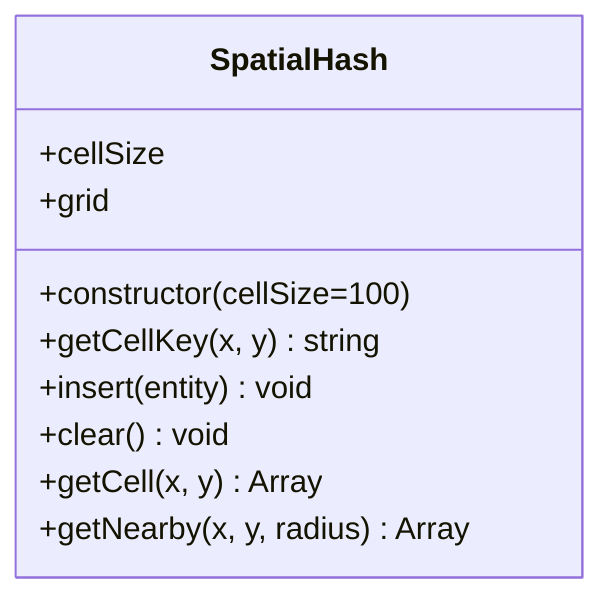

**Diagram sources**
- [src/utils/SpatialHash.js](file://src/utils/SpatialHash.js)

**Section sources**
- [src/__tests__/SpatialHash.test.js](file://src/__tests__/SpatialHash.test.js#L1-L147)

### ShrineManager Testing Patterns
ShrineManager tests validate:
- Shrine definitions integrity and uniqueness.
- Gamble outcomes distribution and weights.
- Chaos effects variety.
- Buff tracking and multipliers.

Recommended patterns:
- Extract pure logic into standalone functions for easy assertion.
- Validate cost-checking logic against player state.

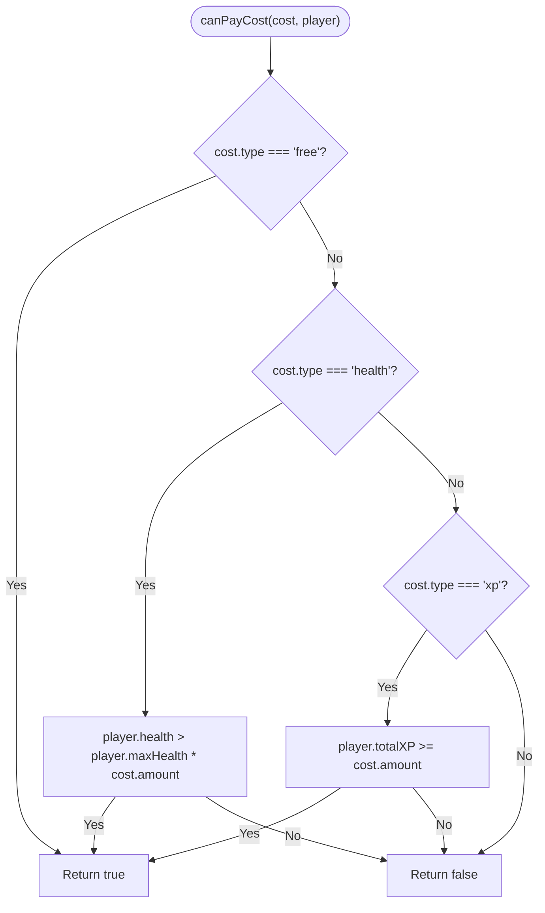

**Diagram sources**
- [src/systems/ShrineManager.js](file://src/systems/ShrineManager.js)

**Section sources**
- [src/__tests__/ShrineManager.test.js](file://src/__tests__/ShrineManager.test.js#L1-L236)

### RunModifiers Testing Patterns
RunModifiers tests validate:
- Modifier definitions and uniqueness.
- Selection without duplicates and caps.
- Combined effects aggregation (multiplicative vs boolean OR).

Recommended patterns:
- Test default effects and combined effect matrices.
- Validate getById and getAll behaviors.

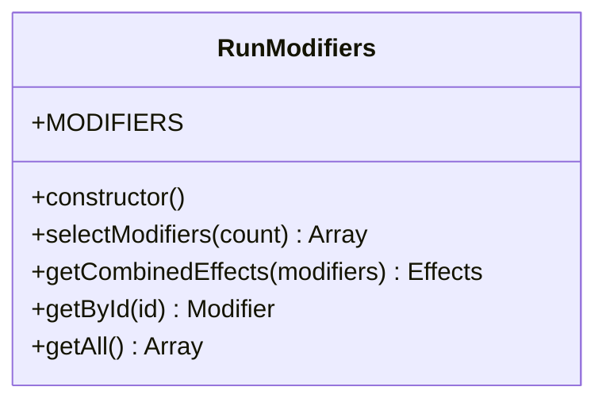

**Diagram sources**
- [src/systems/RunModifiers.js](file://src/systems/RunModifiers.js)

**Section sources**
- [src/__tests__/RunModifiers.test.js](file://src/__tests__/RunModifiers.test.js#L1-L136)

### Integration Testing Approaches

#### WebSocket Communication
Approach:
- Use a lightweight WebSocket server for local testing.
- Mock the client-side socket module to simulate connection events and message handling.
- Validate event emission and response handling without a live backend.

Recommended patterns:
- Isolate socket logic behind a thin wrapper for easy mocking.
- Use Vitest spies to assert send/receive calls.

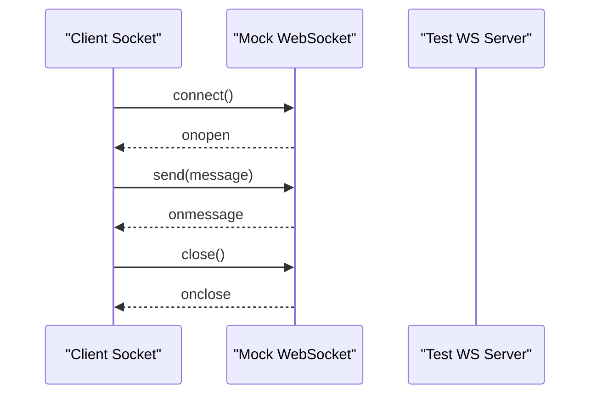

**Diagram sources**
- [src/utils/socket.js](file://src/utils/socket.js)

**Section sources**
- [src/utils/socket.js](file://src/utils/socket.js)

#### ZK Proof Generation and Blockchain Interaction
Approach:
- Use the ZK scripts to generate proofs locally.
- Validate proof artifacts and contract arguments.
- Integrate with Rust contract tests for verification and submission flows.

Recommended patterns:
- Automate proof generation and argument extraction in CI.
- Mock off-chain dependencies (e.g., network calls) when testing pure logic.

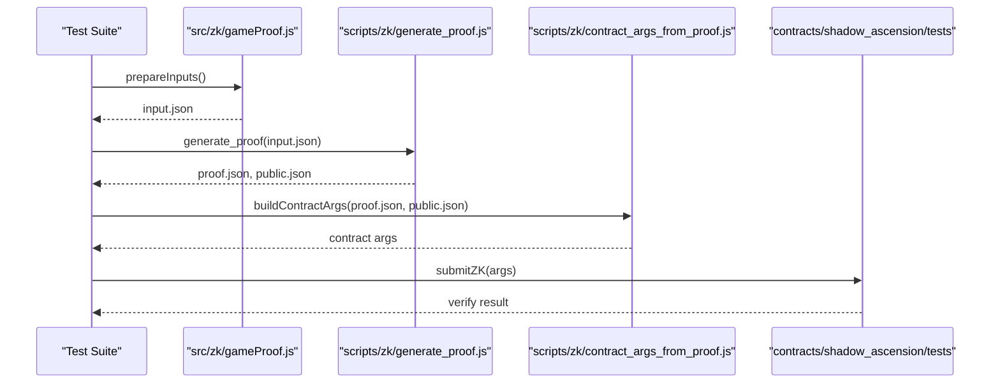

**Diagram sources**
- [src/zk/gameProof.js](file://src/zk/gameProof.js)
- [scripts/zk/generate_proof.js](file://scripts/zk/generate_proof.js)
- [scripts/zk/contract_args_from_proof.js](file://scripts/zk/contract_args_from_proof.js)
- [contracts/shadow_ascension/src/tests.rs](file://contracts/shadow_ascension/src/tests.rs)

**Section sources**
- [src/zk/gameProof.js](file://src/zk/gameProof.js)
- [scripts/zk/generate_proof.js](file://scripts/zk/generate_proof.js)
- [scripts/zk/contract_args_from_proof.js](file://scripts/zk/contract_args_from_proof.js)
- [scripts/e2e_zk.sh](file://scripts/e2e_zk.sh)
- [contracts/shadow_ascension/src/tests.rs](file://contracts/shadow_ascension/src/tests.rs)

#### Backend Authentication and Authorization
Approach:
- Test JWT middleware and auth routes in isolation.
- Mock Supabase client to validate token parsing and user claims.

Recommended patterns:
- Use beforeEach to stub environment variables and DB client.
- Validate error responses for invalid tokens.

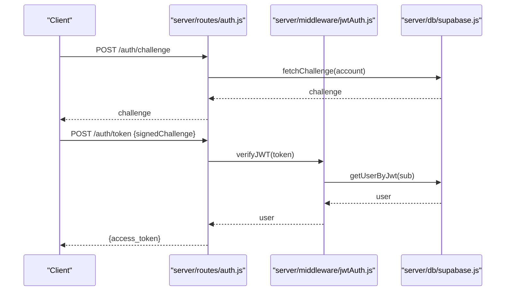

**Diagram sources**
- [server/routes/auth.js](file://server/routes/auth.js)
- [server/middleware/jwtAuth.js](file://server/middleware/jwtAuth.js)
- [server/db/supabase.js](file://server/db/supabase.js)
- [server/auth/challenge.js](file://server/auth/challenge.js)
- [server/auth/token.js](file://server/auth/token.js)

**Section sources**
- [server/routes/auth.js](file://server/routes/auth.js)
- [server/middleware/jwtAuth.js](file://server/middleware/jwtAuth.js)
- [server/db/supabase.js](file://server/db/supabase.js)
- [server/auth/challenge.js](file://server/auth/challenge.js)
- [server/auth/token.js](file://server/auth/token.js)

## Dependency Analysis
Testing dependencies and coupling:
- Frontend tests depend on internal systems and utilities; they are loosely coupled to external services via mocks.
- Backend tests depend on route handlers, middleware, and DB clients; they are isolated via environment stubs.
- ZK tests depend on script orchestration and Rust contract tests; they are integrated end-to-end.

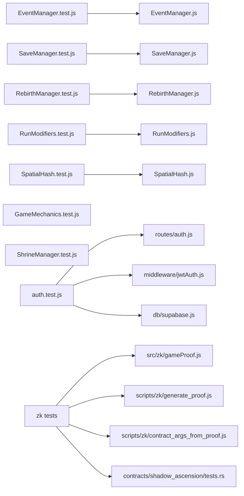

**Diagram sources**
- [src/__tests__/EventManager.test.js](file://src/__tests__/EventManager.test.js)
- [src/systems/EventManager.js](file://src/systems/EventManager.js)
- [src/__tests__/SaveManager.test.js](file://src/__tests__/SaveManager.test.js)
- [src/systems/SaveManager.js](file://src/systems/SaveManager.js)
- [src/__tests__/RebirthManager.test.js](file://src/__tests__/RebirthManager.test.js)
- [src/systems/RebirthManager.js](file://src/systems/RebirthManager.js)
- [src/__tests__/RunModifiers.test.js](file://src/__tests__/RunModifiers.test.js)
- [src/systems/RunModifiers.js](file://src/systems/RunModifiers.js)
- [src/__tests__/SpatialHash.test.js](file://src/__tests__/SpatialHash.test.js)
- [src/utils/SpatialHash.js](file://src/utils/SpatialHash.js)
- [src/__tests__/GameMechanics.test.js](file://src/__tests__/GameMechanics.test.js)
- [src/__tests__/ShrineManager.test.js](file://src/__tests__/ShrineManager.test.js)
- [server/routes/auth.js](file://server/routes/auth.js)
- [server/middleware/jwtAuth.js](file://server/middleware/jwtAuth.js)
- [server/db/supabase.js](file://server/db/supabase.js)
- [src/zk/gameProof.js](file://src/zk/gameProof.js)
- [scripts/zk/generate_proof.js](file://scripts/zk/generate_proof.js)
- [scripts/zk/contract_args_from_proof.js](file://scripts/zk/contract_args_from_proof.js)
- [contracts/shadow_ascension/src/tests.rs](file://contracts/shadow_ascension/src/tests.rs)

**Section sources**
- [src/__tests__/EventManager.test.js](file://src/__tests__/EventManager.test.js#L1-L156)
- [src/__tests__/SaveManager.test.js](file://src/__tests__/SaveManager.test.js#L1-L213)
- [src/__tests__/RebirthManager.test.js](file://src/__tests__/RebirthManager.test.js#L1-L296)
- [src/__tests__/RunModifiers.test.js](file://src/__tests__/RunModifiers.test.js#L1-L136)
- [src/__tests__/SpatialHash.test.js](file://src/__tests__/SpatialHash.test.js#L1-L147)
- [src/__tests__/GameMechanics.test.js](file://src/__tests__/GameMechanics.test.js#L1-L380)
- [src/__tests__/ShrineManager.test.js](file://src/__tests__/ShrineManager.test.js#L1-L236)
- [server/routes/auth.js](file://server/routes/auth.js)
- [server/middleware/jwtAuth.js](file://server/middleware/jwtAuth.js)
- [server/db/supabase.js](file://server/db/supabase.js)
- [src/zk/gameProof.js](file://src/zk/gameProof.js)
- [scripts/zk/generate_proof.js](file://scripts/zk/generate_proof.js)
- [scripts/zk/contract_args_from_proof.js](file://scripts/zk/contract_args_from_proof.js)
- [contracts/shadow_ascension/src/tests.rs](file://contracts/shadow_ascension/src/tests.rs)

## Performance Considerations
- Prefer deterministic logic in unit tests to avoid flaky timing-dependent assertions.
- Use lightweight mocks for external services to reduce test runtime.
- For async flows, favor synchronous equivalents or controlled timers to keep tests fast and reliable.
- Group related tests to minimize repeated setup and teardown overhead.

## Troubleshooting Guide
Common issues and resolutions:
- Stale localStorage state: Reset mocks between tests using beforeEach/afterEach.
- Asynchronous test timeouts: Use Vitest’s built-in async helpers and avoid unnecessary waits.
- WebSocket flakiness: Replace real sockets with mock implementations for deterministic behavior.
- ZK proof failures: Validate input.json generation and ensure scripts execute in the correct order.

Debugging tips:
- Run tests in watch mode to iterate quickly.
- Use console logging sparingly; prefer focused assertions.
- For backend tests, log request/response shapes to isolate middleware issues.

**Section sources**
- [src/__tests__/SaveManager.test.js](file://src/__tests__/SaveManager.test.js#L52-L64)
- [src/__tests__/RebirthManager.test.js](file://src/__tests__/RebirthManager.test.js#L14-L18)

## Conclusion
The testing framework leverages Vitest for unit and integration tests across frontend game systems, backend services, and ZK/blockchain flows. By isolating external dependencies through mocks and stubs, validating deterministic logic, and integrating ZK scripts with Rust contract tests, the suite ensures reliability and maintainability. Adopting the recommended patterns and best practices will help sustain high-quality tests as the project evolves.

## Appendices

### Test Coverage Requirements
- Aim for high coverage in pure logic modules (systems and utilities).
- Require critical paths in backend routes and middleware to be covered.
- For ZK flows, ensure proof generation and argument extraction are validated.

### Continuous Integration Testing
- Use npm scripts to run the test suite in CI environments.
- Configure base paths for deployment contexts to ensure assets resolve correctly during tests.

**Section sources**
- [package.json](file://package.json#L16-L17)
- [vite.config.js](file://vite.config.js#L5-L9)

### Examples Index
- Game logic: XP curves, player stats scaling, spawn pools, weapon balance, evolution recipes, enemy balance, crit chance.
- AI tool integration: Not represented in the current test files; consider adding tests for prompt/response handling and tool invocation flows.
- Blockchain interactions: Contract verification and submission flows driven by ZK proof artifacts.

**Section sources**
- [src/__tests__/GameMechanics.test.js](file://src/__tests__/GameMechanics.test.js#L1-L380)
- [src/__tests__/CombatEdgeCases.test.js](file://src/__tests__/CombatEdgeCases.test.js#L1-L355)
- [src/zk/gameProof.js](file://src/zk/gameProof.js)
- [scripts/zk/generate_proof.js](file://scripts/zk/generate_proof.js)
- [scripts/zk/contract_args_from_proof.js](file://scripts/zk/contract_args_from_proof.js)
- [contracts/shadow_ascension/src/tests.rs](file://contracts/shadow_ascension/src/tests.rs)