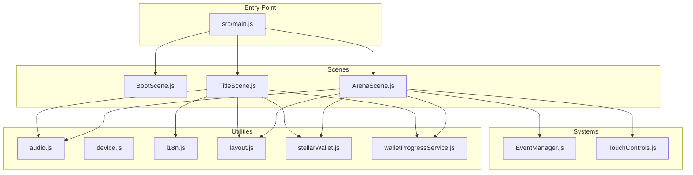
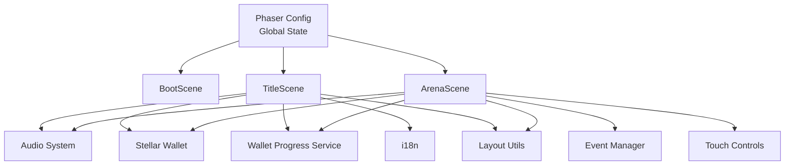
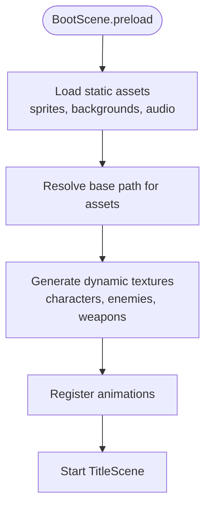
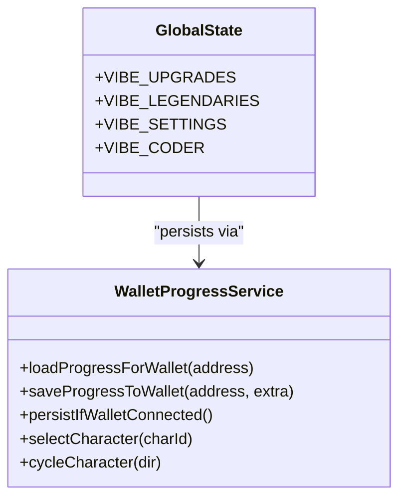
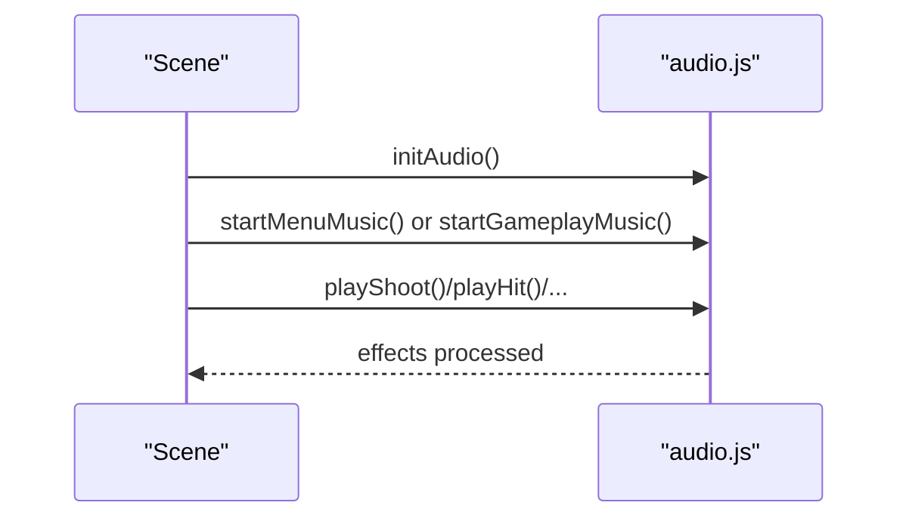
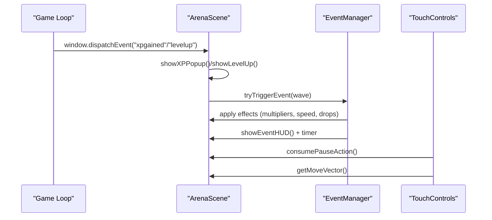
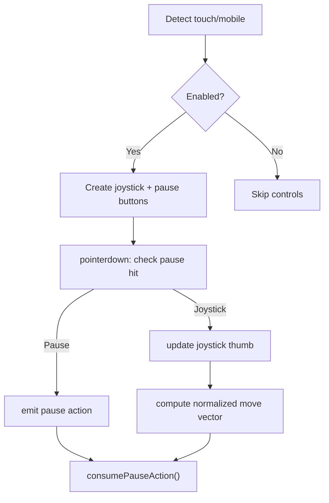
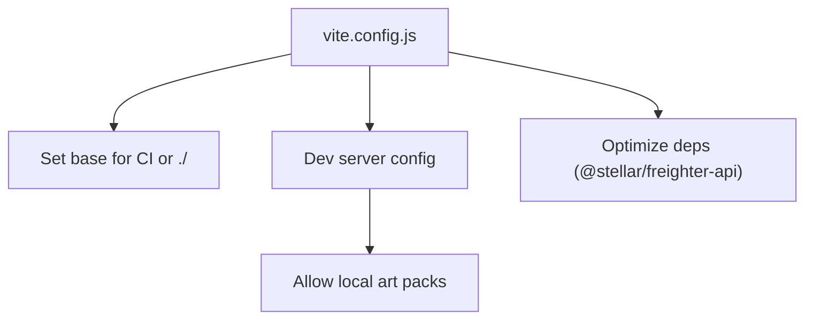
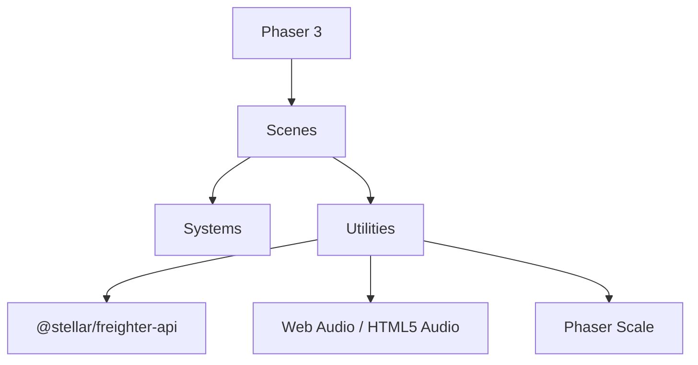

# Frontend Architecture

<cite>
**Referenced Files in This Document**
- [src/main.js](file://src/main.js)
- [src/scenes/BootScene.js](file://src/scenes/BootScene.js)
- [src/scenes/TitleScene.js](file://src/scenes/TitleScene.js)
- [src/scenes/ArenaScene.js](file://src/scenes/ArenaScene.js)
- [src/utils/audio.js](file://src/utils/audio.js)
- [src/utils/device.js](file://src/utils/device.js)
- [src/utils/i18n.js](file://src/utils/i18n.js)
- [src/utils/layout.js](file://src/utils/layout.js)
- [src/systems/EventManager.js](file://src/systems/EventManager.js)
- [src/systems/TouchControls.js](file://src/systems/TouchControls.js)
- [src/utils/stellarWallet.js](file://src/utils/stellarWallet.js)
- [src/utils/walletProgressService.js](file://src/utils/walletProgressService.js)
- [vite.config.js](file://vite.config.js)
- [package.json](file://package.json)
- [README.md](file://README.md)
</cite>

## Table of Contents
1. [Introduction](#introduction)
2. [Project Structure](#project-structure)
3. [Core Components](#core-components)
4. [Architecture Overview](#architecture-overview)
5. [Detailed Component Analysis](#detailed-component-analysis)
6. [Dependency Analysis](#dependency-analysis)
7. [Performance Considerations](#performance-considerations)
8. [Troubleshooting Guide](#troubleshooting-guide)
9. [Conclusion](#conclusion)
10. [Appendices](#appendices)

## Introduction
This document explains the frontend architecture of Vibe-Coder, a Phaser 3-based idle survival game. It covers scene management (Boot, Title, Arena), asset loading and management, game state, utility systems (audio, device detection, i18n, wallet integration), event-driven communication, responsive design and touch controls, and build configuration with Vite. The goal is to help developers understand how the frontend is organized, how systems interact, and how to extend or modify features safely.

## Project Structure
The frontend is organized around a central entry point that configures Phaser, registers scenes, and initializes global game state. Scenes encapsulate UI and gameplay logic. Systems provide reusable game mechanics. Utilities offer cross-cutting concerns like audio, i18n, device detection, and wallet integration. Vite handles development and production builds.



**Diagram sources**
- [src/main.js](file://src/main.js#L1-L464)
- [src/scenes/BootScene.js](file://src/scenes/BootScene.js#L1-L2460)
- [src/scenes/TitleScene.js](file://src/scenes/TitleScene.js#L1-L3526)
- [src/scenes/ArenaScene.js](file://src/scenes/ArenaScene.js#L1-L4970)
- [src/systems/EventManager.js](file://src/systems/EventManager.js#L1-L393)
- [src/systems/TouchControls.js](file://src/systems/TouchControls.js#L1-L157)
- [src/utils/audio.js](file://src/utils/audio.js#L1-L560)
- [src/utils/device.js](file://src/utils/device.js#L1-L25)
- [src/utils/i18n.js](file://src/utils/i18n.js#L1-L45)
- [src/utils/layout.js](file://src/utils/layout.js#L1-L108)
- [src/utils/stellarWallet.js](file://src/utils/stellarWallet.js#L1-L115)
- [src/utils/walletProgressService.js](file://src/utils/walletProgressService.js#L1-L140)

**Section sources**
- [README.md](file://README.md#L115-L135)
- [src/main.js](file://src/main.js#L1-L464)

## Core Components
- Phaser configuration and global state initialization: defines rendering, physics, scene registration, and persistent game state (upgrades, legendaries, settings, coder stats).
- Scene management: BootScene handles asset loading and texture generation; TitleScene manages menus and UI; ArenaScene runs gameplay.
- Utility systems: audio playback, device detection, i18n, layout scaling, wallet integration, and progress persistence.
- Event-driven systems: EventManager orchestrates mid-run events; TouchControls provides mobile input.

**Section sources**
- [src/main.js](file://src/main.js#L15-L464)
- [src/scenes/BootScene.js](file://src/scenes/BootScene.js#L29-L214)
- [src/scenes/TitleScene.js](file://src/scenes/TitleScene.js#L25-L124)
- [src/scenes/ArenaScene.js](file://src/scenes/ArenaScene.js#L21-L273)
- [src/systems/EventManager.js](file://src/systems/EventManager.js#L5-L14)
- [src/systems/TouchControls.js](file://src/systems/TouchControls.js#L9-L19)

## Architecture Overview
The frontend follows a modular, scene-based architecture with clear separation of concerns:
- Entry point configures Phaser and global state.
- Scenes manage UI and gameplay loops.
- Systems encapsulate reusable mechanics.
- Utilities provide platform-agnostic helpers.
- Vite manages build and dev server.



**Diagram sources**
- [src/main.js](file://src/main.js#L15-L37)
- [src/scenes/BootScene.js](file://src/scenes/BootScene.js#L29-L37)
- [src/scenes/TitleScene.js](file://src/scenes/TitleScene.js#L25-L124)
- [src/scenes/ArenaScene.js](file://src/scenes/ArenaScene.js#L21-L273)
- [src/utils/audio.js](file://src/utils/audio.js#L1-L560)
- [src/utils/stellarWallet.js](file://src/utils/stellarWallet.js#L1-L115)
- [src/utils/walletProgressService.js](file://src/utils/walletProgressService.js#L1-L140)
- [src/utils/i18n.js](file://src/utils/i18n.js#L1-L45)
- [src/utils/layout.js](file://src/utils/layout.js#L1-L108)

## Detailed Component Analysis

### Scene Management: Boot, Title, Arena
- BootScene
  - Preloads static assets and generates dynamic textures/animations for characters, enemies, weapons, and backgrounds.
  - Uses runtime base paths to support GitHub Pages and local hosting.
  - Registers animations and fallbacks for robustness.
- TitleScene
  - Creates animated background, menu UI, and interactive elements (wallet connect, language switch, fullscreen).
  - Manages audio initialization on first interaction, integrates with wallet and auth APIs.
  - Handles username modal and responsive layout.
- ArenaScene
  - Runs the core gameplay: player movement, combat, waves, bosses, stages, HUD, and modifiers.
  - Integrates systems like EventManager, TouchControls, MapManager, ShrineManager, and RunModifiers.
  - Implements ZK-ranked submission flow via contracts and proof generation.

```mermaid
sequenceDiagram
participant Boot as "BootScene"
participant Title as "TitleScene"
participant Arena as "ArenaScene"
Boot->>Boot : preload() static assets
Boot->>Boot : generate() dynamic textures
Boot->>Title : scene.start("TitleScene")
Title->>Title : create() background + menu
Title->>Title : connect wallet / i18n / audio
Title->>Arena : scene.start("ArenaScene", { gameMode, continueGame })
Arena->>Arena : create() player + HUD + systems
Arena->>Arena : startWave() + spawn loop
Arena->>Arena : update() + events + controls
```

**Diagram sources**
- [src/scenes/BootScene.js](file://src/scenes/BootScene.js#L39-L112)
- [src/scenes/BootScene.js](file://src/scenes/BootScene.js#L114-L214)
- [src/scenes/TitleScene.js](file://src/scenes/TitleScene.js#L39-L124)
- [src/scenes/ArenaScene.js](file://src/scenes/ArenaScene.js#L281-L469)

**Section sources**
- [src/scenes/BootScene.js](file://src/scenes/BootScene.js#L29-L214)
- [src/scenes/TitleScene.js](file://src/scenes/TitleScene.js#L25-L124)
- [src/scenes/ArenaScene.js](file://src/scenes/ArenaScene.js#L21-L273)

### Asset Loading and Management
- Static assets: sprites, backgrounds, audio MP3s are loaded via Phaser Loader in BootScene preload.
- Dynamic assets: textures and animations are generated procedurally at runtime to support fallbacks and reduce external dependencies.
- Runtime base path resolution: BootScene computes base URLs for assets depending on hosting environment (local vs. GitHub Pages/Vercel).
- Backgrounds: BootScene loads multiple background images; ArenaScene selects stage-specific backgrounds or falls back to procedural generation.



**Diagram sources**
- [src/scenes/BootScene.js](file://src/scenes/BootScene.js#L39-L112)
- [src/scenes/BootScene.js](file://src/scenes/BootScene.js#L114-L214)

**Section sources**
- [src/scenes/BootScene.js](file://src/scenes/BootScene.js#L3-L27)
- [src/scenes/BootScene.js](file://src/scenes/BootScene.js#L81-L107)

### Game State Management
- Global state is initialized in the entry point:
  - Upgrades: persistent meta-progress with levels and currency.
  - Legendaries: permanent weapon unlocks and equipping.
  - Settings: audio toggles, volumes, language, accessibility options.
  - Coder stats: XP, level, streak, kills, last coding time.
- State is mutated by gameplay and events and persisted via wallet-backed service when connected.



**Diagram sources**
- [src/main.js](file://src/main.js#L40-L213)
- [src/utils/walletProgressService.js](file://src/utils/walletProgressService.js#L1-L140)

**Section sources**
- [src/main.js](file://src/main.js#L40-L317)
- [src/utils/walletProgressService.js](file://src/utils/walletProgressService.js#L1-L140)

### Utility Systems

#### Audio Management
- Procedural Web Audio for SFX; HTML5 Audio for menu and gameplay tracks.
- Volume routing through master/music/SFX gains; music mode switching between menu and gameplay.
- Effects include shoot, hit, enemy death, boss death, level up, evolution, XP gain, wave complete, warnings, and special sounds.



**Diagram sources**
- [src/utils/audio.js](file://src/utils/audio.js#L16-L560)

**Section sources**
- [src/utils/audio.js](file://src/utils/audio.js#L1-L560)

#### Device Detection
- Detects touch devices, mobile, and tablets to enable/disable UI and controls accordingly.

**Section sources**
- [src/utils/device.js](file://src/utils/device.js#L1-L25)

#### Internationalization Support
- Simple i18n with English and Spanish locales; key-based lookup with dot notation.
- Language stored in settings and persisted to localStorage.

**Section sources**
- [src/utils/i18n.js](file://src/utils/i18n.js#L1-L45)

#### Layout and Responsive Design
- UI scale and camera zoom adapt to logical and display heights.
- Anchors for fixed-position UI elements; HUD layout computed per viewport.

**Section sources**
- [src/utils/layout.js](file://src/utils/layout.js#L1-L108)

#### Wallet Integration
- Freighter-only wallet integration: connect, sign transactions, short address formatting.
- Wallet progress service loads and saves upgrades, legendaries, scores, and selected character.

```mermaid
sequenceDiagram
participant Title as "TitleScene"
participant Wallet as "stellarWallet.js"
participant WProg as "walletProgressService.js"
participant API as "authApi.js / walletProgressApi.js"
Title->>Wallet : connect()
Wallet-->>Title : address
Title->>API : loginWithSep10(address, signFn)
API-->>Title : token
Title->>WProg : loadProgressForWallet(address)
WProg-->>Title : hydrate upgrades/legendaries/save
Title->>WProg : persistIfWalletConnected()
WProg->>API : saveProgress(...)
```

**Diagram sources**
- [src/scenes/TitleScene.js](file://src/scenes/TitleScene.js#L494-L540)
- [src/utils/stellarWallet.js](file://src/utils/stellarWallet.js#L1-L115)
- [src/utils/walletProgressService.js](file://src/utils/walletProgressService.js#L1-L140)

**Section sources**
- [src/utils/stellarWallet.js](file://src/utils/stellarWallet.js#L1-L115)
- [src/utils/walletProgressService.js](file://src/utils/walletProgressService.js#L1-L140)

### Event-Driven Architecture
- Arena listens to global events for XP gain and level-ups to update HUD and visuals.
- EventManager triggers randomized mid-run events (e.g., boss incoming, double XP, curse, jackpot, swarm) with HUD and timers.
- TouchControls emits pause actions and normalized movement vectors consumed by Arena.



**Diagram sources**
- [src/scenes/ArenaScene.js](file://src/scenes/ArenaScene.js#L400-L405)
- [src/systems/EventManager.js](file://src/systems/EventManager.js#L80-L128)
- [src/systems/TouchControls.js](file://src/systems/TouchControls.js#L146-L154)

**Section sources**
- [src/scenes/ArenaScene.js](file://src/scenes/ArenaScene.js#L400-L405)
- [src/systems/EventManager.js](file://src/systems/EventManager.js#L5-L14)
- [src/systems/TouchControls.js](file://src/systems/TouchControls.js#L9-L19)

### Responsive Design and Touch Controls
- Responsive layout uses logical height scaling and camera zoom to maintain readability and visibility.
- TouchControls provides a virtual joystick and pause button for mobile/touch devices, with hit-testing and normalized movement vectors.



**Diagram sources**
- [src/systems/TouchControls.js](file://src/systems/TouchControls.js#L21-L154)
- [src/utils/layout.js](file://src/utils/layout.js#L10-L38)

**Section sources**
- [src/systems/TouchControls.js](file://src/systems/TouchControls.js#L1-L157)
- [src/utils/layout.js](file://src/utils/layout.js#L1-L108)

### Cross-Platform Compatibility
- Mobile orientation lock and landscape-only flow on portrait devices.
- Runtime base path resolution for assets supports GitHub Pages and Vercel.
- Freighter wallet integration requires desktop browser with extension; mobile UX includes explicit error messaging.

**Section sources**
- [src/main.js](file://src/main.js#L403-L446)
- [src/scenes/TitleScene.js](file://src/scenes/TitleScene.js#L522-L535)

### Build Configuration with Vite
- Automatic base path derivation for GitHub Pages using repository name.
- Dev server allows filesystem access to local art packs for development.
- Optimized dependencies include Freighter API.



**Diagram sources**
- [vite.config.js](file://vite.config.js#L1-L34)

**Section sources**
- [vite.config.js](file://vite.config.js#L1-L34)
- [package.json](file://package.json#L1-L135)

## Dependency Analysis
- Phaser is the core engine; scenes depend on systems and utilities.
- Wallet integration depends on Freighter API; progress service depends on wallet and backend APIs.
- Audio system depends on Web Audio API and HTML5 Audio.
- Layout utilities depend on Phaser scale and display metrics.



**Diagram sources**
- [package.json](file://package.json#L31-L42)
- [src/main.js](file://src/main.js#L1-L10)
- [src/utils/audio.js](file://src/utils/audio.js#L1-L560)
- [src/utils/stellarWallet.js](file://src/utils/stellarWallet.js#L1-L115)

**Section sources**
- [package.json](file://package.json#L31-L42)
- [src/main.js](file://src/main.js#L1-L10)

## Performance Considerations
- Procedural texture generation reduces external asset dependencies but may increase CPU usage on lower-end devices; consider caching generated textures.
- Web Audio effects are short-lived; ensure cleanup of oscillators and buffers to prevent leaks.
- Camera zoom and UI scaling prevent excessive reflows; keep HUD updates minimal.
- Touch controls use hit-testing on circles; ensure pointer events are throttled appropriately.

## Troubleshooting Guide
- Asset loading stuck on LOADING:
  - BootScene logs failed assets; check console for load errors and verify runtime base paths.
- Audio blocked by browser autoplay policies:
  - Initialize audio on first user interaction; resume context after suspend.
- Wallet connection issues:
  - Confirm Freighter availability and extension installation; handle denial gracefully with user feedback.
- Orientation lock on mobile:
  - Ensure landscape orientation is enforced; provide overlay prompting rotation.

**Section sources**
- [src/scenes/BootScene.js](file://src/scenes/BootScene.js#L53-L79)
- [src/utils/audio.js](file://src/utils/audio.js#L16-L43)
- [src/utils/stellarWallet.js](file://src/utils/stellarWallet.js#L26-L53)
- [src/main.js](file://src/main.js#L421-L446)

## Conclusion
Vibe-Coder’s frontend is a well-structured, modular Phaser 3 application. Scenes encapsulate UI and gameplay, systems provide reusable mechanics, and utilities handle cross-cutting concerns. The architecture supports responsive design, mobile touch controls, wallet integration, and a scalable build pipeline with Vite. Extending features should respect the established patterns: keep scenes focused, reuse systems, and integrate via utilities.

## Appendices

### Extension Points and Patterns
- Adding a new scene:
  - Extend Phaser.Scene, register in main config, and manage transitions via scene.start().
- Adding a new weapon:
  - Define weapon type in ArenaScene weaponTypes; add texture generation in BootScene; update HUD and evolution recipes.
- Adding a new enemy:
  - Define enemy type in ArenaScene enemyTypes; add sprite or procedural generation in BootScene; update spawn logic.
- Adding a new modifier:
  - Extend RunModifiers and integrate with SaveManager; update UI and persistence.
- Adding a new event:
  - Define event in EventManager; apply effects to scene state; update HUD and timers.

**Section sources**
- [src/scenes/ArenaScene.js](file://src/scenes/ArenaScene.js#L71-L91)
- [src/scenes/BootScene.js](file://src/scenes/BootScene.js#L621-L765)
- [src/systems/EventManager.js](file://src/systems/EventManager.js#L17-L73)