# Game State Management

<cite>
**Referenced Files in This Document**
- [src/main.js](file://src/main.js)
- [src/systems/SaveManager.js](file://src/systems/SaveManager.js)
- [src/systems/EventManager.js](file://src/systems/EventManager.js)
- [src/systems/RebirthManager.js](file://src/systems/RebirthManager.js)
- [src/systems/RunModifiers.js](file://src/systems/RunModifiers.js)
- [src/systems/LeaderboardManager.js](file://src/systems/LeaderboardManager.js)
- [src/utils/walletProgressService.js](file://src/utils/walletProgressService.js)
- [src/utils/walletProgressApi.js](file://src/utils/walletProgressApi.js)
- [src/scenes/ArenaScene.js](file://src/scenes/ArenaScene.js)
- [src/config/balance.js](file://src/config/balance.js)
</cite>

## Table of Contents
1. [Introduction](#introduction)
2. [Project Structure](#project-structure)
3. [Core Components](#core-components)
4. [Architecture Overview](#architecture-overview)
5. [Detailed Component Analysis](#detailed-component-analysis)
6. [Dependency Analysis](#dependency-analysis)
7. [Performance Considerations](#performance-considerations)
8. [Troubleshooting Guide](#troubleshooting-guide)
9. [Conclusion](#conclusion)

## Introduction
This document explains Vibe-Coder’s game state management system. It covers the global state objects that define player progression, meta-progression, permanent weapons, and user preferences. It also documents persistence mechanisms (localStorage for settings and a blockchain-backed API for progress), XP accumulation with streaks and level progression, the upgrade system with cost scaling and level limits, the legendary weapon system with unlock conditions and equipment mechanics, integration with the rebirth system, and the event system for state change notifications and UI synchronization.

## Project Structure
The state management spans several modules:
- Global state initialization and XP mechanics in the main entry
- Run persistence and continue functionality
- Mid-wave chaos events affecting gameplay
- Permanent progression via rebirth milestones
- Run modifiers affecting wave difficulty and rewards
- Leaderboard submission and persistence
- Wallet-backed progress storage and retrieval
- ArenaScene orchestration of XP, events, and UI updates

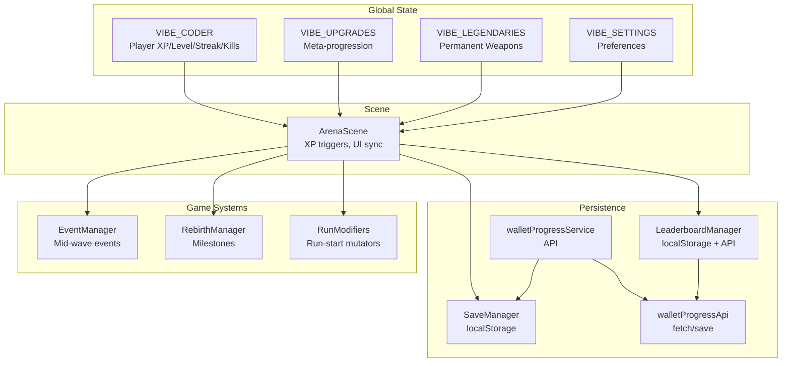

**Diagram sources**
- [src/main.js](file://src/main.js#L39-L379)
- [src/systems/SaveManager.js](file://src/systems/SaveManager.js#L1-L187)
- [src/systems/EventManager.js](file://src/systems/EventManager.js#L1-L393)
- [src/systems/RebirthManager.js](file://src/systems/RebirthManager.js#L1-L173)
- [src/systems/RunModifiers.js](file://src/systems/RunModifiers.js#L1-L185)
- [src/systems/LeaderboardManager.js](file://src/systems/LeaderboardManager.js#L1-L135)
- [src/utils/walletProgressService.js](file://src/utils/walletProgressService.js#L1-L140)
- [src/utils/walletProgressApi.js](file://src/utils/walletProgressApi.js#L1-L46)
- [src/scenes/ArenaScene.js](file://src/scenes/ArenaScene.js#L1-L200)

**Section sources**
- [src/main.js](file://src/main.js#L39-L379)
- [src/systems/SaveManager.js](file://src/systems/SaveManager.js#L1-L187)
- [src/systems/EventManager.js](file://src/systems/EventManager.js#L1-L393)
- [src/systems/RebirthManager.js](file://src/systems/RebirthManager.js#L1-L173)
- [src/systems/RunModifiers.js](file://src/systems/RunModifiers.js#L1-L185)
- [src/systems/LeaderboardManager.js](file://src/systems/LeaderboardManager.js#L1-L135)
- [src/utils/walletProgressService.js](file://src/utils/walletProgressService.js#L1-L140)
- [src/utils/walletProgressApi.js](file://src/utils/walletProgressApi.js#L1-L46)
- [src/scenes/ArenaScene.js](file://src/scenes/ArenaScene.js#L1-L200)

## Core Components
- VIBE_CODER: Tracks XP, level, total XP, streak, kills, and coding activity timestamps. Provides XP calculation with streak, upgrade, and rebirth multipliers and dispatches level-up and XP-gained events.
- VIBE_UPGRADES: Meta-progression upgrades with cost scaling, level caps, and bonus multipliers. Persists via wallet-backed API.
- VIBE_LEGENDARIES: Permanent weapon unlocks and equipment. Persists via wallet-backed API.
- VIBE_SETTINGS: User preferences persisted to localStorage.
- SaveManager: Run persistence for Continue functionality, including auto-save on wave completion and restoration.
- EventManager: Mid-wave chaos events affecting XP multipliers, enemy speed, and drop rates.
- RebirthManager: Milestones granting permanent stat and XP bonuses.
- RunModifiers: Run-start mutators affecting difficulty and rewards.
- LeaderboardManager: Local and on-chain leaderboard submission and retrieval.
- walletProgressService and walletProgressApi: Blockchain-backed persistence for upgrades, legendaries, high scores, and save state.

**Section sources**
- [src/main.js](file://src/main.js#L39-L379)
- [src/systems/SaveManager.js](file://src/systems/SaveManager.js#L1-L187)
- [src/systems/EventManager.js](file://src/systems/EventManager.js#L1-L393)
- [src/systems/RebirthManager.js](file://src/systems/RebirthManager.js#L1-L173)
- [src/systems/RunModifiers.js](file://src/systems/RunModifiers.js#L1-L185)
- [src/systems/LeaderboardManager.js](file://src/systems/LeaderboardManager.js#L1-L135)
- [src/utils/walletProgressService.js](file://src/utils/walletProgressService.js#L1-L140)
- [src/utils/walletProgressApi.js](file://src/utils/walletProgressApi.js#L1-L46)

## Architecture Overview
The state lifecycle integrates XP accumulation, event-driven modifiers, and persistent storage across sessions and devices.

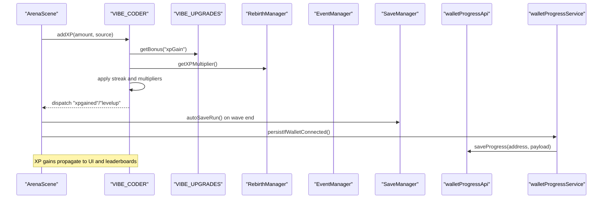

**Diagram sources**
- [src/scenes/ArenaScene.js](file://src/scenes/ArenaScene.js#L1580-L1639)
- [src/main.js](file://src/main.js#L322-L379)
- [src/systems/SaveManager.js](file://src/systems/SaveManager.js#L116-L128)
- [src/utils/walletProgressService.js](file://src/utils/walletProgressService.js#L66-L84)
- [src/utils/walletProgressApi.js](file://src/utils/walletProgressApi.js#L29-L45)

## Detailed Component Analysis

### Global State Objects
- VIBE_CODER: Central XP and level state with streak-based XP multiplier, level progression curve, and event-driven XP bonuses. Emits events for UI synchronization.
- VIBE_UPGRADES: Upgrade definitions with cost scaling and level caps; provides bonus multipliers and wallet-backed persistence.
- VIBE_LEGENDARIES: Legendary weapon definitions, unlock/equip mechanics, and permanent persistence.
- VIBE_SETTINGS: Preferences persisted to localStorage with volume controls and accessibility options.

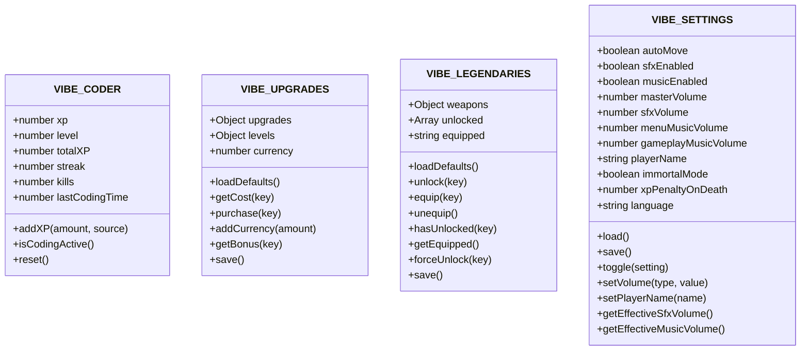

**Diagram sources**
- [src/main.js](file://src/main.js#L39-L379)

**Section sources**
- [src/main.js](file://src/main.js#L39-L379)

### XP Accumulation, Streak Tracking, Level Progression, and Bonus Calculations
- XP is added with optional source metadata to track coding activity and maintain a “last coding time” window for auto-move behavior.
- XP gains are multiplied by:
  - Streak multiplier (bounded)
  - Upgrade XP gain bonus
  - Rebirth XP multiplier
- Level progression uses a super-linear curve: XP for level = floor(100 × level^1.5).
- On wave completion, XP is awarded with event and modifier multipliers applied.

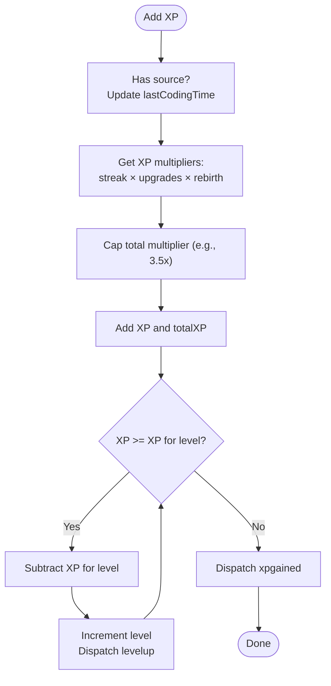

**Diagram sources**
- [src/main.js](file://src/main.js#L336-L364)
- [src/config/balance.js](file://src/config/balance.js#L1-L96)
- [src/scenes/ArenaScene.js](file://src/scenes/ArenaScene.js#L1588-L1590)

**Section sources**
- [src/main.js](file://src/main.js#L336-L364)
- [src/config/balance.js](file://src/config/balance.js#L1-L96)
- [src/scenes/ArenaScene.js](file://src/scenes/ArenaScene.js#L1588-L1590)

### Upgrade System: Cost Scaling, Level Limits, and Effect Calculations
- Cost for next level follows exponential scaling: cost = floor(costBase × (costScale ^ level)).
- Level caps are enforced per upgrade.
- Bonuses are linear: multiplier = 1 + (level × effect).
- Currency is added at run end and spent on purchases.
- Purchases persist via wallet-backed API.

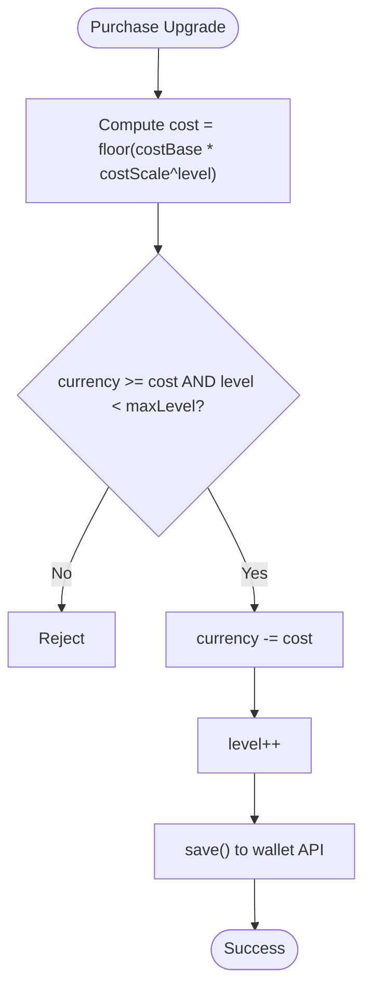

**Diagram sources**
- [src/main.js](file://src/main.js#L74-L92)
- [src/main.js](file://src/main.js#L100-L105)
- [src/main.js](file://src/main.js#L94-L98)

**Section sources**
- [src/main.js](file://src/main.js#L74-L92)
- [src/main.js](file://src/main.js#L100-L105)
- [src/main.js](file://src/main.js#L94-L98)

### Legendary Weapon System: Unlock Conditions, Equipment Mechanics, and Permanent Unlocks
- Legendary weapons are defined with stats and drop rates.
- Unlocks are tracked permanently and persisted via wallet-backed API.
- Equipment sets a weapon as currently active; rendering logic creates orbital sprites scaled by player stats.
- UI displays locked/unlocked states and equip actions.

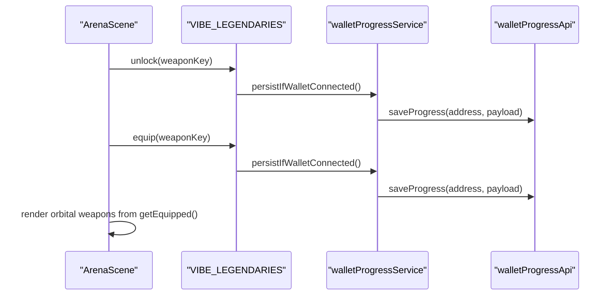

**Diagram sources**
- [src/main.js](file://src/main.js#L111-L210)
- [src/utils/walletProgressService.js](file://src/utils/walletProgressService.js#L66-L84)
- [src/utils/walletProgressApi.js](file://src/utils/walletProgressApi.js#L29-L45)
- [src/scenes/ArenaScene.js](file://src/scenes/ArenaScene.js#L3478-L3626)

**Section sources**
- [src/main.js](file://src/main.js#L111-L210)
- [src/utils/walletProgressService.js](file://src/utils/walletProgressService.js#L66-L84)
- [src/utils/walletProgressApi.js](file://src/utils/walletProgressApi.js#L29-L45)
- [src/scenes/ArenaScene.js](file://src/scenes/ArenaScene.js#L3478-L3626)

### Rebirth System Integration and Persistent Milestones
- Milestones are defined by wave thresholds; performing a rebirth increases permanent bonuses and tracks lifetime stats.
- Bonuses include all-stats and XP gain multipliers and starting weapon additions.
- Rebirth state is persisted to localStorage and influences XP multipliers during gameplay.

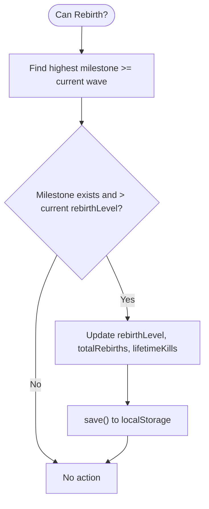

**Diagram sources**
- [src/systems/RebirthManager.js](file://src/systems/RebirthManager.js#L63-L103)
- [src/systems/RebirthManager.js](file://src/systems/RebirthManager.js#L108-L130)

**Section sources**
- [src/systems/RebirthManager.js](file://src/systems/RebirthManager.js#L63-L103)
- [src/systems/RebirthManager.js](file://src/systems/RebirthManager.js#L108-L130)

### Run Modifiers and Event System for State Change Notifications
- RunModifiers selects modifiers at run start and combines their effects; persists selections to localStorage.
- EventManager triggers mid-wave events that modify XP multipliers, enemy speed, and drop rates, and updates HUD timers.
- Both systems influence ArenaScene state and UI via shared properties and event dispatches.

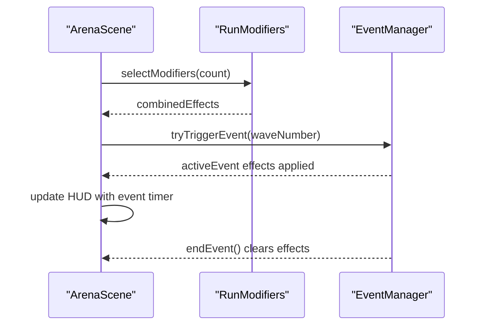

**Diagram sources**
- [src/systems/RunModifiers.js](file://src/systems/RunModifiers.js#L72-L121)
- [src/systems/RunModifiers.js](file://src/systems/RunModifiers.js#L127-L159)
- [src/systems/EventManager.js](file://src/systems/EventManager.js#L80-L128)
- [src/systems/EventManager.js](file://src/systems/EventManager.js#L327-L343)

**Section sources**
- [src/systems/RunModifiers.js](file://src/systems/RunModifiers.js#L72-L121)
- [src/systems/RunModifiers.js](file://src/systems/RunModifiers.js#L127-L159)
- [src/systems/EventManager.js](file://src/systems/EventManager.js#L80-L128)
- [src/systems/EventManager.js](file://src/systems/EventManager.js#L327-L343)

### Persistence Mechanisms: localStorage vs. Blockchain-Backed API
- Settings: persisted to localStorage via VIBE_SETTINGS.
- Run state: auto-saved on wave completion and restored from localStorage; supports clearing and summary display.
- Progress: wallet-backed via walletProgressService and walletProgressApi. Supports loading, saving, resetting on disconnect, and character selection persistence.

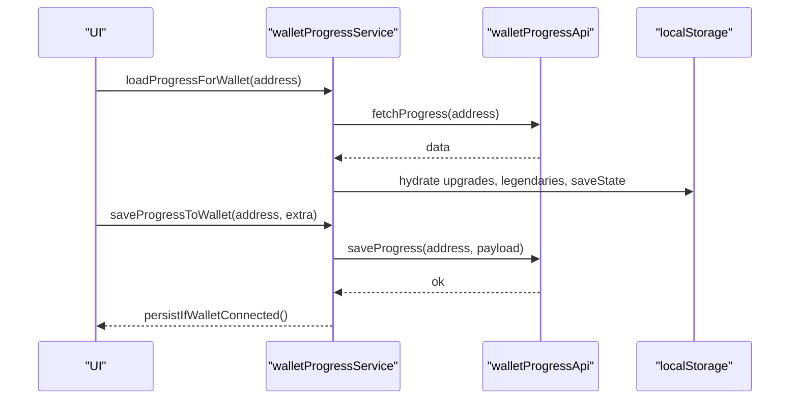

**Diagram sources**
- [src/utils/walletProgressService.js](file://src/utils/walletProgressService.js#L22-L58)
- [src/utils/walletProgressService.js](file://src/utils/walletProgressService.js#L66-L84)
- [src/utils/walletProgressApi.js](file://src/utils/walletProgressApi.js#L15-L27)
- [src/utils/walletProgressApi.js](file://src/utils/walletProgressApi.js#L29-L45)
- [src/systems/SaveManager.js](file://src/systems/SaveManager.js#L107-L128)

**Section sources**
- [src/utils/walletProgressService.js](file://src/utils/walletProgressService.js#L22-L58)
- [src/utils/walletProgressService.js](file://src/utils/walletProgressService.js#L66-L84)
- [src/utils/walletProgressApi.js](file://src/utils/walletProgressApi.js#L15-L27)
- [src/utils/walletProgressApi.js](file://src/utils/walletProgressApi.js#L29-L45)
- [src/systems/SaveManager.js](file://src/systems/SaveManager.js#L107-L128)

### Integration with the ArenaScene: XP Triggers, UI Synchronization, and Leaderboards
- ArenaScene triggers XP on wave completion, applies event/modifier multipliers, auto-saves runs, and submits leaderboard entries.
- UI reacts to level-up and XP-gained events dispatched by VIBE_CODER.
- LeaderboardManager handles local and on-chain submissions.

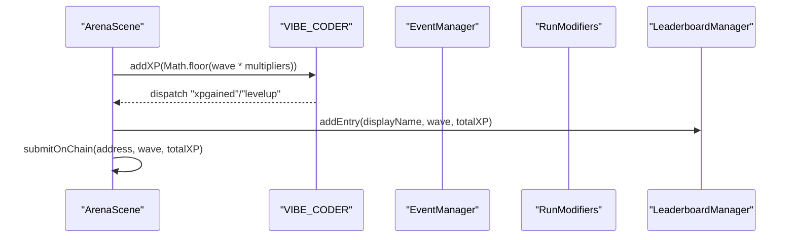

**Diagram sources**
- [src/scenes/ArenaScene.js](file://src/scenes/ArenaScene.js#L1588-L1602)
- [src/main.js](file://src/main.js#L356-L361)
- [src/systems/EventManager.js](file://src/systems/EventManager.js#L134-L153)
- [src/systems/RunModifiers.js](file://src/systems/RunModifiers.js#L91-L121)
- [src/systems/LeaderboardManager.js](file://src/systems/LeaderboardManager.js#L56-L72)

**Section sources**
- [src/scenes/ArenaScene.js](file://src/scenes/ArenaScene.js#L1588-L1602)
- [src/main.js](file://src/main.js#L356-L361)
- [src/systems/EventManager.js](file://src/systems/EventManager.js#L134-L153)
- [src/systems/RunModifiers.js](file://src/systems/RunModifiers.js#L91-L121)
- [src/systems/LeaderboardManager.js](file://src/systems/LeaderboardManager.js#L56-L72)

## Dependency Analysis
- VIBE_CODER depends on VIBE_UPGRADES and RebirthManager for XP multipliers and on ArenaScene for XP triggers.
- ArenaScene orchestrates XP, events, modifiers, and UI updates; persists runs and submits leaderboards.
- walletProgressService coordinates with walletProgressApi and SaveManager for unified persistence.
- RunModifiers and EventManager influence ArenaScene state via shared properties and timers.

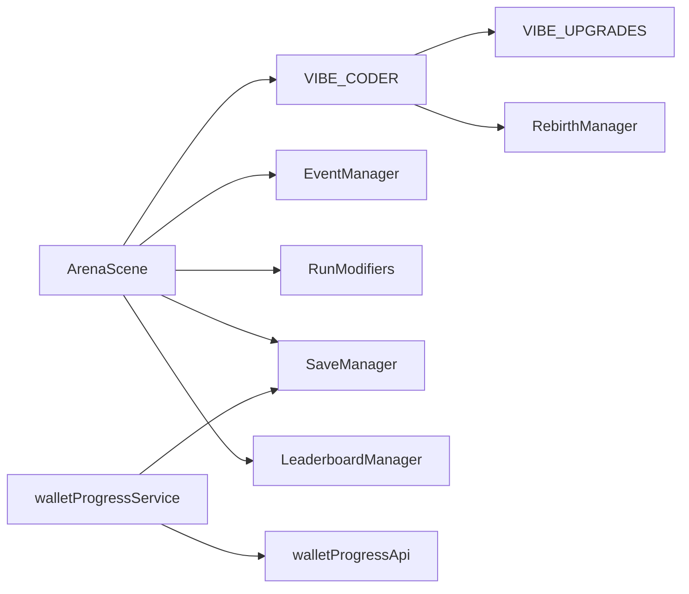

**Diagram sources**
- [src/main.js](file://src/main.js#L322-L379)
- [src/scenes/ArenaScene.js](file://src/scenes/ArenaScene.js#L1-L200)
- [src/systems/EventManager.js](file://src/systems/EventManager.js#L1-L393)
- [src/systems/RunModifiers.js](file://src/systems/RunModifiers.js#L1-L185)
- [src/systems/SaveManager.js](file://src/systems/SaveManager.js#L1-L187)
- [src/systems/LeaderboardManager.js](file://src/systems/LeaderboardManager.js#L1-L135)
- [src/utils/walletProgressService.js](file://src/utils/walletProgressService.js#L1-L140)
- [src/utils/walletProgressApi.js](file://src/utils/walletProgressApi.js#L1-L46)

**Section sources**
- [src/main.js](file://src/main.js#L322-L379)
- [src/scenes/ArenaScene.js](file://src/scenes/ArenaScene.js#L1-L200)
- [src/systems/EventManager.js](file://src/systems/EventManager.js#L1-L393)
- [src/systems/RunModifiers.js](file://src/systems/RunModifiers.js#L1-L185)
- [src/systems/SaveManager.js](file://src/systems/SaveManager.js#L1-L187)
- [src/systems/LeaderboardManager.js](file://src/systems/LeaderboardManager.js#L1-L135)
- [src/utils/walletProgressService.js](file://src/utils/walletProgressService.js#L1-L140)
- [src/utils/walletProgressApi.js](file://src/utils/walletProgressApi.js#L1-L46)

## Performance Considerations
- XP calculations are lightweight and invoked on wave completion and combat events; keep multipliers bounded to avoid excessive computation.
- EventManager timers and delayed calls should be cleaned up on scene shutdown to prevent lingering references.
- RunModifiers combine multipliers efficiently; avoid redundant recomputation by caching combined effects per run.
- SaveManager auto-save occurs on wave completion; consider throttling if performance is impacted on low-end devices.
- Leaderboard submissions are asynchronous; ensure UI remains responsive by deferring non-critical work.

## Troubleshooting Guide
- XP not increasing: verify VIBE_CODER.addXP is called with a valid source and that multipliers are not capped unexpectedly.
- Settings not persisting: confirm VIBE_SETTINGS.save/load paths and localStorage availability.
- Run not loading: check SaveManager.loadRun for timestamp age and clear invalid saves if needed.
- Progress not syncing to wallet: inspect walletProgressService and walletProgressApi for network errors and address validity.
- Events not appearing: ensure EventManager.tryTriggerEvent is called at wave start and that HUD elements are destroyed on end.
- Rebirth not applying: verify RebirthManager.canRebirth and that bonuses are retrieved via getters.

**Section sources**
- [src/main.js](file://src/main.js#L246-L317)
- [src/systems/SaveManager.js](file://src/systems/SaveManager.js#L48-L67)
- [src/systems/EventManager.js](file://src/systems/EventManager.js#L80-L128)
- [src/systems/RebirthManager.js](file://src/systems/RebirthManager.js#L63-L75)
- [src/utils/walletProgressService.js](file://src/utils/walletProgressService.js#L22-L58)
- [src/utils/walletProgressApi.js](file://src/utils/walletProgressApi.js#L15-L27)

## Conclusion
Vibe-Coder’s state management blends deterministic progression (XP, levels, upgrades) with dynamic modifiers (events, run modifiers) and persistent storage (localStorage for settings, wallet-backed API for progress). The system cleanly separates concerns across global state, persistence, and scene orchestration, enabling robust cross-session continuity and engaging emergent gameplay through mid-wave events and run mutators.