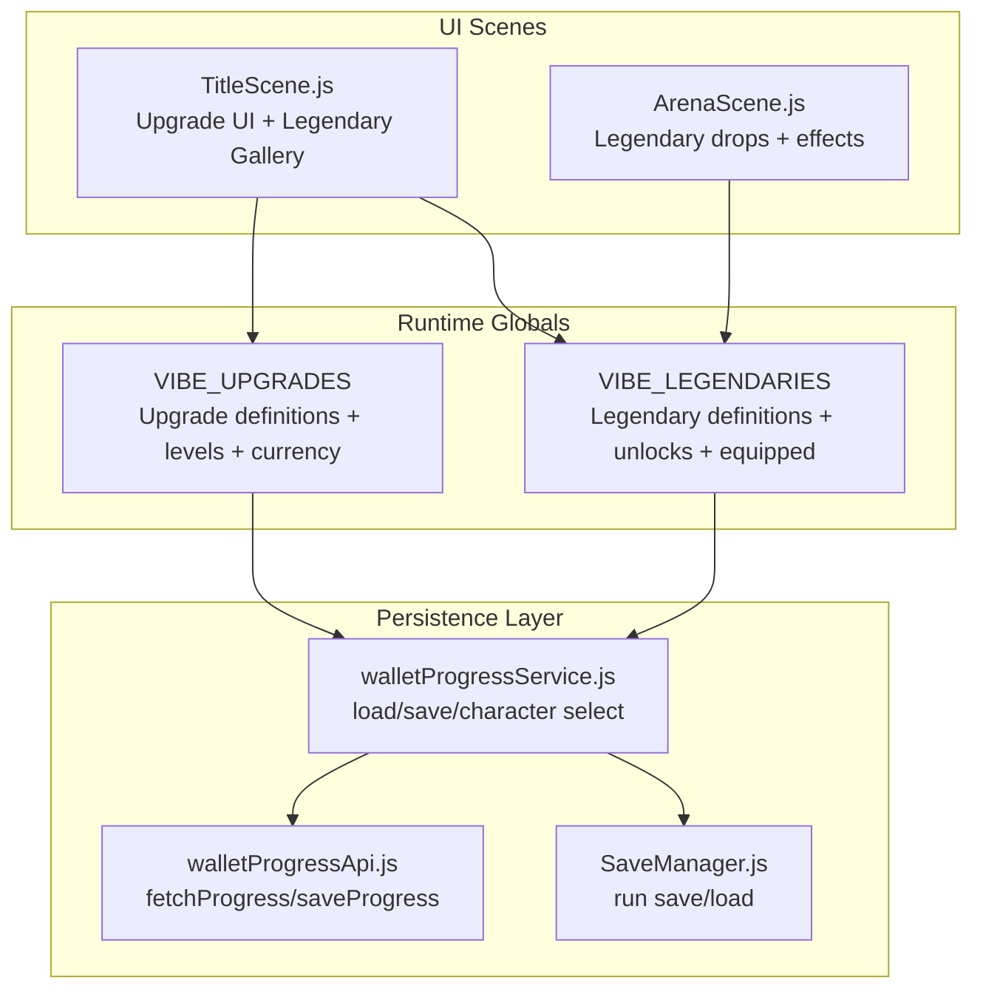
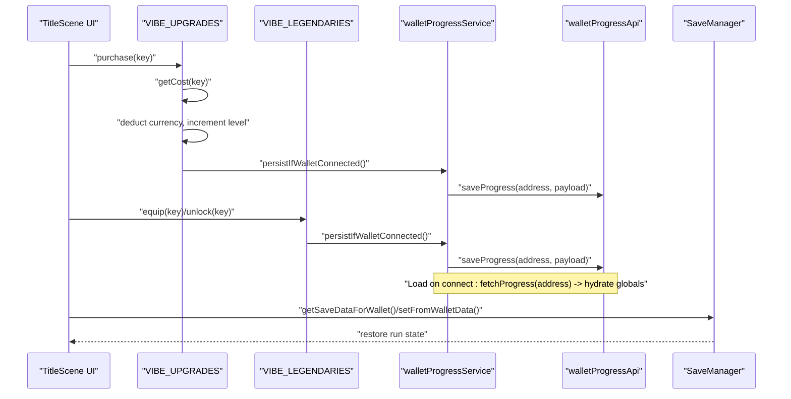
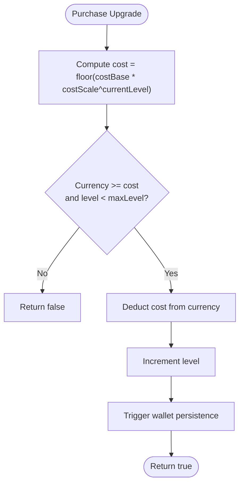
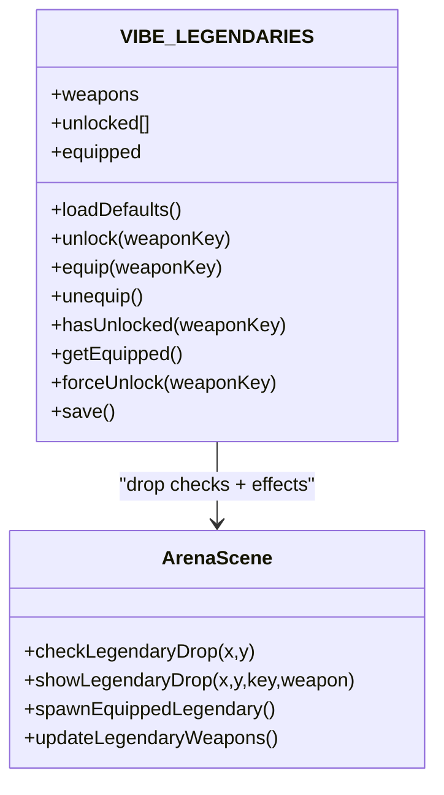
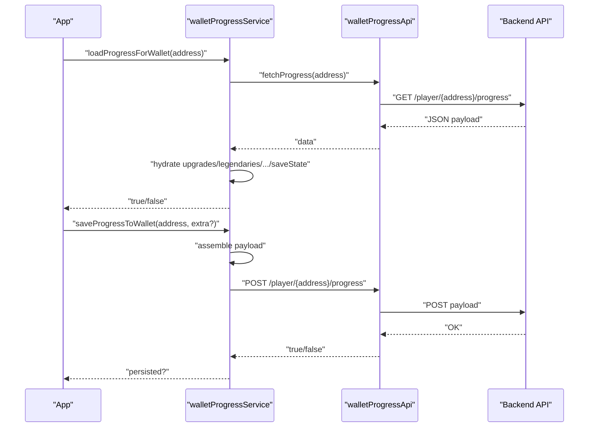
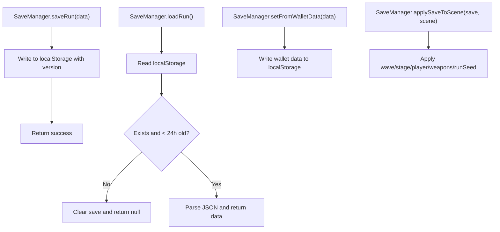
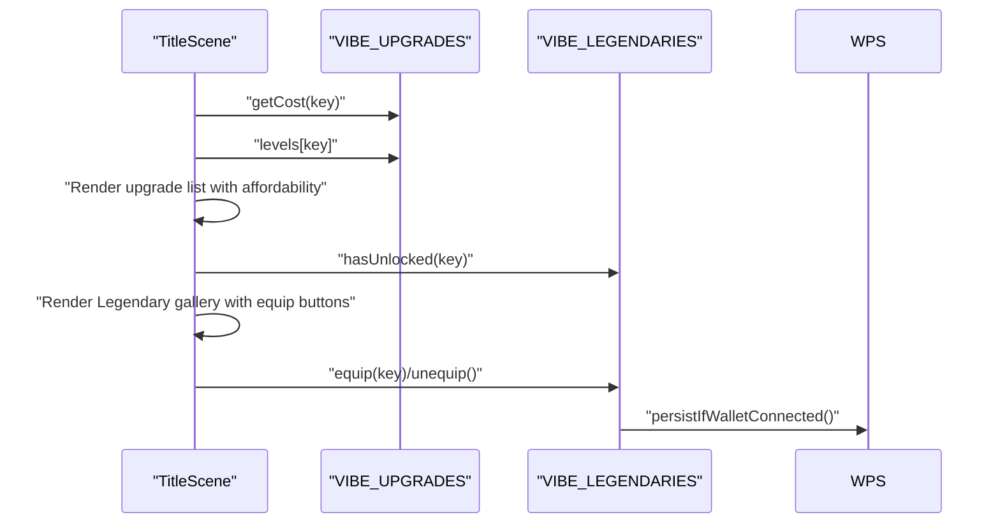
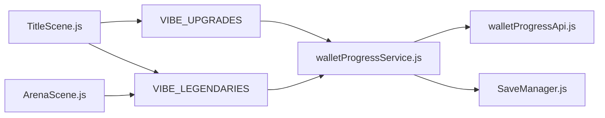

# Meta-Progression System

<cite>
**Referenced Files in This Document**
- [src/main.js](file://src/main.js)
- [src/utils/walletProgressService.js](file://src/utils/walletProgressService.js)
- [src/utils/walletProgressApi.js](file://src/utils/walletProgressApi.js)
- [src/systems/SaveManager.js](file://src/systems/SaveManager.js)
- [src/scenes/TitleScene.js](file://src/scenes/TitleScene.js)
- [src/scenes/ArenaScene.js](file://src/scenes/ArenaScene.js)
</cite>

## Table of Contents
1. [Introduction](#introduction)
2. [Project Structure](#project-structure)
3. [Core Components](#core-components)
4. [Architecture Overview](#architecture-overview)
5. [Detailed Component Analysis](#detailed-component-analysis)
6. [Dependency Analysis](#dependency-analysis)
7. [Performance Considerations](#performance-considerations)
8. [Troubleshooting Guide](#troubleshooting-guide)
9. [Conclusion](#conclusion)
10. [Appendices](#appendices)

## Introduction
This document explains the meta-progression system that persists player progress across runs and integrates with a blockchain-backed wallet progress service. It covers:
- The upgrade system with six categories and a seventh weapon duration category
- Cost scaling algorithm, level limits, and effect calculations
- The legendary weapon system with three unique weapons, drop rates, and equipment management
- Permanent unlocks and cross-run persistence
- Integration with the wallet progress service for blockchain-backed persistence
- Save/load mechanisms and synchronization with the backend API
- Creator/debug modes for testing and development

## Project Structure
The meta-progression system spans several modules:
- Global upgrade definitions and runtime state
- Global legendary weapon definitions and runtime state
- Wallet-backed persistence service and API client
- Run save manager for local run continuation
- UI scenes that render upgrades and legendary galleries

**Diagram sources**
- [src/main.js](file://src/main.js#L40-L106)
- [src/main.js](file://src/main.js#L111-L210)
- [src/utils/walletProgressService.js](file://src/utils/walletProgressService.js#L22-L84)
- [src/utils/walletProgressApi.js](file://src/utils/walletProgressApi.js#L15-L45)
- [src/systems/SaveManager.js](file://src/systems/SaveManager.js#L12-L128)
- [src/scenes/TitleScene.js](file://src/scenes/TitleScene.js#L2865-L2933)
- [src/scenes/TitleScene.js](file://src/scenes/TitleScene.js#L3015-L3163)
- [src/scenes/ArenaScene.js](file://src/scenes/ArenaScene.js#L3471-L3587)

**Section sources**
- [src/main.js](file://src/main.js#L40-L106)
- [src/main.js](file://src/main.js#L111-L210)
- [src/utils/walletProgressService.js](file://src/utils/walletProgressService.js#L22-L84)
- [src/utils/walletProgressApi.js](file://src/utils/walletProgressApi.js#L15-L45)
- [src/systems/SaveManager.js](file://src/systems/SaveManager.js#L12-L128)
- [src/scenes/TitleScene.js](file://src/scenes/TitleScene.js#L2865-L2933)
- [src/scenes/TitleScene.js](file://src/scenes/TitleScene.js#L3015-L3163)
- [src/scenes/ArenaScene.js](file://src/scenes/ArenaScene.js#L3471-L3587)

## Core Components
- VIBE_UPGRADES: Defines six upgrade categories plus weapon duration, with cost scaling and effect calculations. Tracks lifetime currency and current levels.
- VIBE_LEGENDARIES: Defines three unique legendary weapons with drop rates and stats, plus unlock/equip/unequip logic.
- walletProgressService: Loads/saves progress to/from the backend API keyed by wallet address; hydrates upgrades, legendaries, high scores, selected character, and run save state.
- walletProgressApi: Thin wrapper around the backend API for fetching and saving progress.
- SaveManager: Local run save/load for continue functionality; also restores wallet-backed saves.

**Section sources**
- [src/main.js](file://src/main.js#L40-L106)
- [src/main.js](file://src/main.js#L111-L210)
- [src/utils/walletProgressService.js](file://src/utils/walletProgressService.js#L22-L84)
- [src/utils/walletProgressApi.js](file://src/utils/walletProgressApi.js#L15-L45)
- [src/systems/SaveManager.js](file://src/systems/SaveManager.js#L12-L128)

## Architecture Overview
The system separates persistent upgrades and legendaries from transient run state. Upgrades and legendaries are stored on-chain via the wallet progress service; run state is stored locally with optional restoration from wallet-backed saves.

**Diagram sources**
- [src/main.js](file://src/main.js#L74-L106)
- [src/main.js](file://src/main.js#L161-L188)
- [src/utils/walletProgressService.js](file://src/utils/walletProgressService.js#L66-L84)
- [src/utils/walletProgressApi.js](file://src/utils/walletProgressApi.js#L15-L45)
- [src/systems/SaveManager.js](file://src/systems/SaveManager.js#L107-L128)

## Detailed Component Analysis

### Upgrade System (VIBE_UPGRADES)
- Categories: damage, health, speed, attack rate, XP gain, critical chance, weapon duration.
- Level limits: Each category has a maximum level; attempting to purchase beyond the limit costs Infinity.
- Cost scaling: Exponential cost model based on base cost and scale factor per level.
- Effect calculation: Linear additive multiplier per level.
- Currency: Lifetime currency accumulated at the end of runs and spent on upgrades.
- Persistence: Levels and currency are loaded from and saved to the wallet-backed API.

**Diagram sources**
- [src/main.js](file://src/main.js#L74-L106)

**Section sources**
- [src/main.js](file://src/main.js#L40-L106)

### Legendary Weapon System (VIBE_LEGENDARIES)
- Weapons: Three unique legendaries with distinct stats and drop rates.
- Unlocking: Permanent unlocks tracked globally; unlocking triggers persistence.
- Equipment: Only unlocked weapons can be equipped; equipping triggers persistence.
- Drop mechanics: During combat, each eligible legendary has a small chance to drop upon enemy kill; only one legendary can drop per kill.
- Effects: Equipped legendary spawns orbital weapons around the player with damage and spin parameters.

**Diagram sources**
- [src/main.js](file://src/main.js#L111-L210)
- [src/scenes/ArenaScene.js](file://src/scenes/ArenaScene.js#L3471-L3587)

**Section sources**
- [src/main.js](file://src/main.js#L111-L210)
- [src/scenes/ArenaScene.js](file://src/scenes/ArenaScene.js#L3471-L3587)

### Wallet-Backed Persistence (walletProgressService + walletProgressApi)
- Loading: On wallet connect, fetch progress by address and hydrate upgrades, legendaries, high scores, selected character, and run save state.
- Saving: On changes to upgrades, legendaries, high scores, selected character, or run state, persist payload to the backend API.
- Reset: On disconnect, reset upgrades/legendaries/high scores/selected character and clear local run save.
- API URL resolution: Reads environment variables for the backend endpoint.

**Diagram sources**
- [src/utils/walletProgressService.js](file://src/utils/walletProgressService.js#L22-L84)
- [src/utils/walletProgressApi.js](file://src/utils/walletProgressApi.js#L15-L45)

**Section sources**
- [src/utils/walletProgressService.js](file://src/utils/walletProgressService.js#L22-L84)
- [src/utils/walletProgressApi.js](file://src/utils/walletProgressApi.js#L15-L45)

### Save/Load Mechanisms and Run Continuation
- Run saves: Serialized run state (wave, stage, player stats, weapons, modifiers, seed) written to local storage with a version stamp.
- Age check: Saves older than 24 hours are cleared automatically.
- Restore: Wallet-backed saves are restored into local storage; run state is applied to the scene.
- Continue: UI can display a summary of the latest save and allow continuation.

**Diagram sources**
- [src/systems/SaveManager.js](file://src/systems/SaveManager.js#L12-L186)

**Section sources**
- [src/systems/SaveManager.js](file://src/systems/SaveManager.js#L12-L186)

### UI Integration (TitleScene)
- Upgrade list: Displays each upgrade’s name, level bar, description, and cost; highlights affordability and maxed status.
- Legendary gallery: Tabs for Legendary, Melee, and Ranged; shows drop rates for unowned legendaries and equip buttons for owned ones.
- Interaction: Selection and purchase flow for upgrades; equip/unequip for legendaries.

**Diagram sources**
- [src/scenes/TitleScene.js](file://src/scenes/TitleScene.js#L2865-L2933)
- [src/scenes/TitleScene.js](file://src/scenes/TitleScene.js#L3015-L3163)

**Section sources**
- [src/scenes/TitleScene.js](file://src/scenes/TitleScene.js#L2865-L2933)
- [src/scenes/TitleScene.js](file://src/scenes/TitleScene.js#L3015-L3163)

### Creator/Debug Modes
- Force unlock: A helper method to unlock a legendary weapon for testing and development.
- Console logging: Verbose feedback when forcing unlocks.

**Section sources**
- [src/main.js](file://src/main.js#L201-L209)

## Dependency Analysis
- VIBE_UPGRADES and VIBE_LEGENDARIES depend on the wallet progress service for persistence.
- TitleScene renders upgrade and legendary UI and triggers actions.
- ArenaScene handles legendary drops and applies equipped weapon effects.
- SaveManager bridges local run saves and wallet-backed saves.

**Diagram sources**
- [src/scenes/TitleScene.js](file://src/scenes/TitleScene.js#L2865-L2933)
- [src/scenes/ArenaScene.js](file://src/scenes/ArenaScene.js#L3471-L3587)
- [src/main.js](file://src/main.js#L40-L106)
- [src/main.js](file://src/main.js#L111-L210)
- [src/utils/walletProgressService.js](file://src/utils/walletProgressService.js#L22-L84)
- [src/utils/walletProgressApi.js](file://src/utils/walletProgressApi.js#L15-L45)
- [src/systems/SaveManager.js](file://src/systems/SaveManager.js#L12-L128)

**Section sources**
- [src/main.js](file://src/main.js#L40-L106)
- [src/main.js](file://src/main.js#L111-L210)
- [src/utils/walletProgressService.js](file://src/utils/walletProgressService.js#L22-L84)
- [src/utils/walletProgressApi.js](file://src/utils/walletProgressApi.js#L15-L45)
- [src/systems/SaveManager.js](file://src/systems/SaveManager.js#L12-L128)
- [src/scenes/TitleScene.js](file://src/scenes/TitleScene.js#L2865-L2933)
- [src/scenes/ArenaScene.js](file://src/scenes/ArenaScene.js#L3471-L3587)

## Performance Considerations
- Cost computation is O(1) per purchase; negligible overhead.
- Exponential cost scaling ensures balanced progression curves.
- UI updates are minimal and triggered only on selection or purchase.
- Local run saves are lightweight JSON blobs; age checks prevent stale data bloat.

## Troubleshooting Guide
- No data loaded on connect: Verify wallet address and backend endpoint; confirm fetch returns valid JSON.
- Purchases fail silently: Check currency availability and level caps; ensure persistence succeeds.
- Legendaries not appearing: Confirm unlock state and that the drop threshold is met; verify equipped state.
- Run save not restoring: Confirm save exists and is under 24 hours old; ensure wallet-backed restore occurred.

**Section sources**
- [src/utils/walletProgressApi.js](file://src/utils/walletProgressApi.js#L15-L45)
- [src/utils/walletProgressService.js](file://src/utils/walletProgressService.js#L22-L84)
- [src/systems/SaveManager.js](file://src/systems/SaveManager.js#L48-L67)

## Conclusion
The meta-progression system combines exponential upgrade costs, permanent legendary unlocks, and blockchain-backed persistence to deliver a robust, cross-run experience. Upgrades and legendaries persist via a wallet-backed API, while run state is managed locally with optional restoration from wallet-backed saves. The UI integrates seamlessly with these systems, enabling players to manage their progression and equipment across runs.

## Appendices

### Upgrade Definitions and Limits
- Categories: damage, health, speed, attack rate, XP gain, critical chance, weapon duration
- Max levels: 10, 10, 8, 8, 10, 6, 5 respectively
- Cost model: cost = floor(base × scale^level)
- Effects: linear additive multipliers per level

**Section sources**
- [src/main.js](file://src/main.js#L40-L106)

### Legendary Weapons and Drop Rates
- Hunters Warglaive: extremely rare drop rate
- Void Reaper: rare drop rate
- Celestial Blade: rare drop rate

**Section sources**
- [src/main.js](file://src/main.js#L111-L210)

### Backend API Endpoints
- GET /player/{address}/progress
- POST /player/{address}/progress

**Section sources**
- [src/utils/walletProgressApi.js](file://src/utils/walletProgressApi.js#L15-L45)