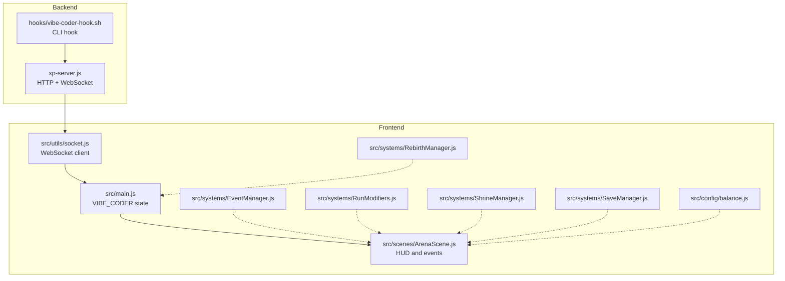
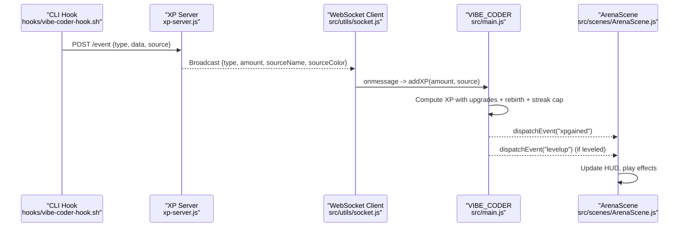
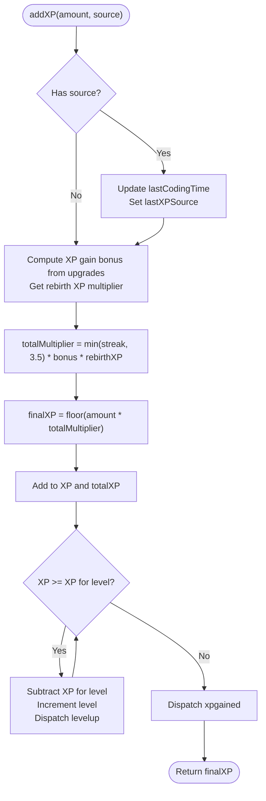
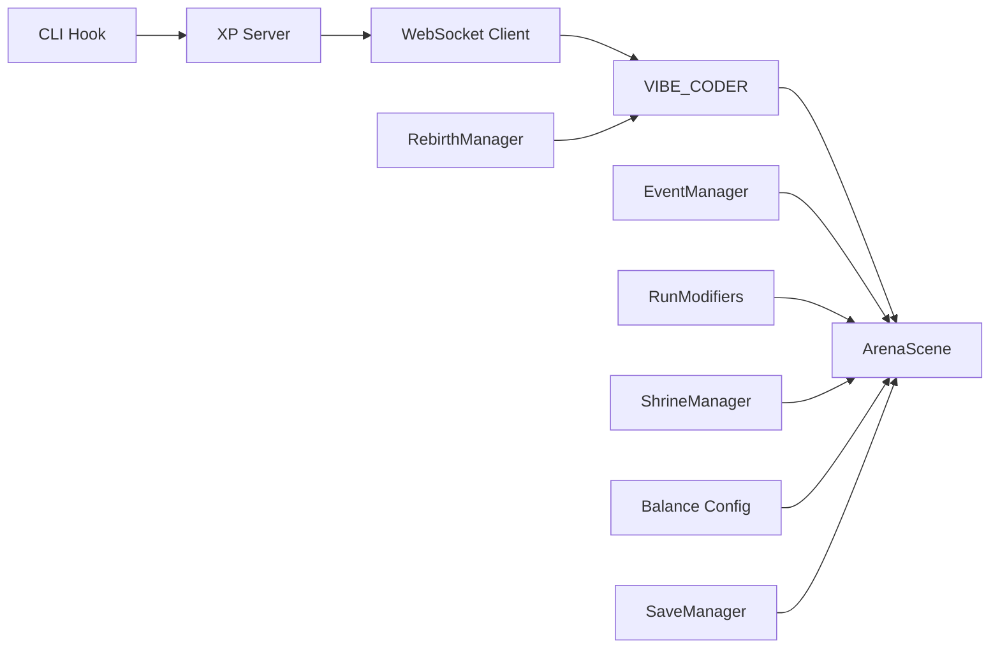

# Player Stats and XP System

<cite>
**Referenced Files in This Document**
- [src/main.js](file://src/main.js)
- [src/utils/socket.js](file://src/utils/socket.js)
- [xp-server.js](file://xp-server.js)
- [hooks/vibe-coder-hook.sh](file://hooks/vibe-coder-hook.sh)
- [src/systems/RebirthManager.js](file://src/systems/RebirthManager.js)
- [src/systems/EventManager.js](file://src/systems/EventManager.js)
- [src/scenes/ArenaScene.js](file://src/scenes/ArenaScene.js)
- [src/systems/RunModifiers.js](file://src/systems/RunModifiers.js)
- [src/systems/ShrineManager.js](file://src/systems/ShrineManager.js)
- [src/config/balance.js](file://src/config/balance.js)
- [src/systems/SaveManager.js](file://src/systems/SaveManager.js)
</cite>

## Table of Contents
1. [Introduction](#introduction)
2. [Project Structure](#project-structure)
3. [Core Components](#core-components)
4. [Architecture Overview](#architecture-overview)
5. [Detailed Component Analysis](#detailed-component-analysis)
6. [Dependency Analysis](#dependency-analysis)
7. [Performance Considerations](#performance-considerations)
8. [Troubleshooting Guide](#troubleshooting-guide)
9. [Conclusion](#conclusion)

## Introduction
This document explains the player statistics and XP accumulation system in Vibe Coder. It covers the VIBE_CODER object that tracks XP, level progression, kills, and streak management; the XP calculation formula including base amounts, bonuses from upgrades and rebirth, and streak multipliers; the exponential level progression system; coding activity tracking with timeouts and source attribution; the WebSocket integration for real-time XP updates; immortal mode mechanics with respawn and XP penalties; and the event dispatching system used for UI updates and state synchronization.

## Project Structure
The XP system spans several frontend and backend components:
- Frontend state and XP logic: VIBE_CODER object in the main game initialization
- WebSocket client for live XP events
- XP server that accepts HTTP events and broadcasts via WebSocket
- CLI hook that posts events to the XP server
- Systems for rebirth, events, run modifiers, shrines, and save/load
- Balance configuration affecting XP scaling and game difficulty

**Diagram sources**
- [src/main.js](file://src/main.js#L323-L379)
- [src/utils/socket.js](file://src/utils/socket.js#L1-L121)
- [xp-server.js](file://xp-server.js#L1-L106)
- [hooks/vibe-coder-hook.sh](file://hooks/vibe-coder-hook.sh#L1-L24)
- [src/systems/RebirthManager.js](file://src/systems/RebirthManager.js#L1-L173)
- [src/systems/EventManager.js](file://src/systems/EventManager.js#L1-L393)
- [src/systems/RunModifiers.js](file://src/systems/RunModifiers.js#L1-L185)
- [src/systems/ShrineManager.js](file://src/systems/ShrineManager.js#L1-L658)
- [src/systems/SaveManager.js](file://src/systems/SaveManager.js#L1-L187)
- [src/config/balance.js](file://src/config/balance.js#L1-L96)

**Section sources**
- [src/main.js](file://src/main.js#L1-L464)
- [src/utils/socket.js](file://src/utils/socket.js#L1-L121)
- [xp-server.js](file://xp-server.js#L1-L106)
- [hooks/vibe-coder-hook.sh](file://hooks/vibe-coder-hook.sh#L1-L24)

## Core Components
- VIBE_CODER: Central player state object managing XP, level, total XP, streak, kills, last coding time, and XP addition logic with bonuses and level-ups.
- WebSocket client: Connects to the XP server, parses incoming events, and calls VIBE_CODER.addXP with source attribution.
- XP server: Accepts HTTP events from CLI hooks and broadcasts them to connected clients via WebSocket.
- RebirthManager: Provides XP gain multipliers and permanent bonuses across runs.
- EventManager: Applies temporary XP multipliers and other effects during mid-wave events.
- RunModifiers: Provides run-wide XP multipliers and other effects.
- ShrineManager: Offers XP-related shrine effects including instant level-ups and XP bonuses.
- SaveManager: Persists run state including XP, level, kills, and streak for continuation.

**Section sources**
- [src/main.js](file://src/main.js#L323-L379)
- [src/utils/socket.js](file://src/utils/socket.js#L18-L104)
- [xp-server.js](file://xp-server.js#L12-L60)
- [src/systems/RebirthManager.js](file://src/systems/RebirthManager.js#L105-L121)
- [src/systems/EventManager.js](file://src/systems/EventManager.js#L134-L153)
- [src/systems/RunModifiers.js](file://src/systems/RunModifiers.js#L91-L121)
- [src/systems/ShrineManager.js](file://src/systems/ShrineManager.js#L394-L493)
- [src/systems/SaveManager.js](file://src/systems/SaveManager.js#L12-L42)

## Architecture Overview
The XP pipeline integrates CLI-driven events with real-time game updates:
- CLI hook posts JSON events to the XP server HTTP endpoint
- XP server parses and broadcasts events to WebSocket clients
- WebSocket client receives messages and invokes VIBE_CODER.addXP with source metadata
- VIBE_CODER computes XP with bonuses, applies streak caps, and triggers level-up events
- ArenaScene listens for level-up and XP-gained events to update HUD and animations

**Diagram sources**
- [hooks/vibe-coder-hook.sh](file://hooks/vibe-coder-hook.sh#L15-L20)
- [xp-server.js](file://xp-server.js#L32-L60)
- [src/utils/socket.js](file://src/utils/socket.js#L54-L68)
- [src/main.js](file://src/main.js#L337-L364)
- [src/scenes/ArenaScene.js](file://src/scenes/ArenaScene.js#L800-L811)

## Detailed Component Analysis

### VIBE_CODER Object and XP Calculation
VIBE_CODER maintains core stats and calculates XP with bonuses:
- Stats: XP, level, total XP, streak, kills, lastCodingTime, lastXPSource, codingTimeout
- XP formula: base XP × (1 + XP gain upgrade bonus) × (rebirth XP multiplier) × min(streak, 3.5)
- Streak cap: totalMultiplier capped at 3.5 to prevent extreme inflation
- Level progression: XP needed for next level computed via exponential scaling
- Level-up handling: subtract spent XP, increment level, dispatch level-up event
- XP-gained event: dispatched after adding XP for HUD updates

**Diagram sources**
- [src/main.js](file://src/main.js#L337-L364)

**Section sources**
- [src/main.js](file://src/main.js#L323-L379)

### Level Progression System
- XP for level N: floor(100 × N^(1.5))
- While loop ensures multiple level-ups if accumulated XP exceeds thresholds
- Level-up event dispatched to trigger UI animations and state updates

**Section sources**
- [src/main.js](file://src/main.js#L334-L358)

### Coding Activity Tracking and Source Attribution
- lastCodingTime updated when XP originates from a source (e.g., CLI events)
- lastXPSource stores { name, color } for display in HUD popups
- isCodingActive checks if recent activity is within codingTimeout
- WebSocket client sets source metadata from hook-provided fields

**Section sources**
- [src/main.js](file://src/main.js#L339-L342)
- [src/main.js](file://src/main.js#L367-L369)
- [src/utils/socket.js](file://src/utils/socket.js#L60-L68)

### WebSocket Integration for Real-Time XP Updates
- Connection guarded to localhost to avoid failures on hosted environments
- On open: dispatches "xpserver-connected"
- On message: parses JSON, constructs source object, calls VIBE_CODER.addXP
- On close: dispatches "xpserver-disconnected" and schedules reconnect
- On error: logs offline once per session to reduce noise

**Section sources**
- [src/utils/socket.js](file://src/utils/socket.js#L18-L104)

### XP Server and CLI Hook
- XP server exposes HTTP POST /event and WebSocket broadcast
- XP values mapped per event type; defaults applied otherwise
- WebSocket clients receive structured messages with source name and color
- CLI hook posts events to server with source identification

**Section sources**
- [xp-server.js](file://xp-server.js#L12-L60)
- [hooks/vibe-coder-hook.sh](file://hooks/vibe-coder-hook.sh#L15-L20)

### Immortal Mode Mechanics and Respawn
- Settings include immortalMode flag and xpPenaltyOnDeath percentage
- When enabled, respawning reduces XP by the configured penalty
- Integration with game over/respawn logic occurs in ArenaScene during player death handling

Note: The immortal mode and respawn mechanics are integrated into the player death and continuation logic in ArenaScene. The relevant settings are defined in VIBE_SETTINGS and influence XP penalties during respawns.

**Section sources**
- [src/main.js](file://src/main.js#L242-L243)
- [src/scenes/ArenaScene.js](file://src/scenes/ArenaScene.js#L1600-L1638)

### Event Dispatching System for UI Updates and State Synchronization
- VIBE_CODER dispatches "levelup" and "xpgained" events
- ArenaScene listens for these events to update HUD, play sounds/animations, and refresh displays
- WebSocket client also dispatches "xpserver-connected"/"xpserver-disconnected" for UI feedback

**Section sources**
- [src/main.js](file://src/main.js#L357-L361)
- [src/scenes/ArenaScene.js](file://src/scenes/ArenaScene.js#L402-L405)
- [src/utils/socket.js](file://src/utils/socket.js#L44-L45)
- [src/utils/socket.js](file://src/utils/socket.js#L77-L78)

### XP Multipliers and Bonuses
- Upgrades: VIBE_UPGRADES provides getBonus('xpGain') for XP gain multipliers
- Rebirth: RebirthManager.getXPMultiplier() scales XP gains permanently
- Events: EventManager applies temporary XP multipliers during events
- Run modifiers: RunModifiers combine multipliers for run-wide XP boosts
- Shrine effects: Some shrines provide XP bonuses or instant level-ups

**Section sources**
- [src/main.js](file://src/main.js#L345-L347)
- [src/systems/RebirthManager.js](file://src/systems/RebirthManager.js#L118-L121)
- [src/systems/EventManager.js](file://src/systems/EventManager.js#L139-L142)
- [src/systems/RunModifiers.js](file://src/systems/RunModifiers.js#L91-L121)
- [src/systems/ShrineManager.js](file://src/systems/ShrineManager.js#L457-L458)

### Save and Load Persistence
- SaveManager persists player XP, level, kills, streak, and weapon state
- Applied on run completion and when loading saves
- Supports both local and wallet-backed persistence

**Section sources**
- [src/systems/SaveManager.js](file://src/systems/SaveManager.js#L12-L42)
- [src/systems/SaveManager.js](file://src/systems/SaveManager.js#L149-L185)

## Dependency Analysis
The XP system exhibits clear separation of concerns:
- Frontend depends on WebSocket client for live updates
- WebSocket client depends on VIBE_CODER for XP application
- XP server depends on CLI hook for input events
- ArenaScene depends on VIBE_CODER events for UI synchronization
- RebirthManager, EventManager, RunModifiers, and ShrineManager provide external multipliers and effects

**Diagram sources**
- [hooks/vibe-coder-hook.sh](file://hooks/vibe-coder-hook.sh#L15-L20)
- [xp-server.js](file://xp-server.js#L32-L60)
- [src/utils/socket.js](file://src/utils/socket.js#L54-L68)
- [src/main.js](file://src/main.js#L337-L364)
- [src/scenes/ArenaScene.js](file://src/scenes/ArenaScene.js#L402-L405)
- [src/systems/RebirthManager.js](file://src/systems/RebirthManager.js#L105-L121)
- [src/systems/EventManager.js](file://src/systems/EventManager.js#L134-L153)
- [src/systems/RunModifiers.js](file://src/systems/RunModifiers.js#L91-L121)
- [src/systems/ShrineManager.js](file://src/systems/ShrineManager.js#L394-L493)
- [src/systems/SaveManager.js](file://src/systems/SaveManager.js#L12-L42)
- [src/config/balance.js](file://src/config/balance.js#L1-L96)

**Section sources**
- [src/main.js](file://src/main.js#L323-L379)
- [src/utils/socket.js](file://src/utils/socket.js#L18-L104)
- [xp-server.js](file://xp-server.js#L12-L60)
- [src/systems/RebirthManager.js](file://src/systems/RebirthManager.js#L105-L121)
- [src/systems/EventManager.js](file://src/systems/EventManager.js#L134-L153)
- [src/systems/RunModifiers.js](file://src/systems/RunModifiers.js#L91-L121)
- [src/systems/ShrineManager.js](file://src/systems/ShrineManager.js#L394-L493)
- [src/systems/SaveManager.js](file://src/systems/SaveManager.js#L12-L42)
- [src/config/balance.js](file://src/config/balance.js#L1-L96)

## Performance Considerations
- WebSocket reconnection is throttled with a fixed interval to avoid excessive retries
- XP calculations use integer arithmetic and bounded multipliers to prevent overflow
- HUD updates are batched through event listeners to minimize redundant redraws
- Event timers and delayed calls are cleaned up on scene shutdown to prevent leaks

## Troubleshooting Guide
- XP server offline: WebSocket client logs once per session and reconnects automatically
- Live XP disabled on hosted environments: Connection is only attempted on localhost
- XP source attribution: Ensure CLI hook sends sourceName and sourceColor; otherwise defaults are used
- Level-up not triggering: Verify XP thresholds and that addXP is invoked with a positive amount
- Streak cap exceeded: The total multiplier is capped at 3.5 regardless of streak length

**Section sources**
- [src/utils/socket.js](file://src/utils/socket.js#L89-L103)
- [src/utils/socket.js](file://src/utils/socket.js#L106-L120)
- [src/main.js](file://src/main.js#L347-L348)
- [src/main.js](file://src/main.js#L353-L358)

## Conclusion
The Vibe Coder XP system combines deterministic and real-time mechanisms to reward sustained coding activity. VIBE_CODER centralizes XP accounting with robust bonus stacking from upgrades, rebirth, events, and run modifiers. The WebSocket pipeline enables live XP updates from CLI hooks, while ArenaScene synchronizes UI and gameplay feedback through event dispatching. Immortal mode and XP penalties during respawns provide accessibility and challenge balance, and SaveManager preserves progress across sessions.