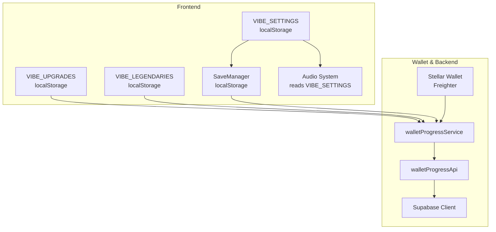
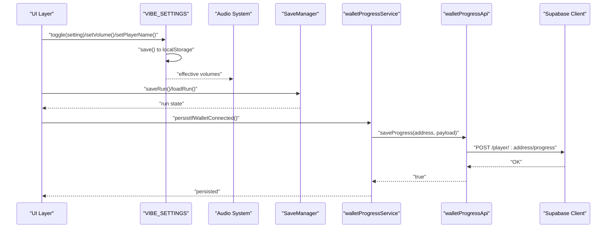
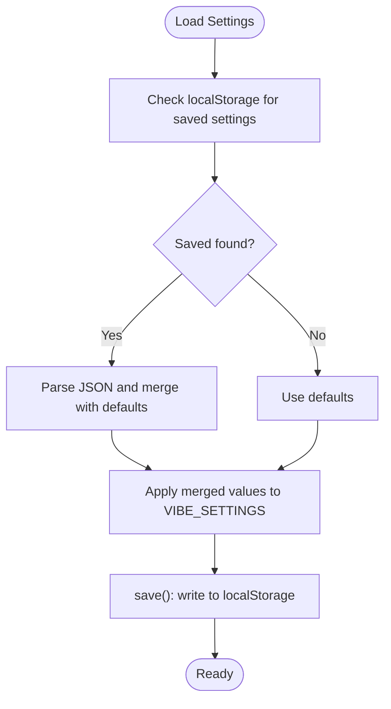
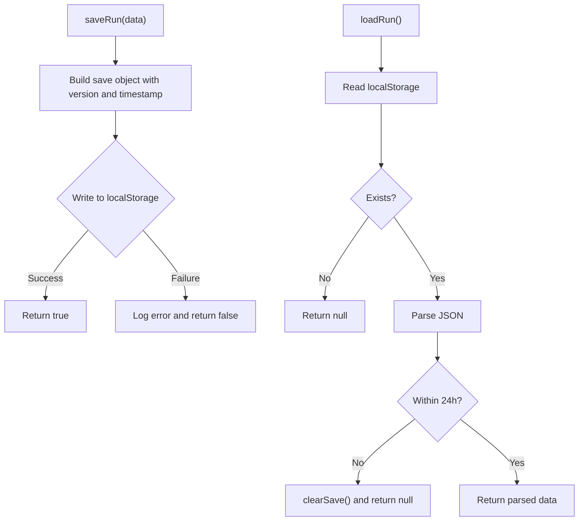
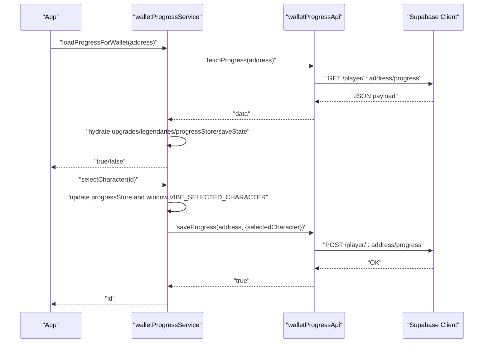
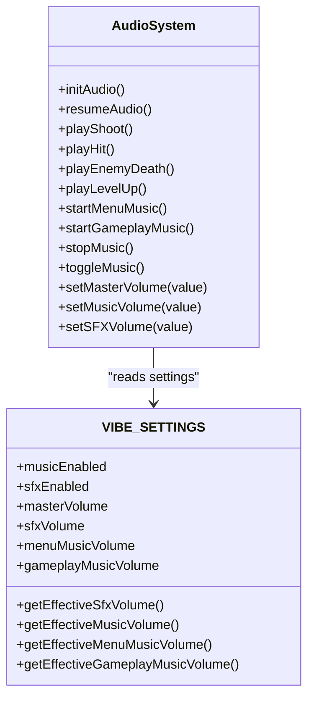
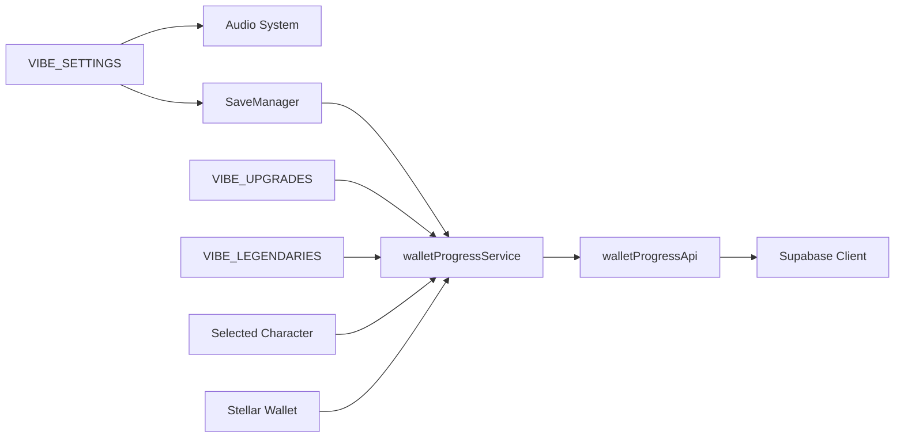

# Settings and Persistence

<cite>
**Referenced Files in This Document**
- [src/main.js](file://src/main.js)
- [src/systems/SaveManager.js](file://src/systems/SaveManager.js)
- [src/utils/walletProgressService.js](file://src/utils/walletProgressService.js)
- [src/utils/walletProgressApi.js](file://src/utils/walletProgressApi.js)
- [src/utils/stellarWallet.js](file://src/utils/stellarWallet.js)
- [src/utils/audio.js](file://src/utils/audio.js)
- [electron/settings.js](file://electron/settings.js)
- [server/db/supabase.js](file://server/db/supabase.js)
</cite>

## Table of Contents
1. [Introduction](#introduction)
2. [Project Structure](#project-structure)
3. [Core Components](#core-components)
4. [Architecture Overview](#architecture-overview)
5. [Detailed Component Analysis](#detailed-component-analysis)
6. [Dependency Analysis](#dependency-analysis)
7. [Performance Considerations](#performance-considerations)
8. [Troubleshooting Guide](#troubleshooting-guide)
9. [Security Considerations](#security-considerations)
10. [Conclusion](#conclusion)

## Introduction
This document explains the settings management and data persistence system in Vibe Coder. It covers:
- The VIBE_SETTINGS object for user preferences (audio, gameplay, personalization)
- Local storage integration for settings persistence
- Migration and compatibility handling for settings
- Wallet-backed progress service for blockchain-backed save games
- Sync mechanisms and conflict resolution strategies
- Character selection integration with wallet progress
- Supabase backend integration for user data
- Error handling and recovery for persistence failures
- Security considerations for sensitive user data and progress synchronization

## Project Structure
The settings and persistence system spans several modules:
- Frontend initialization and settings: VIBE_SETTINGS, VIBE_UPGRADES, VIBE_LEGENDARIES, and runtime configuration loading
- Save manager for local run persistence
- Wallet progress service and API for blockchain-backed persistence
- Stellar wallet integration for identity and signing
- Audio subsystem that respects VIBE_SETTINGS
- Electron settings store for desktop app configuration
- Supabase client for backend user data

**Diagram sources**
- [src/main.js](file://src/main.js#L233-L317)
- [src/systems/SaveManager.js](file://src/systems/SaveManager.js#L1-L187)
- [src/utils/walletProgressService.js](file://src/utils/walletProgressService.js#L1-L140)
- [src/utils/walletProgressApi.js](file://src/utils/walletProgressApi.js#L1-L46)
- [src/utils/stellarWallet.js](file://src/utils/stellarWallet.js#L1-L115)
- [src/utils/audio.js](file://src/utils/audio.js#L1-L560)
- [server/db/supabase.js](file://server/db/supabase.js#L1-L23)

**Section sources**
- [src/main.js](file://src/main.js#L233-L317)
- [src/systems/SaveManager.js](file://src/systems/SaveManager.js#L1-L187)
- [src/utils/walletProgressService.js](file://src/utils/walletProgressService.js#L1-L140)
- [src/utils/walletProgressApi.js](file://src/utils/walletProgressApi.js#L1-L46)
- [src/utils/stellarWallet.js](file://src/utils/stellarWallet.js#L1-L115)
- [src/utils/audio.js](file://src/utils/audio.js#L1-L560)
- [electron/settings.js](file://electron/settings.js#L1-L51)
- [server/db/supabase.js](file://server/db/supabase.js#L1-L23)

## Core Components
- VIBE_SETTINGS: Centralized user preferences persisted to localStorage, including audio toggles and volumes, gameplay options, and personalization fields. It exposes load/save/toggle/setVolume/setPlayerName helpers and computes effective volumes for music/SFX.
- SaveManager: Manages run-state persistence for Continue functionality using localStorage with automatic cleanup for stale saves and conversion to wallet-backed format.
- Wallet Progress Service: Orchestrates loading and saving of upgrades, legendaries, high scores, selected character, and save state against a backend API keyed by wallet address. Provides character selection and cycling.
- Wallet Progress API: Fetches and posts progress to the configured backend endpoint, with environment-aware URL resolution.
- Stellar Wallet: Freighter-based wallet integration for connecting, caching, and signing transactions.
- Audio System: Reads VIBE_SETTINGS to control music/SFX playback and volumes.
- Electron Settings Store: Provides desktop-specific settings defaults and persistence for window behavior, tray mode, hotkeys, and server configuration.

**Section sources**
- [src/main.js](file://src/main.js#L233-L317)
- [src/systems/SaveManager.js](file://src/systems/SaveManager.js#L1-L187)
- [src/utils/walletProgressService.js](file://src/utils/walletProgressService.js#L1-L140)
- [src/utils/walletProgressApi.js](file://src/utils/walletProgressApi.js#L1-L46)
- [src/utils/stellarWallet.js](file://src/utils/stellarWallet.js#L1-L115)
- [src/utils/audio.js](file://src/utils/audio.js#L1-L560)
- [electron/settings.js](file://electron/settings.js#L1-L51)

## Architecture Overview
The system separates concerns between local-first settings and run-state, and wallet-backed global progress. Audio and gameplay options are applied immediately from VIBE_SETTINGS. Wallet-backed progress is loaded when a user connects their wallet and saved automatically when changes occur.

**Diagram sources**
- [src/main.js](file://src/main.js#L233-L317)
- [src/utils/audio.js](file://src/utils/audio.js#L404-L560)
- [src/systems/SaveManager.js](file://src/systems/SaveManager.js#L12-L128)
- [src/utils/walletProgressService.js](file://src/utils/walletProgressService.js#L66-L84)
- [src/utils/walletProgressApi.js](file://src/utils/walletProgressApi.js#L29-L45)
- [server/db/supabase.js](file://server/db/supabase.js#L14-L20)

## Detailed Component Analysis

### VIBE_SETTINGS: User Preferences and Audio Controls
- Purpose: Encapsulates user preferences and applies them across the game (audio, gameplay, personalization).
- Persistence: Uses localStorage with a dedicated key for settings. On load, merges saved values with defaults, enabling backward-compatible migrations.
- Audio integration: Provides effective volume getters that combine master volume with per-category volumes, and exposes setters for volumes and toggles.
- Personalization: Stores player name, language, immortal mode, XP penalty, and auto-move behavior.

**Diagram sources**
- [src/main.js](file://src/main.js#L246-L280)

**Section sources**
- [src/main.js](file://src/main.js#L233-L317)

### SaveManager: Run Persistence and Migration
- Purpose: Persist and restore run state for Continue functionality.
- Storage: Uses localStorage with a single key and includes a version field for future migrations.
- Lifecycle:
  - saveRun: Serializes current run state (wave, stage, player stats, weapons, modifiers, seed, timestamp, version).
  - loadRun: Parses saved data, validates freshness (clears old saves), and returns current state.
  - hasSave/getSaveSummary/clearSave: Convenience queries and cleanup.
  - setFromWalletData/getSaveDataForWallet: Bridges wallet-backed saves to localStorage.
  - applySaveToScene: Restores state into the active scene and game state.

**Diagram sources**
- [src/systems/SaveManager.js](file://src/systems/SaveManager.js#L12-L67)

**Section sources**
- [src/systems/SaveManager.js](file://src/systems/SaveManager.js#L1-L187)

### Wallet Progress Service and API
- Purpose: Centralizes blockchain-backed persistence keyed by wallet address. Persists upgrades, legendaries, high scores, selected character, and save state.
- Loading: Hydrates VIBE_UPGRADES, VIBE_LEGENDARIES, progressStore, and optionally restores SaveManager data from wallet payload.
- Saving: Builds payload from current in-memory state and sends to backend; updates progressStore on success.
- Character selection: Maintains a fixed order and supports cycling and explicit selection, persisting changes when a wallet is connected.
- API: Fetches and posts progress to a configurable endpoint resolved from runtime config or environment variables.

**Diagram sources**
- [src/utils/walletProgressService.js](file://src/utils/walletProgressService.js#L22-L58)
- [src/utils/walletProgressService.js](file://src/utils/walletProgressService.js#L122-L139)
- [src/utils/walletProgressApi.js](file://src/utils/walletProgressApi.js#L15-L27)
- [src/utils/walletProgressApi.js](file://src/utils/walletProgressApi.js#L29-L45)
- [server/db/supabase.js](file://server/db/supabase.js#L14-L20)

**Section sources**
- [src/utils/walletProgressService.js](file://src/utils/walletProgressService.js#L1-L140)
- [src/utils/walletProgressApi.js](file://src/utils/walletProgressApi.js#L1-L46)

### Audio System Integration with VIBE_SETTINGS
- Initializes Web Audio API nodes for master, music, and SFX gains.
- Respects VIBE_SETTINGS for enabling/disabling music/SFX and computing effective volumes.
- Starts/stops menu/gameplay tracks and updates volumes dynamically.

**Diagram sources**
- [src/utils/audio.js](file://src/utils/audio.js#L16-L560)
- [src/main.js](file://src/main.js#L233-L317)

**Section sources**
- [src/utils/audio.js](file://src/utils/audio.js#L1-L560)
- [src/main.js](file://src/main.js#L233-L317)

### Electron Settings Store
- Provides desktop-specific defaults for launch, tray, window behavior, audio, notifications, server mode, and hotkeys.
- Exposes creation and retrieval of the settings store using electron-store.

**Section sources**
- [electron/settings.js](file://electron/settings.js#L1-L51)

### Supabase Backend Integration
- Supplies a shared Supabase client configured from environment variables.
- Used by the wallet progress API to persist and retrieve user progress.

**Section sources**
- [server/db/supabase.js](file://server/db/supabase.js#L1-L23)
- [src/utils/walletProgressApi.js](file://src/utils/walletProgressApi.js#L1-L46)

## Dependency Analysis
- VIBE_SETTINGS depends on localStorage and is consumed by the audio system and UI.
- SaveManager depends on localStorage and interacts with wallet progress for restoring and exporting save data.
- Wallet progress service depends on:
  - VIBE_UPGRADES and VIBE_LEGENDARIES for payload composition
  - progressStore for high scores and selected character
  - walletProgressApi for network operations
  - Supabase client for backend persistence
- Stellar wallet integration provides address caching and signing capabilities used by the progress service.

**Diagram sources**
- [src/main.js](file://src/main.js#L233-L317)
- [src/systems/SaveManager.js](file://src/systems/SaveManager.js#L1-L187)
- [src/utils/walletProgressService.js](file://src/utils/walletProgressService.js#L1-L140)
- [src/utils/walletProgressApi.js](file://src/utils/walletProgressApi.js#L1-L46)
- [src/utils/stellarWallet.js](file://src/utils/stellarWallet.js#L1-L115)
- [server/db/supabase.js](file://server/db/supabase.js#L1-L23)

**Section sources**
- [src/main.js](file://src/main.js#L233-L317)
- [src/systems/SaveManager.js](file://src/systems/SaveManager.js#L1-L187)
- [src/utils/walletProgressService.js](file://src/utils/walletProgressService.js#L1-L140)
- [src/utils/walletProgressApi.js](file://src/utils/walletProgressApi.js#L1-L46)
- [src/utils/stellarWallet.js](file://src/utils/stellarWallet.js#L1-L115)
- [server/db/supabase.js](file://server/db/supabase.js#L1-L23)

## Performance Considerations
- Settings and audio volume computations are lightweight and invoked on demand; avoid excessive re-renders by batching UI updates.
- SaveManager writes are synchronous to localStorage; consider debouncing frequent saves to reduce I/O overhead.
- Wallet progress saves are asynchronous; batch changes (e.g., after multiple upgrades) to minimize network requests.
- Audio generation uses Web Audio API oscillators and noise buffers; keep sound effects short-lived to reduce CPU usage.

[No sources needed since this section provides general guidance]

## Troubleshooting Guide
Common issues and recovery mechanisms:
- Settings load fails silently:
  - Verify localStorage availability and quota limits.
  - Confirm settings key exists and is valid JSON; otherwise, defaults are used.
- SaveManager save/load errors:
  - Catch and log exceptions; ensure localStorage is accessible and not corrupted.
  - Stale saves older than 24 hours are cleared automatically.
- Wallet progress fetch/save failures:
  - Check backend URL resolution and network connectivity.
  - Validate address presence and Freighter availability.
  - On failure, continue with local state and retry later.
- Audio does not play:
  - Resume audio context after user interaction.
  - Ensure music/SFX toggles are enabled and effective volumes are non-zero.
- Electron settings not applying:
  - Confirm store creation and defaults initialization.
  - Verify settings keys match expected schema.

**Section sources**
- [src/systems/SaveManager.js](file://src/systems/SaveManager.js#L35-L41)
- [src/systems/SaveManager.js](file://src/systems/SaveManager.js#L63-L66)
- [src/utils/walletProgressApi.js](file://src/utils/walletProgressApi.js#L18-L26)
- [src/utils/walletProgressApi.js](file://src/utils/walletProgressApi.js#L32-L44)
- [src/utils/audio.js](file://src/utils/audio.js#L39-L43)
- [electron/settings.js](file://electron/settings.js#L39-L50)

## Security Considerations
- Wallet identity and signing:
  - Freighter is used exclusively for connection and signing; never expose private keys.
  - Cache addresses only in memory and localStorage; clear on disconnect.
- Sensitive data handling:
  - Avoid storing sensitive information in localStorage beyond cached addresses.
  - Prefer server-side validation and authorization for progress mutations.
- Progress integrity:
  - Treat wallet-backed progress as authoritative; resolve conflicts by accepting latest server state on load.
  - Validate payload shapes and sanitize inputs before saving.
- Environment configuration:
  - Resolve backend URLs from runtime config or environment variables; avoid hardcoding secrets.
- Cross-site scripting and injection:
  - Sanitize user inputs (e.g., player name) and enforce length limits.
  - Use HTTPS endpoints and secure cookies/session storage where applicable.

**Section sources**
- [src/utils/stellarWallet.js](file://src/utils/stellarWallet.js#L1-L115)
- [src/utils/walletProgressApi.js](file://src/utils/walletProgressApi.js#L7-L13)
- [src/main.js](file://src/main.js#L299-L302)

## Conclusion
The settings and persistence system combines local-first convenience with blockchain-backed continuity. VIBE_SETTINGS centralizes user preferences and integrates with audio and gameplay. SaveManager ensures run-state persistence with safety checks. Wallet progress service and API provide a robust, conflict-aware mechanism for global progress synchronization, while Supabase underpins user data management. Security best practices protect user identity and sensitive data, and error handling ensures graceful degradation and recovery.