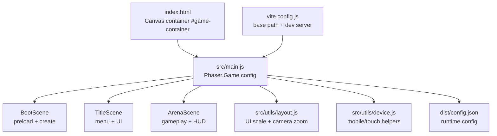
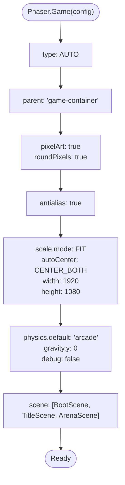
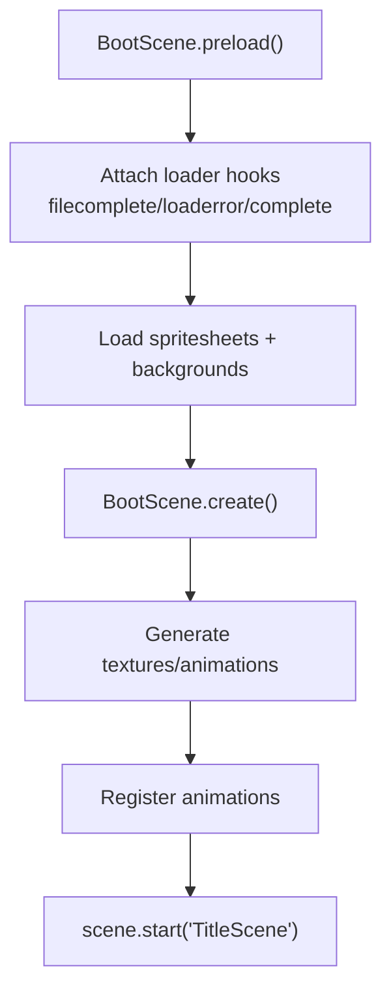
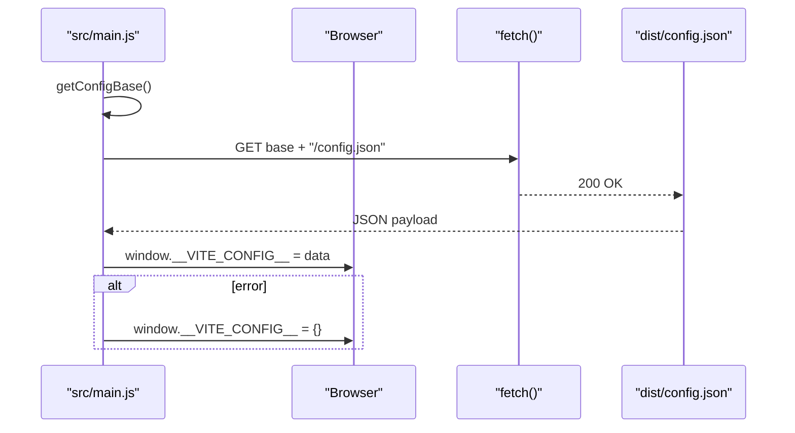
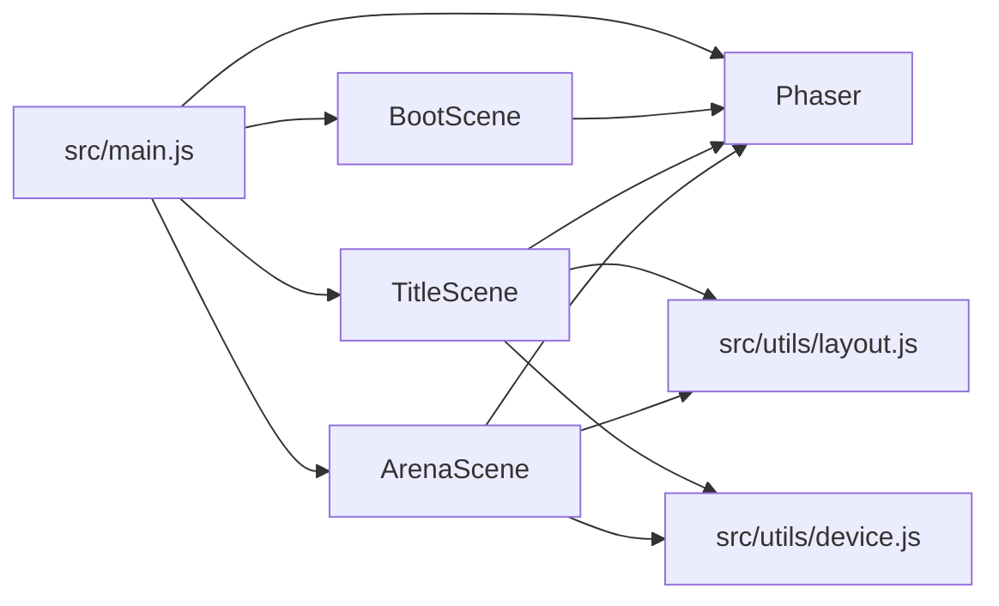

# Phaser Engine Setup

<cite>
**Referenced Files in This Document**
- [src/main.js](file://src/main.js)
- [src/scenes/BootScene.js](file://src/scenes/BootScene.js)
- [src/scenes/TitleScene.js](file://src/scenes/TitleScene.js)
- [src/scenes/ArenaScene.js](file://src/scenes/ArenaScene.js)
- [src/utils/layout.js](file://src/utils/layout.js)
- [src/utils/device.js](file://src/utils/device.js)
- [dist/config.json](file://dist/config.json)
- [vite.config.js](file://vite.config.js)
- [index.html](file://index.html)
- [package.json](file://package.json)
</cite>

## Table of Contents
1. [Introduction](#introduction)
2. [Project Structure](#project-structure)
3. [Core Components](#core-components)
4. [Architecture Overview](#architecture-overview)
5. [Detailed Component Analysis](#detailed-component-analysis)
6. [Dependency Analysis](#dependency-analysis)
7. [Performance Considerations](#performance-considerations)
8. [Troubleshooting Guide](#troubleshooting-guide)
9. [Conclusion](#conclusion)

## Introduction
This document explains how Vibe-Coder sets up and configures the Phaser 3 engine for optimal cross-platform performance. It covers canvas rendering with AUTO mode, pixel art and antialiasing settings, Arcade Physics defaults, the scaling system using FIT mode with a 1920x1080 logical resolution, scene registration, runtime configuration loading, and responsive design helpers for mobile devices. It also documents the Vite build configuration, automatic base path detection, and environment variable handling.

## Project Structure
The game initializes Phaser in the main entry point and registers three scenes: BootScene, TitleScene, and ArenaScene. The HTML page provides a fixed-size container for the Phaser canvas and includes a rotation overlay for mobile orientation.



**Diagram sources**
- [index.html](file://index.html#L46-L54)
- [src/main.js](file://src/main.js#L15-L37)
- [src/scenes/BootScene.js](file://src/scenes/BootScene.js#L29-L37)
- [src/scenes/TitleScene.js](file://src/scenes/TitleScene.js#L25-L37)
- [src/scenes/ArenaScene.js](file://src/scenes/ArenaScene.js#L21-L27)
- [src/utils/layout.js](file://src/utils/layout.js#L10-L38)
- [src/utils/device.js](file://src/utils/device.js#L5-L23)
- [dist/config.json](file://dist/config.json#L1-L7)
- [vite.config.js](file://vite.config.js#L11-L12)

**Section sources**
- [index.html](file://index.html#L46-L54)
- [src/main.js](file://src/main.js#L15-L37)
- [vite.config.js](file://vite.config.js#L11-L12)

## Core Components
- Phaser Game configuration with AUTO rendering, pixel art, antialiasing, roundPixels, FIT scaling, and Arcade Physics defaults.
- Scene registration for BootScene, TitleScene, and ArenaScene.
- Runtime configuration loading from config.json with automatic base path detection.
- Responsive helpers for UI scaling and camera zoom.
- Mobile device detection and orientation handling.

**Section sources**
- [src/main.js](file://src/main.js#L15-L37)
- [src/main.js](file://src/main.js#L381-L401)
- [src/main.js](file://src/main.js#L403-L414)
- [src/main.js](file://src/main.js#L421-L429)
- [src/utils/layout.js](file://src/utils/layout.js#L10-L38)
- [src/utils/device.js](file://src/utils/device.js#L5-L23)

## Architecture Overview
The initialization flow begins in the HTML page with a fixed container. The main script creates a Phaser.Game with a configuration object that defines rendering, scaling, physics, and scene registration. The BootScene handles asset loading and texture generation, transitioning to TitleScene. ArenaScene manages gameplay, HUD, and systems.

```mermaid
sequenceDiagram
participant HTML as "index.html"
participant Main as "src/main.js"
participant Boot as "BootScene"
participant Title as "TitleScene"
participant Arena as "ArenaScene"
participant Config as "dist/config.json"
participant Vite as "vite.config.js"
HTML->>Main : Load module
Main->>Config : loadRuntimeConfig()
Config-->>Main : __VITE_CONFIG__
Main->>Main : isMobileDevice() + isPortrait()
alt portrait on mobile
Main->>HTML : showRotateOverlay()
HTML-->>Main : orientationchange/resize
end
Main->>Main : startGame()
Main->>Boot : new Phaser.Game(config)
Boot->>Boot : preload() + create()
Boot->>Title : scene.start("TitleScene")
Title->>Arena : scene.start("ArenaScene") (on action)
```

**Diagram sources**
- [index.html](file://index.html#L96-L105)
- [src/main.js](file://src/main.js#L381-L446)
- [src/scenes/BootScene.js](file://src/scenes/BootScene.js#L39-L214)
- [src/scenes/TitleScene.js](file://src/scenes/TitleScene.js#L25-L37)
- [src/scenes/ArenaScene.js](file://src/scenes/ArenaScene.js#L281-L285)
- [dist/config.json](file://dist/config.json#L1-L7)
- [vite.config.js](file://vite.config.js#L11-L12)

## Detailed Component Analysis

### Phaser Game Configuration
- Rendering: AUTO selects WebGL or Canvas depending on environment.
- Container: parent references the #game-container element in index.html.
- Pixel art: pixelArt and roundPixels ensure crisp 16-bit aesthetic.
- Antialiasing: antialias improves edges on scaled canvases.
- Scaling: FIT mode with 1920x1080 logical resolution and CENTER_BOTH auto-centering.
- Physics: Arcade Physics with gravity disabled for top-down movement and debug toggled off.
- Scenes: registered BootScene, TitleScene, ArenaScene.



**Diagram sources**
- [src/main.js](file://src/main.js#L15-L37)

**Section sources**
- [src/main.js](file://src/main.js#L15-L37)

### BootScene: Asset Loading and Texture Generation
BootScene performs robust asset loading with debug hooks and generates textures procedurally when external assets are missing. It resolves background base paths dynamically for GitHub Pages and local environments, then transitions to TitleScene.



**Diagram sources**
- [src/scenes/BootScene.js](file://src/scenes/BootScene.js#L39-L80)
- [src/scenes/BootScene.js](file://src/scenes/BootScene.js#L114-L214)

**Section sources**
- [src/scenes/BootScene.js](file://src/scenes/BootScene.js#L39-L80)
- [src/scenes/BootScene.js](file://src/scenes/BootScene.js#L114-L214)

### TitleScene: Menu UI and Responsive Layout
TitleScene initializes audio, builds animated backgrounds, applies camera zoom via layout helpers, and creates a responsive UI layout. It integrates wallet connectivity, language switching, and fullscreen controls.

**Section sources**
- [src/scenes/TitleScene.js](file://src/scenes/TitleScene.js#L39-L124)
- [src/scenes/TitleScene.js](file://src/scenes/TitleScene.js#L83-L260)
- [src/utils/layout.js](file://src/utils/layout.js#L26-L38)

### ArenaScene: Gameplay and Systems
ArenaScene sets world bounds, camera follow, input handling, HUD, spatial hashing, map generation, and touch controls. It manages weapon systems, modifiers, shrines, and event-driven gameplay mechanics.

**Section sources**
- [src/scenes/ArenaScene.js](file://src/scenes/ArenaScene.js#L287-L469)
- [src/scenes/ArenaScene.js](file://src/scenes/ArenaScene.js#L484-L578)

### Scaling System: FIT with 1920x1080 Logical Resolution
The scaling system uses Phaser.Scale.FIT with a 1920x1080 logical resolution and CENTER_BOTH auto-centering. This ensures consistent visual fidelity across different screen sizes and aspect ratios.

**Section sources**
- [src/main.js](file://src/main.js#L22-L28)

### Physics Configuration: Arcade Physics Defaults
Arcade Physics is configured as the default with gravity disabled (top-down movement) and debug turned off. This simplifies collision detection and movement for the game’s style.

**Section sources**
- [src/main.js](file://src/main.js#L29-L35)

### Scene Registration System
The scene registration lists BootScene, TitleScene, and ArenaScene. BootScene acts as the loader and initializer; TitleScene provides the main menu; ArenaScene hosts the gameplay.

**Section sources**
- [src/main.js](file://src/main.js#L36-L36)
- [src/scenes/BootScene.js](file://src/scenes/BootScene.js#L29-L37)
- [src/scenes/TitleScene.js](file://src/scenes/TitleScene.js#L25-L37)
- [src/scenes/ArenaScene.js](file://src/scenes/ArenaScene.js#L21-L27)

### Runtime Configuration Loading from config.json
The main script loads runtime configuration from config.json at the same origin. It derives the base path from the current location and handles errors gracefully by setting an empty configuration object.



**Diagram sources**
- [src/main.js](file://src/main.js#L381-L401)
- [dist/config.json](file://dist/config.json#L1-L7)

**Section sources**
- [src/main.js](file://src/main.js#L381-L401)
- [dist/config.json](file://dist/config.json#L1-L7)

### Mobile Device Detection and Orientation Handling
The main script detects mobile devices and portrait orientation, showing a rotation overlay and waiting for orientationchange or resize events before starting the game. It attempts to lock orientation to landscape on supported devices.

**Section sources**
- [src/main.js](file://src/main.js#L403-L414)
- [src/main.js](file://src/main.js#L421-L429)

### Responsive Design Helpers
Two layout helpers provide responsive scaling:
- getUIScale: scales UI proportionally to the logical height (target ~720px).
- getCameraZoom: adjusts camera zoom based on rendered height to prevent tiny visuals on low-height windows.

**Section sources**
- [src/utils/layout.js](file://src/utils/layout.js#L10-L13)
- [src/utils/layout.js](file://src/utils/layout.js#L26-L38)

### Build Configuration with Vite and Automatic Base Path
Vite determines the base path automatically for GitHub Pages using the repository name from environment variables. In CI, the base becomes "/<repo-name>/"; otherwise "./". The dev server serves assets and allows filesystem access for local art packs.

**Section sources**
- [vite.config.js](file://vite.config.js#L3-L9)
- [vite.config.js](file://vite.config.js#L11-L12)
- [vite.config.js](file://vite.config.js#L13-L25)
- [vite.config.js](file://vite.config.js#L26-L29)
- [vite.config.js](file://vite.config.js#L30-L33)

### Environment Variable Handling
Environment variables are consumed by Vite to set the base path for static hosting. The runtime configuration is loaded from config.json at the same origin, enabling dynamic backend URLs without hardcoding.

**Section sources**
- [vite.config.js](file://vite.config.js#L5-L8)
- [src/main.js](file://src/main.js#L381-L401)
- [dist/config.json](file://dist/config.json#L1-L7)

## Dependency Analysis
The main entry depends on Phaser, scene modules, socket utilities, and system managers. BootScene depends on Phaser and asset generation utilities. TitleScene and ArenaScene depend on audio, layout, systems, and wallet utilities.



**Diagram sources**
- [src/main.js](file://src/main.js#L1-L8)
- [src/scenes/BootScene.js](file://src/scenes/BootScene.js#L1-L1)
- [src/scenes/TitleScene.js](file://src/scenes/TitleScene.js#L1-L12)
- [src/scenes/ArenaScene.js](file://src/scenes/ArenaScene.js#L1-L20)
- [src/utils/layout.js](file://src/utils/layout.js#L1-L1)
- [src/utils/device.js](file://src/utils/device.js#L1-L1)

**Section sources**
- [src/main.js](file://src/main.js#L1-L8)
- [src/scenes/BootScene.js](file://src/scenes/BootScene.js#L1-L1)
- [src/scenes/TitleScene.js](file://src/scenes/TitleScene.js#L1-L12)
- [src/scenes/ArenaScene.js](file://src/scenes/ArenaScene.js#L1-L20)
- [src/utils/layout.js](file://src/utils/layout.js#L1-L1)
- [src/utils/device.js](file://src/utils/device.js#L1-L1)

## Performance Considerations
- Pixel art and roundPixels preserve crisp visuals at various scales.
- Antialiasing improves edge quality on scaled canvases.
- FIT scaling with a fixed logical resolution ensures consistent layout across devices.
- Camera zoom and UI scale adapt to smaller viewports to avoid tiny UI.
- Procedural texture generation reduces external asset dependencies and improves reliability.

[No sources needed since this section provides general guidance]

## Troubleshooting Guide
- If the game gets stuck on a loading screen, BootScene logs failed assets and loader completion statistics. Review the console for load errors and missing keys.
- If textures are missing, BootScene falls back to procedural generation; verify that external assets are served correctly.
- On mobile, ensure the device is rotated to landscape; the overlay prompts users to rotate.
- If runtime configuration is missing, the app defaults to an empty configuration object; verify config.json availability at the expected path.

**Section sources**
- [src/scenes/BootScene.js](file://src/scenes/BootScene.js#L54-L79)
- [src/main.js](file://src/main.js#L431-L446)

## Conclusion
Vibe-Coder’s Phaser 3 setup emphasizes pixel-perfect visuals, consistent scaling across resolutions, and robust asset loading. The BootScene ensures reliable initialization, while TitleScene and ArenaScene provide polished UI and gameplay experiences. Vite’s automatic base path detection and runtime configuration loading enable flexible deployments, and responsive helpers maintain usability on diverse devices.