# Arena Scene

<cite>
**Referenced Files in This Document**
- [ArenaScene.js](file://src/scenes/ArenaScene.js)
- [EventManager.js](file://src/systems/EventManager.js)
- [MapManager.js](file://src/systems/MapManager.js)
- [SpatialHash.js](file://src/utils/SpatialHash.js)
- [SaveManager.js](file://src/systems/SaveManager.js)
- [RunModifiers.js](file://src/systems/RunModifiers.js)
- [ShrineManager.js](file://src/systems/ShrineManager.js)
- [TouchControls.js](file://src/systems/TouchControls.js)
- [balance.js](file://src/config/balance.js)
- [xp-server.js](file://xp-server.js)
- [socket.js](file://src/utils/socket.js)
- [audio.js](file://src/utils/audio.js)
- [walletProgressService.js](file://src/utils/walletProgressService.js)
- [main.js](file://src/main.js)
</cite>

## Table of Contents
1. [Introduction](#introduction)
2. [Project Structure](#project-structure)
3. [Core Components](#core-components)
4. [Architecture Overview](#architecture-overview)
5. [Detailed Component Analysis](#detailed-component-analysis)
6. [Dependency Analysis](#dependency-analysis)
7. [Performance Considerations](#performance-considerations)
8. [Troubleshooting Guide](#troubleshooting-guide)
9. [Conclusion](#conclusion)
10. [Appendices](#appendices)

## Introduction
This document explains the ArenaScene, the core gameplay scene in Vibe-Coder. It covers the game world, enemy spawning, collision detection, player movement and combat, wave progression and boss encounters, dynamic events, particle effects and visual feedback, camera and viewport management, integration with the XP server for real-time coding activity tracking, and performance optimization techniques for managing large numbers of game objects.

## Project Structure
The ArenaScene orchestrates gameplay systems and manages the game world, camera, HUD, and runtime state. Supporting systems include event management, map generation, spatial hashing for collision optimization, save/load persistence, modifiers, shrines, touch controls, audio, and XP server integration.

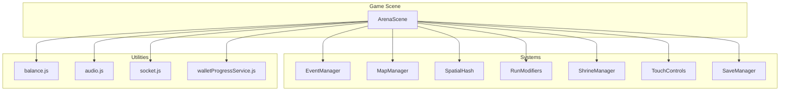

**Diagram sources**
- [ArenaScene.js](file://src/scenes/ArenaScene.js#L21-L273)
- [EventManager.js](file://src/systems/EventManager.js#L5-L14)
- [MapManager.js](file://src/systems/MapManager.js#L5-L81)
- [SpatialHash.js](file://src/utils/SpatialHash.js#L5-L9)
- [RunModifiers.js](file://src/systems/RunModifiers.js#L5-L65)
- [ShrineManager.js](file://src/systems/ShrineManager.js#L5-L15)
- [TouchControls.js](file://src/systems/TouchControls.js#L9-L19)
- [SaveManager.js](file://src/systems/SaveManager.js#L5-L6)
- [balance.js](file://src/config/balance.js#L10-L96)
- [audio.js](file://src/utils/audio.js#L1-L36)
- [socket.js](file://src/utils/socket.js#L1-L121)
- [walletProgressService.js](file://src/utils/walletProgressService.js#L10-L15)

**Section sources**
- [ArenaScene.js](file://src/scenes/ArenaScene.js#L21-L273)
- [main.js](file://src/main.js#L15-L37)

## Core Components
- ArenaScene: Central scene managing world bounds, camera, player, enemies, projectiles, HUD, waves, bosses, events, stages, and integrations.
- EventManager: Mid-wave chaos events (e.g., boss incoming, double XP, curse, jackpot, swarm).
- MapManager: Procedural map generation with walls, hazards, destructibles, teleporters, and collision handling.
- SpatialHash: Efficient spatial partitioning to reduce collision checks.
- RunModifiers: Run-start modifiers affecting difficulty and rewards.
- ShrineManager: Interactive shrines with risk/reward choices and temporary buffs.
- TouchControls: Virtual joystick and pause button for mobile/touch devices.
- SaveManager: Run persistence for Continue functionality.
- balance.js: Difficulty scaling, AFK mechanics, weapon nerfs, elite modifiers, and critical thresholds.
- audio.js: Procedural SFX and music playback.
- socket.js: WebSocket connection to XP server for live coding XP.
- xp-server.js: Local XP server receiving hook events and broadcasting to clients.
- walletProgressService.js: Wallet-backed progress storage and synchronization.

**Section sources**
- [ArenaScene.js](file://src/scenes/ArenaScene.js#L21-L273)
- [EventManager.js](file://src/systems/EventManager.js#L5-L14)
- [MapManager.js](file://src/systems/MapManager.js#L5-L81)
- [SpatialHash.js](file://src/utils/SpatialHash.js#L5-L9)
- [RunModifiers.js](file://src/systems/RunModifiers.js#L5-L65)
- [ShrineManager.js](file://src/systems/ShrineManager.js#L5-L15)
- [TouchControls.js](file://src/systems/TouchControls.js#L9-L19)
- [SaveManager.js](file://src/systems/SaveManager.js#L5-L6)
- [balance.js](file://src/config/balance.js#L10-L96)
- [audio.js](file://src/utils/audio.js#L1-L36)
- [socket.js](file://src/utils/socket.js#L1-L121)
- [xp-server.js](file://xp-server.js#L1-L106)
- [walletProgressService.js](file://src/utils/walletProgressService.js#L10-L15)

## Architecture Overview
The ArenaScene initializes audio, creates the player, sets up camera following, builds groups for enemies, projectiles, weapon drops, and orbitals, and wires input and HUD. It integrates systems for map generation, collision optimization, events, modifiers, shrines, and persistence. The XP server feeds real-time XP events into the game via WebSocket.

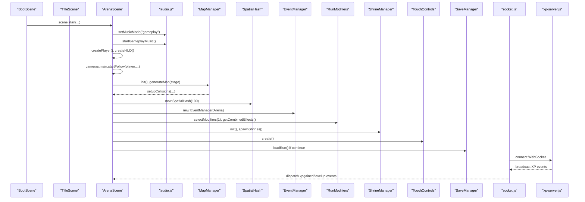

**Diagram sources**
- [ArenaScene.js](file://src/scenes/ArenaScene.js#L288-L470)
- [audio.js](file://src/utils/audio.js#L464-L486)
- [MapManager.js](file://src/systems/MapManager.js#L95-L102)
- [SpatialHash.js](file://src/utils/SpatialHash.js#L5-L9)
- [EventManager.js](file://src/systems/EventManager.js#L6-L14)
- [RunModifiers.js](file://src/systems/RunModifiers.js#L72-L84)
- [ShrineManager.js](file://src/systems/ShrineManager.js#L102-L109)
- [TouchControls.js](file://src/systems/TouchControls.js#L21-L69)
- [SaveManager.js](file://src/systems/SaveManager.js#L48-L67)
- [socket.js](file://src/utils/socket.js#L18-L104)
- [xp-server.js](file://xp-server.js#L20-L83)

## Detailed Component Analysis

### Game World and Camera
- World bounds are set larger than the viewport to encourage exploration.
- Camera follows the player with a deadzone and dynamic zoom based on resolution.
- Background uses either a preloaded arena image or a procedurally generated tileable texture with animated floating particles and optional vortex effects for higher stages.

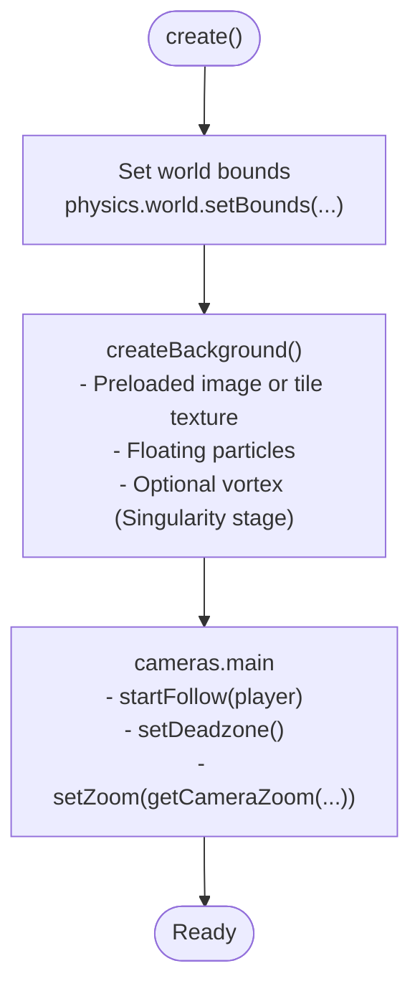

**Diagram sources**
- [ArenaScene.js](file://src/scenes/ArenaScene.js#L298-L317)
- [ArenaScene.js](file://src/scenes/ArenaScene.js#L485-L579)
- [ArenaScene.js](file://src/scenes/ArenaScene.js#L581-L636)
- [ArenaScene.js](file://src/scenes/ArenaScene.js#L546-L573)

**Section sources**
- [ArenaScene.js](file://src/scenes/ArenaScene.js#L298-L317)
- [ArenaScene.js](file://src/scenes/ArenaScene.js#L485-L579)
- [ArenaScene.js](file://src/scenes/ArenaScene.js#L581-L636)

### Player Movement and Controls
- Keyboard and WASD support for desktop.
- Mobile/touch support via a virtual joystick and pause button.
- Auto-move mode toggled by coding activity tracked via XP server events.
- Player movement vector is normalized and applied to velocity each update.

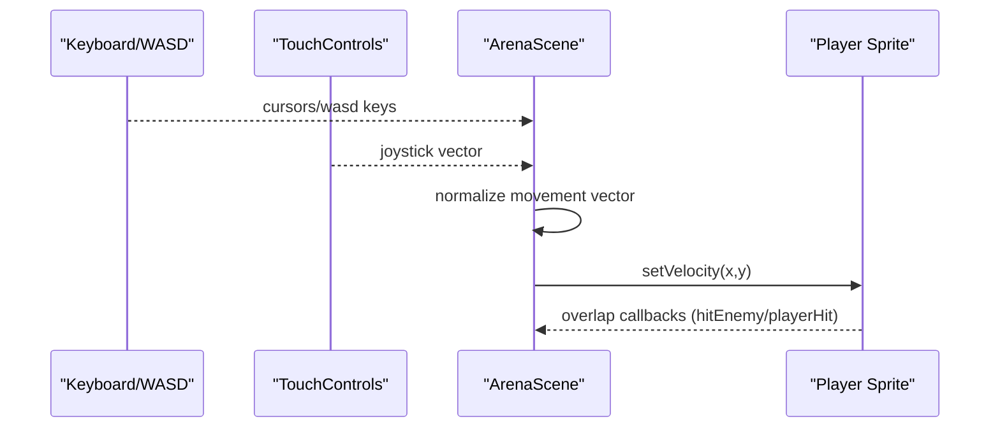

**Diagram sources**
- [ArenaScene.js](file://src/scenes/ArenaScene.js#L337-L343)
- [TouchControls.js](file://src/systems/TouchControls.js#L84-L154)
- [ArenaScene.js](file://src/scenes/ArenaScene.js#L360-L362)

**Section sources**
- [ArenaScene.js](file://src/scenes/ArenaScene.js#L337-L343)
- [TouchControls.js](file://src/systems/TouchControls.js#L21-L69)
- [TouchControls.js](file://src/systems/TouchControls.js#L126-L154)

### Weapons, Combat, and Projectiles
- Player’s current weapon is defined by a type with stats (attackRate, damage, projectiles, pierce, color, and optional special/melee).
- Weapons can expire after a duration; evolved combinations are tracked.
- Projectiles are created with per-weapon stats and pierce behavior; overlaps trigger hitEnemy and apply damage.
- Melee weapons (slash, thrust, return, throw) are supported with range and special behaviors.

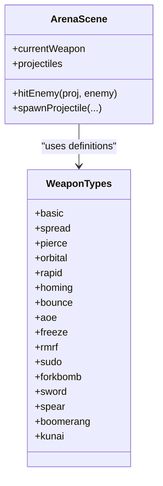

**Diagram sources**
- [ArenaScene.js](file://src/scenes/ArenaScene.js#L65-L91)
- [ArenaScene.js](file://src/scenes/ArenaScene.js#L360-L361)
- [ArenaScene.js](file://src/scenes/ArenaScene.js#L360-L361)

**Section sources**
- [ArenaScene.js](file://src/scenes/ArenaScene.js#L65-L91)
- [ArenaScene.js](file://src/scenes/ArenaScene.js#L360-L361)

### Enemy Spawning and Behavior
- Enemies are defined by type with stats, behaviors (chase, teleport, orbit, erratic, deathzone, spawner, grow, fake, growDamage, contextLoss, hijack, invisible, blocker, morph, split, predict, clone), and wave availability.
- Spawning is governed by wave number, spawn delays, and caps; modifiers influence spawn rates and enemy counts.
- Bosses and mini-bosses appear at designated waves with abilities.

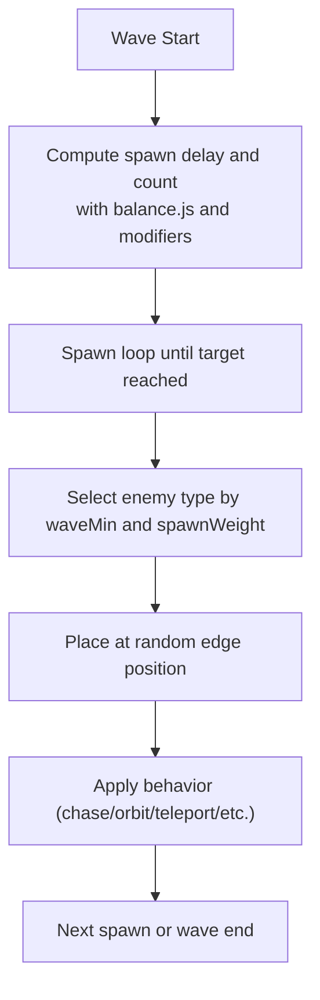

**Diagram sources**
- [ArenaScene.js](file://src/scenes/ArenaScene.js#L398-L399)
- [balance.js](file://src/config/balance.js#L34-L44)
- [RunModifiers.js](file://src/systems/RunModifiers.js#L91-L121)
- [ArenaScene.js](file://src/scenes/ArenaScene.js#L174-L201)

**Section sources**
- [ArenaScene.js](file://src/scenes/ArenaScene.js#L398-L399)
- [balance.js](file://src/config/balance.js#L34-L44)
- [RunModifiers.js](file://src/systems/RunModifiers.js#L91-L121)
- [ArenaScene.js](file://src/scenes/ArenaScene.js#L174-L201)

### Collision Detection and Spatial Hashing
- Overlaps are registered for projectiles vs enemies, player vs enemies, and player vs weapon drops.
- SpatialHash partitions entities into cells to accelerate nearby queries and reduce O(n^2) collision checks.

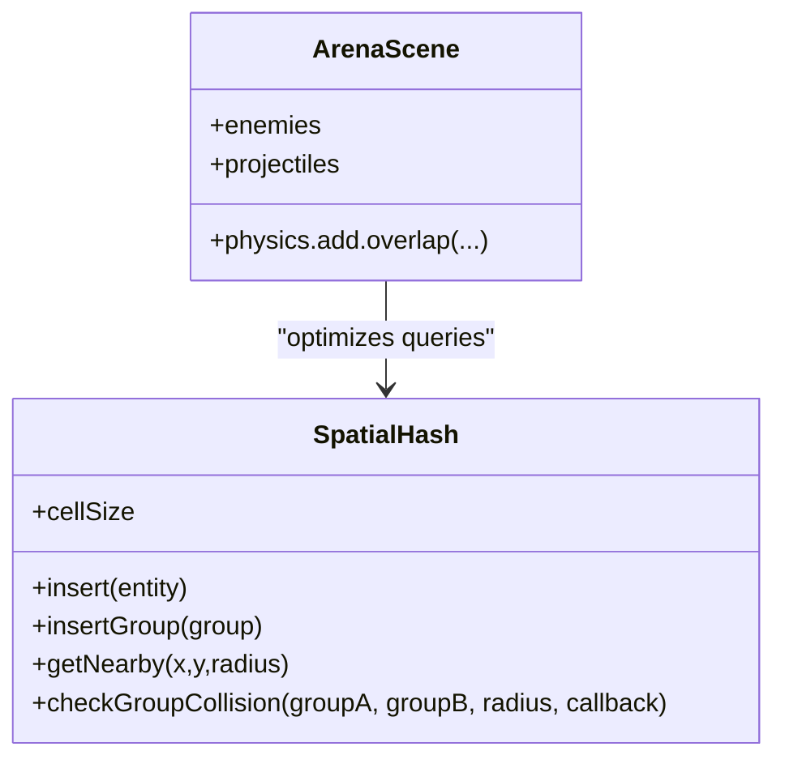

**Diagram sources**
- [SpatialHash.js](file://src/utils/SpatialHash.js#L5-L140)
- [ArenaScene.js](file://src/scenes/ArenaScene.js#L359-L363)

**Section sources**
- [SpatialHash.js](file://src/utils/SpatialHash.js#L5-L140)
- [ArenaScene.js](file://src/scenes/ArenaScene.js#L359-L363)

### Wave Progression, Stages, and Boss Encounters
- Waves incrementally increase enemy count and difficulty; stages change visuals and music.
- Bosses appear at specific waves with unique abilities; mini-bosses appear periodically.
- Stage transitions trigger background regeneration and visual announcements.

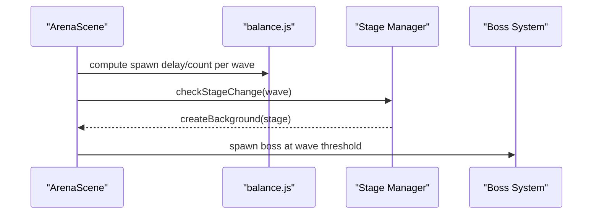

**Diagram sources**
- [ArenaScene.js](file://src/scenes/ArenaScene.js#L677-L688)
- [ArenaScene.js](file://src/scenes/ArenaScene.js#L485-L579)
- [ArenaScene.js](file://src/scenes/ArenaScene.js#L93-L135)
- [balance.js](file://src/config/balance.js#L34-L44)

**Section sources**
- [ArenaScene.js](file://src/scenes/ArenaScene.js#L677-L688)
- [ArenaScene.js](file://src/scenes/ArenaScene.js#L485-L579)
- [ArenaScene.js](file://src/scenes/ArenaScene.js#L93-L135)
- [balance.js](file://src/config/balance.js#L34-L44)

### Dynamic Events and Shrine Mechanics
- EventManager randomly triggers mid-wave events with timers and HUD banners.
- ShrineManager places interactive shrines with risk/reward choices and temporary buffs; includes chaos effects and gamble outcomes.

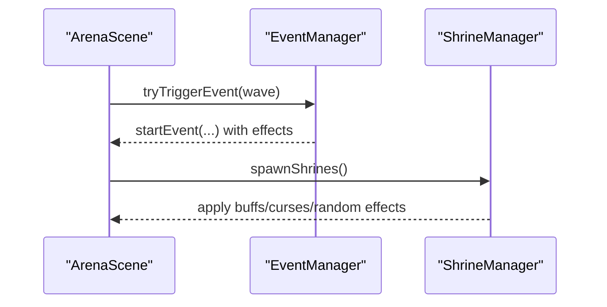

**Diagram sources**
- [EventManager.js](file://src/systems/EventManager.js#L80-L97)
- [EventManager.js](file://src/systems/EventManager.js#L103-L128)
- [ShrineManager.js](file://src/systems/ShrineManager.js#L144-L168)
- [ShrineManager.js](file://src/systems/ShrineManager.js#L394-L414)

**Section sources**
- [EventManager.js](file://src/systems/EventManager.js#L80-L97)
- [EventManager.js](file://src/systems/EventManager.js#L103-L128)
- [ShrineManager.js](file://src/systems/ShrineManager.js#L144-L168)
- [ShrineManager.js](file://src/systems/ShrineManager.js#L394-L414)

### Particle Effects, Visual Feedback, and Screen Shake
- Floating particles and data streams animate across the large world background.
- Visual feedback includes flashing, tinting, and HUD messages for hazards, shrines, and events.
- Screen shake intensity increases for critical hits based on thresholds.

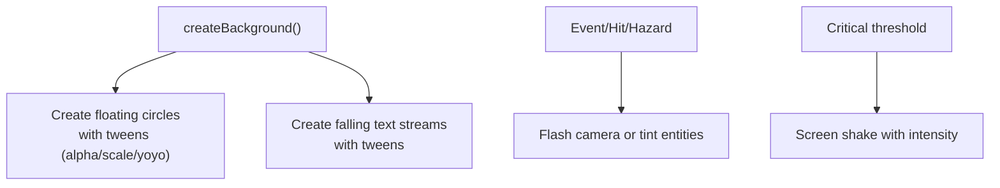

**Diagram sources**
- [ArenaScene.js](file://src/scenes/ArenaScene.js#L517-L542)
- [ArenaScene.js](file://src/scenes/ArenaScene.js#L638-L675)
- [MapManager.js](file://src/systems/MapManager.js#L437-L457)
- [balance.js](file://src/config/balance.js#L76-L82)

**Section sources**
- [ArenaScene.js](file://src/scenes/ArenaScene.js#L517-L542)
- [ArenaScene.js](file://src/scenes/ArenaScene.js#L638-L675)
- [MapManager.js](file://src/systems/MapManager.js#L437-L457)
- [balance.js](file://src/config/balance.js#L76-L82)

### Camera Following and Viewport Management
- Camera bounds match world size; follows player with smoothing and deadzone.
- Zoom adapts to screen size; HUD remains fixed to camera.

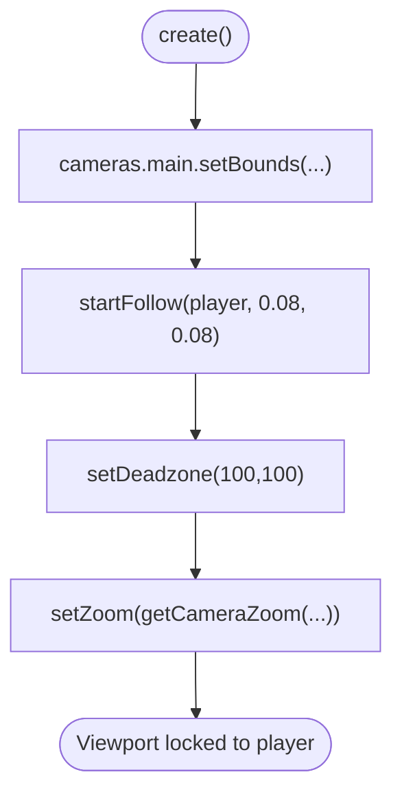

**Diagram sources**
- [ArenaScene.js](file://src/scenes/ArenaScene.js#L310-L317)

**Section sources**
- [ArenaScene.js](file://src/scenes/ArenaScene.js#L310-L317)

### XP Server Integration for Real-Time Coding Activity
- WebSocket connection established only on localhost/Electron to avoid failures on GitHub Pages.
- XP server receives HTTP events from CLI hooks and broadcasts XP amounts to connected clients.
- ArenaScene listens for xpgained and levelup events to update HUD and state.

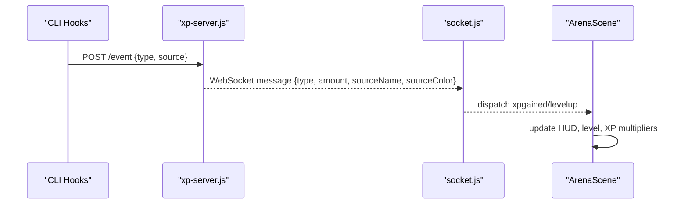

**Diagram sources**
- [xp-server.js](file://xp-server.js#L20-L70)
- [xp-server.js](file://xp-server.js#L72-L83)
- [socket.js](file://src/utils/socket.js#L54-L72)
- [socket.js](file://src/utils/socket.js#L106-L108)
- [ArenaScene.js](file://src/scenes/ArenaScene.js#L401-L405)

**Section sources**
- [xp-server.js](file://xp-server.js#L20-L70)
- [socket.js](file://src/utils/socket.js#L54-L72)
- [socket.js](file://src/utils/socket.js#L106-L108)
- [ArenaScene.js](file://src/scenes/ArenaScene.js#L401-L405)

### Wallet-Backed Progress and Persistence
- progressStore holds high wave/score and selected character.
- walletProgressService loads and saves upgrades, legendaries, save state, and selected character via API.
- SaveManager persists runs for Continue functionality.

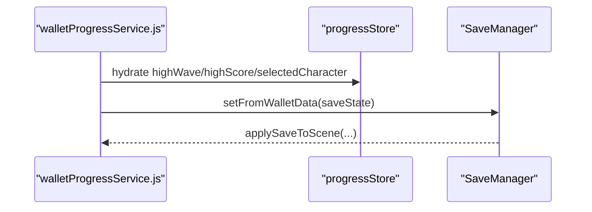

**Diagram sources**
- [walletProgressService.js](file://src/utils/walletProgressService.js#L22-L58)
- [SaveManager.js](file://src/systems/SaveManager.js#L149-L185)

**Section sources**
- [walletProgressService.js](file://src/utils/walletProgressService.js#L22-L58)
- [SaveManager.js](file://src/systems/SaveManager.js#L149-L185)

## Dependency Analysis
ArenaScene depends on multiple systems and utilities. The following diagram highlights key dependencies and interactions.

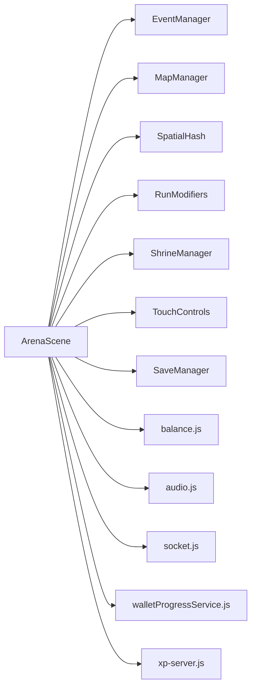

**Diagram sources**
- [ArenaScene.js](file://src/scenes/ArenaScene.js#L1-L20)
- [EventManager.js](file://src/systems/EventManager.js#L1-L14)
- [MapManager.js](file://src/systems/MapManager.js#L1-L81)
- [SpatialHash.js](file://src/utils/SpatialHash.js#L1-L9)
- [RunModifiers.js](file://src/systems/RunModifiers.js#L1-L65)
- [ShrineManager.js](file://src/systems/ShrineManager.js#L1-L15)
- [TouchControls.js](file://src/systems/TouchControls.js#L1-L19)
- [SaveManager.js](file://src/systems/SaveManager.js#L1-L6)
- [balance.js](file://src/config/balance.js#L1-L96)
- [audio.js](file://src/utils/audio.js#L1-L36)
- [socket.js](file://src/utils/socket.js#L1-L121)
- [walletProgressService.js](file://src/utils/walletProgressService.js#L1-L15)
- [xp-server.js](file://xp-server.js#L1-L106)

**Section sources**
- [ArenaScene.js](file://src/scenes/ArenaScene.js#L1-L20)
- [main.js](file://src/main.js#L1-L14)

## Performance Considerations
- Spatial hashing reduces collision checks from O(n^2) to near-linear by grouping entities into cells sized to typical collision radii.
- Large world bounds and camera deadzones prevent unnecessary rendering updates off-screen.
- Background generation uses tile textures and minimal animated elements; data streams respawn after completion to keep memory bounded.
- Projectiles and enemies are pooled via Phaser groups; destruction removes them promptly to avoid lingering objects.
- Audio synthesis is lightweight and only active when enabled; music uses HTML5 Audio for lower overhead.
- Run modifiers and balance parameters cap extreme scaling to maintain stability at high waves.

[No sources needed since this section provides general guidance]

## Troubleshooting Guide
- WebSocket connection fails on non-localhost: The client intentionally avoids connecting outside localhost to prevent errors; run the XP server locally or use the Electron app.
- XP events not received: Ensure the XP server is running and emitting events; verify the WebSocket URL and CORS headers.
- Audio not playing: Initialize audio after user interaction; resume audio context on first input.
- Touch controls not appearing: They activate automatically on touch/mobile devices; verify UI scale and container depth.
- Shrines not interactable: Ensure the player is within interact radius and can afford the shrine cost; check shrine usage flags.
- Map elements not cleared: Use MapManager.clearMap() to stop tweens and destroy groups before regeneration.
- Save not loading: Confirm save age and validity; clear stale saves if too old.

**Section sources**
- [socket.js](file://src/utils/socket.js#L18-L104)
- [xp-server.js](file://xp-server.js#L20-L70)
- [audio.js](file://src/utils/audio.js#L16-L43)
- [TouchControls.js](file://src/systems/TouchControls.js#L21-L69)
- [ShrineManager.js](file://src/systems/ShrineManager.js#L307-L340)
- [MapManager.js](file://src/systems/MapManager.js#L582-L598)
- [SaveManager.js](file://src/systems/SaveManager.js#L48-L67)

## Conclusion
The ArenaScene integrates a robust set of systems to deliver a scalable, visually rich, and responsive top-down shooter. Through spatial hashing, modular systems, and real-time XP integration, it maintains performance while offering deep strategic depth via modifiers, events, and shrine mechanics. The camera and world design encourage exploration, while the XP server enables meaningful integration with coding workflows.

[No sources needed since this section summarizes without analyzing specific files]

## Appendices

### XP Server Endpoints and Messages
- HTTP POST /event: Accepts event payloads and broadcasts structured messages to WebSocket clients.
- WebSocket: Sends JSON messages with type, amount, sourceName, and sourceColor.

**Section sources**
- [xp-server.js](file://xp-server.js#L20-L70)
- [xp-server.js](file://xp-server.js#L72-L83)

### Audio System Highlights
- Procedural SFX and music playback; separate gain nodes for SFX and music; volume controls and mode switching.

**Section sources**
- [audio.js](file://src/utils/audio.js#L46-L369)
- [audio.js](file://src/utils/audio.js#L464-L546)

### Settings and Runtime Config
- VIBE_SETTINGS persists across sessions; runtime config.json is fetched for environment overrides.

**Section sources**
- [main.js](file://src/main.js#L233-L317)
- [main.js](file://src/main.js#L381-L401)