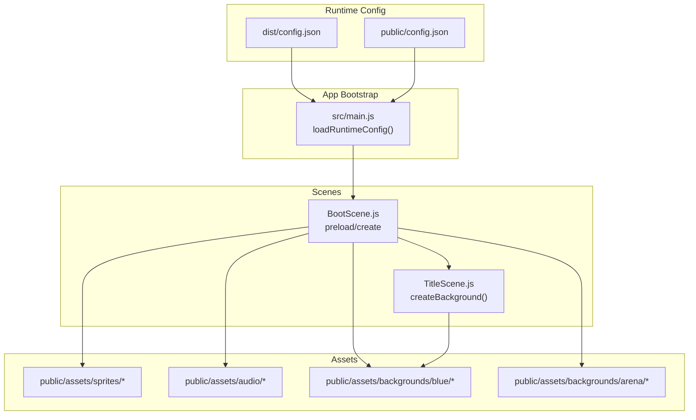
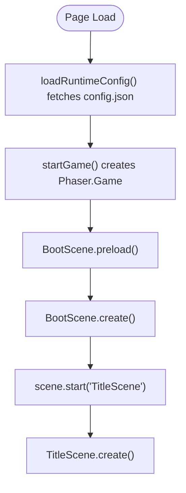
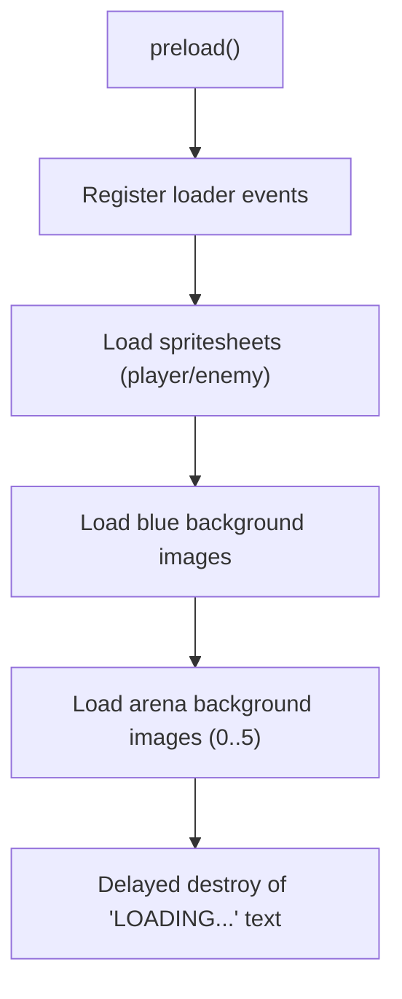
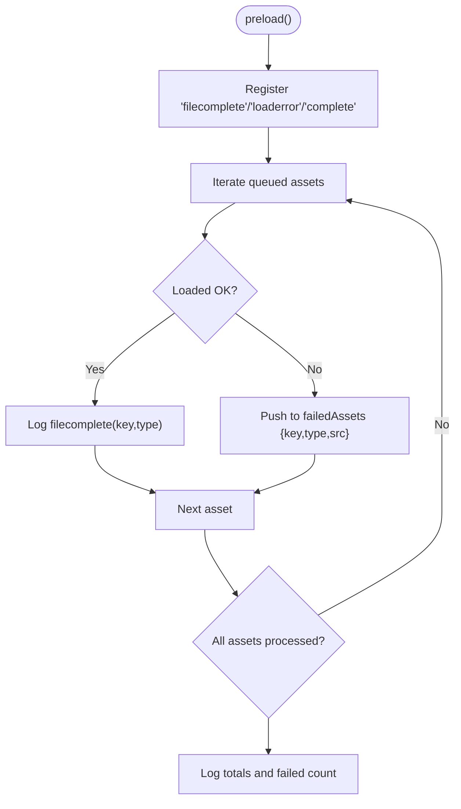
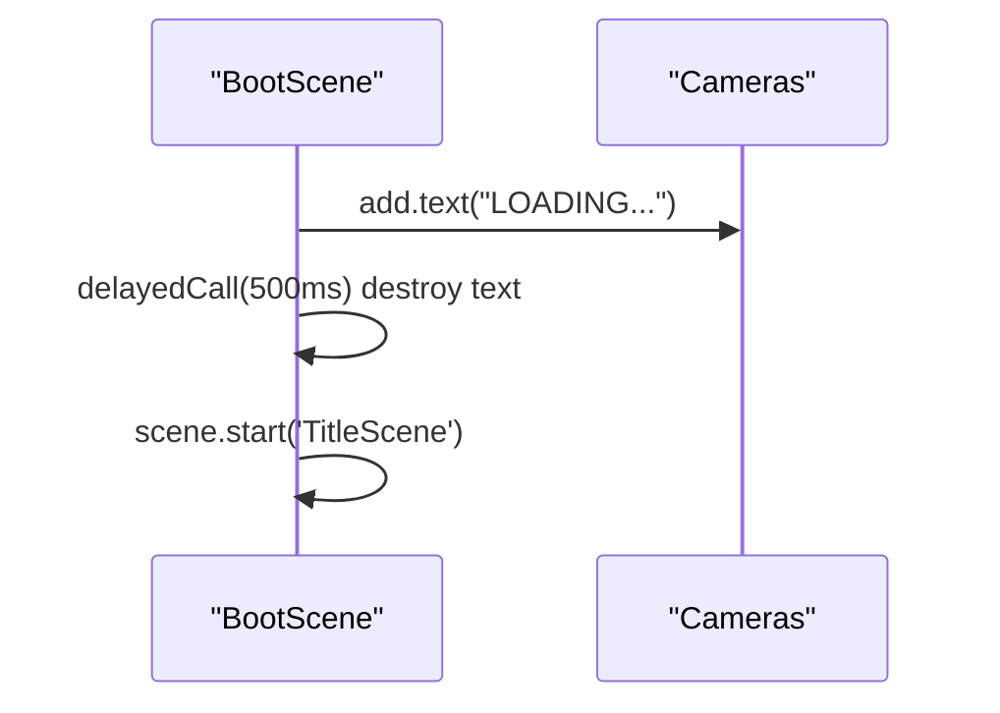
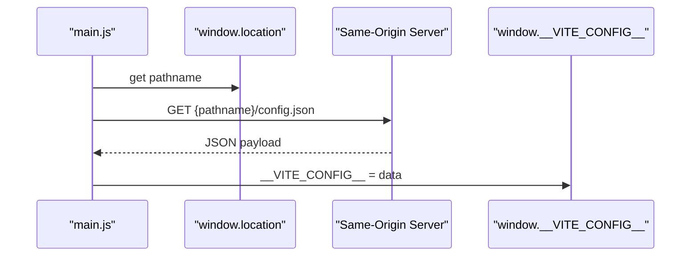
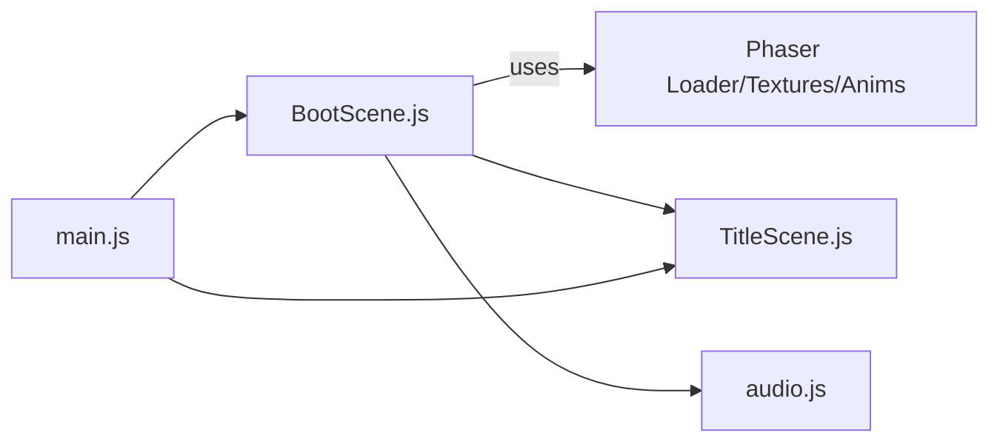

# Boot Scene

<cite>
**Referenced Files in This Document**
- [BootScene.js](file://src/scenes/BootScene.js)
- [TitleScene.js](file://src/scenes/TitleScene.js)
- [main.js](file://src/main.js)
- [audio.js](file://src/utils/audio.js)
- [config.json](file://dist/config.json)
- [config.json](file://public/config.json)
</cite>

## Table of Contents
1. [Introduction](#introduction)
2. [Project Structure](#project-structure)
3. [Core Components](#core-components)
4. [Architecture Overview](#architecture-overview)
5. [Detailed Component Analysis](#detailed-component-analysis)
6. [Dependency Analysis](#dependency-analysis)
7. [Performance Considerations](#performance-considerations)
8. [Troubleshooting Guide](#troubleshooting-guide)
9. [Conclusion](#conclusion)

## Introduction
This document explains the BootScene implementation in Vibe-Coder. It covers the initialization sequence, asset preloading strategy, loading progress tracking, splash screen and logo animation, and the transition to TitleScene. It also documents the asset bundle organization (spritesheets, audio, fonts), the loading bar implementation and progress calculation, error handling and fallback mechanisms, integration with the runtime configuration system, and performance considerations for asset optimization and lazy loading.

## Project Structure
BootScene is a Phaser scene responsible for:
- Preloading static assets (images, spritesheets)
- Generating dynamic textures and animations at runtime
- Tracking asset loading errors
- Transitioning to TitleScene when ready

Key runtime configuration is loaded via a separate config.json file served alongside the app.



**Diagram sources**
- [BootScene.js](file://src/scenes/BootScene.js#L39-L112)
- [TitleScene.js](file://src/scenes/TitleScene.js#L126-L260)
- [main.js](file://src/main.js#L388-L401)

**Section sources**
- [BootScene.js](file://src/scenes/BootScene.js#L29-L112)
- [main.js](file://src/main.js#L388-L401)

## Core Components
- BootScene: Preloads static assets and generates dynamic textures/animations; transitions to TitleScene.
- TitleScene: Title screen with animated background and menu; uses assets generated by BootScene.
- Runtime configuration loader: Fetches config.json from the same origin to populate window.__VITE_CONFIG__.

Key responsibilities:
- Asset preloading and error logging
- Dynamic texture generation for characters, enemies, and weapons
- Animation registration for sprites
- Transition to TitleScene after assets are ready

**Section sources**
- [BootScene.js](file://src/scenes/BootScene.js#L39-L214)
- [TitleScene.js](file://src/scenes/TitleScene.js#L39-L124)
- [main.js](file://src/main.js#L388-L401)

## Architecture Overview
BootScene orchestrates asset preparation and dynamic content creation before transitioning to TitleScene. TitleScene then renders the title screen and menu using the prepared assets.

```mermaid
sequenceDiagram
participant Browser as "Browser"
participant Main as "main.js"
participant Boot as "BootScene"
participant Title as "TitleScene"
Browser->>Main : Load page
Main->>Main : loadRuntimeConfig()
Main->>Boot : new Phaser.Game(config) starts BootScene
Boot->>Boot : preload() loads images/spritesheets
Boot->>Boot : create() generates textures/animations
Boot->>Title : scene.start('TitleScene')
Title->>Title : createBackground() uses generated assets
```

**Diagram sources**
- [main.js](file://src/main.js#L388-L446)
- [BootScene.js](file://src/scenes/BootScene.js#L39-L214)
- [TitleScene.js](file://src/scenes/TitleScene.js#L39-L124)

## Detailed Component Analysis

### Initialization Sequence
- Runtime config loading: The app fetches config.json from the same-origin URL constructed from the current pathname. The resolved object is stored in window.__VITE_CONFIG__.
- Game bootstrap: After config load, the app checks orientation on mobile devices and starts the Phaser game with a scene list including BootScene and TitleScene.
- BootScene preload: Adds a “LOADING...” text and registers loader event handlers for debugging and error tracking.
- BootScene create: Builds player textures, enemy sprites, weapon icons, and boss visuals procedurally; registers animations; transitions to TitleScene.



**Diagram sources**
- [main.js](file://src/main.js#L388-L446)
- [BootScene.js](file://src/scenes/BootScene.js#L39-L214)
- [TitleScene.js](file://src/scenes/TitleScene.js#L39-L124)

**Section sources**
- [main.js](file://src/main.js#L388-L446)
- [BootScene.js](file://src/scenes/BootScene.js#L39-L214)
- [TitleScene.js](file://src/scenes/TitleScene.js#L39-L124)

### Asset Preloading Strategy
- Static assets: Images and spritesheets are preloaded via this.load.image and this.load.spritesheet with explicit keys.
- Background packs: Two background sets are supported:
  - Blue space pack: blue-back, blue-stars, blue-with-stars, prop-planet-big, asteroid-1, asteroid-2
  - Arena pack: arena-bg-0 through arena-bg-5
- Path resolution: getBackgroundBase and getArenaBackgroundBase compute the correct base path depending on deployment context (GitHub Pages, Vercel, or local) to ensure assets load correctly.



**Diagram sources**
- [BootScene.js](file://src/scenes/BootScene.js#L39-L112)

**Section sources**
- [BootScene.js](file://src/scenes/BootScene.js#L39-L112)

### Loading Progress Tracking
- Event hooks:
  - filecomplete: Logs each successfully loaded asset key and type.
  - loaderror: Captures failed assets and stores them in this.failedAssets for later inspection.
  - complete: Logs totals and warns if any assets failed.
- The loader exposes totalToLoad, totalComplete, and totalFailed; BootScene uses these plus its internal failedAssets array to report completion status.



**Diagram sources**
- [BootScene.js](file://src/scenes/BootScene.js#L54-L79)

**Section sources**
- [BootScene.js](file://src/scenes/BootScene.js#L54-L79)

### Splash Screen and Logo Animation
- Splash: A centered “LOADING...” text is added during preload and destroyed after a short delay to simulate a splash screen effect.
- Logo animation: Not implemented in BootScene; TitleScene creates animated background layers and floating code particles, and TitleScene’s createBackground method composes background images and tile sprites.



**Diagram sources**
- [BootScene.js](file://src/scenes/BootScene.js#L44-L111)
- [TitleScene.js](file://src/scenes/TitleScene.js#L126-L260)

**Section sources**
- [BootScene.js](file://src/scenes/BootScene.js#L44-L111)
- [TitleScene.js](file://src/scenes/TitleScene.js#L126-L260)

### Transition to TitleScene
- After asset generation and animation registration, BootScene starts TitleScene.
- TitleScene initializes audio, builds background layers, and sets up UI.

**Section sources**
- [BootScene.js](file://src/scenes/BootScene.js#L212-L214)
- [TitleScene.js](file://src/scenes/TitleScene.js#L39-L124)

### Asset Bundle Organization
- Spritesheets:
  - Player/enemy frames: ./assets/sprites/player/*.png and ./assets/sprites/enemies/*.png
  - Effects and tiles: ./assets/sprites/effects/* and ./assets/sprites/tiles/*
- Backgrounds:
  - Blue space: ./assets/backgrounds/blue/*.png
  - Arena stages: ./assets/backgrounds/arena/*.png
- Audio:
  - Menu music: assets/audio/arcade-by-lucjo.mp3
  - Gameplay tracks: Galaxy_Guppy_KLICKAUD.mp3 and Kubbi-Ember.mp3
- Fonts:
  - UI text uses system fonts defined in BootScene and TitleScene; no custom font assets are explicitly loaded in these scenes.

**Section sources**
- [BootScene.js](file://src/scenes/BootScene.js#L83-L106)
- [audio.js](file://src/utils/audio.js#L397-L402)

### Loading Bar Implementation and Progress Percentage Calculation
- The BootScene does not implement a visual loading bar. Instead, it:
  - Displays a “LOADING...” text during preload
  - Logs detailed progress and failures via loader events
  - Uses Phaser’s built-in loader metrics (totalToLoad, totalComplete, totalFailed) and augments with an internal failedAssets array
- To add a visual progress bar, integrate Phaser’s LoaderPlugin events to update a progress indicator and compute a percentage as completed/totalToLoad.

[No sources needed since this section provides general guidance]

### Error Handling During Asset Loading and Fallback Mechanisms
- Error handling:
  - loaderror captures failing assets and records key, type, and src for debugging.
  - complete logs total counts and prints failed assets for diagnosis.
- Fallback mechanisms:
  - Player textures: If external sprites are missing, BootScene generates fallback player and hurt textures procedurally.
  - Secondary characters: If idle/walk sprites are missing, fallbacks are generated for Destroyer and Swordsman.
  - Bug enemy: If werewolf-run is missing, a procedural bug spritesheet is generated.
  - Animations: registerAnimations guards missing textures and skips animation registration when assets are absent.

**Section sources**
- [BootScene.js](file://src/scenes/BootScene.js#L59-L79)
- [BootScene.js](file://src/scenes/BootScene.js#L436-L565)
- [BootScene.js](file://src/scenes/BootScene.js#L570-L619)
- [BootScene.js](file://src/scenes/BootScene.js#L216-L289)

### Integration with Runtime Configuration System
- The app fetches config.json from the same-origin URL derived from window.location.pathname. The resolved JSON is stored in window.__VITE_CONFIG__ for global use.
- This mechanism supports deployments under different base paths (e.g., GitHub Pages subpaths) by computing the correct URL prefix.



**Diagram sources**
- [main.js](file://src/main.js#L388-L401)

**Section sources**
- [main.js](file://src/main.js#L388-L401)
- [config.json](file://dist/config.json#L1-L7)
- [config.json](file://public/config.json#L1-L7)

## Dependency Analysis
BootScene depends on:
- Phaser Loader for asset preloading
- Phaser Textures and Animations for runtime generation and registration
- TitleScene for post-transition UI composition



**Diagram sources**
- [BootScene.js](file://src/scenes/BootScene.js#L39-L214)
- [TitleScene.js](file://src/scenes/TitleScene.js#L39-L124)
- [audio.js](file://src/utils/audio.js#L397-L402)
- [main.js](file://src/main.js#L388-L446)

**Section sources**
- [BootScene.js](file://src/scenes/BootScene.js#L39-L214)
- [TitleScene.js](file://src/scenes/TitleScene.js#L39-L124)
- [audio.js](file://src/utils/audio.js#L397-L402)
- [main.js](file://src/main.js#L388-L446)

## Performance Considerations
- Asset optimization:
  - Use appropriately sized spritesheets and images to reduce memory footprint.
  - Prefer compressed audio formats and manage volume via audio.js to minimize CPU usage.
- Lazy loading:
  - Defer non-critical asset loading to TitleScene or gameplay scenes.
  - Generate expensive procedural textures only when needed (already guarded by existence checks).
- Rendering:
  - Use pixelArt and appropriate scale modes to maintain crisp visuals without unnecessary scaling overhead.
  - Minimize overlapping tileSprite layers and excessive tweens on low-end devices.

[No sources needed since this section provides general guidance]

## Troubleshooting Guide
Common issues and diagnostics:
- Assets stuck on “LOADING...”:
  - Check browser console for loaderror entries and review this.failedAssets logged during complete.
  - Verify asset paths and BASE_URL resolution for hosted deployments.
- Missing textures or animations:
  - Confirm that required spritesheets exist; BootScene falls back to procedural generation when assets are missing.
  - Ensure registerAnimations runs after textures are generated; missing textures will cause animations to be skipped with warnings.
- Runtime config not applied:
  - Ensure config.json is served from the same origin and pathname; the loader constructs the URL from window.location.pathname.

**Section sources**
- [BootScene.js](file://src/scenes/BootScene.js#L59-L79)
- [BootScene.js](file://src/scenes/BootScene.js#L216-L289)
- [main.js](file://src/main.js#L388-L401)

## Conclusion
BootScene performs essential asset preloading and dynamic content generation to prepare TitleScene. It provides robust error tracking and fallbacks to ensure the game remains functional even when assets are missing. Runtime configuration is loaded early to support deployment flexibility. With minor additions (visual progress bar, lazy loading), BootScene can further improve user feedback and performance.