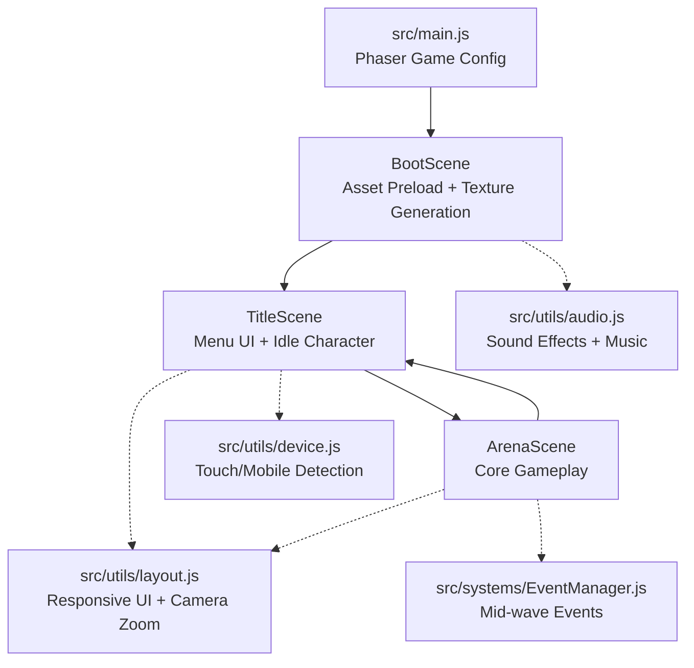
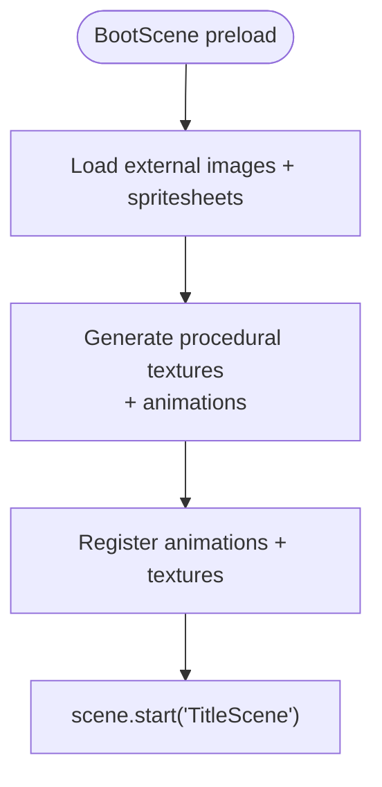
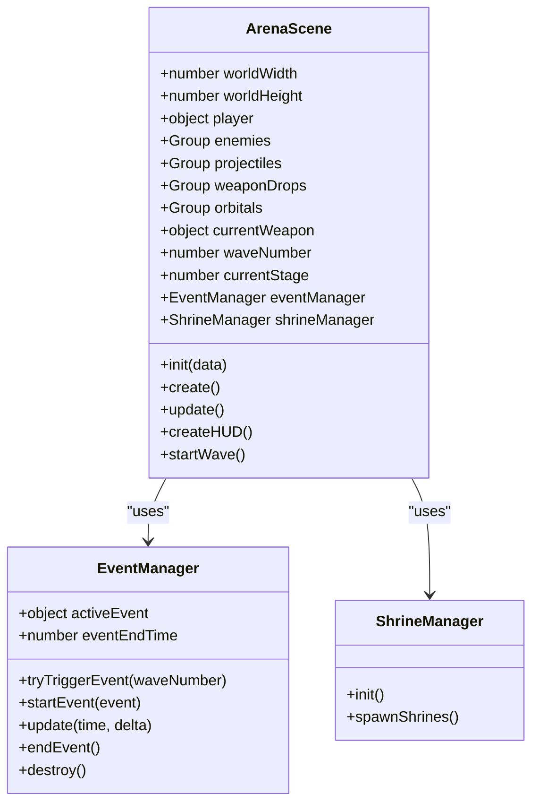
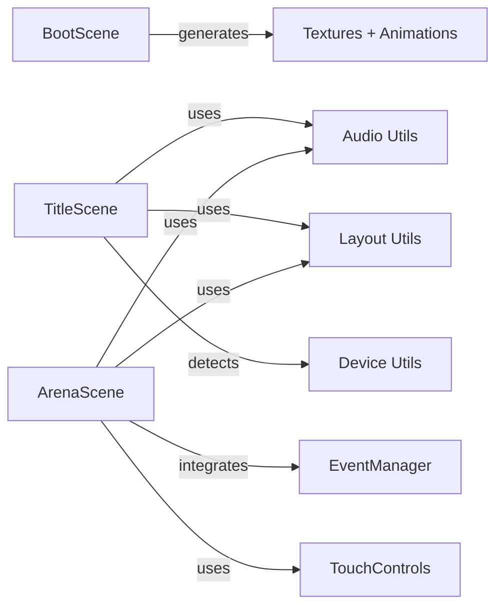

# Scene Management System

<cite>
**Referenced Files in This Document**
- [src/main.js](file://src/main.js)
- [src/scenes/BootScene.js](file://src/scenes/BootScene.js)
- [src/scenes/TitleScene.js](file://src/scenes/TitleScene.js)
- [src/scenes/ArenaScene.js](file://src/scenes/ArenaScene.js)
- [src/utils/audio.js](file://src/utils/audio.js)
- [src/utils/layout.js](file://src/utils/layout.js)
- [src/utils/device.js](file://src/utils/device.js)
- [src/systems/EventManager.js](file://src/systems/EventManager.js)
</cite>

## Table of Contents
1. [Introduction](#introduction)
2. [Project Structure](#project-structure)
3. [Core Components](#core-components)
4. [Architecture Overview](#architecture-overview)
5. [Detailed Component Analysis](#detailed-component-analysis)
6. [Dependency Analysis](#dependency-analysis)
7. [Performance Considerations](#performance-considerations)
8. [Troubleshooting Guide](#troubleshooting-guide)
9. [Conclusion](#conclusion)

## Introduction
This document explains Vibe-Coder's scene management architecture built with Phaser 3. It covers the three main scenes (BootScene, TitleScene, ArenaScene), their lifecycle phases (creation, preload, create, update), asset loading strategies, sprite sheet generation, audio resource handling, scene transitions, parameter passing, state preservation, responsive design with orientation locking, event system integration, and best practices for organization, memory management, and performance optimization.

## Project Structure
The game initializes a Phaser game instance configured with pixel art rendering, logical resolution, and Arcade Physics. The scene array defines BootScene, TitleScene, and ArenaScene. Audio utilities manage procedural sound effects and music playback. Layout helpers provide responsive UI scaling and camera zoom. Device detection utilities inform touch/mobile behavior. Systems like EventManager coordinate dynamic gameplay events.



**Diagram sources**
- [src/main.js](file://src/main.js#L15-L37)
- [src/scenes/BootScene.js](file://src/scenes/BootScene.js#L29-L37)
- [src/scenes/TitleScene.js](file://src/scenes/TitleScene.js#L25-L37)
- [src/scenes/ArenaScene.js](file://src/scenes/ArenaScene.js#L21-L37)
- [src/utils/audio.js](file://src/utils/audio.js#L1-L14)
- [src/utils/layout.js](file://src/utils/layout.js#L10-L38)
- [src/utils/device.js](file://src/utils/device.js#L5-L17)
- [src/systems/EventManager.js](file://src/systems/EventManager.js#L5-L14)

**Section sources**
- [src/main.js](file://src/main.js#L15-L37)
- [src/scenes/BootScene.js](file://src/scenes/BootScene.js#L29-L37)
- [src/scenes/TitleScene.js](file://src/scenes/TitleScene.js#L25-L37)
- [src/scenes/ArenaScene.js](file://src/scenes/ArenaScene.js#L21-L37)
- [src/utils/audio.js](file://src/utils/audio.js#L1-L14)
- [src/utils/layout.js](file://src/utils/layout.js#L10-L38)
- [src/utils/device.js](file://src/utils/device.js#L5-L17)
- [src/systems/EventManager.js](file://src/systems/EventManager.js#L5-L14)

## Core Components
- BootScene: Handles asset preloading, runtime background base resolution calculation, procedural texture generation for characters, enemies, weapons, and bosses, and registers animations. Transitions to TitleScene upon completion.
- TitleScene: Manages the main menu UI, animated background, idle character, wallet integration, settings, and responsive layout. Handles scene shutdown and cleanup.
- ArenaScene: Implements core gameplay including player, enemies, projectiles, weapon mechanics, stages, boss fights, HUD, modifiers, shrine effects, and event system integration.
- Audio Utilities: Provides procedural Web Audio API sound effects and HTML5 Audio music playback with volume control and mode switching.
- Layout Utilities: Compute UI scale and camera zoom based on logical and display sizes for responsive design.
- Device Utilities: Detect touch/mobile/tablet devices for input and UI decisions.
- EventManager: Orchestrates timed chaos events that alter gameplay dynamics.

**Section sources**
- [src/scenes/BootScene.js](file://src/scenes/BootScene.js#L29-L214)
- [src/scenes/TitleScene.js](file://src/scenes/TitleScene.js#L25-L124)
- [src/scenes/ArenaScene.js](file://src/scenes/ArenaScene.js#L21-L273)
- [src/utils/audio.js](file://src/utils/audio.js#L16-L560)
- [src/utils/layout.js](file://src/utils/layout.js#L10-L107)
- [src/utils/device.js](file://src/utils/device.js#L5-L23)
- [src/systems/EventManager.js](file://src/systems/EventManager.js#L5-L393)

## Architecture Overview
The scene lifecycle follows Phaser conventions: preload (BootScene), create (TitleScene/ArenaScene), update (ArenaScene), and shutdown/cleanup (TitleScene). Asset loading combines external images and dynamically generated textures. Audio modes switch between menu and gameplay tracks. Responsive design scales UI and camera zoom. EventManager injects dynamic gameplay elements.

```mermaid
sequenceDiagram
participant Main as "main.js"
participant Boot as "BootScene"
participant Title as "TitleScene"
participant Arena as "ArenaScene"
Main->>Boot : new Phaser.Game(config)
Boot->>Boot : preload() load assets + debug hooks
Boot->>Boot : create() generate textures + animations
Boot-->>Title : scene.start("TitleScene")
Title->>Title : create() menu UI + background + idle character
Title->>Arena : scene.start("ArenaScene", data)
Arena->>Arena : init(data) receive params
Arena->>Arena : create() player + HUD + systems
Arena->>Arena : update() game loop
Arena-->>Title : scene.start("TitleScene") on game over
Title->>Title : shutdown() cleanup tweens/timers/listeners
```

**Diagram sources**
- [src/main.js](file://src/main.js#L15-L37)
- [src/scenes/BootScene.js](file://src/scenes/BootScene.js#L39-L214)
- [src/scenes/TitleScene.js](file://src/scenes/TitleScene.js#L39-L876)
- [src/scenes/ArenaScene.js](file://src/scenes/ArenaScene.js#L281-L470)

## Detailed Component Analysis

### BootScene: Initialization and Asset Loading
BootScene performs:
- Runtime background base path resolution for GitHub Pages/Vercel/local hosting.
- Preloading of external sprite sheets and background images.
- Procedural texture generation for characters, enemies, weapons, bosses, and UI icons.
- Animation registration for characters and enemies.
- Transition to TitleScene after asset generation completes.

Key responsibilities:
- Asset loading with loader hooks for debugging failed assets.
- Sprite sheet management via addSpriteSheet for generated textures.
- Animation registration guarded by texture existence checks.
- Fallback generation for missing external assets.



**Diagram sources**
- [src/scenes/BootScene.js](file://src/scenes/BootScene.js#L39-L214)

**Section sources**
- [src/scenes/BootScene.js](file://src/scenes/BootScene.js#L29-L214)

### TitleScene: Main Menu and Character Selection
TitleScene manages:
- Animated background with parallax layers and star scrolling.
- Idle character animation synchronized with selected character.
- Menu UI with responsive layout and interactive options.
- Wallet integration, settings, language switching, and fullscreen toggling.
- Cleanup on shutdown including tweens, timers, and event listeners.

Lifecycle highlights:
- create(): Initializes audio, background, UI layout, input, particles, idle character, git quotes, and debug overlay.
- shutdown()/handleShutdown(): Removes keyboard listeners, XP/level listeners, timers, and kills tweens.

```mermaid
sequenceDiagram
participant Title as "TitleScene"
participant Audio as "Audio Utils"
participant Layout as "Layout Utils"
Title->>Audio : setMusicMode("menu")
Title->>Audio : startMenuMusic() if enabled
Title->>Layout : getCameraZoom() + getUIScale()
Title->>Title : createBackground() + createMenu() + createIdleCharacter()
Title->>Title : setupInput() + createCodeParticles()
Title->>Title : startGitQuotes() + createDebugOverlay()
Title->>Title : handleShutdown() on scene shutdown
```

**Diagram sources**
- [src/scenes/TitleScene.js](file://src/scenes/TitleScene.js#L39-L124)
- [src/utils/audio.js](file://src/utils/audio.js#L404-L546)
- [src/utils/layout.js](file://src/utils/layout.js#L26-L38)

**Section sources**
- [src/scenes/TitleScene.js](file://src/scenes/TitleScene.js#L25-L124)
- [src/scenes/TitleScene.js](file://src/scenes/TitleScene.js#L808-L876)

### ArenaScene: Core Gameplay
ArenaScene implements:
- Player, enemies, projectiles, weapon drops, orbitals, and legendary weapons.
- Wave system with scaling spawn rates and boss/miniboss waves.
- Stage progression with background changes and music transitions.
- HUD with XP bar, health bar, wave counter, kills, score, weapon info, and boss health.
- Modifiers, shrine effects, and event system integration.
- Touch controls for mobile devices.
- Auto-play logic with hunt/evade/idle modes.

Initialization and lifecycle:
- init(data): Receives gameMode and continueGame flags.
- create(): Sets up world bounds, background, player, camera, groups, collisions, HUD, spatial hash, map manager, touch controls, EventManager, ShrineManager, and RunModifiers.
- update(): Runs game loop logic, auto-move calculations, and HUD updates.



**Diagram sources**
- [src/scenes/ArenaScene.js](file://src/scenes/ArenaScene.js#L21-L273)
- [src/systems/EventManager.js](file://src/systems/EventManager.js#L5-L393)

**Section sources**
- [src/scenes/ArenaScene.js](file://src/scenes/ArenaScene.js#L21-L273)
- [src/scenes/ArenaScene.js](file://src/scenes/ArenaScene.js#L281-L470)
- [src/scenes/ArenaScene.js](file://src/scenes/ArenaScene.js#L1083-L1349)
- [src/systems/EventManager.js](file://src/systems/EventManager.js#L5-L393)

### Audio Resource Handling
Audio utilities provide:
- Procedural sound effects via Web Audio API oscillators, noise buffers, and filters.
- HTML5 Audio for menu and gameplay tracks with looping and crossfade behavior.
- Volume controls for master, music, and SFX.
- Music mode switching between menu and gameplay.

Integration:
- BootScene sets music mode to menu and starts menu music when enabled.
- ArenaScene switches to gameplay mode and starts gameplay tracks.

**Section sources**
- [src/utils/audio.js](file://src/utils/audio.js#L16-L560)
- [src/scenes/BootScene.js](file://src/scenes/BootScene.js#L43-L48)
- [src/scenes/ArenaScene.js](file://src/scenes/ArenaScene.js#L292-L296)

### Scene Transitions and Parameter Passing
Transitions:
- BootScene → TitleScene after asset generation.
- TitleScene → ArenaScene with data containing gameMode and continueGame flags.
- ArenaScene → TitleScene on game over.

Parameter passing:
- ArenaScene.init(data) receives gameMode and continueGame.
- TitleScene.updateContinueMenuOption rebuilds menu options based on saved state.

**Section sources**
- [src/scenes/BootScene.js](file://src/scenes/BootScene.js#L212-L214)
- [src/scenes/TitleScene.js](file://src/scenes/TitleScene.js#L773-L787)
- [src/scenes/ArenaScene.js](file://src/scenes/ArenaScene.js#L281-L286)

### State Preservation and Cleanup
State preservation:
- Settings, upgrades, legendaries, and coder stats are stored in global window objects and persisted to wallet-backed APIs.
- Progress store maintains high scores and selected character.

Cleanup:
- TitleScene.handleShutdown removes keyboard and window event listeners, clears timers, and kills tweens.
- ArenaScene tracks active tweens, weapon timers, and event handlers for cleanup.

**Section sources**
- [src/main.js](file://src/main.js#L233-L379)
- [src/scenes/TitleScene.js](file://src/scenes/TitleScene.js#L821-L876)
- [src/scenes/ArenaScene.js](file://src/scenes/ArenaScene.js#L245-L255)

### Responsive Design and Orientation Locking
Responsive design:
- UI scale computed from logical height; camera zoom adjusts for low-height windows.
- Layout utilities provide anchors and HUD positions.

Orientation locking:
- Mobile devices lock to landscape orientation on startup and show a rotate overlay when portrait.

**Section sources**
- [src/utils/layout.js](file://src/utils/layout.js#L10-L38)
- [src/main.js](file://src/main.js#L403-L446)

### Event System Integration
EventManager coordinates:
- Random event triggers at wave start with configurable chance and minimum wave threshold.
- Effects applied to scene state (XP multiplier, enemy speed modifier, forced rare drops).
- Special events like boss incoming countdown and swarm spawning.
- HUD display with timer bars and animations.

**Section sources**
- [src/systems/EventManager.js](file://src/systems/EventManager.js#L5-L393)
- [src/scenes/ArenaScene.js](file://src/scenes/ArenaScene.js#L1520-L1523)

## Dependency Analysis
BootScene depends on:
- Runtime background base path resolution for assets.
- Texture generation utilities for characters, enemies, weapons, and bosses.
- Animation registration for sprites.

TitleScene depends on:
- Audio utilities for music and SFX.
- Layout utilities for responsive UI and camera zoom.
- Device utilities for touch/mobile detection.
- Wallet integration and settings persistence.

ArenaScene depends on:
- Audio utilities for SFX and music.
- Layout utilities for HUD.
- EventManager, ShrineManager, and RunModifiers for dynamic gameplay.
- TouchControls for mobile input.



**Diagram sources**
- [src/scenes/BootScene.js](file://src/scenes/BootScene.js#L216-L289)
- [src/scenes/TitleScene.js](file://src/scenes/TitleScene.js#L39-L124)
- [src/scenes/ArenaScene.js](file://src/scenes/ArenaScene.js#L281-L470)
- [src/utils/audio.js](file://src/utils/audio.js#L404-L546)
- [src/utils/layout.js](file://src/utils/layout.js#L10-L107)
- [src/utils/device.js](file://src/utils/device.js#L5-L23)
- [src/systems/EventManager.js](file://src/systems/EventManager.js#L5-L393)

**Section sources**
- [src/scenes/BootScene.js](file://src/scenes/BootScene.js#L29-L214)
- [src/scenes/TitleScene.js](file://src/scenes/TitleScene.js#L25-L124)
- [src/scenes/ArenaScene.js](file://src/scenes/ArenaScene.js#L21-L273)
- [src/utils/audio.js](file://src/utils/audio.js#L16-L560)
- [src/utils/layout.js](file://src/utils/layout.js#L10-L107)
- [src/utils/device.js](file://src/utils/device.js#L5-L23)
- [src/systems/EventManager.js](file://src/systems/EventManager.js#L5-L393)

## Performance Considerations
- Procedural texture generation occurs once in BootScene to avoid runtime overhead during gameplay.
- Use addSpriteSheet for generated textures to leverage Phaser's texture caching.
- Kill tweens and remove timers on scene shutdown to prevent memory leaks.
- Limit particle counts and reuse graphics buffers where possible.
- Use spatial hashing for collision detection to reduce broad-phase checks.
- Clamp camera zoom to reasonable values to avoid excessive scaling.
- Minimize DOM manipulation; prefer Phaser graphics and containers.

## Troubleshooting Guide
Common issues and resolutions:
- Assets stuck on loading screen:
  - Check BootScene preload loader hooks for failed assets and review console logs.
  - Verify background base path resolution for hosted environments.
- Missing textures/animations:
  - Confirm texture existence before registering animations.
  - Use fallback generation for missing external assets.
- Audio not playing:
  - Ensure audio is initialized on first interaction and music is resumed.
  - Verify music mode switching between menu and gameplay.
- Scene cleanup leaks:
  - Ensure shutdown handlers remove listeners, clear timers, and kill tweens.
- Mobile orientation problems:
  - Confirm orientation lock is supported and overlay visibility toggles correctly.

**Section sources**
- [src/scenes/BootScene.js](file://src/scenes/BootScene.js#L54-L79)
- [src/scenes/BootScene.js](file://src/scenes/BootScene.js#L216-L289)
- [src/utils/audio.js](file://src/utils/audio.js#L16-L560)
- [src/scenes/TitleScene.js](file://src/scenes/TitleScene.js#L821-L876)
- [src/main.js](file://src/main.js#L421-L446)

## Conclusion
Vibe-Coder’s scene management leverages Phaser’s lifecycle and modular architecture to deliver a polished, responsive, and extensible game. BootScene centralizes asset loading and procedural generation, TitleScene provides a robust menu and idle experience, and ArenaScene delivers deep gameplay with dynamic events and systems. Proper cleanup, responsive design, and audio integration ensure a smooth user experience across platforms.