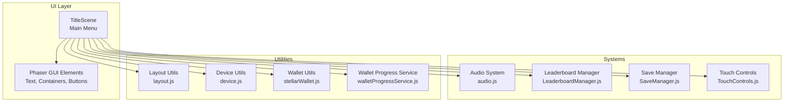
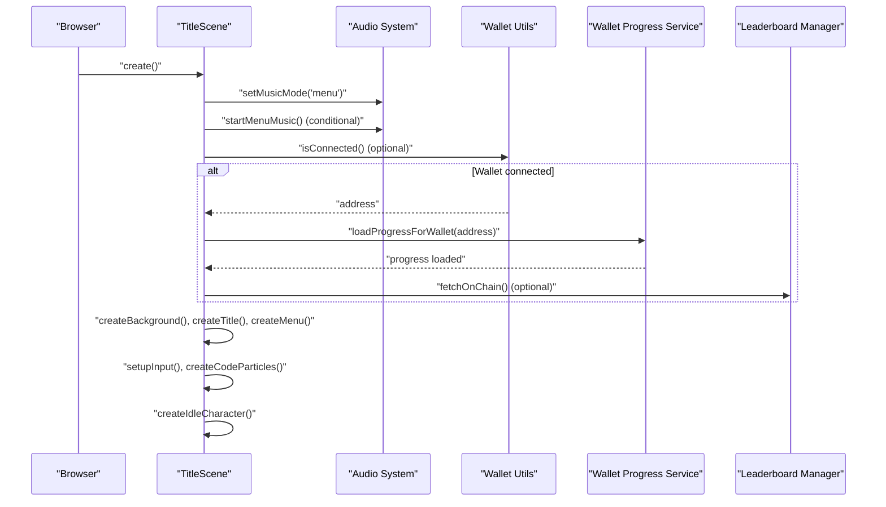
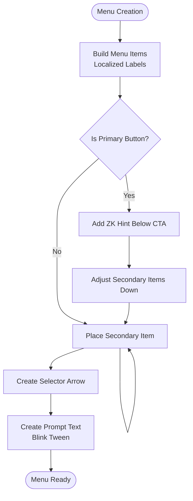
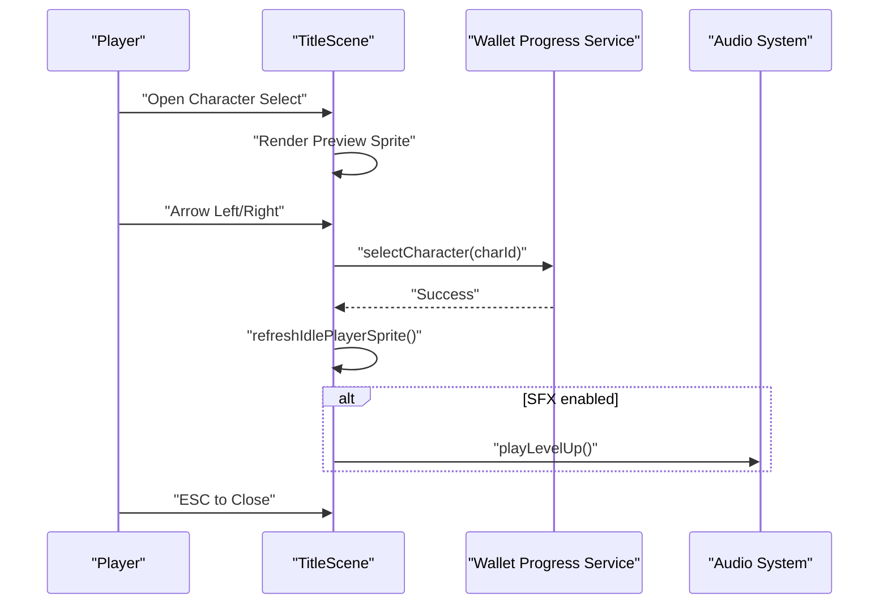
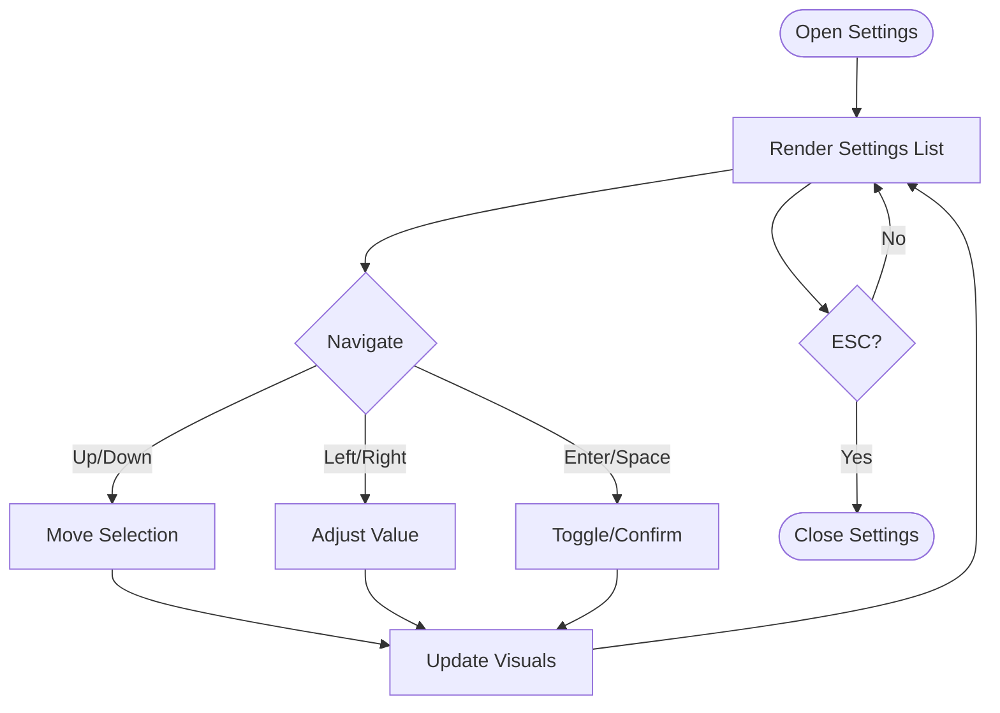
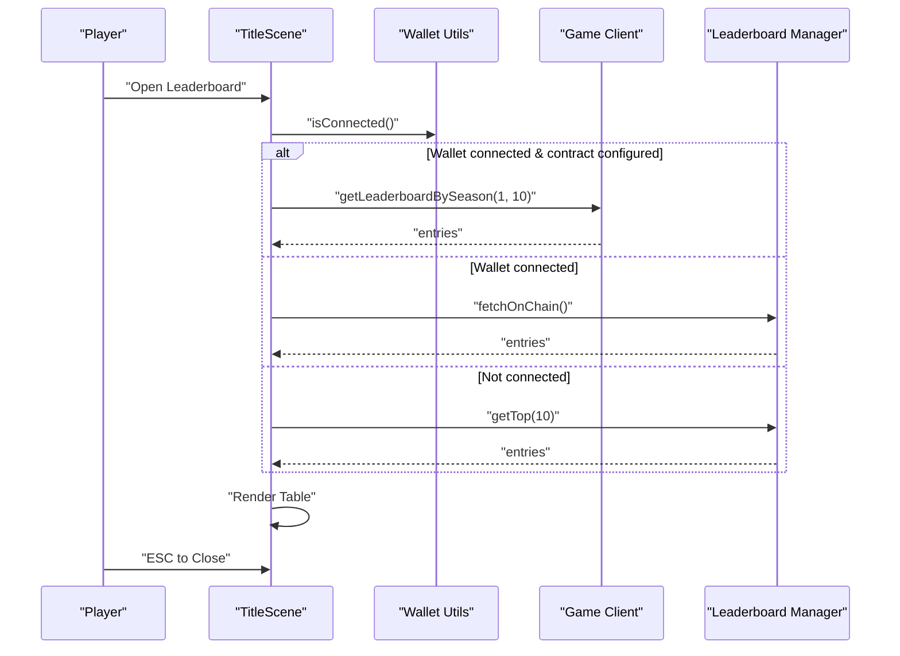
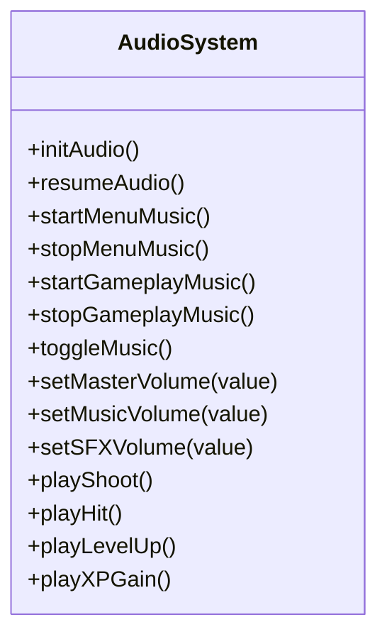
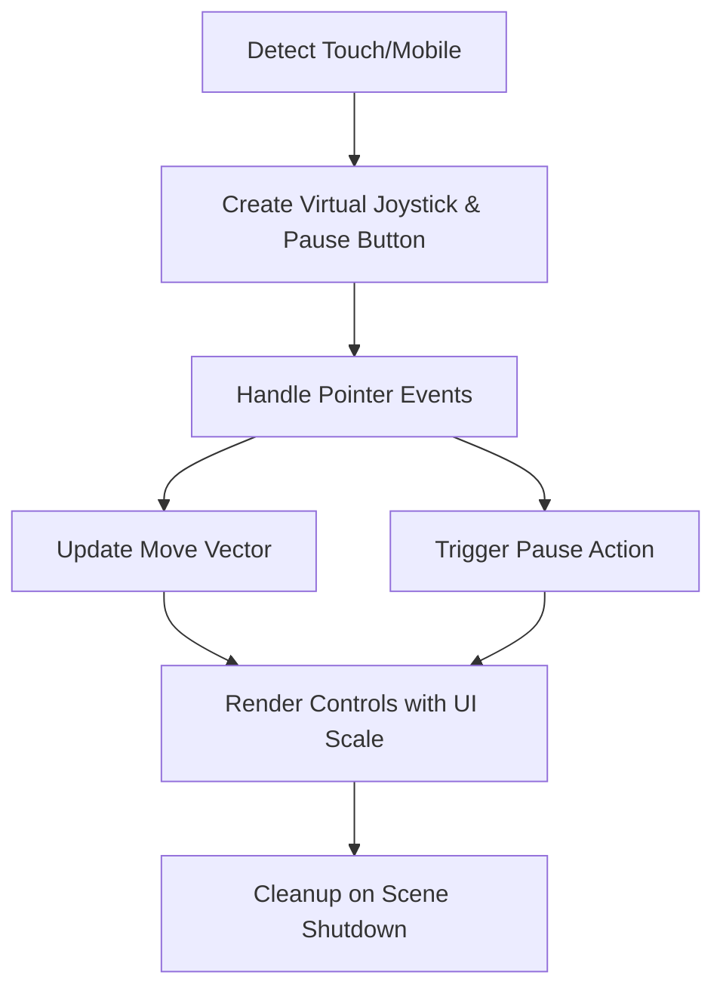
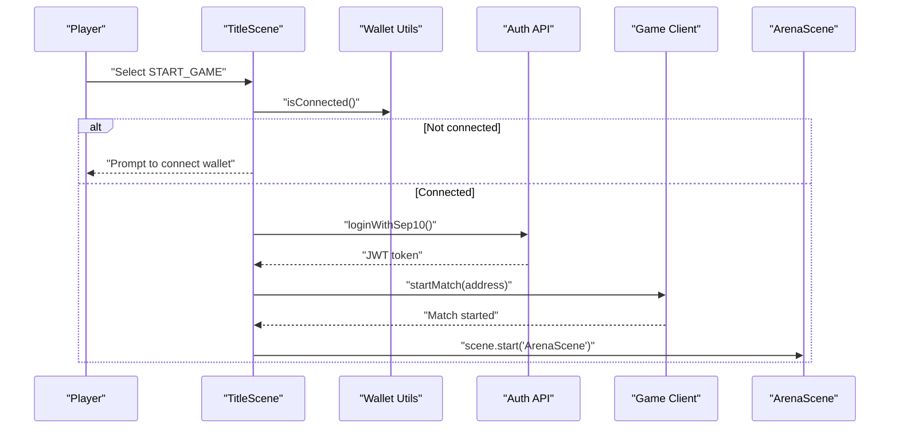
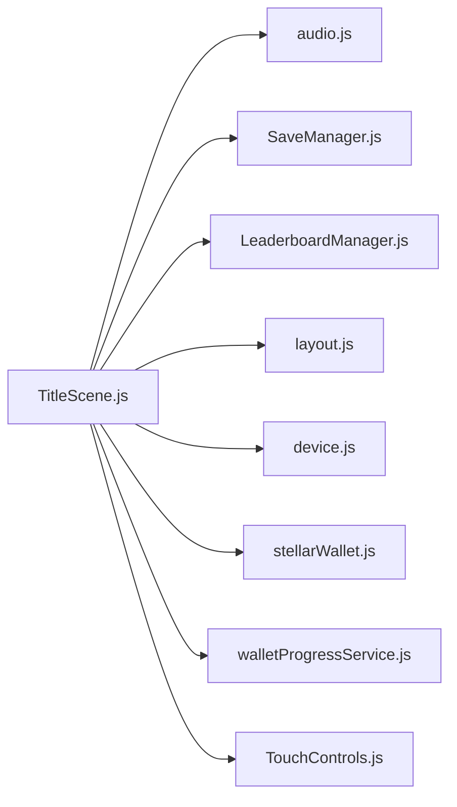

# Title Scene

<cite>
**Referenced Files in This Document**
- [TitleScene.js](file://src/scenes/TitleScene.js)
- [audio.js](file://src/utils/audio.js)
- [LeaderboardManager.js](file://src/systems/LeaderboardManager.js)
- [SaveManager.js](file://src/systems/SaveManager.js)
- [TouchControls.js](file://src/systems/TouchControls.js)
- [layout.js](file://src/utils/layout.js)
- [device.js](file://src/utils/device.js)
- [walletProgressService.js](file://src/utils/walletProgressService.js)
- [stellarWallet.js](file://src/utils/stellarWallet.js)
</cite>

## Table of Contents
1. [Introduction](#introduction)
2. [Project Structure](#project-structure)
3. [Core Components](#core-components)
4. [Architecture Overview](#architecture-overview)
5. [Detailed Component Analysis](#detailed-component-analysis)
6. [Dependency Analysis](#dependency-analysis)
7. [Performance Considerations](#performance-considerations)
8. [Troubleshooting Guide](#troubleshooting-guide)
9. [Conclusion](#conclusion)

## Introduction
This document provides comprehensive technical documentation for the TitleScene implementation. It explains the main menu interface, character selection system, settings management, UI layout with Phaser GUI elements, button interactions, navigation flow, leaderboard integration, audio system integration, and responsive design considerations including touch controls for mobile devices.

## Project Structure
The TitleScene orchestrates the main menu experience and integrates with multiple subsystems:
- Audio system for background music and sound effects
- Save and progress management for persistent runs and wallet-backed data
- Leaderboard manager for displaying high scores
- Device and layout utilities for responsive scaling and camera zoom
- Wallet integration for authentication and progress synchronization
- Touch controls for mobile play

**Diagram sources**
- [TitleScene.js](file://src/scenes/TitleScene.js#L1-L120)
- [audio.js](file://src/utils/audio.js#L1-L120)
- [LeaderboardManager.js](file://src/systems/LeaderboardManager.js#L1-L60)
- [SaveManager.js](file://src/systems/SaveManager.js#L1-L60)
- [TouchControls.js](file://src/systems/TouchControls.js#L1-L60)
- [layout.js](file://src/utils/layout.js#L1-L40)
- [device.js](file://src/utils/device.js#L1-L25)
- [walletProgressService.js](file://src/utils/walletProgressService.js#L1-L40)
- [stellarWallet.js](file://src/utils/stellarWallet.js#L1-L40)

**Section sources**
- [TitleScene.js](file://src/scenes/TitleScene.js#L1-L120)

## Core Components
- TitleScene: Main scene managing UI, input, animations, and navigation
- Audio system: Menu music, gameplay music, and procedural sound effects
- SaveManager: Local run persistence and restoration
- LeaderboardManager: Local and on-chain leaderboard integration
- TouchControls: Virtual joystick and pause button for mobile
- Layout and device utilities: Responsive scaling and camera zoom
- Wallet integration: Authentication, progress sync, and username management

**Section sources**
- [TitleScene.js](file://src/scenes/TitleScene.js#L25-L80)
- [audio.js](file://src/utils/audio.js#L1-L120)
- [SaveManager.js](file://src/systems/SaveManager.js#L1-L60)
- [LeaderboardManager.js](file://src/systems/LeaderboardManager.js#L1-L60)
- [TouchControls.js](file://src/systems/TouchControls.js#L1-L60)
- [layout.js](file://src/utils/layout.js#L1-L40)
- [device.js](file://src/utils/device.js#L1-L25)

## Architecture Overview
The TitleScene initializes audio, builds a responsive UI, manages interactive menus, and coordinates integrations with the audio system, save/progress managers, leaderboard, and wallet services. It also handles touch controls for mobile platforms.

**Diagram sources**
- [TitleScene.js](file://src/scenes/TitleScene.js#L39-L124)
- [audio.js](file://src/utils/audio.js#L404-L443)
- [walletProgressService.js](file://src/utils/walletProgressService.js#L1-L40)
- [LeaderboardManager.js](file://src/systems/LeaderboardManager.js#L101-L120)

## Detailed Component Analysis

### Main Menu Interface
The main menu is built with a centered UI container and dynamic menu items. It supports keyboard and mouse navigation, with visual feedback for selection and a pulsing CTA glow for the primary action.

Key behaviors:
- Dynamic menu creation with localized labels
- Selection arrow and visual emphasis for the selected item
- Conditional ZK CTA hint below the primary button
- Prompt text with blinking animation

**Diagram sources**
- [TitleScene.js](file://src/scenes/TitleScene.js#L329-L458)

**Section sources**
- [TitleScene.js](file://src/scenes/TitleScene.js#L329-L458)

### Character Selection System
The character selection panel displays three playable characters: VibeCoder, Destroyer, and Swordsman. Users can cycle through characters via arrows or keyboard, and the selection is persisted via the wallet progress service.

Character metadata and selection flow:
- Character IDs: vibecoder, destroyer, swordsman
- Preview sprite with idle animation
- Cycle via arrow buttons or keyboard left/right
- Persist selection and refresh idle character preview

**Diagram sources**
- [TitleScene.js](file://src/scenes/TitleScene.js#L3385-L3524)
- [walletProgressService.js](file://src/utils/walletProgressService.js#L1-L40)
- [audio.js](file://src/utils/audio.js#L184-L209)

**Section sources**
- [TitleScene.js](file://src/scenes/TitleScene.js#L3385-L3524)

### Settings Management
The settings panel provides:
- Player name input with validation and persistence
- Language selection (English/Spanish)
- Music and SFX toggles
- Master volume and music-specific volume sliders
- Desktop app settings for Electron (window mode, always on top)

Navigation and interaction:
- Up/down to move between settings
- Left/right to adjust slider/select values
- Enter/Space to toggle or confirm
- ESC to close

**Diagram sources**
- [TitleScene.js](file://src/scenes/TitleScene.js#L2404-L2645)

**Section sources**
- [TitleScene.js](file://src/scenes/TitleScene.js#L2404-L2645)

### Leaderboard Integration
The leaderboard panel displays top entries with rank, name, wave, and score. It adapts based on wallet connection and ZK contract configuration:
- On-chain leaderboard via contract when configured
- Fallback to local leaderboard manager
- Shortened wallet addresses for privacy

**Diagram sources**
- [TitleScene.js](file://src/scenes/TitleScene.js#L2196-L2326)
- [LeaderboardManager.js](file://src/systems/LeaderboardManager.js#L101-L133)

**Section sources**
- [TitleScene.js](file://src/scenes/TitleScene.js#L2196-L2326)
- [LeaderboardManager.js](file://src/systems/LeaderboardManager.js#L1-L135)

### Audio System Integration
The audio system provides:
- Menu music (Arcade by Lucjo) with HTML5 Audio
- Gameplay music playlist with looping and track transitions
- Procedural sound effects via Web Audio API
- Volume controls for master, music, and SFX
- Initialization on first user interaction to satisfy browser autoplay policies

**Diagram sources**
- [audio.js](file://src/utils/audio.js#L1-L120)
- [audio.js](file://src/utils/audio.js#L404-L560)

**Section sources**
- [audio.js](file://src/utils/audio.js#L1-L120)
- [audio.js](file://src/utils/audio.js#L404-L560)

### Responsive Design and Touch Controls
Responsive design:
- UI scale increases with viewport height
- Camera zoom adjusts for low-height windows
- Footer elements use anchored positions

Touch controls:
- Virtual joystick and pause button for mobile/touch devices
- Movement vector and pause action handling
- Accessibility labels and visual indicators

**Diagram sources**
- [TouchControls.js](file://src/systems/TouchControls.js#L1-L157)
- [layout.js](file://src/utils/layout.js#L10-L38)
- [device.js](file://src/utils/device.js#L5-L23)

**Section sources**
- [layout.js](file://src/utils/layout.js#L1-L108)
- [device.js](file://src/utils/device.js#L1-L25)
- [TouchControls.js](file://src/systems/TouchControls.js#L1-L157)

### Navigation Flow and Interactions
Keyboard and mouse navigation:
- Arrow keys/WASD to move selection
- Enter/Space to select
- Pointer hover and click for menu items

Menu options and actions:
- START_GAME: Validates wallet connection, authenticates via SEP-10, starts match (if configured), and transitions to ArenaScene
- UPGRADES: Opens upgrades panel with currency display and purchase flow
- WEAPONS: Opens weapons gallery with tabs for Legendary, Melee, and Ranged
- CHARACTER: Opens character selection panel
- SETTINGS: Opens settings panel
- LEADERBOARD: Opens leaderboard panel
- CONTROLS: Opens controls reference
- DOCUMENTATION: Opens documentation in a new tab
- CREDITS: Opens credits panel

**Diagram sources**
- [TitleScene.js](file://src/scenes/TitleScene.js#L1919-L2029)
- [stellarWallet.js](file://src/utils/stellarWallet.js#L1-L40)
- [walletProgressService.js](file://src/utils/walletProgressService.js#L1-L40)

**Section sources**
- [TitleScene.js](file://src/scenes/TitleScene.js#L1827-L2029)

## Dependency Analysis
The TitleScene depends on several modules for cohesive functionality. The following diagram highlights key dependencies and their roles.

**Diagram sources**
- [TitleScene.js](file://src/scenes/TitleScene.js#L1-L120)
- [audio.js](file://src/utils/audio.js#L1-L120)
- [SaveManager.js](file://src/systems/SaveManager.js#L1-L60)
- [LeaderboardManager.js](file://src/systems/LeaderboardManager.js#L1-L60)
- [layout.js](file://src/utils/layout.js#L1-L40)
- [device.js](file://src/utils/device.js#L1-L25)
- [stellarWallet.js](file://src/utils/stellarWallet.js#L1-L40)
- [walletProgressService.js](file://src/utils/walletProgressService.js#L1-L40)
- [TouchControls.js](file://src/systems/TouchControls.js#L1-L60)

**Section sources**
- [TitleScene.js](file://src/scenes/TitleScene.js#L1-L120)

## Performance Considerations
- Audio initialization on first interaction avoids autoplay restrictions and reduces startup overhead until needed.
- Background parallax uses a single update loop for efficient movement across multiple layers.
- Menu and settings panels use container-based rendering to minimize DOM overhead.
- Touch controls are conditionally enabled based on device detection to avoid unnecessary UI elements on desktop.
- Idle character animations and speech bubbles are managed with tweens and timers that are cleaned up on scene shutdown.

## Troubleshooting Guide
Common issues and resolutions:
- Menu does not respond to input:
  - Ensure audio is initialized on first interaction.
  - Verify keyboard and pointer event handlers are attached.
- Wallet connection errors:
  - Confirm Freighter extension availability and proper network passphrase handling.
  - Check SEP-10 authentication flow and JWT token storage.
- Leaderboard empty:
  - Connect wallet for on-chain entries or ensure local entries exist.
- Audio not playing:
  - Confirm browser autoplay policy and user interaction requirement.
  - Verify musicEnabled setting and volume levels.
- Mobile controls not appearing:
  - Ensure device detection recognizes touch/mobility.
  - Confirm UI scale and layout calculations for viewport size.

**Section sources**
- [TitleScene.js](file://src/scenes/TitleScene.js#L51-L59)
- [TitleScene.js](file://src/scenes/TitleScene.js#L499-L535)
- [audio.js](file://src/utils/audio.js#L16-L43)
- [LeaderboardManager.js](file://src/systems/LeaderboardManager.js#L23-L42)
- [TouchControls.js](file://src/systems/TouchControls.js#L10-L20)

## Conclusion
The TitleScene provides a polished, responsive, and feature-rich main menu experience. It integrates audio, save/progress, leaderboard, wallet, and touch controls seamlessly. The modular design and clear separation of concerns enable maintainability and extensibility for future enhancements.