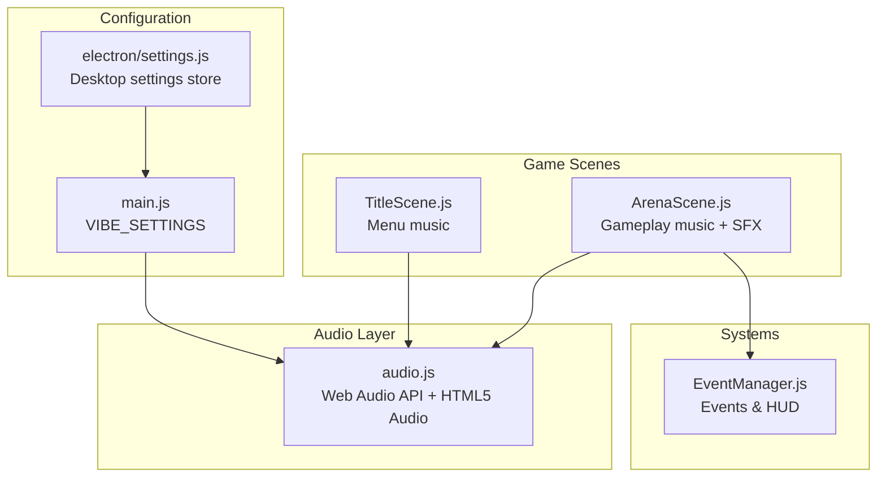
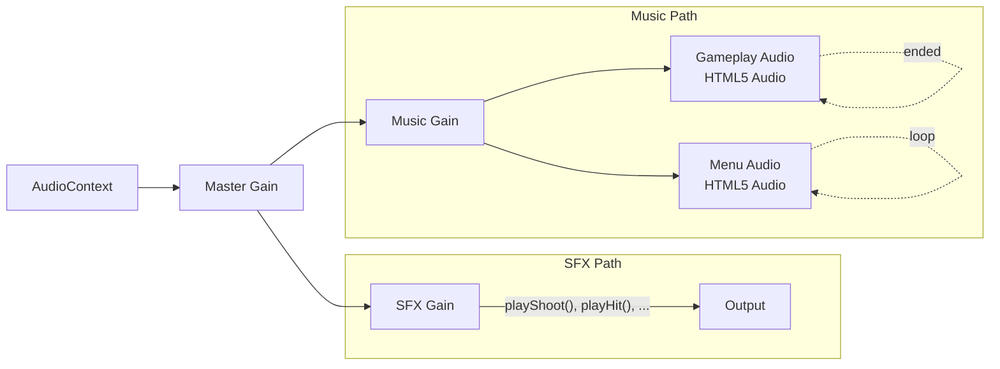
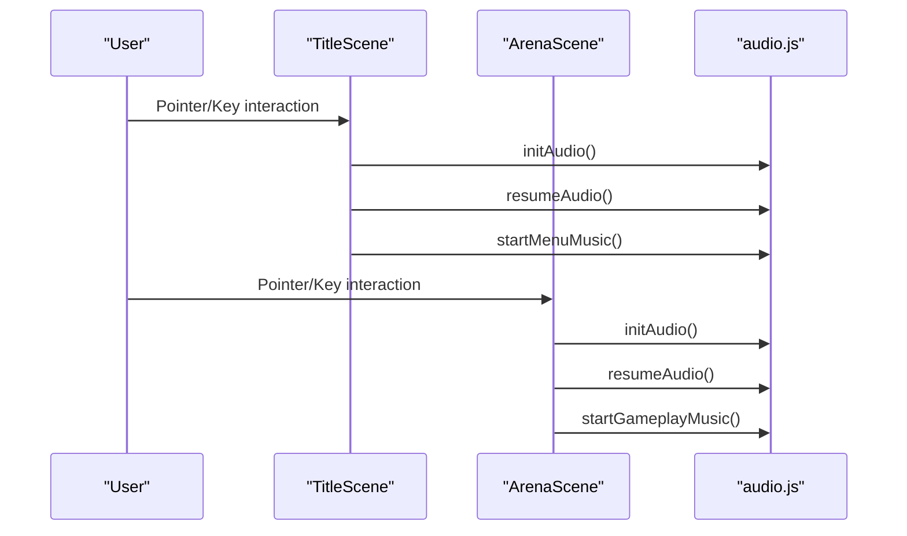
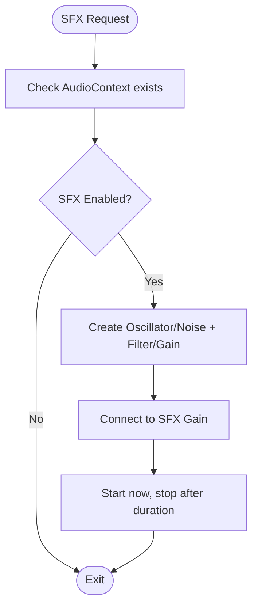
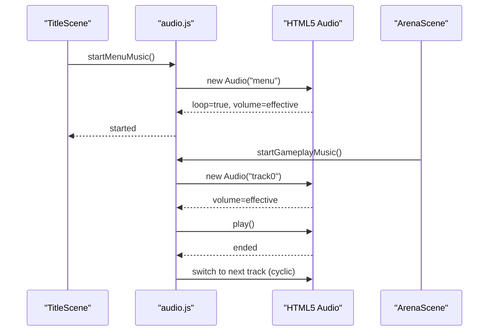
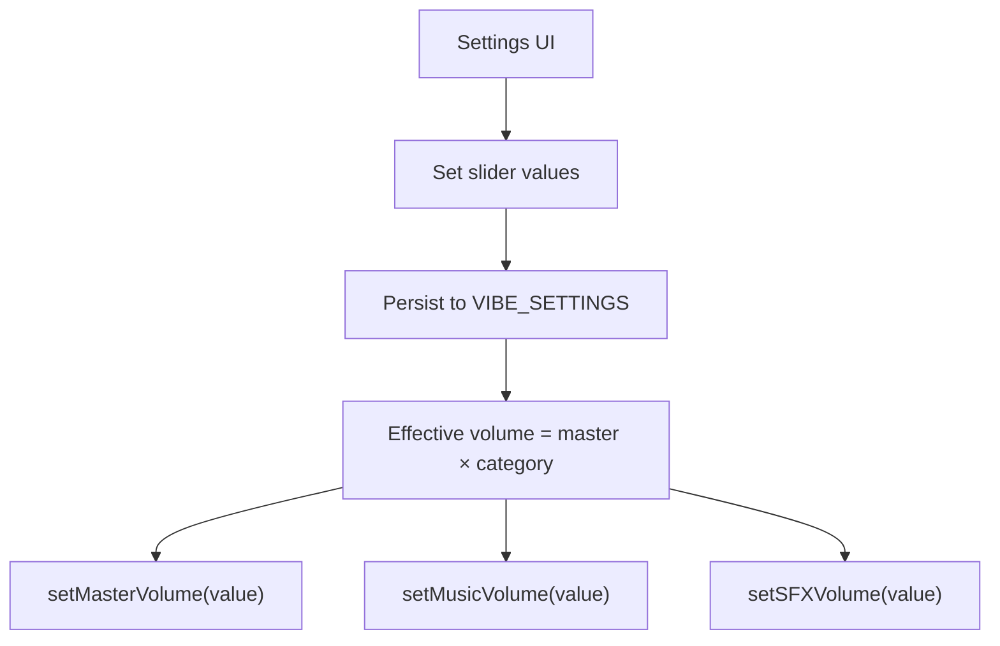
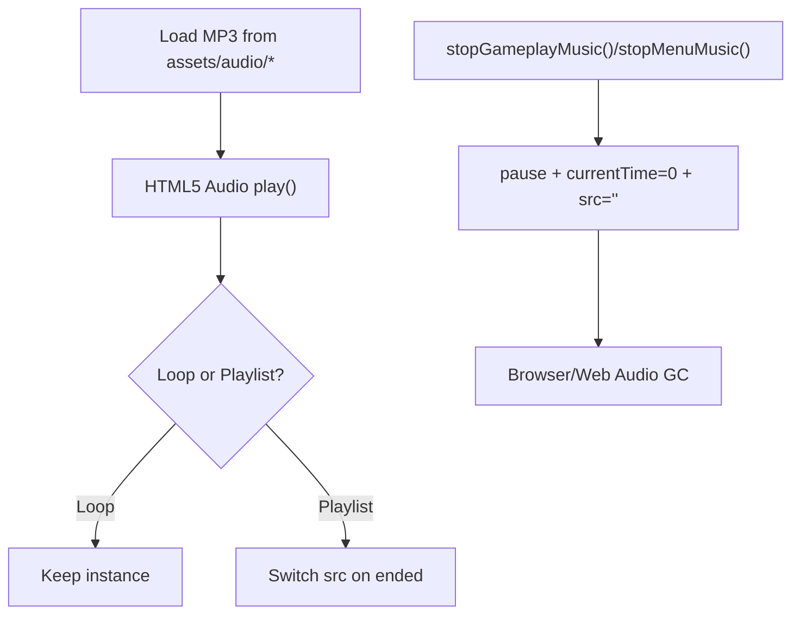
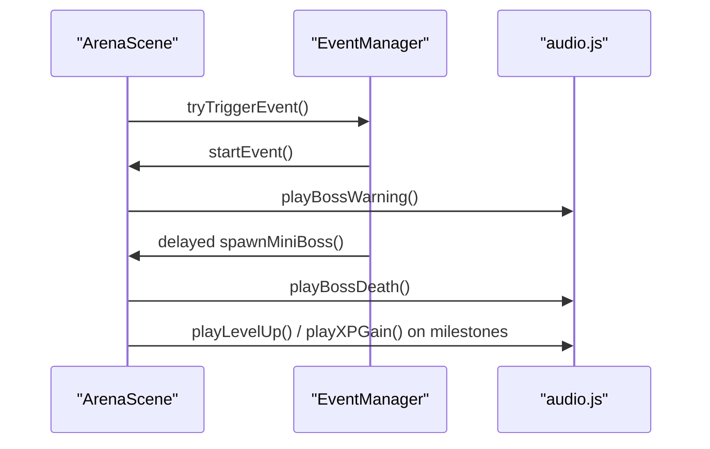
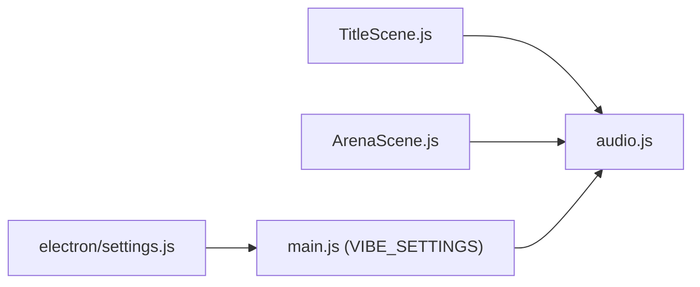

# Audio Management

<cite>
**Referenced Files in This Document**
- [audio.js](file://src/utils/audio.js)
- [main.js](file://src/main.js)
- [TitleScene.js](file://src/scenes/TitleScene.js)
- [ArenaScene.js](file://src/scenes/ArenaScene.js)
- [EventManager.js](file://src/systems/EventManager.js)
- [device.js](file://src/utils/device.js)
- [settings.js](file://electron/settings.js)
</cite>

## Table of Contents
1. [Introduction](#introduction)
2. [Project Structure](#project-structure)
3. [Core Components](#core-components)
4. [Architecture Overview](#architecture-overview)
5. [Detailed Component Analysis](#detailed-component-analysis)
6. [Dependency Analysis](#dependency-analysis)
7. [Performance Considerations](#performance-considerations)
8. [Troubleshooting Guide](#troubleshooting-guide)
9. [Conclusion](#conclusion)

## Introduction
This document explains the audio management system in Vibe-Coder. It covers the procedural sound effects architecture, the HTML5 Audio-based music system, volume control per channel, seamless track transitions, configuration of master, SFX, and music volumes, asset loading and caching, memory management, integration with game events, and platform-specific considerations for mobile and battery optimization.

## Project Structure
The audio system is implemented as a single module that exposes initialization, playback, and volume control functions. Game scenes initialize and control audio based on user interactions and game state.

**Diagram sources**
- [audio.js](file://src/utils/audio.js#L1-L560)
- [main.js](file://src/main.js#L232-L317)
- [TitleScene.js](file://src/scenes/TitleScene.js#L39-L60)
- [ArenaScene.js](file://src/scenes/ArenaScene.js#L444-L463)
- [EventManager.js](file://src/systems/EventManager.js#L1-L200)
- [settings.js](file://electron/settings.js#L1-L50)

**Section sources**
- [audio.js](file://src/utils/audio.js#L1-L560)
- [main.js](file://src/main.js#L232-L317)
- [TitleScene.js](file://src/scenes/TitleScene.js#L39-L60)
- [ArenaScene.js](file://src/scenes/ArenaScene.js#L444-L463)
- [EventManager.js](file://src/systems/EventManager.js#L1-L200)
- [settings.js](file://electron/settings.js#L1-L50)

## Core Components
- Audio initialization and context lifecycle
- Procedural sound effects via Web Audio API
- HTML5 Audio for menu and gameplay music
- Per-channel volume control (master, music, SFX)
- Seamless music track cycling
- Settings integration for persistence and effective volumes

**Section sources**
- [audio.js](file://src/utils/audio.js#L16-L43)
- [audio.js](file://src/utils/audio.js#L48-L393)
- [audio.js](file://src/utils/audio.js#L397-L559)
- [main.js](file://src/main.js#L232-L317)

## Architecture Overview
The audio system separates concerns into:
- Web Audio API for procedural SFX routed through a dedicated SFX gain node
- HTML5 Audio for menu and gameplay tracks routed through a music gain node
- A master gain node controlling global output
- Settings-driven effective volumes and toggles

**Diagram sources**
- [audio.js](file://src/utils/audio.js#L16-L36)
- [audio.js](file://src/utils/audio.js#L397-L559)

## Detailed Component Analysis

### Audio Initialization and Lifecycle
- Initializes the Web Audio Context on first user interaction
- Creates master, music, and SFX gain nodes
- Resumes the context if suspended
- Tracks whether music is playing to avoid redundant operations

**Diagram sources**
- [TitleScene.js](file://src/scenes/TitleScene.js#L444-L453)
- [ArenaScene.js](file://src/scenes/ArenaScene.js#L444-L453)
- [audio.js](file://src/utils/audio.js#L16-L43)

**Section sources**
- [audio.js](file://src/utils/audio.js#L16-L43)
- [TitleScene.js](file://src/scenes/TitleScene.js#L444-L453)
- [ArenaScene.js](file://src/scenes/ArenaScene.js#L444-L453)

### Sound Effects Architecture (Procedural SFX)
- Uses oscillators, noise buffers, filters, and gain envelopes
- Each SFX is short-lived and stops itself after its duration
- All SFX route through the SFX gain node

**Diagram sources**
- [audio.js](file://src/utils/audio.js#L48-L67)
- [audio.js](file://src/utils/audio.js#L70-L89)
- [audio.js](file://src/utils/audio.js#L92-L122)

**Section sources**
- [audio.js](file://src/utils/audio.js#L48-L122)
- [audio.js](file://src/utils/audio.js#L125-L159)
- [audio.js](file://src/utils/audio.js#L162-L182)
- [audio.js](file://src/utils/audio.js#L185-L209)
- [audio.js](file://src/utils/audio.js#L212-L232)
- [audio.js](file://src/utils/audio.js#L235-L266)
- [audio.js](file://src/utils/audio.js#L269-L288)
- [audio.js](file://src/utils/audio.js#L291-L315)
- [audio.js](file://src/utils/audio.js#L318-L341)
- [audio.js](file://src/utils/audio.js#L344-L370)
- [audio.js](file://src/utils/audio.js#L373-L393)

### Music System (Menu and Gameplay)
- Menu music: HTML5 Audio looping track
- Gameplay music: HTML5 Audio cycling through a playlist on “ended”
- Per-mode volume updates respect effective volumes from settings
- Toggle and stop helpers manage lifecycle

**Diagram sources**
- [audio.js](file://src/utils/audio.js#L428-L443)
- [audio.js](file://src/utils/audio.js#L464-L486)
- [audio.js](file://src/utils/audio.js#L455-L462)
- [TitleScene.js](file://src/scenes/TitleScene.js#L44-L48)
- [ArenaScene.js](file://src/scenes/ArenaScene.js#L451-L453)

**Section sources**
- [audio.js](file://src/utils/audio.js#L397-L426)
- [audio.js](file://src/utils/audio.js#L428-L453)
- [audio.js](file://src/utils/audio.js#L464-L486)
- [TitleScene.js](file://src/scenes/TitleScene.js#L44-L48)
- [ArenaScene.js](file://src/scenes/ArenaScene.js#L451-L453)

### Volume Control and Configuration
- Master volume affects all outputs
- SFX and music gains provide per-category control
- Effective volumes are computed from master plus category-specific sliders
- Settings are persisted in localStorage and Electron store

**Diagram sources**
- [main.js](file://src/main.js#L232-L317)
- [audio.js](file://src/utils/audio.js#L549-L559)
- [TitleScene.js](file://src/scenes/TitleScene.js#L2438-L2442)
- [settings.js](file://electron/settings.js#L16-L22)

**Section sources**
- [main.js](file://src/main.js#L232-L317)
- [audio.js](file://src/utils/audio.js#L549-L559)
- [TitleScene.js](file://src/scenes/TitleScene.js#L2438-L2442)
- [settings.js](file://electron/settings.js#L16-L22)

### Asset Loading, Caching, and Memory Management
- Assets are served from the public assets directory and referenced via relative paths
- HTML5 Audio instances are reused and reset on mode changes
- Stopping music clears the source and pauses to free resources
- Timeout arrays are cleared when stopping gameplay music

**Diagram sources**
- [audio.js](file://src/utils/audio.js#L397-L402)
- [audio.js](file://src/utils/audio.js#L428-L453)
- [audio.js](file://src/utils/audio.js#L464-L499)

**Section sources**
- [audio.js](file://src/utils/audio.js#L397-L402)
- [audio.js](file://src/utils/audio.js#L428-L453)
- [audio.js](file://src/utils/audio.js#L464-L499)

### Integration with Game Events and Feedback
- SFX are triggered on actions such as XP gain, level up, weapon pickup, evolution, boss warnings, and boss death
- Music responds to scene transitions and user input
- Event manager announces events visually; audio cues (warning rumble, boss spawn flash) complement the HUD

**Diagram sources**
- [ArenaScene.js](file://src/scenes/ArenaScene.js#L444-L463)
- [EventManager.js](file://src/systems/EventManager.js#L103-L128)
- [audio.js](file://src/utils/audio.js#L318-L341)
- [audio.js](file://src/utils/audio.js#L125-L159)
- [audio.js](file://src/utils/audio.js#L185-L209)
- [audio.js](file://src/utils/audio.js#L269-L288)

**Section sources**
- [ArenaScene.js](file://src/scenes/ArenaScene.js#L444-L463)
- [EventManager.js](file://src/systems/EventManager.js#L103-L128)
- [audio.js](file://src/utils/audio.js#L318-L341)
- [audio.js](file://src/utils/audio.js#L125-L159)
- [audio.js](file://src/utils/audio.js#L185-L209)
- [audio.js](file://src/utils/audio.js#L269-L288)

## Dependency Analysis
- TitleScene and ArenaScene depend on audio.js for initialization, music, and SFX
- VIBE_SETTINGS in main.js computes effective volumes and persists user preferences
- Electron settings store provides desktop defaults and persistence

**Diagram sources**
- [TitleScene.js](file://src/scenes/TitleScene.js#L2-L3)
- [ArenaScene.js](file://src/scenes/ArenaScene.js#L2-L3)
- [audio.js](file://src/utils/audio.js#L1-L560)
- [main.js](file://src/main.js#L232-L317)
- [settings.js](file://electron/settings.js#L1-L50)

**Section sources**
- [TitleScene.js](file://src/scenes/TitleScene.js#L2-L3)
- [ArenaScene.js](file://src/scenes/ArenaScene.js#L2-L3)
- [audio.js](file://src/utils/audio.js#L1-L560)
- [main.js](file://src/main.js#L232-L317)
- [settings.js](file://electron/settings.js#L1-L50)

## Performance Considerations
- Web Audio API nodes are short-lived; oscillators and buffer sources are created per SFX and stop themselves, minimizing long-lived node accumulation
- HTML5 Audio instances are reused and reset on mode changes to reduce overhead
- Music transitions rely on the “ended” event to cycle tracks, avoiding gaps and redundant players
- Avoid autoplay by initializing audio on first user interaction to comply with browser policies

[No sources needed since this section provides general guidance]

## Troubleshooting Guide
- Audio does not play on first interaction: ensure initAudio and resumeAudio are called after user input
- Music does not toggle: verify musicEnabled setting and toggle logic in the scenes
- SFX disabled: confirm sfxEnabled and that effective SFX volume is non-zero
- Desktop defaults missing: check Electron settings store defaults and persistence

**Section sources**
- [audio.js](file://src/utils/audio.js#L16-L43)
- [audio.js](file://src/utils/audio.js#L521-L539)
- [main.js](file://src/main.js#L232-L317)
- [settings.js](file://electron/settings.js#L16-L22)

## Conclusion
Vibe-Coder’s audio system cleanly separates procedural SFX and HTML5 Audio tracks, routes them through dedicated gain nodes, and integrates tightly with settings and game scenes. The design supports responsive initialization, seamless transitions, and clear volume control, while remaining mindful of browser autoplay policies and resource cleanup.