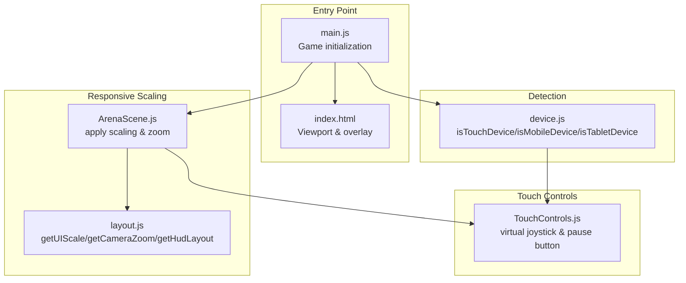
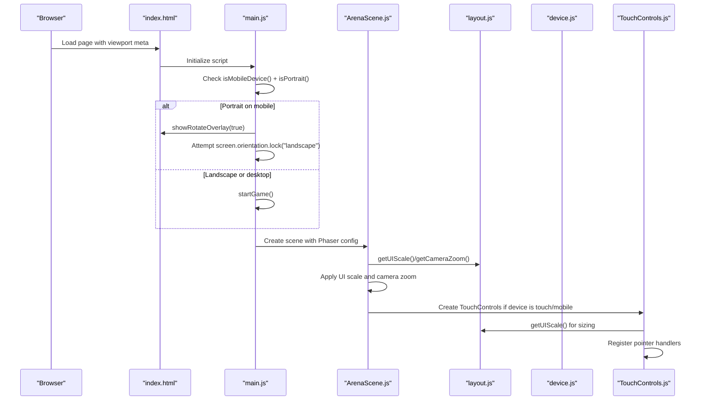
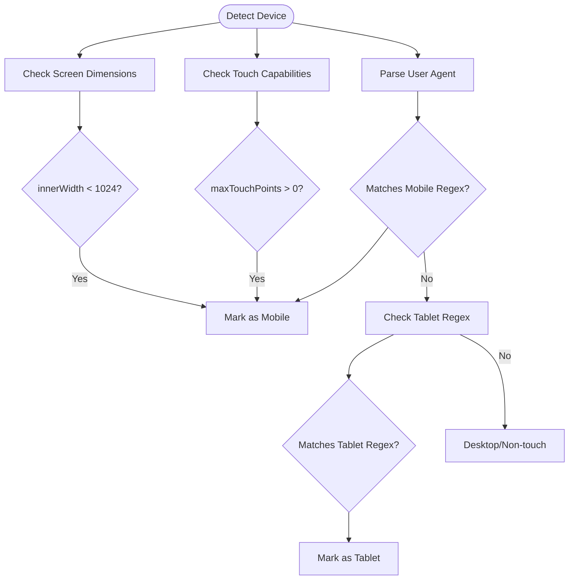
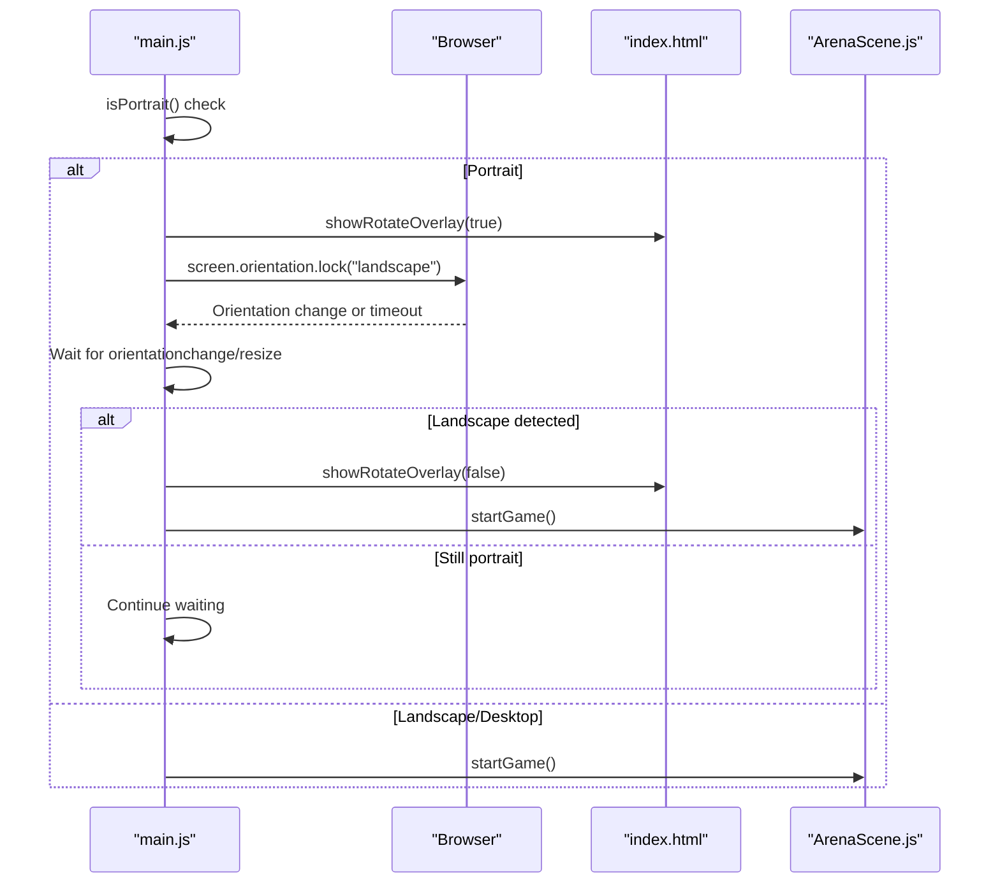
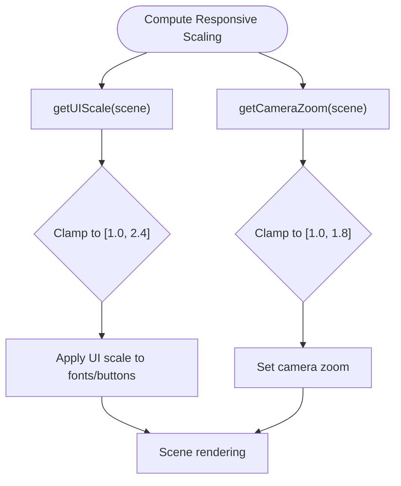
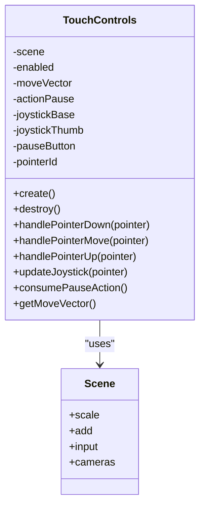
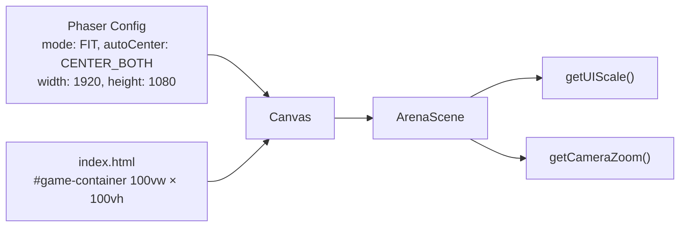
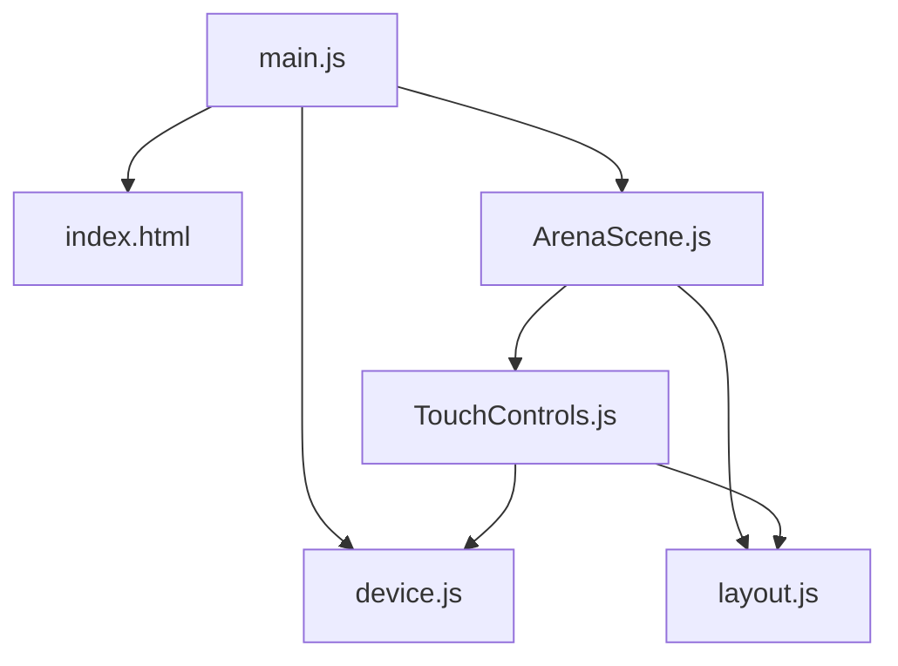

# Device Detection and Responsive Design

<cite>
**Referenced Files in This Document**
- [device.js](file://src/utils/device.js)
- [layout.js](file://src/utils/layout.js)
- [main.js](file://src/main.js)
- [TouchControls.js](file://src/systems/TouchControls.js)
- [index.html](file://index.html)
- [ArenaScene.js](file://src/scenes/ArenaScene.js)
</cite>

## Table of Contents
1. [Introduction](#introduction)
2. [Project Structure](#project-structure)
3. [Core Components](#core-components)
4. [Architecture Overview](#architecture-overview)
5. [Detailed Component Analysis](#detailed-component-analysis)
6. [Dependency Analysis](#dependency-analysis)
7. [Performance Considerations](#performance-considerations)
8. [Troubleshooting Guide](#troubleshooting-guide)
9. [Conclusion](#conclusion)

## Introduction
This document explains the device detection and responsive design system used to adapt the game to various devices and screen configurations. It covers:
- Mobile and desktop detection using user agent strings, touch capabilities, and screen dimensions
- Orientation handling with landscape enforcement and rotation overlay for portrait devices
- Responsive scaling calculations to maintain a 16:9 aspect ratio
- Touch controls implementation and gesture recognition for mobile platforms
- Integration with Phaser's scaling system and viewport management
- Performance optimization strategies and battery life considerations

## Project Structure
The responsive design system spans several modules:
- Device detection utilities for identifying touch/mobile/tablet capabilities
- Layout utilities for UI scaling and camera zoom
- Main entry point orchestrating orientation checks and game initialization
- Touch controls system for mobile input
- HTML container and CSS for viewport and overlay management
- Scene integration for applying responsive scaling and camera zoom

**Diagram sources**
- [main.js](file://src/main.js#L403-L446)
- [index.html](file://index.html#L5-L107)
- [device.js](file://src/utils/device.js#L5-L23)
- [layout.js](file://src/utils/layout.js#L10-L38)
- [ArenaScene.js](file://src/scenes/ArenaScene.js#L288-L470)
- [TouchControls.js](file://src/systems/TouchControls.js#L9-L82)

**Section sources**
- [device.js](file://src/utils/device.js#L1-L25)
- [layout.js](file://src/utils/layout.js#L1-L108)
- [main.js](file://src/main.js#L15-L464)
- [index.html](file://index.html#L1-L108)
- [ArenaScene.js](file://src/scenes/ArenaScene.js#L288-L470)
- [TouchControls.js](file://src/systems/TouchControls.js#L1-L157)

## Core Components
- Device detection: Determines whether the platform is touch-enabled, mobile, or tablet using user agent strings and touch capabilities.
- Orientation handler: Detects portrait mode on mobile and displays a rotation overlay, optionally locking the screen to landscape.
- Responsive scaling: Computes UI scale based on logical game height and applies camera zoom to prevent tiny rendering on small viewports.
- Touch controls: Implements a virtual joystick and pause button for mobile devices with pointer-based gesture handling.
- Phaser integration: Uses Phaser's FIT + CENTER_BOTH scaling mode with a 16:9 logical resolution to maintain crisp visuals across resolutions.

**Section sources**
- [device.js](file://src/utils/device.js#L5-L23)
- [main.js](file://src/main.js#L403-L446)
- [layout.js](file://src/utils/layout.js#L10-L38)
- [TouchControls.js](file://src/systems/TouchControls.js#L9-L157)
- [ArenaScene.js](file://src/scenes/ArenaScene.js#L304-L317)

## Architecture Overview
The responsive design pipeline integrates detection, scaling, and input handling:

**Diagram sources**
- [index.html](file://index.html#L5-L107)
- [main.js](file://src/main.js#L403-L446)
- [ArenaScene.js](file://src/scenes/ArenaScene.js#L288-L470)
- [layout.js](file://src/utils/layout.js#L10-L38)
- [device.js](file://src/utils/device.js#L5-L23)
- [TouchControls.js](file://src/systems/TouchControls.js#L9-L82)

## Detailed Component Analysis

### Device Detection Logic
The system identifies devices using:
- Touch capability detection via global touch events and max touch points
- User agent parsing for mobile and tablet patterns
- Screen dimension heuristics for narrow widths

**Diagram sources**
- [device.js](file://src/utils/device.js#L5-L23)
- [main.js](file://src/main.js#L403-L409)

**Section sources**
- [device.js](file://src/utils/device.js#L5-L23)
- [main.js](file://src/main.js#L403-L409)

### Orientation Handling and Rotation Overlay
On mobile devices, the system:
- Detects portrait mode by comparing innerHeight and innerWidth
- Shows a persistent overlay instructing users to rotate to landscape
- Attempts to lock the screen orientation to landscape
- Starts the game only when orientation is landscape or when not on mobile

**Diagram sources**
- [main.js](file://src/main.js#L411-L446)
- [index.html](file://index.html#L65-L94)

**Section sources**
- [main.js](file://src/main.js#L411-L446)
- [index.html](file://index.html#L65-L94)

### Responsive Scaling Calculations
The system maintains a 16:9 logical resolution while adapting to different screen sizes:
- Logical resolution: 1920×1080 (16:9)
- Phaser scale mode: FIT + CENTER_BOTH
- UI scale: Derived from logical height clamped between 1.0 and 2.4
- Camera zoom: Adjusts to prevent tiny rendering on small viewports

**Diagram sources**
- [layout.js](file://src/utils/layout.js#L10-L38)
- [ArenaScene.js](file://src/scenes/ArenaScene.js#L304-L317)

**Section sources**
- [layout.js](file://src/utils/layout.js#L10-L38)
- [ArenaScene.js](file://src/scenes/ArenaScene.js#L304-L317)

### Touch Controls Implementation and Gesture Recognition
The touch controls system provides:
- Virtual joystick in the lower-left corner with a base and thumb
- Pause button in the lower-right corner
- Pointer-based movement vector calculation
- Pause action consumption

**Diagram sources**
- [TouchControls.js](file://src/systems/TouchControls.js#L9-L157)

**Section sources**
- [TouchControls.js](file://src/systems/TouchControls.js#L9-L157)
- [device.js](file://src/utils/device.js#L5-L23)
- [layout.js](file://src/utils/layout.js#L10-L13)

### Integration with Phaser's Scaling System and Viewport Management
Phaser configuration:
- Scale mode: FIT with auto-centering
- Logical resolution: 1920×1080 (16:9)
- Pixel art and anti-aliasing tuned for crisp visuals
- Container: Fixed-positioned div filling the viewport

**Diagram sources**
- [main.js](file://src/main.js#L15-L37)
- [index.html](file://index.html#L46-L64)
- [ArenaScene.js](file://src/scenes/ArenaScene.js#L304-L317)

**Section sources**
- [main.js](file://src/main.js#L15-L37)
- [index.html](file://index.html#L46-L64)
- [ArenaScene.js](file://src/scenes/ArenaScene.js#L304-L317)

## Dependency Analysis
The responsive design system exhibits low coupling and clear separation of concerns:
- Device detection is reused by both the main entry and touch controls
- Layout utilities are consumed by scenes and touch controls
- Orientation handling is centralized in the main entry
- Phaser scaling is configured once and applied consistently

**Diagram sources**
- [main.js](file://src/main.js#L403-L446)
- [device.js](file://src/utils/device.js#L5-L23)
- [layout.js](file://src/utils/layout.js#L10-L38)
- [TouchControls.js](file://src/systems/TouchControls.js#L9-L82)
- [ArenaScene.js](file://src/scenes/ArenaScene.js#L288-L470)
- [index.html](file://index.html#L5-L107)

**Section sources**
- [main.js](file://src/main.js#L403-L446)
- [device.js](file://src/utils/device.js#L5-L23)
- [layout.js](file://src/utils/layout.js#L10-L38)
- [TouchControls.js](file://src/systems/TouchControls.js#L9-L82)
- [ArenaScene.js](file://src/scenes/ArenaScene.js#L288-L470)
- [index.html](file://index.html#L5-L107)

## Performance Considerations
- Camera zoom clamp prevents excessive magnification on small screens, reducing unnecessary rendering overhead.
- UI scale clamp ensures readable text without excessive scaling that could impact performance on low-end devices.
- Touch controls use pointer hit-testing with distance checks to minimize layout thrashing.
- Phaser's pixelArt and anti-aliasing settings balance crispness with performance.
- Battery life considerations:
  - Avoid heavy particle effects on low-end devices by keeping the number of animated elements reasonable.
  - Prefer simpler visual effects on mobile devices to reduce GPU load.
  - Disable or reduce non-essential audio on battery-constrained devices.
  - Use orientation lock to prevent accidental reflows caused by frequent orientation changes.

[No sources needed since this section provides general guidance]

## Troubleshooting Guide
Common issues and resolutions:
- Landscape overlay persists after rotation:
  - Verify orientationchange and resize listeners are attached and removed properly.
  - Ensure the overlay element exists and toggles correctly.
- Touch controls not appearing:
  - Confirm device detection returns true for touch/mobile.
  - Check that UI scale is computed and applied before creating controls.
- Camera appears too small or too large:
  - Validate getCameraZoom returns a value within the expected clamp range.
  - Confirm display height is correctly measured from the canvas or window.
- Orientation lock fails:
  - Some browsers restrict orientation locks; handle exceptions gracefully and continue gameplay.

**Section sources**
- [main.js](file://src/main.js#L411-L446)
- [index.html](file://index.html#L65-L94)
- [layout.js](file://src/utils/layout.js#L26-L38)
- [TouchControls.js](file://src/systems/TouchControls.js#L9-L82)

## Conclusion
The responsive design system combines robust device detection, orientation handling, and scalable UI/camera logic to deliver a consistent experience across desktop and mobile platforms. By leveraging Phaser's scaling configuration and modular utilities, the game maintains crisp visuals and intuitive controls while optimizing for performance and battery life on diverse hardware.