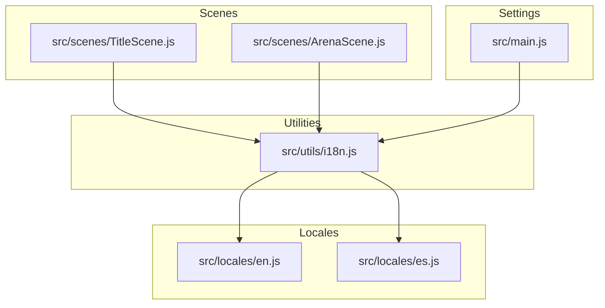
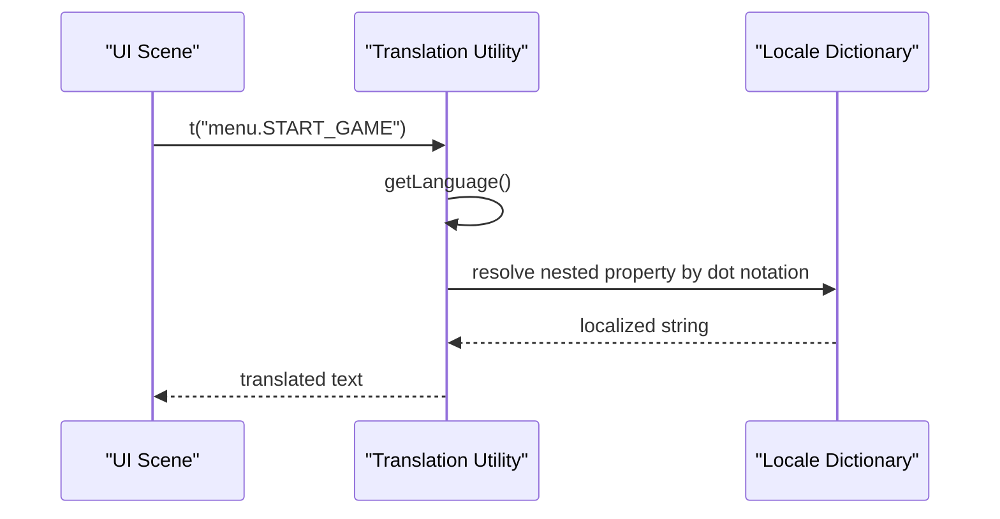
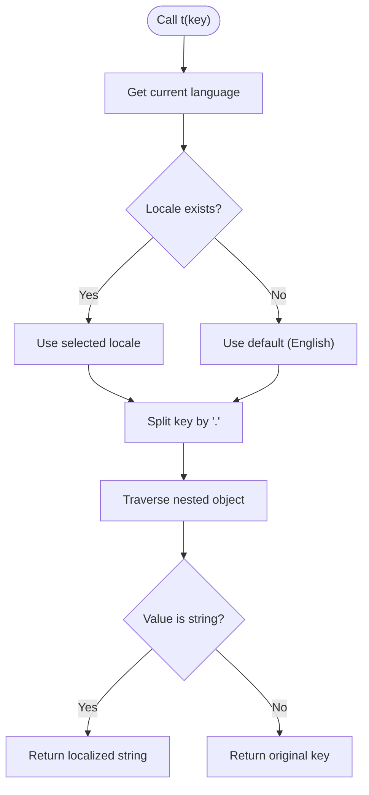
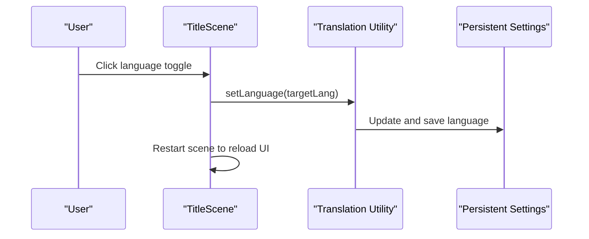
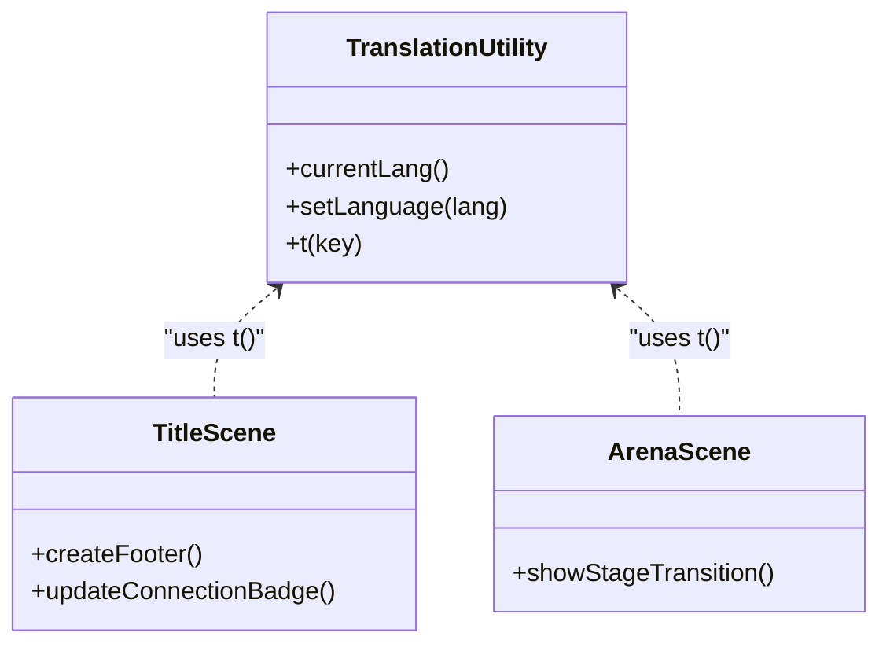
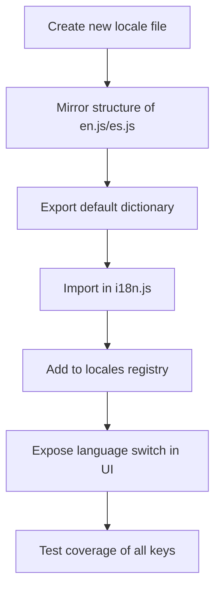
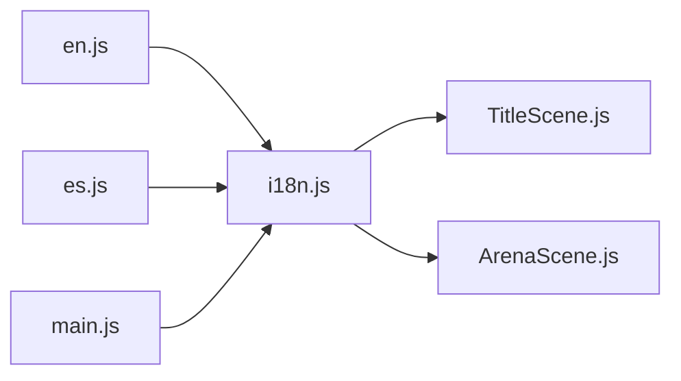

# Internationalization (i18n)

<cite>
**Referenced Files in This Document**
- [i18n.js](file://src/utils/i18n.js)
- [en.js](file://src/locales/en.js)
- [es.js](file://src/locales/es.js)
- [TitleScene.js](file://src/scenes/TitleScene.js)
- [ArenaScene.js](file://src/scenes/ArenaScene.js)
- [main.js](file://src/main.js)
- [index.html](file://public/docs/index.html)
</cite>

## Table of Contents
1. [Introduction](#introduction)
2. [Project Structure](#project-structure)
3. [Core Components](#core-components)
4. [Architecture Overview](#architecture-overview)
5. [Detailed Component Analysis](#detailed-component-analysis)
6. [Dependency Analysis](#dependency-analysis)
7. [Performance Considerations](#performance-considerations)
8. [Troubleshooting Guide](#troubleshooting-guide)
9. [Conclusion](#conclusion)

## Introduction
This document explains the internationalization (i18n) system used by the application to support English and Spanish. It covers the locale data structure, translation lookup mechanism, language switching, dynamic loading behavior, integration with UI elements, real-time text updates, and the fallback system for missing translations. It also documents how to extend the system to support additional languages and outlines error handling for malformed locale files.

## Project Structure
The i18n system is organized around a small utility module that imports locale dictionaries and exposes translation functions. UI scenes consume these translations to render localized text. Settings persistence integrates with the i18n system to maintain the selected language across sessions.

**Diagram sources**
- [i18n.js](file://src/utils/i18n.js#L1-L45)
- [en.js](file://src/locales/en.js#L1-L319)
- [es.js](file://src/locales/es.js#L1-L317)
- [TitleScene.js](file://src/scenes/TitleScene.js#L1-L120)
- [ArenaScene.js](file://src/scenes/ArenaScene.js#L1-L120)
- [main.js](file://src/main.js#L232-L320)

**Section sources**
- [i18n.js](file://src/utils/i18n.js#L1-L45)
- [en.js](file://src/locales/en.js#L1-L319)
- [es.js](file://src/locales/es.js#L1-L317)
- [TitleScene.js](file://src/scenes/TitleScene.js#L1-L120)
- [ArenaScene.js](file://src/scenes/ArenaScene.js#L1-L120)
- [main.js](file://src/main.js#L232-L320)

## Core Components
- Translation utility: Provides functions to translate keys, get the current language, and set the language.
- Locale dictionaries: English and Spanish dictionaries structured as nested objects with dot-notation keys.
- UI integration: Scenes and UI components use the translation utility to render localized text.
- Settings integration: Language preference is stored in persistent settings and synchronized with the translation utility.

Key responsibilities:
- t(key): Resolves a translation by traversing nested locale objects using dot notation.
- currentLang(): Returns the currently active language code.
- setLanguage(lang): Updates the language setting and persists it.

**Section sources**
- [i18n.js](file://src/utils/i18n.js#L1-L45)
- [en.js](file://src/locales/en.js#L1-L319)
- [es.js](file://src/locales/es.js#L1-L317)
- [TitleScene.js](file://src/scenes/TitleScene.js#L540-L560)
- [main.js](file://src/main.js#L232-L320)

## Architecture Overview
The i18n architecture follows a simple, centralized design:
- The translation utility imports locale dictionaries and exposes a single translation function.
- UI code calls the translation function with dot-notation keys to retrieve localized strings.
- Language switching updates a shared settings object, which persists the choice and triggers UI refresh.

**Diagram sources**
- [i18n.js](file://src/utils/i18n.js#L10-L42)
- [en.js](file://src/locales/en.js#L9-L21)
- [es.js](file://src/locales/es.js#L8-L20)

## Detailed Component Analysis

### Translation Utility
The translation utility encapsulates:
- Locale registry: Maintains references to supported locales.
- Language resolution: Reads the language from global settings with a fallback to English.
- Translation lookup: Splits dot-notation keys and traverses the locale object.
- Fallback behavior: Returns the key itself if the resolved value is not a string.

**Diagram sources**
- [i18n.js](file://src/utils/i18n.js#L10-L42)

**Section sources**
- [i18n.js](file://src/utils/i18n.js#L1-L45)

### Locale Data Structure
Each locale is a hierarchical object with categorized keys:
- Titles and subtitles
- Menus and navigation
- Documentation and credits
- Settings and prompts
- Gameplay messages and HUD labels
- Events, stages, and bosses

Dot notation keys enable precise lookup:
- Example: "menu.START_GAME" resolves to the localized menu item.
- Nested categories: "settings.LANGUAGE" selects the language label.

The English and Spanish dictionaries mirror the same structure, enabling consistent key resolution across languages.

**Section sources**
- [en.js](file://src/locales/en.js#L1-L319)
- [es.js](file://src/locales/es.js#L1-L317)

### Language Switching Mechanism
Language switching is coordinated through:
- UI trigger: A language toggle button in the title scene.
- Setting update: Calls the translation utility to set the new language.
- Persistence: Saves the updated language to persistent settings.
- UI refresh: Restarts the scene to re-render with the new language.

**Diagram sources**
- [TitleScene.js](file://src/scenes/TitleScene.js#L540-L560)
- [i18n.js](file://src/utils/i18n.js#L19-L26)
- [main.js](file://src/main.js#L266-L280)

**Section sources**
- [TitleScene.js](file://src/scenes/TitleScene.js#L540-L560)
- [i18n.js](file://src/utils/i18n.js#L19-L26)
- [main.js](file://src/main.js#L266-L280)

### Dynamic Loading Behavior
- The translation utility imports locale modules statically at initialization.
- There is no runtime dynamic import of locale files; locales are bundled with the application.
- Language switching does not require reloading locale files; the in-memory dictionaries are used directly.

**Section sources**
- [i18n.js](file://src/utils/i18n.js#L5-L6)

### Integration with UI Elements
- Title scene: Uses translations for title, subtitle, menu items, prompts, and footer labels.
- Arena scene: Uses translations for stage announcements and HUD labels.
- Settings integration: The language toggle updates persistent settings and triggers a scene restart.

**Diagram sources**
- [i18n.js](file://src/utils/i18n.js#L15-L42)
- [TitleScene.js](file://src/scenes/TitleScene.js#L460-L565)
- [ArenaScene.js](file://src/scenes/ArenaScene.js#L690-L720)

**Section sources**
- [TitleScene.js](file://src/scenes/TitleScene.js#L266-L302)
- [TitleScene.js](file://src/scenes/TitleScene.js#L352-L378)
- [TitleScene.js](file://src/scenes/TitleScene.js#L460-L565)
- [ArenaScene.js](file://src/scenes/ArenaScene.js#L690-L720)

### Real-Time Text Updates
- Language switching updates the global settings and persists the change.
- The title scene restarts to rebuild UI elements with the new language.
- Translations are applied immediately upon scene recreation.

**Section sources**
- [TitleScene.js](file://src/scenes/TitleScene.js#L540-L560)
- [i18n.js](file://src/utils/i18n.js#L19-L26)

### Date/Time Formatting, Number Formatting, and Cultural Adaptations
- The i18n system does not implement date/time or number formatting.
- Currency and numeric displays in the UI rely on simple string concatenation and integer values.
- Cultural adaptations are handled through textual translations and layout adjustments in scenes.

**Section sources**
- [TitleScene.js](file://src/scenes/TitleScene.js#L464-L478)
- [TitleScene.js](file://src/scenes/TitleScene.js#L540-L560)

### Translation Workflow and Adding New Languages
To add a new language:
1. Create a new locale dictionary file mirroring the structure of existing dictionaries.
2. Export the dictionary as the default export.
3. Import the new locale in the translation utility and add it to the locales registry.
4. Extend UI components to expose a language switch option.
5. Ensure the new dictionary covers all required keys used by the application.

**Diagram sources**
- [i18n.js](file://src/utils/i18n.js#L5-L8)
- [en.js](file://src/locales/en.js#L1-L5)
- [es.js](file://src/locales/es.js#L1-L5)

**Section sources**
- [i18n.js](file://src/utils/i18n.js#L5-L8)
- [en.js](file://src/locales/en.js#L1-L5)
- [es.js](file://src/locales/es.js#L1-L5)

### Fallback System and Error Handling
- Fallback language: If the configured language is unsupported, the system falls back to English.
- Fallback text: If a translation key is missing or resolves to a non-string value, the original key is returned.
- Error handling: The system does not throw exceptions for missing keys; it returns the key string to prevent UI crashes.

**Section sources**
- [i18n.js](file://src/utils/i18n.js#L10-L13)
- [i18n.js](file://src/utils/i18n.js#L33-L42)

## Dependency Analysis
The i18n system has minimal dependencies and maintains loose coupling:
- Translation utility depends on locale dictionaries.
- UI scenes depend on the translation utility.
- Settings integration depends on the translation utility for language updates.

**Diagram sources**
- [i18n.js](file://src/utils/i18n.js#L5-L6)
- [en.js](file://src/locales/en.js#L1-L5)
- [es.js](file://src/locales/es.js#L1-L5)
- [TitleScene.js](file://src/scenes/TitleScene.js#L1-L120)
- [ArenaScene.js](file://src/scenes/ArenaScene.js#L1-L120)
- [main.js](file://src/main.js#L232-L320)

**Section sources**
- [i18n.js](file://src/utils/i18n.js#L5-L6)
- [TitleScene.js](file://src/scenes/TitleScene.js#L1-L120)
- [ArenaScene.js](file://src/scenes/ArenaScene.js#L1-L120)
- [main.js](file://src/main.js#L232-L320)

## Performance Considerations
- Static imports: Locales are imported statically, avoiding runtime parsing overhead.
- Lookup complexity: Dot-notation traversal is linear in the number of key segments; typical keys have short paths.
- Memory footprint: Locale dictionaries are held in memory; adding new languages increases memory usage proportionally.
- UI refresh: Restarting scenes on language change incurs minor overhead but ensures consistent rendering.

## Troubleshooting Guide
Common issues and resolutions:
- Missing translation key: The system returns the key string. Verify the key exists in the appropriate locale dictionary.
- Unsupported language setting: The system falls back to English. Ensure the language code matches a registered locale.
- UI not updating after language change: Confirm the scene restarts after setting the language and that the settings are persisted.

**Section sources**
- [i18n.js](file://src/utils/i18n.js#L10-L13)
- [i18n.js](file://src/utils/i18n.js#L33-L42)
- [TitleScene.js](file://src/scenes/TitleScene.js#L540-L560)

## Conclusion
The i18n system provides a straightforward, maintainable foundation for English and Spanish localization. It leverages static imports, dot-notation keys, and a simple fallback strategy to deliver consistent translations across UI elements. Extending the system to additional languages requires mirroring the locale structure and integrating with the settings and UI components. The current design prioritizes simplicity and reliability, with room for future enhancements such as pluralization support and cultural formatting if needed.