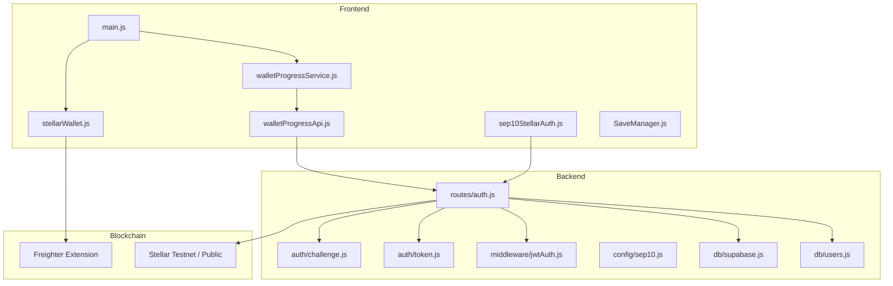
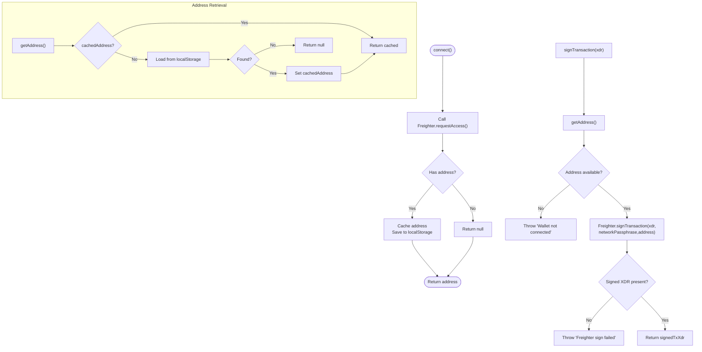
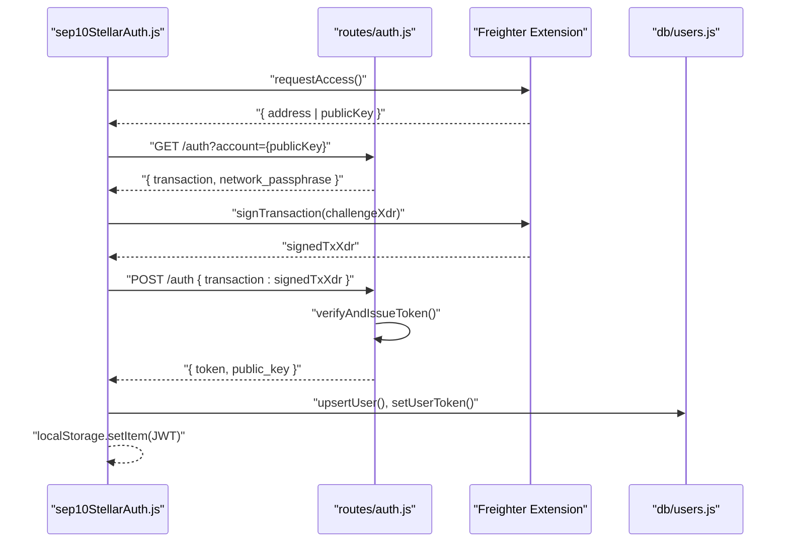
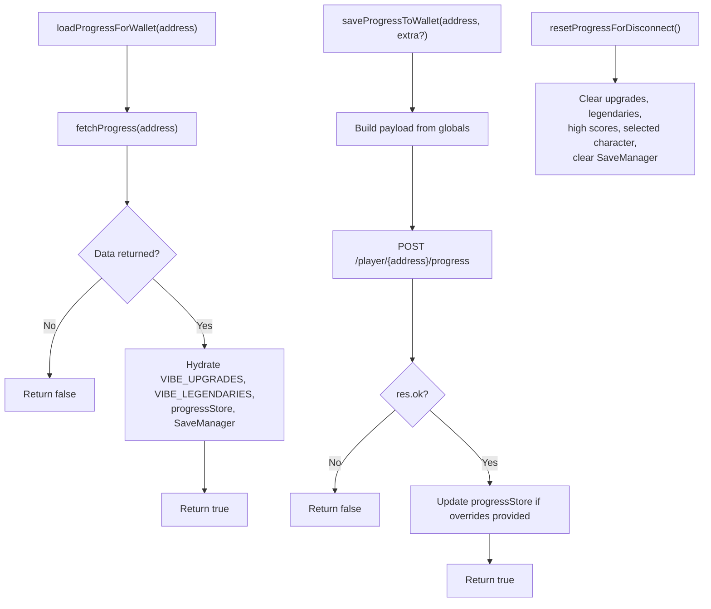
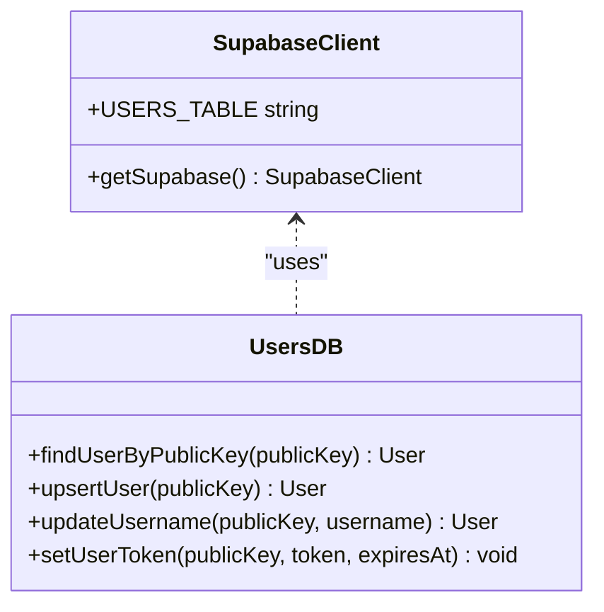
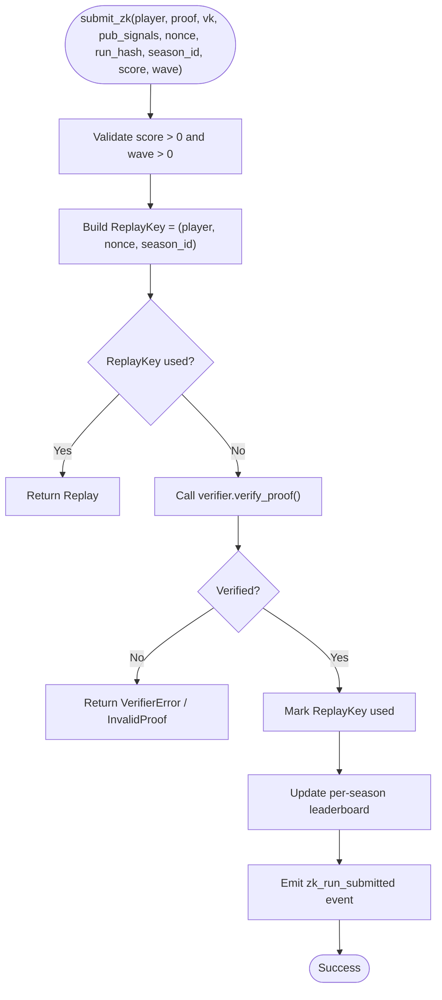
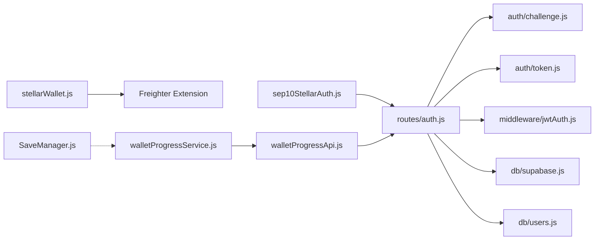
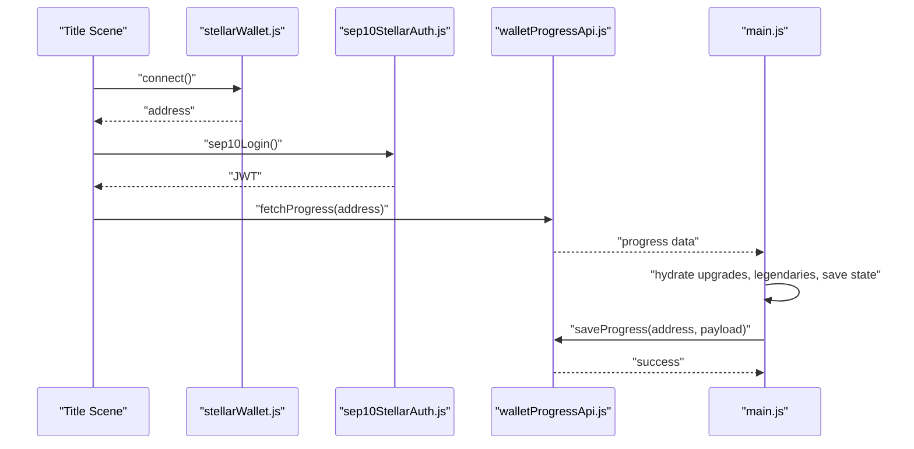

# Stellar Wallet Integration

<cite>
**Referenced Files in This Document**
- [README.md](file://README.md)
- [src/utils/stellarWallet.js](file://src/utils/stellarWallet.js)
- [src/utils/sep10StellarAuth.js](file://src/utils/sep10StellarAuth.js)
- [src/utils/walletProgressService.js](file://src/utils/walletProgressService.js)
- [src/utils/walletProgressApi.js](file://src/utils/walletProgressApi.js)
- [src/systems/SaveManager.js](file://src/systems/SaveManager.js)
- [src/main.js](file://src/main.js)
- [server/routes/auth.js](file://server/routes/auth.js)
- [server/auth/challenge.js](file://server/auth/challenge.js)
- [server/auth/token.js](file://server/auth/token.js)
- [server/middleware/jwtAuth.js](file://server/middleware/jwtAuth.js)
- [server/config/sep10.js](file://server/config/sep10.js)
- [server/db/supabase.js](file://server/db/supabase.js)
- [server/db/users.js](file://server/db/users.js)
- [docs/TECHNICAL_DOCUMENTATION.md](file://docs/TECHNICAL_DOCUMENTATION.md)
- [docs/SEP10_AUTH.md](file://docs/SEP10_AUTH.md)
- [docs/SUPABASE_COSMIC_CODER_SETUP.md](file://docs/SUPABASE_COSMIC_CODER_SETUP.md)
</cite>

## Table of Contents
1. [Introduction](#introduction)
2. [Project Structure](#project-structure)
3. [Core Components](#core-components)
4. [Architecture Overview](#architecture-overview)
5. [Detailed Component Analysis](#detailed-component-analysis)
6. [Dependency Analysis](#dependency-analysis)
7. [Performance Considerations](#performance-considerations)
8. [Troubleshooting Guide](#troubleshooting-guide)
9. [Conclusion](#conclusion)
10. [Appendices](#appendices)

## Introduction
This document explains the Stellar blockchain wallet integration for the game, focusing on Freighter wallet connection, account discovery, and the progress persistence system. It covers how progress is backed by the blockchain (via wallet address), how anti-replay protection is enforced for ranked submissions, and how the frontend integrates with the Supabase-backed backend for user data. Security considerations for private key handling, transaction signing, and network validation are included, along with error handling for wallet disconnections and network failures. The user experience flow from wallet connection to progress synchronization is documented to help both developers and players understand the system.

## Project Structure
The integration spans the frontend and backend:
- Frontend wallet utilities and progress service
- Backend SEP-10 authentication and JWT issuance
- Supabase user storage and optional PostgreSQL fallback
- Game progress persistence and save management



**Diagram sources**
- [src/utils/stellarWallet.js](file://src/utils/stellarWallet.js#L1-L115)
- [src/utils/sep10StellarAuth.js](file://src/utils/sep10StellarAuth.js#L1-L219)
- [src/utils/walletProgressService.js](file://src/utils/walletProgressService.js#L1-L140)
- [src/utils/walletProgressApi.js](file://src/utils/walletProgressApi.js#L1-L46)
- [src/systems/SaveManager.js](file://src/systems/SaveManager.js#L1-L187)
- [src/main.js](file://src/main.js#L1-L464)
- [server/routes/auth.js](file://server/routes/auth.js#L1-L157)
- [server/auth/challenge.js](file://server/auth/challenge.js#L1-L110)
- [server/auth/token.js](file://server/auth/token.js#L1-L124)
- [server/middleware/jwtAuth.js](file://server/middleware/jwtAuth.js#L1-L36)
- [server/config/sep10.js](file://server/config/sep10.js#L1-L87)
- [server/db/supabase.js](file://server/db/supabase.js#L1-L23)
- [server/db/users.js](file://server/db/users.js#L1-L181)

**Section sources**
- [README.md](file://README.md#L1-L158)
- [src/main.js](file://src/main.js#L1-L464)

## Core Components
- Freighter wallet connector: provides connection, address retrieval, signing, and disconnection.
- SEP-10 authentication: challenge generation, transaction signing, token issuance, and protected routes.
- Wallet-backed progress service: loads and saves upgrades, legendaries, high scores, selected character, and save state keyed by wallet address.
- Supabase user storage: persists users, usernames, and JWTs with optional PostgreSQL fallback.
- Save manager: local run persistence with age-based cleanup and wallet-backed restore.

**Section sources**
- [src/utils/stellarWallet.js](file://src/utils/stellarWallet.js#L1-L115)
- [src/utils/sep10StellarAuth.js](file://src/utils/sep10StellarAuth.js#L1-L219)
- [src/utils/walletProgressService.js](file://src/utils/walletProgressService.js#L1-L140)
- [src/utils/walletProgressApi.js](file://src/utils/walletProgressApi.js#L1-L46)
- [src/systems/SaveManager.js](file://src/systems/SaveManager.js#L1-L187)
- [server/db/supabase.js](file://server/db/supabase.js#L1-L23)
- [server/db/users.js](file://server/db/users.js#L1-L181)

## Architecture Overview
The system separates concerns between the frontend and backend:
- Frontend handles wallet connection, transaction signing, and progress persistence.
- Backend enforces SEP-10, issues JWTs, and stores user data.
- Wallet address acts as the key for progress persistence, ensuring blockchain-backed continuity.

```mermaid
sequenceDiagram
participant User as "Player"
participant Title as "Title Scene"
participant Wallet as "stellarWallet.js"
participant Freighter as "Freighter Extension"
participant Auth as "sep10StellarAuth.js"
participant Backend as "routes/auth.js"
participant Supabase as "db/supabase.js"
User->>Title : "Connect Wallet"
Title->>Wallet : "connect()"
Wallet->>Freighter : "requestAccess()"
Freighter-->>Wallet : "address/publicKey"
Wallet-->>Title : "address"
Title->>Auth : "sep10Login()"
Auth->>Backend : "GET /auth?account=..."
Backend-->>Auth : "{ transaction, network_passphrase }"
Auth->>Freighter : "signTransaction(signedChallenge)"
Freighter-->>Auth : "signedTxXdr"
Auth->>Backend : "POST /auth { transaction }"
Backend->>Backend : "verifyAndIssueToken()"
Backend-->>Auth : "{ token, public_key }"
Auth->>Supabase : "upsertUser(), setUserToken()"
Auth-->>Title : "login success"
Title-->>User : "Authenticated"
```

**Diagram sources**
- [src/utils/stellarWallet.js](file://src/utils/stellarWallet.js#L39-L53)
- [src/utils/sep10StellarAuth.js](file://src/utils/sep10StellarAuth.js#L65-L164)
- [server/routes/auth.js](file://server/routes/auth.js#L61-L97)
- [server/auth/challenge.js](file://server/auth/challenge.js#L64-L109)
- [server/auth/token.js](file://server/auth/token.js#L29-L123)
- [server/db/supabase.js](file://server/db/supabase.js#L14-L20)

## Detailed Component Analysis

### Freighter Wallet Connection and Signing
- Availability detection and connection flow.
- Address caching and localStorage persistence.
- Transaction signing with network passphrase and address validation.
- Disconnection clears cache and storage.



**Diagram sources**
- [src/utils/stellarWallet.js](file://src/utils/stellarWallet.js#L26-L114)

**Section sources**
- [src/utils/stellarWallet.js](file://src/utils/stellarWallet.js#L1-L115)

### SEP-10 Authentication Flow
- Detect Freighter availability.
- Obtain public key from Freighter.
- Request challenge from backend with account parameter.
- Sign challenge with Freighter on the correct network passphrase.
- Submit signed transaction to backend to receive JWT.
- Store JWT in localStorage and provide authenticated fetch wrapper.



**Diagram sources**
- [src/utils/sep10StellarAuth.js](file://src/utils/sep10StellarAuth.js#L65-L164)
- [server/routes/auth.js](file://server/routes/auth.js#L61-L97)
- [server/auth/challenge.js](file://server/auth/challenge.js#L64-L109)
- [server/auth/token.js](file://server/auth/token.js#L29-L123)
- [server/db/users.js](file://server/db/users.js#L131-L180)

**Section sources**
- [src/utils/sep10StellarAuth.js](file://src/utils/sep10StellarAuth.js#L1-L219)
- [server/routes/auth.js](file://server/routes/auth.js#L1-L157)
- [server/auth/challenge.js](file://server/auth/challenge.js#L1-L110)
- [server/auth/token.js](file://server/auth/token.js#L1-L124)
- [server/middleware/jwtAuth.js](file://server/middleware/jwtAuth.js#L1-L36)
- [server/config/sep10.js](file://server/config/sep10.js#L1-L87)
- [docs/SEP10_AUTH.md](file://docs/SEP10_AUTH.md#L1-L106)

### Wallet-Backed Progress Persistence
- Progress is keyed by wallet address and includes upgrades, legendaries, high wave/score, selected character, and save state.
- Local caching of progress store and hydration of global game state.
- Save and load via API with robust error handling.
- Reset on disconnect to clear local state.



**Diagram sources**
- [src/utils/walletProgressService.js](file://src/utils/walletProgressService.js#L22-L105)
- [src/utils/walletProgressApi.js](file://src/utils/walletProgressApi.js#L15-L45)
- [src/systems/SaveManager.js](file://src/systems/SaveManager.js#L107-L128)

**Section sources**
- [src/utils/walletProgressService.js](file://src/utils/walletProgressService.js#L1-L140)
- [src/utils/walletProgressApi.js](file://src/utils/walletProgressApi.js#L1-L46)
- [src/systems/SaveManager.js](file://src/systems/SaveManager.js#L1-L187)
- [src/main.js](file://src/main.js#L7-L13)

### Supabase Backend Integration
- Supabase client initialization with URL and keys.
- User persistence with upsert, username updates, and JWT storage.
- Fallback to PostgreSQL or in-memory store if Supabase is unavailable.



**Diagram sources**
- [server/db/supabase.js](file://server/db/supabase.js#L1-L23)
- [server/db/users.js](file://server/db/users.js#L1-L181)

**Section sources**
- [server/db/supabase.js](file://server/db/supabase.js#L1-L23)
- [server/db/users.js](file://server/db/users.js#L1-L181)
- [docs/SUPABASE_COSMIC_CODER_SETUP.md](file://docs/SUPABASE_COSMIC_CODER_SETUP.md#L1-L89)

### Anti-Replay Protection for Ranked Submissions
- Replay protection uses a composite key (player, nonce, season_id) stored on-chain.
- The policy contract enforces uniqueness and prevents double-submission.
- Public inputs bind the nonce to the ZK proof, preventing reuse.



**Diagram sources**
- [docs/TECHNICAL_DOCUMENTATION.md](file://docs/TECHNICAL_DOCUMENTATION.md#L265-L284)

**Section sources**
- [docs/TECHNICAL_DOCUMENTATION.md](file://docs/TECHNICAL_DOCUMENTATION.md#L287-L334)

## Dependency Analysis
- Frontend depends on Freighter for wallet operations and on backend endpoints for authentication and progress persistence.
- Backend depends on SEP-10 configuration, JWT middleware, and user storage.
- Supabase provides primary persistence; PostgreSQL or in-memory fallback is supported.



**Diagram sources**
- [src/utils/stellarWallet.js](file://src/utils/stellarWallet.js#L1-L115)
- [src/utils/sep10StellarAuth.js](file://src/utils/sep10StellarAuth.js#L1-L219)
- [src/utils/walletProgressService.js](file://src/utils/walletProgressService.js#L1-L140)
- [src/utils/walletProgressApi.js](file://src/utils/walletProgressApi.js#L1-L46)
- [src/systems/SaveManager.js](file://src/systems/SaveManager.js#L1-L187)
- [server/routes/auth.js](file://server/routes/auth.js#L1-L157)
- [server/auth/challenge.js](file://server/auth/challenge.js#L1-L110)
- [server/auth/token.js](file://server/auth/token.js#L1-L124)
- [server/middleware/jwtAuth.js](file://server/middleware/jwtAuth.js#L1-L36)
- [server/db/supabase.js](file://server/db/supabase.js#L1-L23)
- [server/db/users.js](file://server/db/users.js#L1-L181)

**Section sources**
- [src/main.js](file://src/main.js#L1-L464)
- [server/config/sep10.js](file://server/config/sep10.js#L1-L87)

## Performance Considerations
- Wallet operations are lightweight; Freighter calls are asynchronous and should be awaited.
- Progress API calls are infrequent and triggered by user actions or game events.
- Local save manager uses localStorage; consider quota limits and cleanup strategies.
- Backend JWT verification and database writes are O(1) operations; ensure proper indexing on public_key.

[No sources needed since this section provides general guidance]

## Troubleshooting Guide
- Freighter not available: prompt user to install the extension; the frontend gracefully handles absence.
- Wallet disconnection: clear cached address and localStorage; reset progress store and save state.
- Network failures: API calls return null/false; retry logic should be implemented at the caller level.
- SEP-10 token issuance failures: verify challenge request/response, signed XDR correctness, and backend configuration (JWT_SECRET, server key).
- Supabase connectivity: fallback to PostgreSQL or in-memory store; check credentials and policies.

**Section sources**
- [src/utils/stellarWallet.js](file://src/utils/stellarWallet.js#L26-L88)
- [src/utils/walletProgressService.js](file://src/utils/walletProgressService.js#L89-L105)
- [src/utils/walletProgressApi.js](file://src/utils/walletProgressApi.js#L15-L45)
- [docs/SEP10_AUTH.md](file://docs/SEP10_AUTH.md#L84-L106)
- [server/db/users.js](file://server/db/users.js#L131-L180)

## Conclusion
The integration leverages Freighter for secure wallet operations and SEP-10 for server-verified authentication. Progress persistence is keyed by wallet address and backed by a dedicated API, while Supabase provides reliable user data storage. Anti-replay protection is enforced on-chain for ranked submissions, ensuring fairness and integrity. Robust error handling and graceful degradation maintain a smooth user experience across network conditions.

[No sources needed since this section summarizes without analyzing specific files]

## Appendices

### User Experience Flow: From Wallet Connection to Progress Sync
- Connect wallet via Freighter; retrieve address and cache it.
- Authenticate using SEP-10; receive JWT and store it.
- Load progress from API keyed by wallet address; hydrate game state.
- Persist progress on changes; reset on disconnect.
- Use authenticated fetch for protected backend calls.



**Diagram sources**
- [src/utils/stellarWallet.js](file://src/utils/stellarWallet.js#L39-L88)
- [src/utils/sep10StellarAuth.js](file://src/utils/sep10StellarAuth.js#L65-L164)
- [src/utils/walletProgressApi.js](file://src/utils/walletProgressApi.js#L15-L45)
- [src/main.js](file://src/main.js#L7-L13)