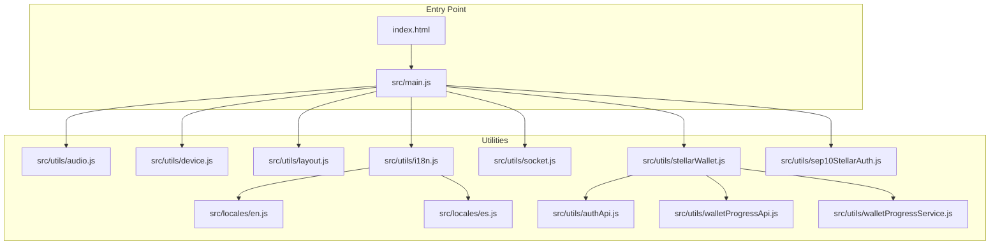
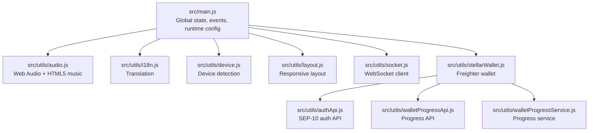
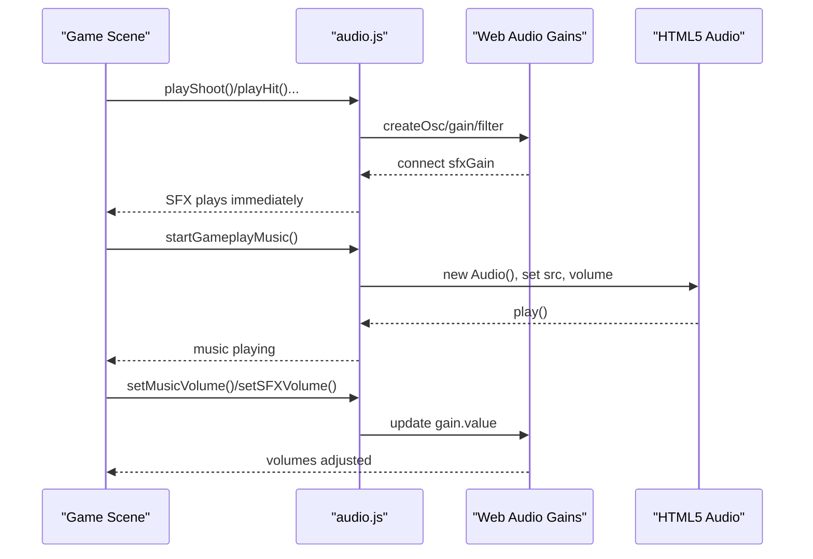
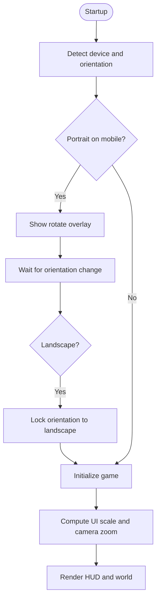
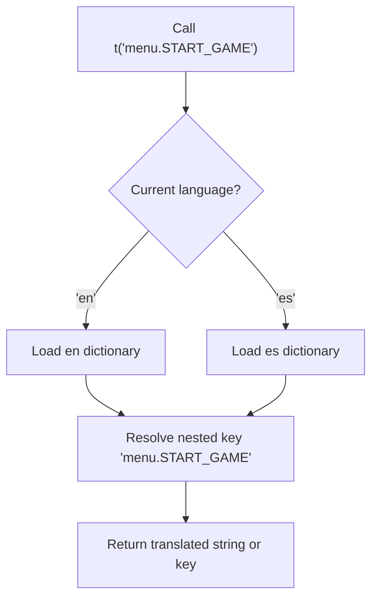
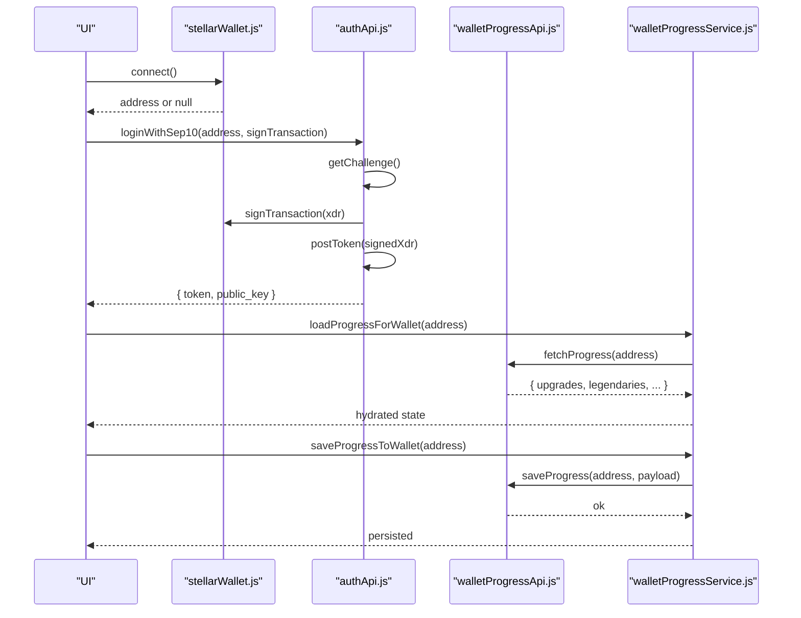
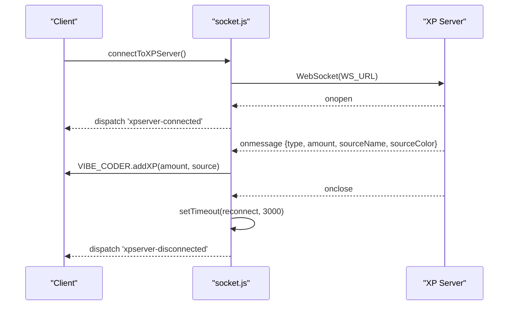
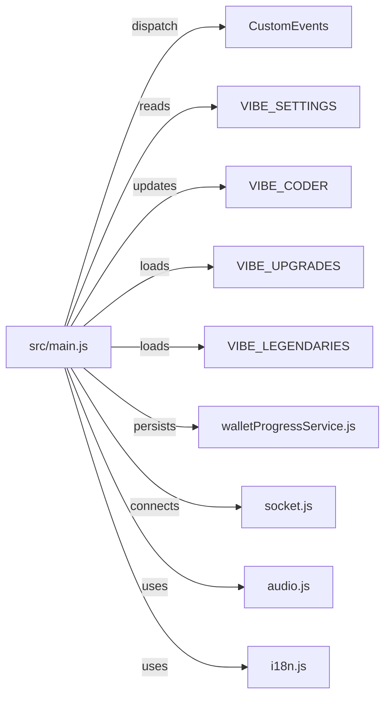
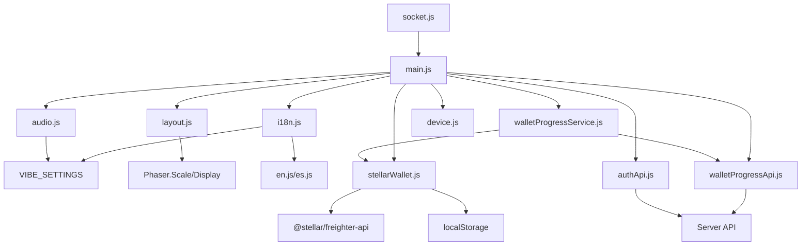

# Utility Systems

<cite>
**Referenced Files in This Document**
- [audio.js](file://src/utils/audio.js)
- [device.js](file://src/utils/device.js)
- [i18n.js](file://src/utils/i18n.js)
- [layout.js](file://src/utils/layout.js)
- [socket.js](file://src/utils/socket.js)
- [stellarWallet.js](file://src/utils/stellarWallet.js)
- [authApi.js](file://src/utils/authApi.js)
- [walletProgressApi.js](file://src/utils/walletProgressApi.js)
- [walletProgressService.js](file://src/utils/walletProgressService.js)
- [sep10StellarAuth.js](file://src/utils/sep10StellarAuth.js)
- [en.js](file://src/locales/en.js)
- [es.js](file://src/locales/es.js)
- [main.js](file://src/main.js)
- [index.html](file://index.html)
- [SpatialHash.js](file://src/utils/SpatialHash.js)
</cite>

## Table of Contents
1. [Introduction](#introduction)
2. [Project Structure](#project-structure)
3. [Core Components](#core-components)
4. [Architecture Overview](#architecture-overview)
5. [Detailed Component Analysis](#detailed-component-analysis)
6. [Dependency Analysis](#dependency-analysis)
7. [Performance Considerations](#performance-considerations)
8. [Troubleshooting Guide](#troubleshooting-guide)
9. [Conclusion](#conclusion)

## Introduction
This document explains the utility systems that power Vibe-Coder’s core gameplay experience. It covers:
- Audio management with procedural SFX, HTML5 music, and separate volume channels
- Device detection and responsive layout helpers for mobile/desktop adaptation
- Internationalization (i18n) with dynamic language switching
- Stellar wallet integration for blockchain connectivity, account management, and progress persistence
- WebSocket communication for real-time XP broadcasting and live coding activity tracking
- Integration patterns showing how these utilities interact with the main game systems

## Project Structure
The utility systems are organized under src/utils and src/locales, with integration points in src/main.js and the HTML entry point. Key areas:
- Audio: procedural Web Audio API generators and HTML5 music playback
- Device and layout: device detection and responsive scaling helpers
- i18n: language selection and translation keys
- Blockchain: wallet, auth, and progress APIs/services
- Networking: WebSocket client for XP events
- Integration: global state and event dispatch in main.js

**Diagram sources**
- [index.html](file://index.html#L1-L108)
- [main.js](file://src/main.js#L1-L464)
- [audio.js](file://src/utils/audio.js#L1-L560)
- [device.js](file://src/utils/device.js#L1-L25)
- [layout.js](file://src/utils/layout.js#L1-L108)
- [i18n.js](file://src/utils/i18n.js#L1-L45)
- [en.js](file://src/locales/en.js#L1-L319)
- [es.js](file://src/locales/es.js#L1-L317)
- [socket.js](file://src/utils/socket.js#L1-L121)
- [stellarWallet.js](file://src/utils/stellarWallet.js#L1-L115)
- [authApi.js](file://src/utils/authApi.js#L1-L184)
- [walletProgressApi.js](file://src/utils/walletProgressApi.js#L1-L46)
- [walletProgressService.js](file://src/utils/walletProgressService.js#L1-L140)
- [sep10StellarAuth.js](file://src/utils/sep10StellarAuth.js#L1-L219)

**Section sources**
- [index.html](file://index.html#L1-L108)
- [main.js](file://src/main.js#L1-L464)

## Core Components
- Audio system: Web Audio API for procedural SFX and HTML5 Audio for menu/gameplay tracks with separate master/music/SFX gain nodes and per-mode volumes.
- Device and layout: device detection helpers and responsive layout helpers for UI scaling and camera zoom.
- i18n: simple key-based translation with dynamic language switching backed by locale dictionaries.
- Stellar wallet: Freighter-based connection, caching, and transaction signing; progress persistence via wallet-backed API.
- WebSocket: optional XP server connection with reconnection logic and event dispatch.
- Integration: global state and event bus in main.js coordinating utilities and scenes.

**Section sources**
- [audio.js](file://src/utils/audio.js#L1-L560)
- [device.js](file://src/utils/device.js#L1-L25)
- [layout.js](file://src/utils/layout.js#L1-L108)
- [i18n.js](file://src/utils/i18n.js#L1-L45)
- [stellarWallet.js](file://src/utils/stellarWallet.js#L1-L115)
- [authApi.js](file://src/utils/authApi.js#L1-L184)
- [walletProgressApi.js](file://src/utils/walletProgressApi.js#L1-L46)
- [walletProgressService.js](file://src/utils/walletProgressService.js#L1-L140)
- [socket.js](file://src/utils/socket.js#L1-L121)
- [main.js](file://src/main.js#L1-L464)

## Architecture Overview
The utilities integrate with the main game lifecycle and scenes. Audio and i18n are used by UI and HUD components; device/layout adapt the viewport and camera; wallet and auth enable blockchain features; WebSocket provides live XP updates.

**Diagram sources**
- [main.js](file://src/main.js#L1-L464)
- [audio.js](file://src/utils/audio.js#L1-L560)
- [i18n.js](file://src/utils/i18n.js#L1-L45)
- [device.js](file://src/utils/device.js#L1-L25)
- [layout.js](file://src/utils/layout.js#L1-L108)
- [socket.js](file://src/utils/socket.js#L1-L121)
- [stellarWallet.js](file://src/utils/stellarWallet.js#L1-L115)
- [authApi.js](file://src/utils/authApi.js#L1-L184)
- [walletProgressApi.js](file://src/utils/walletProgressApi.js#L1-L46)
- [walletProgressService.js](file://src/utils/walletProgressService.js#L1-L140)

## Detailed Component Analysis

### Audio Management System
The audio system provides:
- Procedural sound effects via Web Audio API oscillators, noise buffers, filters, and gains
- HTML5 Audio for menu and gameplay tracks with looping and crossfade-like transitions
- Separate volume channels: master, music, and SFX
- Per-mode volume getters that respect effective settings and master volume
- Playback control: start/stop/toggle for menu and gameplay music, plus toggling music mode

Key behaviors:
- Initialization creates an AudioContext and three gain nodes (master, music, SFX)
- SFX playback respects VIBE_SETTINGS.sfxEnabled and uses per-effect envelopes
- Music uses HTML5 Audio with a playlist that cycles gameplay tracks and supports menu music
- Volume setters clamp values to [0, 1] and apply to respective gain nodes

**Diagram sources**
- [audio.js](file://src/utils/audio.js#L16-L36)
- [audio.js](file://src/utils/audio.js#L48-L122)
- [audio.js](file://src/utils/audio.js#L464-L486)
- [audio.js](file://src/utils/audio.js#L549-L559)

**Section sources**
- [audio.js](file://src/utils/audio.js#L1-L560)

### Device Detection and Responsive Design
Device detection:
- isTouchDevice, isMobileDevice, isTabletDevice use userAgent and touch capabilities

Responsive layout:
- getUIScale scales UI proportionally to logical height
- getCameraZoom adjusts camera zoom based on display height to keep gameplay comfortably visible
- Anchor helpers and getHudLayout compute responsive HUD positions and sizes

Integration:
- main.js detects portrait/mobile and locks orientation to landscape on supported devices
- index.html sets viewport-fit and orientation meta tags to support landscape-first UX

**Diagram sources**
- [main.js](file://src/main.js#L403-L446)
- [layout.js](file://src/utils/layout.js#L10-L38)
- [layout.js](file://src/utils/layout.js#L64-L107)
- [index.html](file://index.html#L5-L8)

**Section sources**
- [device.js](file://src/utils/device.js#L1-L25)
- [layout.js](file://src/utils/layout.js#L1-L108)
- [main.js](file://src/main.js#L403-L446)
- [index.html](file://index.html#L1-L108)

### Internationalization (i18n)
Capabilities:
- Dynamic language selection via VIBE_SETTINGS.language
- Translation function t supports dot notation keys
- Locale dictionaries for English and Spanish
- setLanguage persists language choice to VIBE_SETTINGS

Usage pattern:
- Import i18n and call t('menu.START_GAME') to resolve localized strings
- Call setLanguage('es') to switch languages and persist the setting

**Diagram sources**
- [i18n.js](file://src/utils/i18n.js#L10-L42)
- [en.js](file://src/locales/en.js#L9-L21)
- [es.js](file://src/locales/es.js#L8-L20)

**Section sources**
- [i18n.js](file://src/utils/i18n.js#L1-L45)
- [en.js](file://src/locales/en.js#L1-L319)
- [es.js](file://src/locales/es.js#L1-L317)

### Stellar Wallet Integration and Progress Persistence
Wallet:
- Freighter availability check and connection
- Address caching with localStorage fallback
- Transaction signing with network passphrase and address
- Short address formatting and disconnect/clear

Auth:
- Full SEP-10 challenge/sign/token flow with timeouts and error handling
- JWT storage and authenticated fetch wrapper

Progress:
- Fetch/save progress keyed by wallet address
- Hydrate upgrades, legendaries, high wave/score, selected character, and save state
- Persist on changes and reset on disconnect

**Diagram sources**
- [stellarWallet.js](file://src/utils/stellarWallet.js#L39-L53)
- [authApi.js](file://src/utils/authApi.js#L167-L183)
- [walletProgressApi.js](file://src/utils/walletProgressApi.js#L15-L45)
- [walletProgressService.js](file://src/utils/walletProgressService.js#L22-L58)

**Section sources**
- [stellarWallet.js](file://src/utils/stellarWallet.js#L1-L115)
- [authApi.js](file://src/utils/authApi.js#L1-L184)
- [walletProgressApi.js](file://src/utils/walletProgressApi.js#L1-L46)
- [walletProgressService.js](file://src/utils/walletProgressService.js#L1-L140)

### WebSocket Communication for Live XP
Connection:
- Only connects on localhost to avoid failures on GitHub Pages
- Guard against concurrent connections and stale sockets
- onopen: mark connected, clear reconnect timer, dispatch custom event
- onmessage: parse XP events, dispatch addXP with source metadata
- onclose/onerror: schedule reconnection with 3s delay, avoid console spam

**Diagram sources**
- [socket.js](file://src/utils/socket.js#L18-L104)
- [main.js](file://src/main.js#L449-L461)

**Section sources**
- [socket.js](file://src/utils/socket.js#L1-L121)
- [main.js](file://src/main.js#L449-L461)

### Integration Patterns with Main Game Systems
- Global state: VIBE_SETTINGS, VIBE_CODER, VIBE_UPGRADES, VIBE_LEGENDARIES, VIBE_SELECTED_CHARACTER
- Events: levelup, xpgained, xpserver-connected/disconnected
- Runtime config: loadRuntimeConfig reads config.json from same-origin
- Orientation lock: main.js locks to landscape on mobile and hides overlay when ready
- Audio integration: audio.js uses VIBE_SETTINGS for enabling and effective volumes
- i18n integration: i18n reads VIBE_SETTINGS.language and resolves translations
- Wallet progress: walletProgressService hydrates and persists upgrades/legendaries/save state

**Diagram sources**
- [main.js](file://src/main.js#L233-L379)
- [main.js](file://src/main.js#L449-L461)
- [audio.js](file://src/utils/audio.js#L408-L426)
- [i18n.js](file://src/utils/i18n.js#L10-L26)
- [walletProgressService.js](file://src/utils/walletProgressService.js#L22-L58)

**Section sources**
- [main.js](file://src/main.js#L1-L464)

## Dependency Analysis
- Audio depends on Web Audio API and HTML5 Audio; integrates with VIBE_SETTINGS for enabling and volumes
- Device and layout depend on window/screen APIs and Phaser scale/display metrics
- i18n depends on locale dictionaries and VIBE_SETTINGS.language
- Wallet depends on Freighter extension and localStorage; auth depends on backend API
- Progress service depends on wallet and progress API; persists to wallet-backed endpoint
- WebSocket depends on environment (localhost) and dispatches events consumed by main.js
- main.js orchestrates all utilities and exposes global state and events

**Diagram sources**
- [audio.js](file://src/utils/audio.js#L1-L560)
- [layout.js](file://src/utils/layout.js#L1-L108)
- [i18n.js](file://src/utils/i18n.js#L1-L45)
- [en.js](file://src/locales/en.js#L1-L319)
- [es.js](file://src/locales/es.js#L1-L317)
- [stellarWallet.js](file://src/utils/stellarWallet.js#L1-L115)
- [authApi.js](file://src/utils/authApi.js#L1-L184)
- [walletProgressApi.js](file://src/utils/walletProgressApi.js#L1-L46)
- [walletProgressService.js](file://src/utils/walletProgressService.js#L1-L140)
- [socket.js](file://src/utils/socket.js#L1-L121)
- [main.js](file://src/main.js#L1-L464)

**Section sources**
- [main.js](file://src/main.js#L1-L464)

## Performance Considerations
- Audio
  - Prefer procedural SFX for low-latency, parameterized sounds
  - Keep SFX short-lived; stop oscillators promptly to free resources
  - Use separate gain nodes to minimize recomputation when adjusting volumes
- Device and layout
  - Compute UI scale and camera zoom once per resize/orientation change
  - Avoid frequent DOM recalculations by caching computed values
- i18n
  - Keep translation keys shallow and consistent to reduce lookup overhead
- Wallet and progress
  - Debounce saveProgressToWallet calls to avoid excessive API requests
  - Cache address and JWT in memory to reduce localStorage churn
- WebSocket
  - Limit reconnect frequency and avoid logging on every failure
  - Parse messages efficiently and dispatch lightweight events

## Troubleshooting Guide
- Audio does not play
  - Ensure audio context is initialized and resumed after user gesture
  - Verify VIBE_SETTINGS.sfxEnabled/musicEnabled and effective volumes
- Music not looping or switching tracks
  - Confirm HTML5 Audio element is created and volume is set
  - Check event listeners for ended and error conditions
- Device orientation issues
  - On mobile, ensure landscape lock is supported and overlay is dismissed
  - Verify viewport meta tags and orientation handling logic
- i18n not switching language
  - Confirm VIBE_SETTINGS.language is set and saved
  - Ensure locale dictionaries are present and keys exist
- Wallet connection fails
  - Check Freighter availability and extension installation
  - Validate localStorage access and cached address
- Progress not loading/saving
  - Verify backend URL resolution and network connectivity
  - Confirm wallet address is present and payload structure matches expectations
- WebSocket not connecting
  - Ensure running on localhost; verify WS_URL and server availability
  - Check for repeated connection attempts and stale socket references

**Section sources**
- [audio.js](file://src/utils/audio.js#L16-L43)
- [audio.js](file://src/utils/audio.js#L428-L486)
- [main.js](file://src/main.js#L421-L446)
- [i18n.js](file://src/utils/i18n.js#L19-L26)
- [stellarWallet.js](file://src/utils/stellarWallet.js#L26-L53)
- [walletProgressApi.js](file://src/utils/walletProgressApi.js#L15-L45)
- [socket.js](file://src/utils/socket.js#L18-L104)

## Conclusion
The utility systems in Vibe-Coder provide robust, modular support for audio, device adaptation, localization, blockchain connectivity, and real-time networking. They integrate cleanly with the main game lifecycle through global state and events, ensuring a consistent and responsive player experience across platforms and environments.