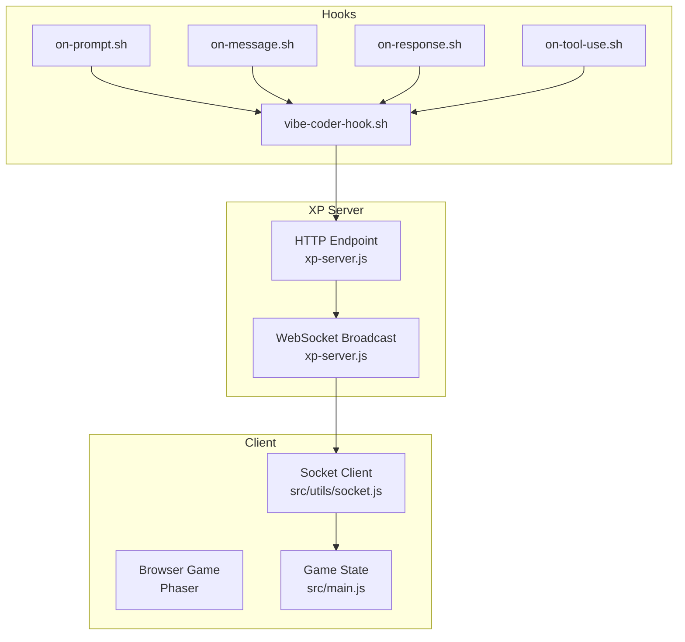
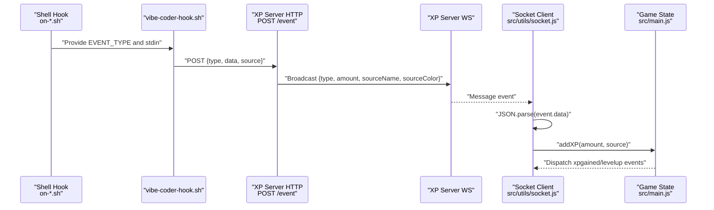
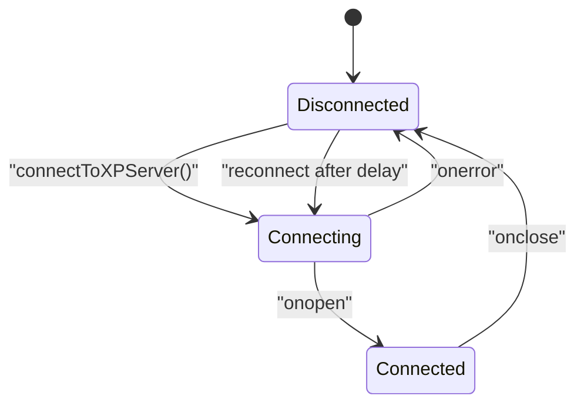
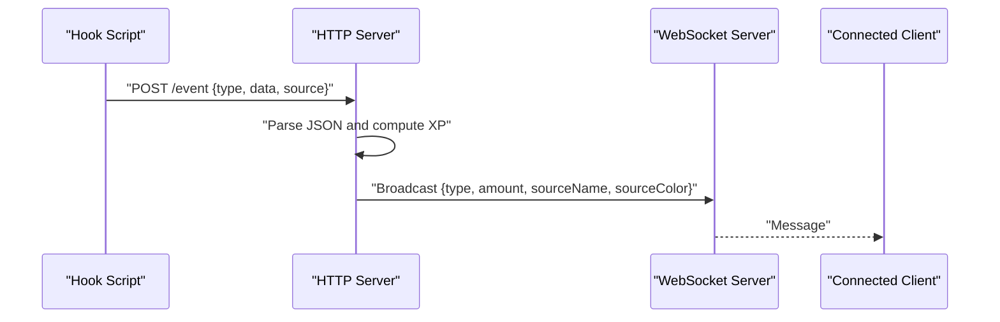
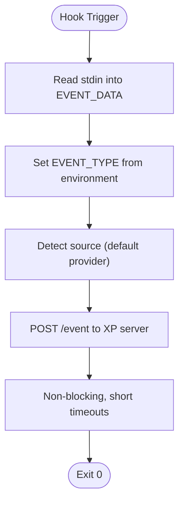
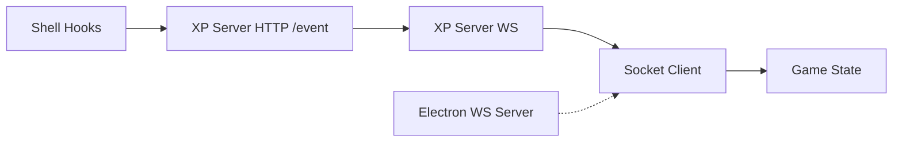

# WebSocket Communication

<cite>
**Referenced Files in This Document**
- [src/utils/socket.js](file://src/utils/socket.js)
- [src/main.js](file://src/main.js)
- [xp-server.js](file://xp-server.js)
- [hooks/vibe-coder-hook.sh](file://hooks/vibe-coder-hook.sh)
- [hooks/on-message.sh](file://hooks/on-message.sh)
- [hooks/on-response.sh](file://hooks/on-response.sh)
- [hooks/on-tool-use.sh](file://hooks/on-tool-use.sh)
- [hooks/on-prompt.sh](file://hooks/on-prompt.sh)
- [electron/server.js](file://electron/server.js)
- [src/utils/authApi.js](file://src/utils/authApi.js)
- [src/utils/sep10StellarAuth.js](file://src/utils/sep10StellarAuth.js)
- [package.json](file://package.json)
- [dist/config.json](file://dist/config.json)
</cite>

## Table of Contents
1. [Introduction](#introduction)
2. [Project Structure](#project-structure)
3. [Core Components](#core-components)
4. [Architecture Overview](#architecture-overview)
5. [Detailed Component Analysis](#detailed-component-analysis)
6. [Dependency Analysis](#dependency-analysis)
7. [Performance Considerations](#performance-considerations)
8. [Troubleshooting Guide](#troubleshooting-guide)
9. [Conclusion](#conclusion)

## Introduction
This document explains the WebSocket-based real-time XP broadcasting system used by the game. It covers how the client establishes a WebSocket connection to the XP server, how the server receives and forwards XP events, how the client parses messages and updates the game state, and how reconnection and error handling work. It also documents the integration with shell hooks that emit events from Claude Code, and clarifies the current absence of heartbeat mechanisms and authentication handshakes in the WebSocket layer.

## Project Structure
The WebSocket communication spans three layers:
- Client-side WebSocket consumer in the game (Phaser) that listens for XP events and updates the game state.
- XP server that accepts HTTP events from shell hooks and broadcasts them to connected clients via WebSocket.
- Shell hooks that capture user actions in Claude Code and POST events to the XP server.

**Diagram sources**
- [src/utils/socket.js](file://src/utils/socket.js#L1-L121)
- [src/main.js](file://src/main.js#L448-L463)
- [xp-server.js](file://xp-server.js#L1-L106)
- [hooks/vibe-coder-hook.sh](file://hooks/vibe-coder-hook.sh#L1-L24)
- [hooks/on-prompt.sh](file://hooks/on-prompt.sh#L1-L5)
- [hooks/on-message.sh](file://hooks/on-message.sh#L1-L5)
- [hooks/on-response.sh](file://hooks/on-response.sh#L1-L5)
- [hooks/on-tool-use.sh](file://hooks/on-tool-use.sh#L1-L5)

**Section sources**
- [src/utils/socket.js](file://src/utils/socket.js#L1-L121)
- [src/main.js](file://src/main.js#L448-L463)
- [xp-server.js](file://xp-server.js#L1-L106)
- [hooks/vibe-coder-hook.sh](file://hooks/vibe-coder-hook.sh#L1-L24)

## Core Components
- Socket client: Establishes a WebSocket connection to the XP server, parses incoming messages, dispatches UI events, and manages reconnection with a fixed delay.
- XP server: Accepts HTTP POST events from shell hooks, computes XP amounts, and broadcasts standardized JSON messages to all connected WebSocket clients.
- Shell hooks: Capture user actions and POST structured events to the XP server’s HTTP endpoint.
- Game state: Consumes XP events to update XP, level, streak, and triggers UI events for rendering.

**Section sources**
- [src/utils/socket.js](file://src/utils/socket.js#L1-L121)
- [src/main.js](file://src/main.js#L322-L379)
- [xp-server.js](file://xp-server.js#L11-L70)
- [hooks/vibe-coder-hook.sh](file://hooks/vibe-coder-hook.sh#L1-L24)

## Architecture Overview
The system is event-driven. Hooks emit events to the XP server over HTTP. The XP server transforms and broadcasts them to clients over WebSocket. The client updates the game state and UI accordingly.

**Diagram sources**
- [hooks/on-prompt.sh](file://hooks/on-prompt.sh#L1-L5)
- [hooks/on-message.sh](file://hooks/on-message.sh#L1-L5)
- [hooks/on-response.sh](file://hooks/on-response.sh#L1-L5)
- [hooks/on-tool-use.sh](file://hooks/on-tool-use.sh#L1-L5)
- [hooks/vibe-coder-hook.sh](file://hooks/vibe-coder-hook.sh#L1-L24)
- [xp-server.js](file://xp-server.js#L32-L70)
- [src/utils/socket.js](file://src/utils/socket.js#L54-L72)
- [src/main.js](file://src/main.js#L337-L364)

## Detailed Component Analysis

### Socket Client (src/utils/socket.js)
Responsibilities:
- Connects to the XP server WebSocket only on localhost to avoid failing connections in production environments.
- Guards against concurrent connection attempts and stale socket references.
- Parses incoming JSON messages and extracts XP amount, type, and source metadata.
- Updates the global game state with XP and source information.
- Dispatches custom DOM events for connection and disconnection to enable UI reactions.
- Implements a simple reconnection mechanism with a fixed delay when the connection closes.

Message format consumed by the client:
- Fields: type, amount, sourceName, sourceColor.
- The client logs the event and passes source metadata to the game state to support auto-move logic.

Reconnection logic:
- On close, schedules a single reconnection attempt after a fixed delay.
- Clears any pending reconnect timer on successful open.

Security considerations:
- The client does not implement authentication or heartbeat mechanisms.
- Connections are restricted to localhost to reduce exposure outside development.

**Section sources**
- [src/utils/socket.js](file://src/utils/socket.js#L18-L104)
- [src/main.js](file://src/main.js#L337-L364)
- [src/main.js](file://src/main.js#L455-L461)

#### Class Diagram: Client-Side State Machine

**Diagram sources**
- [src/utils/socket.js](file://src/utils/socket.js#L38-L87)

### XP Server (xp-server.js)
Responsibilities:
- Exposes an HTTP POST endpoint to receive events from shell hooks.
- Computes XP amounts based on event types and assigns a default amount for unknown types.
- Broadcasts standardized JSON messages to all connected WebSocket clients.
- Assigns a color per source for UI differentiation.
- Provides CORS headers for cross-origin requests.

Message format produced by the server:
- Fields: type, amount, sourceName, sourceColor.
- sourceName is uppercase; sourceColor is mapped from known sources.

HTTP endpoint:
- Method: POST
- Path: /event
- Content-Type: application/json
- Body: { type, data, source }

WebSocket endpoint:
- URL: ws://localhost:<port> (port is printed at startup).
- Clients receive broadcast messages with the above fields.

**Section sources**
- [xp-server.js](file://xp-server.js#L11-L17)
- [xp-server.js](file://xp-server.js#L32-L70)
- [xp-server.js](file://xp-server.js#L85-L94)
- [xp-server.js](file://xp-server.js#L96-L105)

#### Sequence Diagram: Event Ingestion and Broadcasting

**Diagram sources**
- [hooks/vibe-coder-hook.sh](file://hooks/vibe-coder-hook.sh#L14-L20)
- [xp-server.js](file://xp-server.js#L32-L70)

### Shell Hooks Integration
The hooks integrate with Claude Code to emit events:
- on-prompt.sh, on-message.sh, on-response.sh, on-tool-use.sh set the event type and delegate to vibe-coder-hook.sh.
- vibe-coder-hook.sh reads stdin, determines the event type, detects the source, and POSTs to the XP server HTTP endpoint.
- The POST is non-blocking and fails fast with short timeouts to avoid blocking the editor.

Event payload:
- type: derived from hook environment.
- data: captured from stdin.
- source: defaults to the hook’s provider.

**Section sources**
- [hooks/on-prompt.sh](file://hooks/on-prompt.sh#L1-L5)
- [hooks/on-message.sh](file://hooks/on-message.sh#L1-L5)
- [hooks/on-response.sh](file://hooks/on-response.sh#L1-L5)
- [hooks/on-tool-use.sh](file://hooks/on-tool-use.sh#L1-L5)
- [hooks/vibe-coder-hook.sh](file://hooks/vibe-coder-hook.sh#L1-L24)

#### Flowchart: Hook Event Emission

**Diagram sources**
- [hooks/vibe-coder-hook.sh](file://hooks/vibe-coder-hook.sh#L5-L20)

### Game State Integration (src/main.js)
The client integrates XP events into the game state:
- Adds XP with multipliers (streak, upgrades, rebirth bonuses).
- Tracks last coding activity and source for auto-move logic.
- Emits custom events for UI updates (level up, XP gained).

Connection lifecycle:
- On localhost, the client automatically connects to the XP server.
- Custom events are dispatched for connection and disconnection to inform the UI.

**Section sources**
- [src/main.js](file://src/main.js#L322-L379)
- [src/main.js](file://src/main.js#L448-L463)

## Dependency Analysis
- The client depends on the XP server’s HTTP and WebSocket endpoints.
- The XP server depends on the shell hooks for input events.
- The Electron server (if running) exposes a WebSocket server for internal use but is separate from the XP broadcasting server.

**Diagram sources**
- [hooks/vibe-coder-hook.sh](file://hooks/vibe-coder-hook.sh#L14-L20)
- [xp-server.js](file://xp-server.js#L72-L83)
- [src/utils/socket.js](file://src/utils/socket.js#L5-L6)
- [electron/server.js](file://electron/server.js#L54-L61)

**Section sources**
- [package.json](file://package.json#L42)
- [electron/server.js](file://electron/server.js#L54-L61)

## Performance Considerations
- Fixed reconnection delay: The client reconnects after a fixed delay. There is no exponential backoff, which keeps CPU and network usage predictable but may prolong recovery under intermittent failures.
- Minimal parsing overhead: The client performs lightweight JSON parsing and direct field extraction.
- Broadcast scaling: The XP server iterates over connected clients; the number of clients is small in practice, keeping broadcast costs low.
- Non-blocking hook emissions: Shell hooks use short timeouts and run in the background to avoid blocking the editor.

[No sources needed since this section provides general guidance]

## Troubleshooting Guide
Common issues and resolutions:
- Connection fails in production builds:
  - The client restricts WebSocket connections to localhost. Ensure you are running locally or adjust the client to connect to a deployed WebSocket endpoint.
- XP server offline:
  - The client logs a one-time “offline” message per session and schedules a single reconnection attempt. Start the XP server or disable live XP mode.
- Message parsing errors:
  - The client catches parsing errors and logs them. Verify that the XP server sends properly formatted JSON with the expected fields.
- Network interruptions:
  - The client dispatches a disconnection event and reconnects after a fixed delay. Monitor the custom events to reflect status in the UI.
- Authentication and heartbeat:
  - The WebSocket layer does not implement authentication or heartbeat. If you require secure channels, consider adding TLS and a custom handshake protocol.

**Section sources**
- [src/utils/socket.js](file://src/utils/socket.js#L89-L103)
- [src/utils/socket.js](file://src/utils/socket.js#L74-L87)
- [src/utils/socket.js](file://src/utils/socket.js#L69-L71)

## Conclusion
The WebSocket communication system provides a simple, robust pipeline for real-time XP broadcasting. Events from Claude Code are ingested via HTTP, transformed by the XP server, and delivered to the game over WebSocket. The client integrates these events into the game state and UI, with straightforward reconnection behavior. While the current design lacks authentication and heartbeat mechanisms, it is well-suited for development and local use. For production deployments, consider adding TLS, optional authentication, and exponential backoff for resilience.