# Core Gameplay

<cite>
**Referenced Files in This Document**
- [ArenaScene.js](file://src/scenes/ArenaScene.js)
- [EventManager.js](file://src/systems/EventManager.js)
- [MapManager.js](file://src/systems/MapManager.js)
- [balance.js](file://src/config/balance.js)
- [SpatialHash.js](file://src/utils/SpatialHash.js)
- [RunModifiers.js](file://src/systems/RunModifiers.js)
- [ShrineManager.js](file://src/systems/ShrineManager.js)
- [SaveManager.js](file://src/systems/SaveManager.js)
- [RebirthManager.js](file://src/systems/RebirthManager.js)
- [LeaderboardManager.js](file://src/systems/LeaderboardManager.js)
</cite>

## Table of Contents
1. [Introduction](#introduction)
2. [Project Structure](#project-structure)
3. [Core Components](#core-components)
4. [Architecture Overview](#architecture-overview)
5. [Detailed Component Analysis](#detailed-component-analysis)
6. [Dependency Analysis](#dependency-analysis)
7. [Performance Considerations](#performance-considerations)
8. [Troubleshooting Guide](#troubleshooting-guide)
9. [Conclusion](#conclusion)

## Introduction
This document explains Vibe-Coder’s core gameplay mechanics with a focus on Vampire Survivors-style progression. It covers enemy spawning and wave progression, boss encounters, arena mechanics and collision detection, damage systems, weapon systems (melee, ranged, orbital), map management and environmental interactions, combat flow from spawn to wave completion, scoring and XP accumulation, and practical examples from ArenaScene.js showing how gameplay events are triggered and managed.

## Project Structure
The gameplay is implemented primarily in the ArenaScene with supporting systems:
- ArenaScene orchestrates waves, enemies, projectiles, weapon pickups, HUD, and events.
- EventManager adds mid-run chaos events (e.g., boss incoming, double XP, curse).
- MapManager generates biomes, obstacles, hazards, teleporters, and destructible crates.
- RunModifiers applies run-wide challenges/bonuses affecting damage, health, spawn rates, and XP.
- ShrineManager places interactive shrines with risk/reward choices.
- SaveManager persists runs for continuation.
- RebirthManager defines permanent milestones and bonuses.
- LeaderboardManager tracks local and on-chain scores.
- balance.js defines scaling and difficulty constants.
- SpatialHash optimizes collision detection.

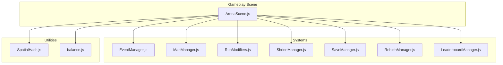

**Diagram sources**
- [ArenaScene.js](file://src/scenes/ArenaScene.js#L21-L273)
- [EventManager.js](file://src/systems/EventManager.js#L5-L14)
- [MapManager.js](file://src/systems/MapManager.js#L5-L81)
- [RunModifiers.js](file://src/systems/RunModifiers.js#L5-L65)
- [ShrineManager.js](file://src/systems/ShrineManager.js#L5-L15)
- [SaveManager.js](file://src/systems/SaveManager.js#L5-L6)
- [RebirthManager.js](file://src/systems/RebirthManager.js#L5-L6)
- [LeaderboardManager.js](file://src/systems/LeaderboardManager.js#L18-L18)
- [SpatialHash.js](file://src/utils/SpatialHash.js#L5-L9)
- [balance.js](file://src/config/balance.js#L11-L96)

**Section sources**
- [ArenaScene.js](file://src/scenes/ArenaScene.js#L21-L273)
- [EventManager.js](file://src/systems/EventManager.js#L5-L14)
- [MapManager.js](file://src/systems/MapManager.js#L5-L81)
- [RunModifiers.js](file://src/systems/RunModifiers.js#L5-L65)
- [ShrineManager.js](file://src/systems/ShrineManager.js#L5-L15)
- [SaveManager.js](file://src/systems/SaveManager.js#L5-L6)
- [RebirthManager.js](file://src/systems/RebirthManager.js#L5-L6)
- [LeaderboardManager.js](file://src/systems/LeaderboardManager.js#L18-L18)
- [SpatialHash.js](file://src/utils/SpatialHash.js#L5-L9)
- [balance.js](file://src/config/balance.js#L11-L96)

## Core Components
- ArenaScene: Central controller for waves, enemies, projectiles, weapon drops, HUD, and events. Manages player stats, weapon types, boss and mini-boss definitions, stage transitions, and XP/progression.
- EventManager: Randomized mid-run events with timers and HUD, including boss incoming, double XP, curse, jackpot, and swarm.
- MapManager: Procedural biomes with walls, furniture, hazards, destructibles, teleporters, and collision logic.
- RunModifiers: Run-start modifiers affecting damage, health, weapon duration, XP, and spawn rates.
- ShrineManager: Interactable shrines offering buffs, random outcomes, instant level-up, invincibility, and chaos effects.
- SaveManager: Continuation saves with run state and seed.
- RebirthManager: Permanent milestones and bonuses across runs.
- LeaderboardManager: Local and on-chain scoreboards.
- balance.js: Difficulty scaling constants for enemies, spawn delays, XP, and AFK mechanics.
- SpatialHash: Optimized spatial queries for collision detection.

**Section sources**
- [ArenaScene.js](file://src/scenes/ArenaScene.js#L21-L273)
- [EventManager.js](file://src/systems/EventManager.js#L5-L14)
- [MapManager.js](file://src/systems/MapManager.js#L5-L81)
- [RunModifiers.js](file://src/systems/RunModifiers.js#L5-L65)
- [ShrineManager.js](file://src/systems/ShrineManager.js#L5-L15)
- [SaveManager.js](file://src/systems/SaveManager.js#L5-L6)
- [RebirthManager.js](file://src/systems/RebirthManager.js#L5-L6)
- [LeaderboardManager.js](file://src/systems/LeaderboardManager.js#L18-L18)
- [balance.js](file://src/config/balance.js#L11-L96)
- [SpatialHash.js](file://src/utils/SpatialHash.js#L5-L9)

## Architecture Overview
The gameplay architecture centers on ArenaScene, which initializes subsystems, sets up collisions, and drives the wave lifecycle. Systems integrate through references and shared state (e.g., XP multipliers, modifier effects, shrine buffs).

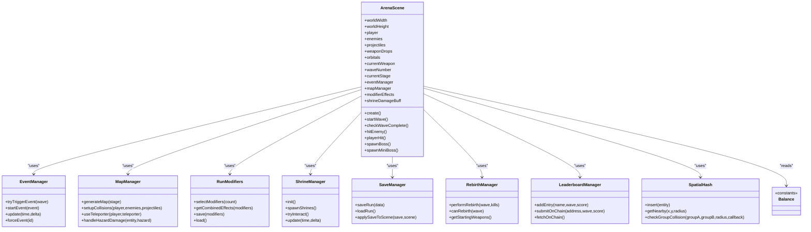

**Diagram sources**
- [ArenaScene.js](file://src/scenes/ArenaScene.js#L21-L273)
- [EventManager.js](file://src/systems/EventManager.js#L5-L14)
- [MapManager.js](file://src/systems/MapManager.js#L5-L81)
- [RunModifiers.js](file://src/systems/RunModifiers.js#L5-L65)
- [ShrineManager.js](file://src/systems/ShrineManager.js#L5-L15)
- [SaveManager.js](file://src/systems/SaveManager.js#L5-L6)
- [RebirthManager.js](file://src/systems/RebirthManager.js#L5-L6)
- [LeaderboardManager.js](file://src/systems/LeaderboardManager.js#L18-L18)
- [SpatialHash.js](file://src/utils/SpatialHash.js#L5-L9)
- [balance.js](file://src/config/balance.js#L11-L96)

## Detailed Component Analysis

### ArenaScene: Waves, Bosses, and Combat Flow
- Wave lifecycle:
  - startWave computes spawn count and delay using balance.js scaling, schedules repeated spawns, and checks completion every 2 seconds.
  - checkWaveComplete ends the wave when all spawned enemies are cleared, announces boss waves, grants wave XP, auto-saves, updates leaderboards, and optionally triggers rebirth prompts.
- Boss and mini-boss:
  - spawnBoss selects a boss by wave thresholds and scales health/speed/damage with player level and wave progression.
  - spawnMiniBoss appears at waves 10, 30, 50… with unique abilities.
- Player combat:
  - hitEnemy handles damage, critical hits, special effects (freeze, fork bomb), and XP awarding with event/modifier multipliers.
  - playerHit applies elite critical chance, screen shake on critical hits, vampiric healing under modifiers, and damage sounds.
- Weapons:
  - Weapon types define attack rate, damage, projectiles, pierce, color, and special behaviors (homing, bounce, aoe, freeze, clearAll, godMode, fork).
  - Orbital weapons create rotating projectiles around the player; evolution recipes combine two weapons into powerful forms.
  - Weapon pickup logic equips new weapons with durations, orbital creation, and HUD feedback.
- Scoring and XP:
  - XP is awarded per kill and wave completion, multiplied by event and modifier multipliers.
  - High wave tracking is persisted and synced to wallet-backed progress.

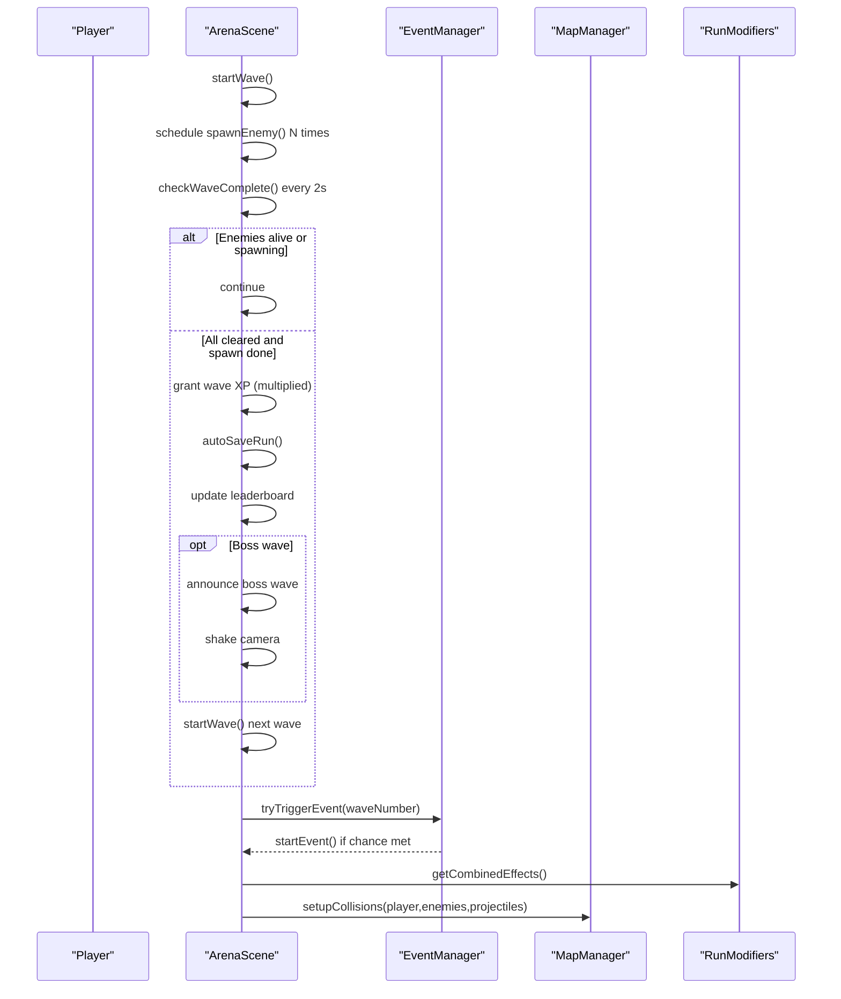

**Diagram sources**
- [ArenaScene.js](file://src/scenes/ArenaScene.js#L1513-L1638)
- [EventManager.js](file://src/systems/EventManager.js#L80-L97)
- [MapManager.js](file://src/systems/MapManager.js#L527-L577)
- [RunModifiers.js](file://src/systems/RunModifiers.js#L91-L121)

**Section sources**
- [ArenaScene.js](file://src/scenes/ArenaScene.js#L1513-L1638)
- [ArenaScene.js](file://src/scenes/ArenaScene.js#L3062-L3114)
- [ArenaScene.js](file://src/scenes/ArenaScene.js#L3657-L3714)
- [ArenaScene.js](file://src/scenes/ArenaScene.js#L3858-L3894)
- [ArenaScene.js](file://src/scenes/ArenaScene.js#L1640-L1673)
- [ArenaScene.js](file://src/scenes/ArenaScene.js#L2948-L3016)

### EventManager: Mid-Wave Chaos Events
- Randomly triggers events at wave start with a fixed chance and minimum wave threshold.
- Effects include boss incoming countdown, double XP, enemy speed increase, forced rare drops, and swarm spawn.
- Maintains HUD with timer bars and cleans up effects on end.

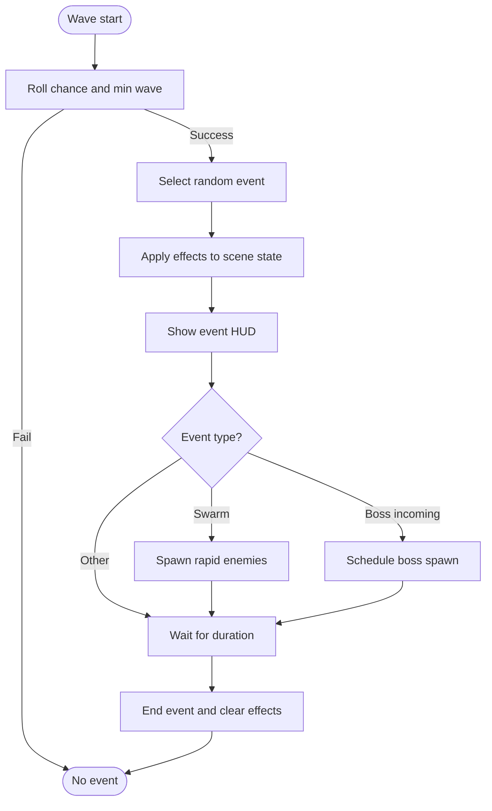

**Diagram sources**
- [EventManager.js](file://src/systems/EventManager.js#L80-L128)
- [EventManager.js](file://src/systems/EventManager.js#L167-L181)
- [EventManager.js](file://src/systems/EventManager.js#L186-L215)

**Section sources**
- [EventManager.js](file://src/systems/EventManager.js#L16-L73)
- [EventManager.js](file://src/systems/EventManager.js#L80-L128)
- [EventManager.js](file://src/systems/EventManager.js#L167-L215)

### MapManager: Biomes, Obstacles, Hazards, Teleporters, and Destructibles
- Generates biomes with walls, furniture, hazards, destructibles, and teleporter pairs.
- Implements collision handling: walls block movement and projectiles; hazards damage on overlap; destructibles drop XP or weapons; teleporters link pairs with cooldowns.
- Provides visual effects and tracked tweens for animations.

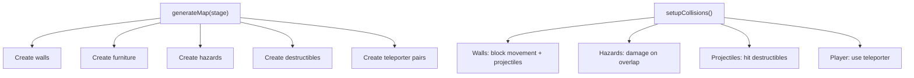

**Diagram sources**
- [MapManager.js](file://src/systems/MapManager.js#L108-L165)
- [MapManager.js](file://src/systems/MapManager.js#L527-L577)

**Section sources**
- [MapManager.js](file://src/systems/MapManager.js#L108-L165)
- [MapManager.js](file://src/systems/MapManager.js#L527-L577)

### Collision Detection and Spatial Hash
- SpatialHash partitions entities into cells to reduce pairwise collision checks.
- ArenaScene uses overlaps for projectiles vs. enemies and player vs. enemies, and MapManager uses overlaps for hazards and destructibles.

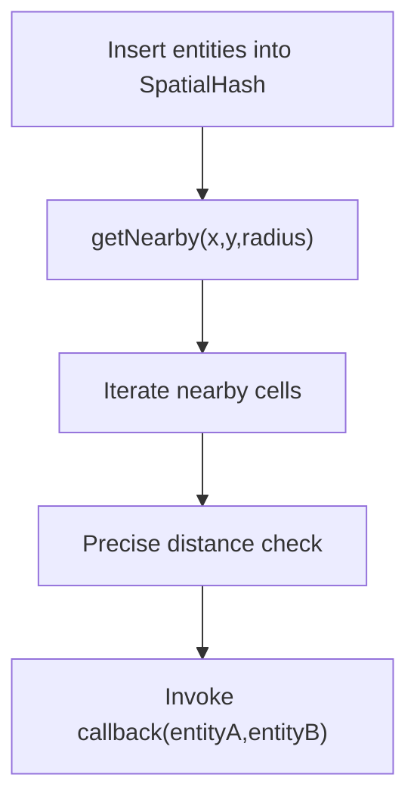

**Diagram sources**
- [SpatialHash.js](file://src/utils/SpatialHash.js#L65-L95)
- [SpatialHash.js](file://src/utils/SpatialHash.js#L116-L139)

**Section sources**
- [SpatialHash.js](file://src/utils/SpatialHash.js#L5-L141)
- [ArenaScene.js](file://src/scenes/ArenaScene.js#L359-L361)
- [MapManager.js](file://src/systems/MapManager.js#L539-L561)

### Damage Systems and Scaling
- Enemy scaling:
  - Health and speed scale with wave and player level caps.
  - Damage scales with wave and level, plus global multipliers.
- Player damage:
  - Attack rate and damage derived from weapon stats and upgrades.
  - Critical hits apply a multiplier and screen shake when exceeding a percentage of max health.
- Modifier effects:
  - Vampiric enemies heal on damage dealt.
  - Glass Cannon halves max health and doubles damage.
  - Bullet Hell increases enemy count and projectiles.
- AFK mechanics:
  - Idle penalties increase enemy damage/spawn and reduce weapon effectiveness.

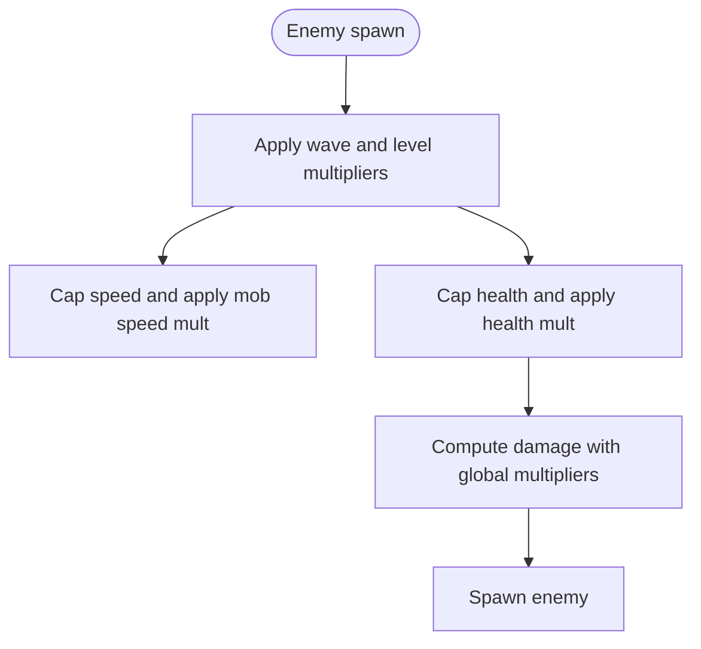

**Diagram sources**
- [ArenaScene.js](file://src/scenes/ArenaScene.js#L1759-L1776)
- [balance.js](file://src/config/balance.js#L11-L33)
- [RunModifiers.js](file://src/systems/RunModifiers.js#L8-Balance.js#L54-L62)

**Section sources**
- [ArenaScene.js](file://src/scenes/ArenaScene.js#L1759-L1776)
- [balance.js](file://src/config/balance.js#L11-L33)
- [RunModifiers.js](file://src/systems/RunModifiers.js#L8-Balance.js#L62)

### Weapon Systems: Melee, Ranged, Orbital, and Evolution
- Weapon types:
  - Ranged: spread, pierce, rapid, homing, bounce, aoe, freeze, rmrf, sudo, forkbomb.
  - Melee: sword, spear, boomerang, kunai.
  - Orbital: persistent spinning weapons.
- Mechanics:
  - Projectiles pierce unless flagged; special effects include freezing, bouncing, AOE, and clearing.
  - Orbital weapons create rotating projectiles around the player.
  - Evolution combines two collected weapons into powerful forms with upgraded stats.
- Upgrades:
  - Duration multipliers and rare weapon drop chances from RunModifiers.
  - Shrine buffs (e.g., damage multiplier) stack with weapon effects.

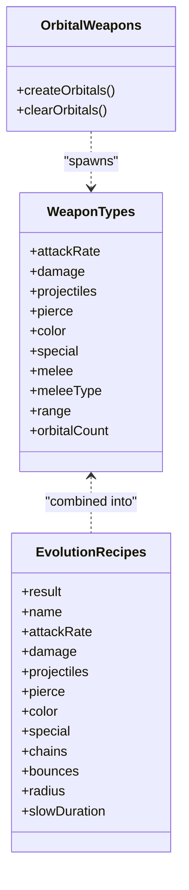

**Diagram sources**
- [ArenaScene.js](file://src/scenes/ArenaScene.js#L71-L91)
- [ArenaScene.js](file://src/scenes/ArenaScene.js#L217-L230)
- [ArenaScene.js](file://src/scenes/ArenaScene.js#L3174-L3208)

**Section sources**
- [ArenaScene.js](file://src/scenes/ArenaScene.js#L71-L91)
- [ArenaScene.js](file://src/scenes/ArenaScene.js#L217-L230)
- [ArenaScene.js](file://src/scenes/ArenaScene.js#L3174-L3208)

### Map Management: Room Generation and Environmental Interactions
- Biomes:
  - Six stages with distinct visuals, wall tints, hazard types, and densities.
  - Teleporter pairs connect distant areas with cooldowns and visual effects.
- Interactables:
  - Destructible crates drop XP or weapons randomly.
  - Shrines offer risk/reward choices with timers and effects.
- Collisions:
  - Walls block movement and projectiles.
  - Hazards damage continuously with cooldowns.
  - Teleporters trigger visual and positional effects.

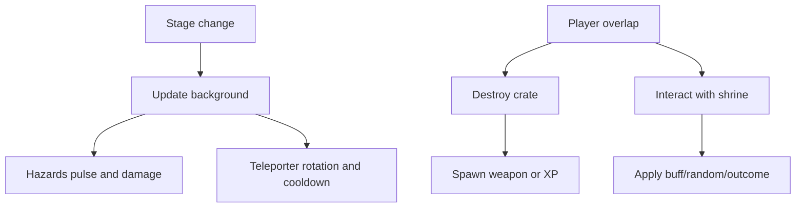

**Diagram sources**
- [ArenaScene.js](file://src/scenes/ArenaScene.js#L676-L718)
- [MapManager.js](file://src/systems/MapManager.js#L108-L165)
- [MapManager.js](file://src/systems/MapManager.js#L527-L577)
- [ShrineManager.js](file://src/systems/ShrineManager.js#L144-L168)

**Section sources**
- [ArenaScene.js](file://src/scenes/ArenaScene.js#L676-L718)
- [MapManager.js](file://src/systems/MapManager.js#L108-L165)
- [MapManager.js](file://src/systems/MapManager.js#L527-L577)
- [ShrineManager.js](file://src/systems/ShrineManager.js#L144-L168)

### Combat Flow: From Spawn to Wave Completion
- Spawn phase:
  - startWave calculates spawn count and delay, schedules spawns, and begins periodic completion checks.
- Active combat:
  - Overlaps trigger hitEnemy and playerHit; projectiles are destroyed or pierce; special effects apply.
- Wave completion:
  - checkWaveComplete evaluates cleared enemies, finished spawn timer, and boss presence; grants XP, auto-saves, updates leaderboards, and optionally triggers rebirth prompts.

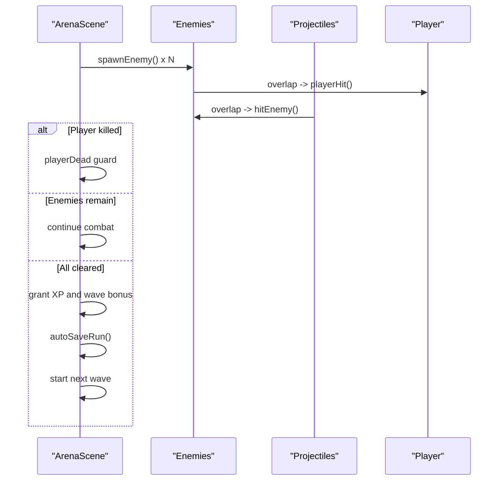

**Diagram sources**
- [ArenaScene.js](file://src/scenes/ArenaScene.js#L1513-L1565)
- [ArenaScene.js](file://src/scenes/ArenaScene.js#L3657-L3714)
- [ArenaScene.js](file://src/scenes/ArenaScene.js#L3858-L3894)

**Section sources**
- [ArenaScene.js](file://src/scenes/ArenaScene.js#L1513-L1565)
- [ArenaScene.js](file://src/scenes/ArenaScene.js#L3657-L3714)
- [ArenaScene.js](file://src/scenes/ArenaScene.js#L3858-L3894)

### Scoring Mechanisms and XP Accumulation
- Per-kill XP:
  - Applied with event and modifier multipliers.
- Wave XP:
  - Base XP per wave number, higher for boss waves, multiplied by event and modifier multipliers.
- Progression:
  - High wave tracking and leaderboard entries; on-chain submission when wallet connected.

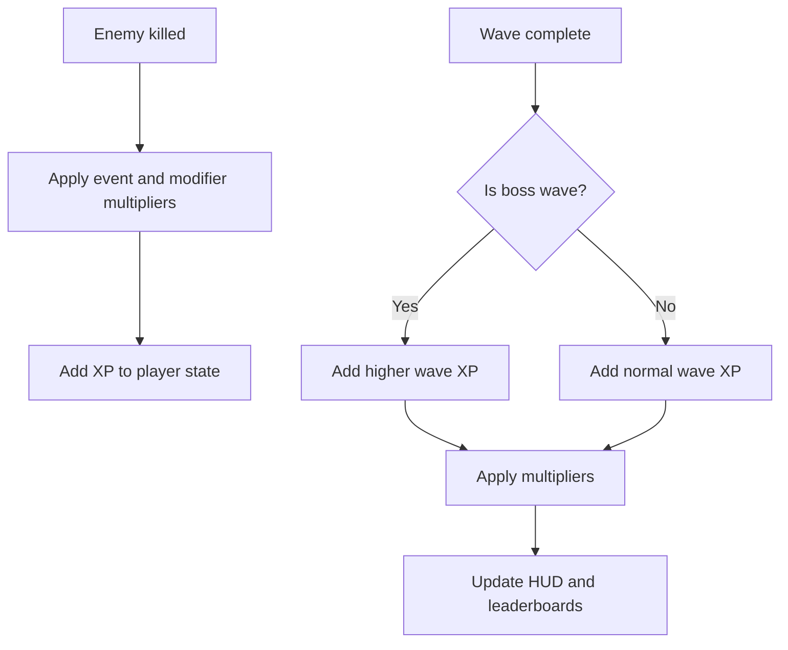

**Diagram sources**
- [ArenaScene.js](file://src/scenes/ArenaScene.js#L3062-L3114)
- [ArenaScene.js](file://src/scenes/ArenaScene.js#L1586-L1601)

**Section sources**
- [ArenaScene.js](file://src/scenes/ArenaScene.js#L3062-L3114)
- [ArenaScene.js](file://src/scenes/ArenaScene.js#L1586-L1601)

## Dependency Analysis
- Coupling:
  - ArenaScene depends on EventManager, MapManager, RunModifiers, ShrineManager, SaveManager, RebirthManager, and LeaderboardManager.
  - MapManager and SpatialHash are used for collision optimization.
- Cohesion:
  - Each system encapsulates a cohesive concern (events, maps, modifiers, shrines, persistence, progression).
- External integrations:
  - Wallet-backed progress and on-chain leaderboard submission via Stellar.

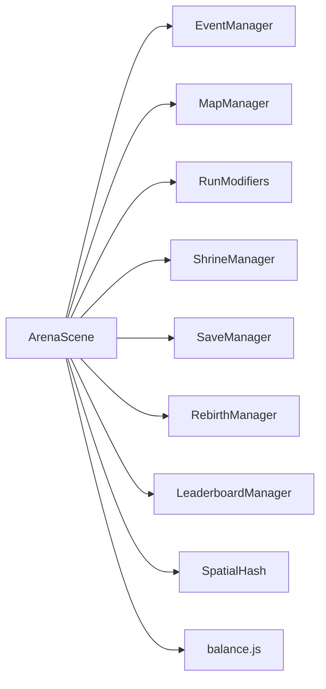

**Diagram sources**
- [ArenaScene.js](file://src/scenes/ArenaScene.js#L21-L273)
- [EventManager.js](file://src/systems/EventManager.js#L5-L14)
- [MapManager.js](file://src/systems/MapManager.js#L5-L81)
- [RunModifiers.js](file://src/systems/RunModifiers.js#L5-L65)
- [ShrineManager.js](file://src/systems/ShrineManager.js#L5-L15)
- [SaveManager.js](file://src/systems/SaveManager.js#L5-L6)
- [RebirthManager.js](file://src/systems/RebirthManager.js#L5-L6)
- [LeaderboardManager.js](file://src/systems/LeaderboardManager.js#L18-L18)
- [SpatialHash.js](file://src/utils/SpatialHash.js#L5-L9)
- [balance.js](file://src/config/balance.js#L11-L96)

**Section sources**
- [ArenaScene.js](file://src/scenes/ArenaScene.js#L21-L273)
- [EventManager.js](file://src/systems/EventManager.js#L5-L14)
- [MapManager.js](file://src/systems/MapManager.js#L5-L81)
- [RunModifiers.js](file://src/systems/RunModifiers.js#L5-L65)
- [ShrineManager.js](file://src/systems/ShrineManager.js#L5-L15)
- [SaveManager.js](file://src/systems/SaveManager.js#L5-L6)
- [RebirthManager.js](file://src/systems/RebirthManager.js#L5-L6)
- [LeaderboardManager.js](file://src/systems/LeaderboardManager.js#L18-L18)
- [SpatialHash.js](file://src/utils/SpatialHash.js#L5-L9)
- [balance.js](file://src/config/balance.js#L11-L96)

## Performance Considerations
- Spatial hashing reduces collision checks from O(n^2) to near-linear by grouping entities into cells.
- Tracked tweens and timers are cleaned up on map clear and scene shutdown to prevent memory leaks.
- Wave scaling caps ensure manageable spawn rates and enemy counts.
- AFK mechanics prevent runaway difficulty and encourage engagement.

[No sources needed since this section provides general guidance]

## Troubleshooting Guide
- Player stuck behind walls:
  - Verify MapManager setupCollisions for walls and furniture.
- No XP gained:
  - Confirm hitEnemy and checkWaveComplete apply event and modifier multipliers.
- Weapons not expiring:
  - Ensure weaponExpiryTimer is created and cleared appropriately.
- Shrine effects not applying:
  - Check ShrineManager.canPayCost and applyEffect branches.
- Teleporter not working:
  - Validate teleporter cooldown and useTeleporter logic.

**Section sources**
- [MapManager.js](file://src/systems/MapManager.js#L527-L577)
- [ArenaScene.js](file://src/scenes/ArenaScene.js#L3062-L3114)
- [ArenaScene.js](file://src/scenes/ArenaScene.js#L2948-L3016)
- [ShrineManager.js](file://src/systems/ShrineManager.js#L347-L387)
- [MapManager.js](file://src/systems/MapManager.js#L373-L399)

## Conclusion
Vibe-Coder’s gameplay blends Vampire Survivors-style waves with a tech-themed twist. ArenaScene coordinates enemy spawning, boss encounters, and weapon evolution, while systems like EventManager, MapManager, RunModifiers, and ShrineManager add depth and variety. balance.js ensures scalable difficulty, and persistence systems enable progression continuity and social leaderboards.