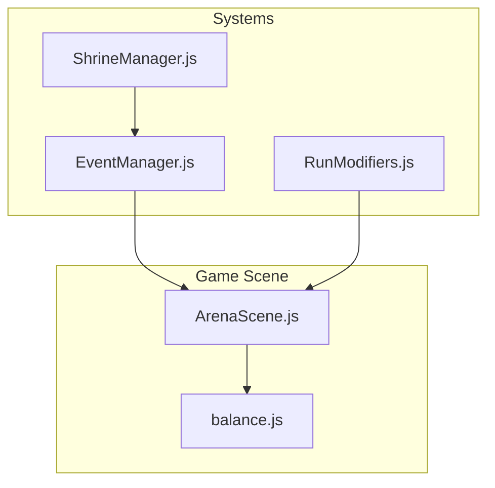
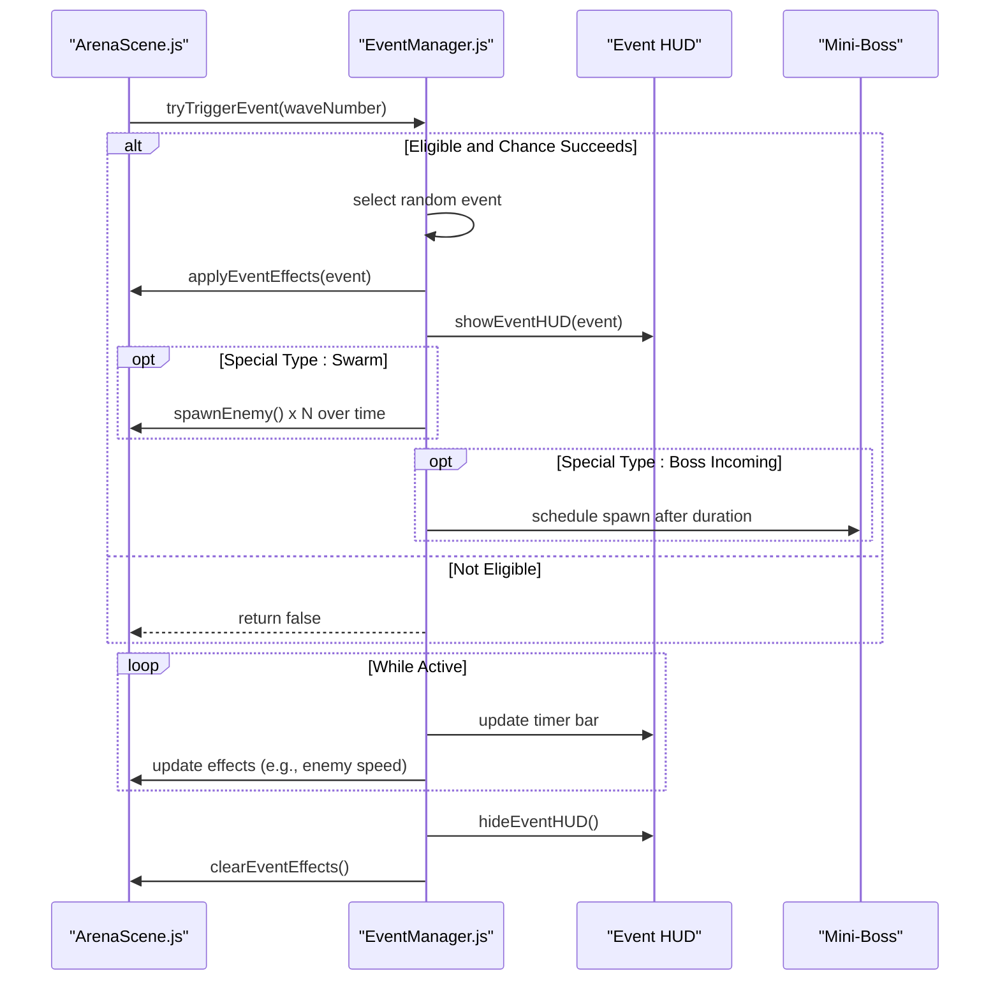
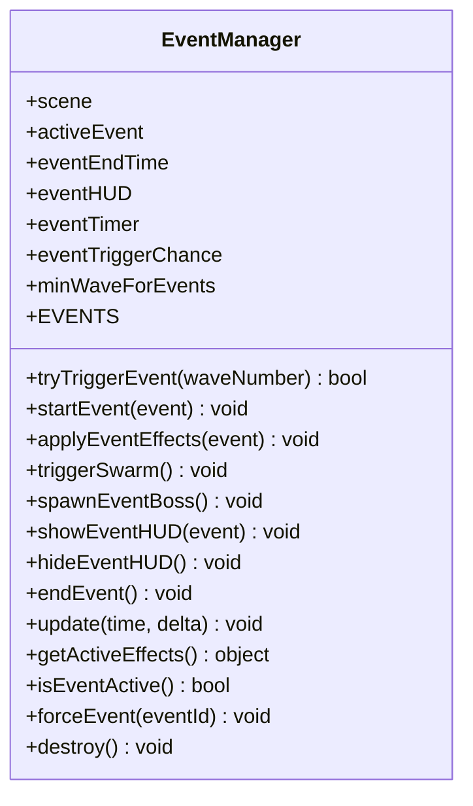
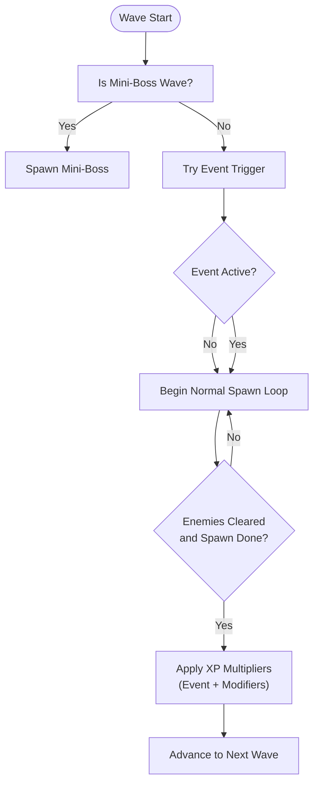
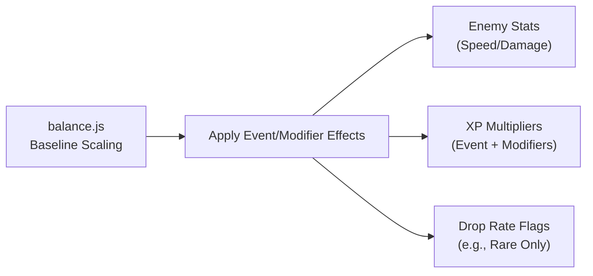
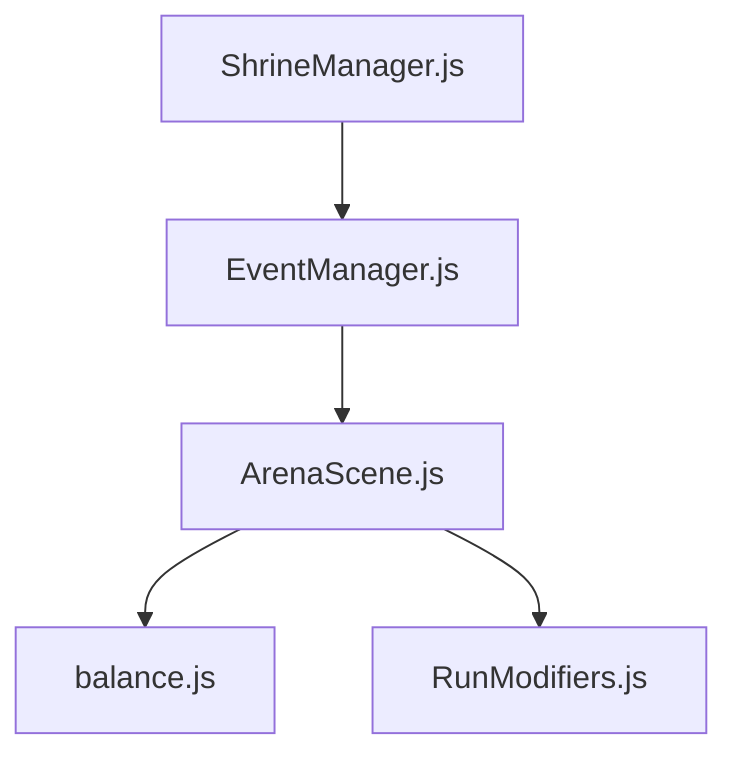

# Dynamic Events

<cite>
**Referenced Files in This Document**
- [EventManager.js](file://src/systems/EventManager.js)
- [ArenaScene.js](file://src/scenes/ArenaScene.js)
- [balance.js](file://src/config/balance.js)
- [RunModifiers.js](file://src/systems/RunModifiers.js)
- [EventManager.test.js](file://src/__tests__/EventManager.test.js)
- [ShrineManager.js](file://src/systems/ShrineManager.js)
</cite>

## Table of Contents
1. [Introduction](#introduction)
2. [Project Structure](#project-structure)
3. [Core Components](#core-components)
4. [Architecture Overview](#architecture-overview)
5. [Detailed Component Analysis](#detailed-component-analysis)
6. [Dependency Analysis](#dependency-analysis)
7. [Performance Considerations](#performance-considerations)
8. [Troubleshooting Guide](#troubleshooting-guide)
9. [Conclusion](#conclusion)

## Introduction
This document explains Vibe-Coder’s dynamic event system that introduces mid-wave chaos to keep gameplay fresh and challenging. It covers event types, timing mechanics, probability calculations, triggers, durations, and player impact. It also details how events are selected, scheduled, and executed during wave progression, and how balance mechanisms ensure events enhance rather than break gameplay. Examples from EventManager.js illustrate registration, triggering, and lifecycle management of events during a run.

## Project Structure
The dynamic event system spans several core files:
- EventManager.js defines event types, selection, scheduling, HUD, and lifecycle.
- ArenaScene.js integrates event triggering at wave start and applies event effects to enemy scaling and XP calculation.
- balance.js provides baseline scaling and difficulty parameters that events modify.
- RunModifiers.js provides run-start modifiers that stack with events for balanced variance.
- EventManager.test.js validates event behavior and state transitions.
- ShrineManager.js demonstrates external systems invoking events for thematic variety.

**Diagram sources**
- [EventManager.js](file://src/systems/EventManager.js#L1-L393)
- [ArenaScene.js](file://src/scenes/ArenaScene.js#L1500-L1699)
- [balance.js](file://src/config/balance.js#L1-L96)
- [RunModifiers.js](file://src/systems/RunModifiers.js#L1-L185)
- [ShrineManager.js](file://src/systems/ShrineManager.js#L518-L553)

**Section sources**
- [EventManager.js](file://src/systems/EventManager.js#L1-L393)
- [ArenaScene.js](file://src/scenes/ArenaScene.js#L1500-L1699)
- [balance.js](file://src/config/balance.js#L1-L96)
- [RunModifiers.js](file://src/systems/RunModifiers.js#L1-L185)
- [ShrineManager.js](file://src/systems/ShrineManager.js#L518-L553)

## Core Components
- EventManager: Central orchestrator for event selection, scheduling, HUD, and cleanup.
- ArenaScene: Triggers events at wave start, applies event effects to enemy scaling and XP, and coordinates wave progression.
- balance.js: Provides baseline scaling parameters that events temporarily amplify or alter.
- RunModifiers: Adds persistent run-start modifiers that combine with events for balanced variation.
- ShrineManager: Demonstrates external systems invoking events for thematic surprises.

Key responsibilities:
- Event selection and probability: Random selection with a fixed per-wave chance and minimum wave threshold.
- Duration and scheduling: Fixed-duration timers with HUD countdown and delayed boss spawns.
- Effects application: Temporary multipliers and flags applied to scene state.
- Cleanup and HUD: Restoration of normal state and removal of visual indicators.

**Section sources**
- [EventManager.js](file://src/systems/EventManager.js#L1-L393)
- [ArenaScene.js](file://src/scenes/ArenaScene.js#L1500-L1699)
- [balance.js](file://src/config/balance.js#L1-L96)
- [RunModifiers.js](file://src/systems/RunModifiers.js#L1-L185)
- [ShrineManager.js](file://src/systems/ShrineManager.js#L518-L553)

## Architecture Overview
The event lifecycle is tightly coupled with ArenaScene’s wave progression. At the start of each wave, ArenaScene checks whether an event should trigger, starts it, and updates HUD visuals. Events modify scene state for the duration of their timer, then are automatically cleared.

**Diagram sources**
- [EventManager.js](file://src/systems/EventManager.js#L80-L128)
- [EventManager.js](file://src/systems/EventManager.js#L221-L343)
- [ArenaScene.js](file://src/scenes/ArenaScene.js#L1520-L1523)

**Section sources**
- [EventManager.js](file://src/systems/EventManager.js#L80-L128)
- [EventManager.js](file://src/systems/EventManager.js#L221-L343)
- [ArenaScene.js](file://src/scenes/ArenaScene.js#L1520-L1523)

## Detailed Component Analysis

### EventManager: Types, Mechanics, and Lifecycle
- Event types and effects:
  - BOSS_INCOMING: Countdown then spawns a mini-boss after duration.
  - DOUBLE_XP: 2x XP multiplier applied to all XP sources.
  - CURSE: All enemies receive a speed boost.
  - JACKPOT: Forces rare weapon drops only.
  - SWARM: Rapid enemy spawns over a short period.
- Probability and timing:
  - Per-wave chance to trigger is configurable.
  - Minimum wave threshold prevents early events.
  - Each event has a fixed duration; HUD reflects remaining time.
- Selection and scheduling:
  - Random selection among available events.
  - Delayed calls schedule boss spawns precisely at end of event duration.
- HUD and cleanup:
  - Animated banner with icon, name, and timer bar.
  - Smooth hide animations and timer bar scaling.
  - Automatic restoration of scene multipliers and flags.

**Diagram sources**
- [EventManager.js](file://src/systems/EventManager.js#L5-L393)

**Section sources**
- [EventManager.js](file://src/systems/EventManager.js#L16-L73)
- [EventManager.js](file://src/systems/EventManager.js#L80-L97)
- [EventManager.js](file://src/systems/EventManager.js#L103-L128)
- [EventManager.js](file://src/systems/EventManager.js#L134-L162)
- [EventManager.js](file://src/systems/EventManager.js#L167-L181)
- [EventManager.js](file://src/systems/EventManager.js#L186-L215)
- [EventManager.js](file://src/systems/EventManager.js#L221-L282)
- [EventManager.js](file://src/systems/EventManager.js#L287-L320)
- [EventManager.js](file://src/systems/EventManager.js#L327-L343)
- [EventManager.js](file://src/systems/EventManager.js#L349-L372)
- [EventManager.js](file://src/systems/EventManager.js#L377-L382)
- [EventManager.js](file://src/systems/EventManager.js#L387-L392)

### ArenaScene Integration: Triggering and Effects
- Triggering: At wave start, ArenaScene calls EventManager.tryTriggerEvent with the current wave number.
- Effects application:
  - Enemy speed is scaled by a scene-level modifier that EventManager sets during events.
  - XP calculation multiplies wave XP rewards by XP multipliers from both events and run modifiers.
- Wave progression: Events do not interrupt boss waves; they coexist with periodic mini-boss waves.

**Diagram sources**
- [ArenaScene.js](file://src/scenes/ArenaScene.js#L1500-L1699)
- [ArenaScene.js](file://src/scenes/ArenaScene.js#L1514-L1523)
- [ArenaScene.js](file://src/scenes/ArenaScene.js#L1568-L1639)
- [ArenaScene.js](file://src/scenes/ArenaScene.js#L1765-L1776)

**Section sources**
- [ArenaScene.js](file://src/scenes/ArenaScene.js#L1514-L1523)
- [ArenaScene.js](file://src/scenes/ArenaScene.js#L1568-L1639)
- [ArenaScene.js](file://src/scenes/ArenaScene.js#L1765-L1776)

### Balance Mechanics: Ensuring Events Enhance Gameplay
- Baseline scaling: balance.js defines enemy damage, speed, and spawn parameters that events either augment or temporarily invert.
- Event stacking: Event multipliers combine with run modifiers to produce a single effective multiplier applied to XP and enemy stats.
- Recovery: Events automatically end and restore normal state, preventing permanent imbalance.

**Diagram sources**
- [balance.js](file://src/config/balance.js#L11-L44)
- [EventManager.js](file://src/systems/EventManager.js#L134-L162)
- [RunModifiers.js](file://src/systems/RunModifiers.js#L91-L121)

**Section sources**
- [balance.js](file://src/config/balance.js#L11-L44)
- [EventManager.js](file://src/systems/EventManager.js#L134-L162)
- [RunModifiers.js](file://src/systems/RunModifiers.js#L91-L121)

### Example: Event Registration, Triggering, and Management
- Registration: Event types are defined centrally in EventManager.EVENTS with id, name, icon, color, duration, and effects.
- Triggering: ArenaScene invokes tryTriggerEvent at wave start; EventManager evaluates eligibility and selects a random event.
- Management: EventManager starts the event, applies effects, shows HUD, schedules special actions, and cleans up on expiration.

Paths to review:
- Event definitions: [EVENTS](file://src/systems/EventManager.js#L16-L73)
- Triggering logic: [tryTriggerEvent](file://src/systems/EventManager.js#L80-L97)
- Starting and scheduling: [startEvent](file://src/systems/EventManager.js#L103-L128)
- HUD and timers: [showEventHUD/update](file://src/systems/EventManager.js#L221-L343)
- Cleanup: [endEvent/clearEventEffects](file://src/systems/EventManager.js#L287-L320)

**Section sources**
- [EventManager.js](file://src/systems/EventManager.js#L16-L73)
- [EventManager.js](file://src/systems/EventManager.js#L80-L97)
- [EventManager.js](file://src/systems/EventManager.js#L103-L128)
- [EventManager.js](file://src/systems/EventManager.js#L221-L343)
- [EventManager.js](file://src/systems/EventManager.js#L287-L320)

### Additional Integration: ShrineManager and External Event Invocation
- Chaos shrine outcomes can trigger events via EventManager.forceEvent, ensuring thematic variety outside of wave progression.
- This pattern maintains consistency with the central EventManager while decentralizing event triggers.

**Section sources**
- [ShrineManager.js](file://src/systems/ShrineManager.js#L518-L553)

## Dependency Analysis
- EventManager depends on ArenaScene for time, camera, and enemy spawning APIs.
- ArenaScene depends on EventManager for event state and effects.
- balance.js underpins enemy scaling and is indirectly affected by event speed modifiers.
- RunModifiers contributes persistent multipliers that compound with event multipliers.

**Diagram sources**
- [EventManager.js](file://src/systems/EventManager.js#L1-L393)
- [ArenaScene.js](file://src/scenes/ArenaScene.js#L1500-L1699)
- [balance.js](file://src/config/balance.js#L1-L96)
- [RunModifiers.js](file://src/systems/RunModifiers.js#L1-L185)
- [ShrineManager.js](file://src/systems/ShrineManager.js#L518-L553)

**Section sources**
- [EventManager.js](file://src/systems/EventManager.js#L1-L393)
- [ArenaScene.js](file://src/scenes/ArenaScene.js#L1500-L1699)
- [balance.js](file://src/config/balance.js#L1-L96)
- [RunModifiers.js](file://src/systems/RunModifiers.js#L1-L185)
- [ShrineManager.js](file://src/systems/ShrineManager.js#L518-L553)

## Performance Considerations
- Event scheduling uses minimal timers and delayed calls; overhead is bounded by event duration.
- HUD updates scale a single rectangle per frame; negligible cost.
- Effects are stored as simple numeric multipliers and flags, avoiding heavy computations.
- Tests confirm deterministic behavior and no memory leaks during lifecycle transitions.

[No sources needed since this section provides general guidance]

## Troubleshooting Guide
Common issues and resolutions:
- Event not triggering:
  - Verify wave number meets minimum threshold and no event is currently active.
  - Confirm per-wave chance is not exhausted by repeated calls.
- Event ends unexpectedly:
  - Check that time comparisons use the scene’s time source and that the event timer is not prematurely cleared.
- Effects not applying:
  - Ensure scene-level multipliers are read during enemy spawn and XP calculations.
- HUD not visible:
  - Confirm HUD creation and tween animations are not interrupted by scene transitions.

Validation references:
- Eligibility and effects: [tryTriggerEvent/getActiveEffects](file://src/systems/EventManager.js#L80-L97), (file://src/systems/EventManager.js#L349-L372)
- Clearing effects: [clearEventEffects](file://src/systems/EventManager.js#L158-L162)
- HUD lifecycle: [showEventHUD/hideEventHUD](file://src/systems/EventManager.js#L221-L282)
- Timer updates: [update](file://src/systems/EventManager.js#L327-L343)

**Section sources**
- [EventManager.js](file://src/systems/EventManager.js#L80-L97)
- [EventManager.js](file://src/systems/EventManager.js#L158-L162)
- [EventManager.js](file://src/systems/EventManager.js#L221-L282)
- [EventManager.js](file://src/systems/EventManager.js#L327-L343)
- [EventManager.js](file://src/systems/EventManager.js#L349-L372)

## Conclusion
Vibe-Coder’s dynamic event system introduces meaningful, temporary variance mid-run through carefully balanced events. EventManager encapsulates selection, scheduling, HUD, and cleanup, while ArenaScene integrates events into wave progression and applies their effects to enemy scaling and XP. balance.js and RunModifiers ensure events remain challenging but fair, and tests validate core behaviors. External integrations like ShrineManager further enrich the experience by offering thematic event invocation.