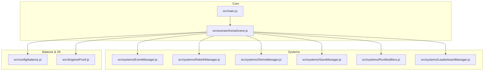
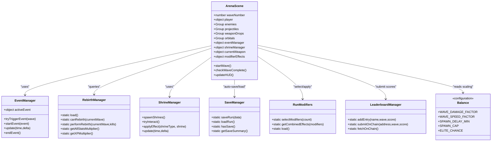
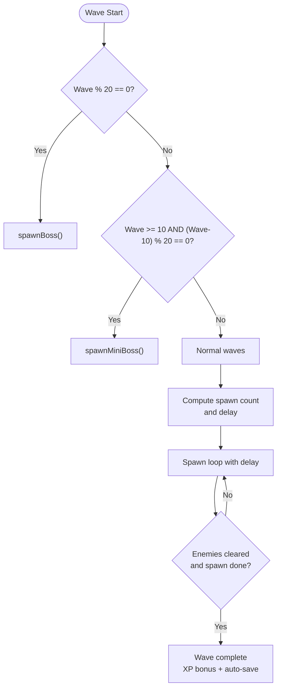
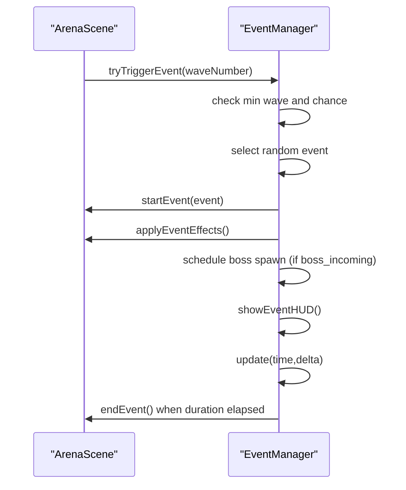
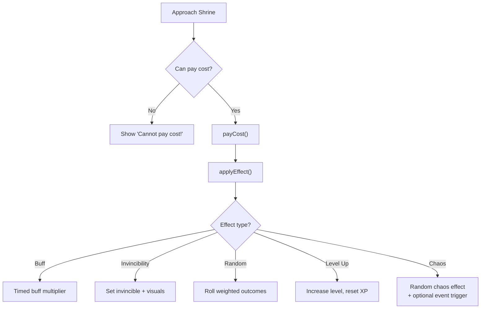
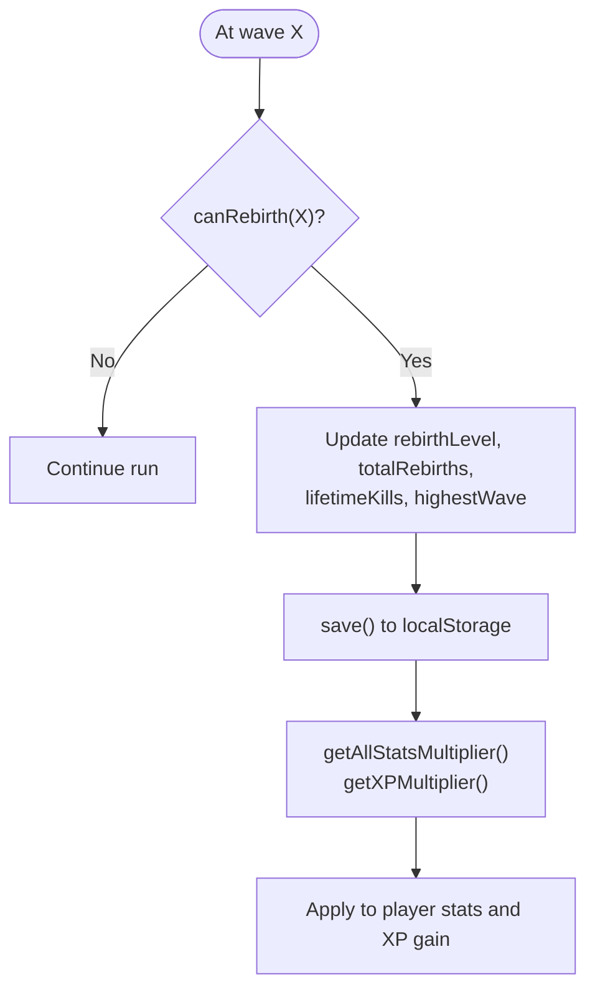
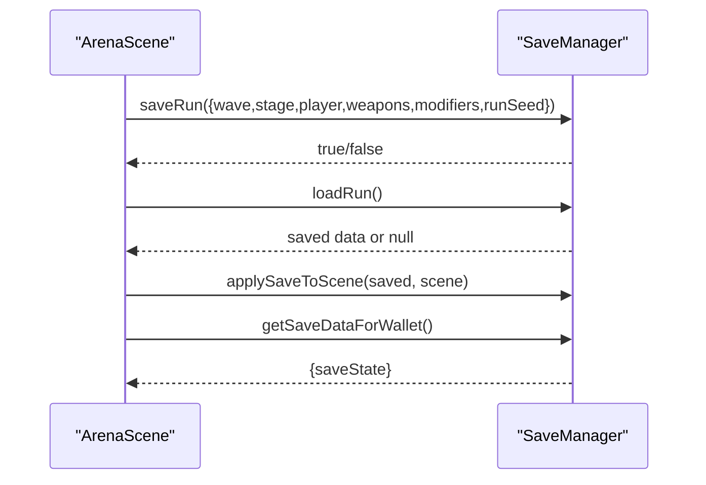
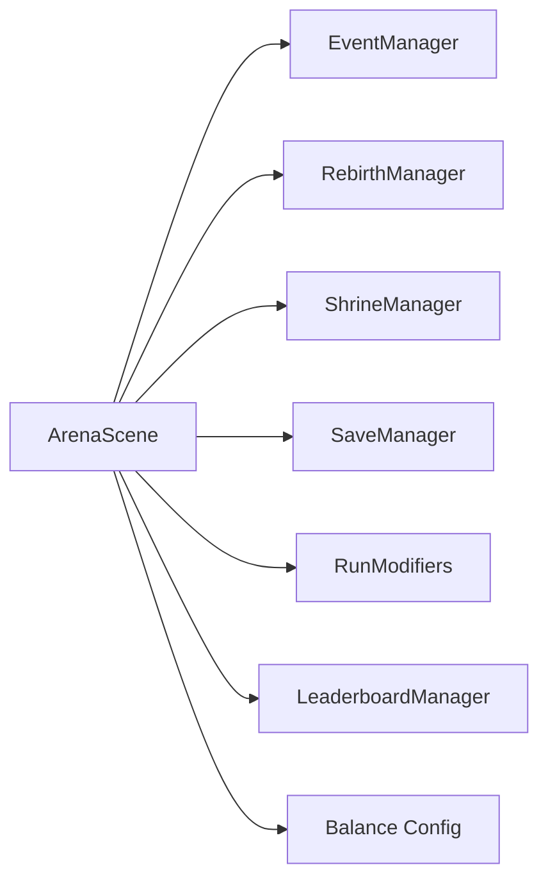

# Game Mechanics

<cite>
**Referenced Files in This Document**
- [src/main.js](file://src/main.js)
- [src/config/balance.js](file://src/config/balance.js)
- [src/systems/EventManager.js](file://src/systems/EventManager.js)
- [src/systems/RebirthManager.js](file://src/systems/RebirthManager.js)
- [src/systems/ShrineManager.js](file://src/systems/ShrineManager.js)
- [src/systems/SaveManager.js](file://src/systems/SaveManager.js)
- [src/systems/RunModifiers.js](file://src/systems/RunModifiers.js)
- [src/systems/LeaderboardManager.js](file://src/systems/LeaderboardManager.js)
- [src/zk/gameProof.js](file://src/zk/gameProof.js)
- [src/scenes/ArenaScene.js](file://src/scenes/ArenaScene.js)
- [src/__tests__/EventManager.test.js](file://src/__tests__/EventManager.test.js)
- [src/__tests__/RebirthManager.test.js](file://src/__tests__/RebirthManager.test.js)
- [src/__tests__/SaveManager.test.js](file://src/__tests__/SaveManager.test.js)
</cite>

## Table of Contents
1. [Introduction](#introduction)
2. [Project Structure](#project-structure)
3. [Core Components](#core-components)
4. [Architecture Overview](#architecture-overview)
5. [Detailed Component Analysis](#detailed-component-analysis)
6. [Dependency Analysis](#dependency-analysis)
7. [Performance Considerations](#performance-considerations)
8. [Troubleshooting Guide](#troubleshooting-guide)
9. [Conclusion](#conclusion)
10. [Appendices](#appendices)

## Introduction
This document explains Vibe-Coder’s Vampire Survivors-style gameplay and progression systems. It covers wave-based combat, enemy scaling, boss encounters, mid-wave chaos events, shrine risk/reward mechanics, the rebirth system, save and progress persistence, statistics and scoring, and difficulty scaling. It also highlights how these systems interact to shape the player experience and provides references to the actual codebase.

## Project Structure
Vibe-Coder is a browser-based top-down shooter built with Phaser. Gameplay logic is organized into systems (Event Manager, Rebirth Manager, Shrine Manager, Save Manager, Run Modifiers), configuration for balance and scaling, and a central scene orchestrating combat, UI, and persistence.

**Diagram sources**
- [src/main.js](file://src/main.js#L1-L464)
- [src/scenes/ArenaScene.js](file://src/scenes/ArenaScene.js#L21-L273)
- [src/systems/EventManager.js](file://src/systems/EventManager.js#L5-L14)
- [src/systems/RebirthManager.js](file://src/systems/RebirthManager.js#L5-L22)
- [src/systems/ShrineManager.js](file://src/systems/ShrineManager.js#L5-L15)
- [src/systems/SaveManager.js](file://src/systems/SaveManager.js#L5-L11)
- [src/systems/RunModifiers.js](file://src/systems/RunModifiers.js#L5-L11)
- [src/systems/LeaderboardManager.js](file://src/systems/LeaderboardManager.js#L18-L23)
- [src/config/balance.js](file://src/config/balance.js#L1-L96)
- [src/zk/gameProof.js](file://src/zk/gameProof.js#L1-L78)

**Section sources**
- [src/main.js](file://src/main.js#L1-L464)
- [src/scenes/ArenaScene.js](file://src/scenes/ArenaScene.js#L21-L273)

## Core Components
- Player progression and XP: VIBE_CODER tracks XP, level, kills, and streak; applies multipliers from upgrades, rebirth, and events.
- Meta-progression upgrades: Persistent upgrades affecting damage, health, speed, attack rate, XP gain, crit chance, and weapon duration.
- Legendary weapons: Permanent unlocks with powerful passive stats; can be equipped for persistent bonuses.
- Wave system: Boss waves every 20 waves, mini-boss waves every 20 starting at wave 10; scalable spawn rates and caps.
- Mid-wave chaos events: Random, timer-based events adding variance (XP boost, speed, rare drops, swarm, boss incoming).
- Shrine system: Risk/reward interactions (heal, level-up, invincibility, gamble, chaos) with costs (health, XP, weapon).
- Run modifiers: Randomized run-start challenges/multipliers (e.g., vampiric enemies, glass cannon, weapon frenzy).
- Save system: Auto-save at wave completion; continue from last checkpoint; integrates with wallet-backed progress.
- Difficulty scaling: Enemy damage/speed scaling by wave and player level; AFK penalties; elite modifier probability.

**Section sources**
- [src/main.js](file://src/main.js#L323-L379)
- [src/main.js](file://src/main.js#L40-L106)
- [src/main.js](file://src/main.js#L112-L210)
- [src/config/balance.js](file://src/config/balance.js#L11-L96)
- [src/systems/EventManager.js](file://src/systems/EventManager.js#L17-L73)
- [src/systems/ShrineManager.js](file://src/systems/ShrineManager.js#L18-L78)
- [src/systems/RunModifiers.js](file://src/systems/RunModifiers.js#L7-L62)
- [src/systems/SaveManager.js](file://src/systems/SaveManager.js#L12-L42)

## Architecture Overview
The ArenaScene coordinates all subsystems. It initializes the player, world, UI, and managers; triggers waves; handles combat; updates HUD; persists progress; and integrates with ZK fairness.

**Diagram sources**
- [src/scenes/ArenaScene.js](file://src/scenes/ArenaScene.js#L21-L273)
- [src/systems/EventManager.js](file://src/systems/EventManager.js#L5-L14)
- [src/systems/RebirthManager.js](file://src/systems/RebirthManager.js#L5-L22)
- [src/systems/ShrineManager.js](file://src/systems/ShrineManager.js#L5-L15)
- [src/systems/SaveManager.js](file://src/systems/SaveManager.js#L5-L11)
- [src/systems/RunModifiers.js](file://src/systems/RunModifiers.js#L5-L11)
- [src/systems/LeaderboardManager.js](file://src/systems/LeaderboardManager.js#L18-L23)
- [src/config/balance.js](file://src/config/balance.js#L11-L96)

## Detailed Component Analysis

### Wave-Based Combat and Scaling
- Boss waves: Every 20 waves, a boss fight occurs; ArenaScene checks and spawns bosses, halts normal spawn, and polls for completion.
- Mini-boss waves: Every 20 waves starting at wave 10 introduces a smaller threat.
- Spawn logic: Spawn count scales with wave using configurable factors and caps; spawn delay decreases with wave to increase density.
- Scaling: Enemy damage/speed scale with wave and player level; global multipliers apply; elites appear with a fixed chance and random modifiers.

**Diagram sources**
- [src/scenes/ArenaScene.js](file://src/scenes/ArenaScene.js#L1493-L1565)
- [src/config/balance.js](file://src/config/balance.js#L11-L44)

**Section sources**
- [src/scenes/ArenaScene.js](file://src/scenes/ArenaScene.js#L1493-L1565)
- [src/config/balance.js](file://src/config/balance.js#L11-L44)

### Mid-Wave Chaos Events
- Random event trigger: After wave start, a small chance (configured) triggers an event if not already active and after a minimum wave threshold.
- Event types: Boss incoming (countdown then boss spawn), double XP, curse (enemy speed boost), jackpot (only rare drops), swarm (rapid spawn).
- Effects: Applied to scene state (XP multiplier, enemy speed modifier, force rare drops flag) and visualized with HUD and announcements.

**Diagram sources**
- [src/systems/EventManager.js](file://src/systems/EventManager.js#L80-L128)
- [src/systems/EventManager.js](file://src/systems/EventManager.js#L134-L162)
- [src/systems/EventManager.js](file://src/systems/EventManager.js#L327-L343)

**Section sources**
- [src/systems/EventManager.js](file://src/systems/EventManager.js#L17-L73)
- [src/systems/EventManager.js](file://src/systems/EventManager.js#L80-L128)
- [src/systems/EventManager.js](file://src/systems/EventManager.js#L134-L162)
- [src/systems/EventManager.js](file://src/systems/EventManager.js#L221-L282)
- [src/systems/EventManager.js](file://src/systems/EventManager.js#L287-L320)
- [src/systems/EventManager.js](file://src/systems/EventManager.js#L327-L343)
- [src/systems/EventManager.js](file://src/systems/EventManager.js#L377-L382)

### Shrine System (Risk/ Reward)
- Types: Power (damage buff), Gamble (random outcome), XP (instant level-up), Shield (invincibility), Chaos (random powerful effect).
- Costs: Health percentage, XP amount, or losing current weapon.
- Effects: Timed buffs, invincibility, weapon drops, full heal, curses, or chaos outcomes including event triggers and boss spawns.
- Interaction: Proximity detection, E-key prompt, cost validation, effect application, and visual feedback.

**Diagram sources**
- [src/systems/ShrineManager.js](file://src/systems/ShrineManager.js#L347-L363)
- [src/systems/ShrineManager.js](file://src/systems/ShrineManager.js#L394-L414)
- [src/systems/ShrineManager.js](file://src/systems/ShrineManager.js#L419-L433)
- [src/systems/ShrineManager.js](file://src/systems/ShrineManager.js#L498-L513)
- [src/systems/ShrineManager.js](file://src/systems/ShrineManager.js#L518-L553)

**Section sources**
- [src/systems/ShrineManager.js](file://src/systems/ShrineManager.js#L18-L78)
- [src/systems/ShrineManager.js](file://src/systems/ShrineManager.js#L347-L363)
- [src/systems/ShrineManager.js](file://src/systems/ShrineManager.js#L394-L414)
- [src/systems/ShrineManager.js](file://src/systems/ShrineManager.js#L419-L433)
- [src/systems/ShrineManager.js](file://src/systems/ShrineManager.js#L498-L513)
- [src/systems/ShrineManager.js](file://src/systems/ShrineManager.js#L518-L553)

### Rebirth System (Meta-Progression)
- Milestones: Reach specific waves to unlock rebirth levels; grants permanent bonuses to all stats and XP gain, plus starting weapon slots.
- Persistence: Stored in localStorage; provides multipliers for stats and XP; tracks lifetime kills and highest wave.
- Starting weapons: Randomly selected from a curated pool based on rebirth level (capped at 3).

**Diagram sources**
- [src/systems/RebirthManager.js](file://src/systems/RebirthManager.js#L63-L75)
- [src/systems/RebirthManager.js](file://src/systems/RebirthManager.js#L83-L103)
- [src/systems/RebirthManager.js](file://src/systems/RebirthManager.js#L109-L121)
- [src/systems/RebirthManager.js](file://src/systems/RebirthManager.js#L158-L171)

**Section sources**
- [src/systems/RebirthManager.js](file://src/systems/RebirthManager.js#L9-L22)
- [src/systems/RebirthManager.js](file://src/systems/RebirthManager.js#L28-L56)
- [src/systems/RebirthManager.js](file://src/systems/RebirthManager.js#L63-L75)
- [src/systems/RebirthManager.js](file://src/systems/RebirthManager.js#L83-L103)
- [src/systems/RebirthManager.js](file://src/systems/RebirthManager.js#L109-L121)
- [src/systems/RebirthManager.js](file://src/systems/RebirthManager.js#L158-L171)

### Save System and Progress Persistence
- Auto-save: Occurs at wave completion with run state (wave, stage, player stats, weapons, modifiers, run seed).
- Continue: Loads saved state into ArenaScene; restores player health, collected and current weapons, and run seed.
- Wallet-backed persistence: Upgrades, legendaries, high wave/score, and save state synchronized via API; supports resetting on disconnect.

**Diagram sources**
- [src/systems/SaveManager.js](file://src/systems/SaveManager.js#L12-L42)
- [src/systems/SaveManager.js](file://src/systems/SaveManager.js#L48-L67)
- [src/systems/SaveManager.js](file://src/systems/SaveManager.js#L149-L185)

**Section sources**
- [src/systems/SaveManager.js](file://src/systems/SaveManager.js#L12-L42)
- [src/systems/SaveManager.js](file://src/systems/SaveManager.js#L48-L67)
- [src/systems/SaveManager.js](file://src/systems/SaveManager.js#L149-L185)

### Run Modifiers (Dynamic Variance)
- Selection: One modifier at run start; increases to two after wave 25.
- Effects: Combine into a single effects object multiplying damage/health, altering weapon duration/drop rate, projectile count, enemy count, wave length, XP multiplier, and vampiric flag.

**Section sources**
- [src/systems/RunModifiers.js](file://src/systems/RunModifiers.js#L72-L84)
- [src/systems/RunModifiers.js](file://src/systems/RunModifiers.js#L91-L121)
- [src/systems/RunModifiers.js](file://src/systems/RunModifiers.js#L127-L134)
- [src/systems/RunModifiers.js](file://src/systems/RunModifiers.js#L140-L159)

### Progression, Scoring, and Statistics
- XP and leveling: XP gained is multiplied by streak, upgrades (xpGain), and rebirth multipliers; level-ups trigger events and full-heal on level-up.
- Scoring: Score equals total XP; leaderboard entries submitted with wave and score.
- HUD: Displays level, XP bar, health, wave, enemies, score, kills, stage, and collected weapons.

**Section sources**
- [src/main.js](file://src/main.js#L323-L379)
- [src/main.js](file://src/main.js#L101-L105)
- [src/systems/LeaderboardManager.js](file://src/systems/LeaderboardManager.js#L56-L72)
- [src/scenes/ArenaScene.js](file://src/scenes/ArenaScene.js#L1262-L1348)

### ZK Fairness and Provably Fair Mechanics
- Run seed: Generated at run start and stored; used to bind results.
- Game hash: SHA-256 over player address, wave, score, seed, and timestamp; used as commitment.
- Rule validation: Enforces score vs wave bounds and sane limits.

**Section sources**
- [src/zk/gameProof.js](file://src/zk/gameProof.js#L29-L42)
- [src/zk/gameProof.js](file://src/zk/gameProof.js#L51-L63)
- [src/zk/gameProof.js](file://src/zk/gameProof.js#L69-L75)

## Dependency Analysis
- ArenaScene depends on EventManager, RebirthManager, ShrineManager, SaveManager, RunModifiers, LeaderboardManager, and Balance.
- EventManager writes to ArenaScene state (multipliers, flags) and reads wave number.
- RebirthManager influences player stats and XP multipliers.
- ShrineManager modifies scene state and player attributes.
- SaveManager persists and restores run state.
- RunModifiers affects spawn counts, XP multipliers, and weapon mechanics.
- Balance defines scaling and thresholds.

**Diagram sources**
- [src/scenes/ArenaScene.js](file://src/scenes/ArenaScene.js#L419-L424)
- [src/systems/EventManager.js](file://src/systems/EventManager.js#L5-L14)
- [src/systems/RebirthManager.js](file://src/systems/RebirthManager.js#L5-L22)
- [src/systems/ShrineManager.js](file://src/systems/ShrineManager.js#L5-L15)
- [src/systems/SaveManager.js](file://src/systems/SaveManager.js#L5-L11)
- [src/systems/RunModifiers.js](file://src/systems/RunModifiers.js#L5-L11)
- [src/systems/LeaderboardManager.js](file://src/systems/LeaderboardManager.js#L18-L23)
- [src/config/balance.js](file://src/config/balance.js#L11-L96)

**Section sources**
- [src/scenes/ArenaScene.js](file://src/scenes/ArenaScene.js#L419-L424)
- [src/systems/EventManager.js](file://src/systems/EventManager.js#L5-L14)
- [src/systems/RebirthManager.js](file://src/systems/RebirthManager.js#L5-L22)
- [src/systems/ShrineManager.js](file://src/systems/ShrineManager.js#L5-L15)
- [src/systems/SaveManager.js](file://src/systems/SaveManager.js#L5-L11)
- [src/systems/RunModifiers.js](file://src/systems/RunModifiers.js#L5-L11)
- [src/systems/LeaderboardManager.js](file://src/systems/LeaderboardManager.js#L18-L23)
- [src/config/balance.js](file://src/config/balance.js#L11-L96)

## Performance Considerations
- Spawn loops and timers: Spawn delays and caps prevent unbounded growth; consider adjusting SPAWN_CAP and SPAWN_DELAY_PER_WAVE for performance on lower-end devices.
- Event HUD: Timers and animations are lightweight; keep event durations moderate to avoid UI thrash.
- Shrine buffs: Timed buffs are tracked in a simple object; ensure frequent updates remain efficient.
- ZK hash computation: SHA-256 is fast in modern browsers; compute off-main-thread if needed for very large runs.
- Collision detection: SpatialHash is initialized; ensure broad-phase culling remains effective as enemy counts grow.

[No sources needed since this section provides general guidance]

## Troubleshooting Guide
- Event already active: tryTriggerEvent returns false if an event is already running; ensure only one event is active at a time.
- Shrine cost not met: canPayCost prevents invalid interactions; verify player health, XP, or weapon state before applying cost.
- Save conflicts/expiry: Saves older than 24 hours are cleared automatically; ensure timely continuation.
- Rebirth milestone not unlocking: canRebirth requires qualifying wave and higher rebirth level than currently stored.

**Section sources**
- [src/systems/EventManager.js](file://src/systems/EventManager.js#L80-L97)
- [src/systems/EventManager.js](file://src/systems/EventManager.js#L158-L162)
- [src/systems/ShrineManager.js](file://src/systems/ShrineManager.js#L347-L363)
- [src/systems/SaveManager.js](file://src/systems/SaveManager.js#L55-L60)
- [src/systems/RebirthManager.js](file://src/systems/RebirthManager.js#L63-L75)

## Conclusion
Vibe-Coder blends Vampire Survivors-style wave-based combat with dynamic mid-wave events, shrine risk/reward decisions, and deep progression via upgrades, legendaries, and rebirth. Difficulty scales with waves and player level, while modifiers and events add variety. Persistence is handled through auto-save and wallet-backed progress, and ZK fairness ensures verifiable run results.

[No sources needed since this section summarizes without analyzing specific files]

## Appendices

### Example References to Code Paths
- Wave start and boss logic: [src/scenes/ArenaScene.js](file://src/scenes/ArenaScene.js#L1493-L1565)
- Event definitions and triggers: [src/systems/EventManager.js](file://src/systems/EventManager.js#L17-L97)
- Shrine types and effects: [src/systems/ShrineManager.js](file://src/systems/ShrineManager.js#L18-L78)
- Rebirth milestones and multipliers: [src/systems/RebirthManager.js](file://src/systems/RebirthManager.js#L9-L22)
- Save lifecycle: [src/systems/SaveManager.js](file://src/systems/SaveManager.js#L12-L42)
- Run modifiers: [src/systems/RunModifiers.js](file://src/systems/RunModifiers.js#L72-L121)
- Balance scaling constants: [src/config/balance.js](file://src/config/balance.js#L11-L96)
- ZK game hash and validation: [src/zk/gameProof.js](file://src/zk/gameProof.js#L29-L63)