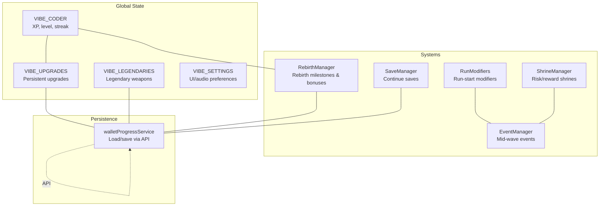
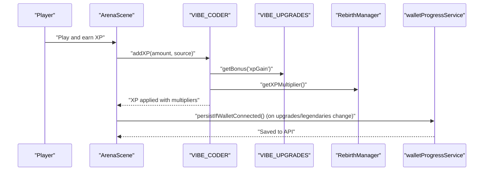
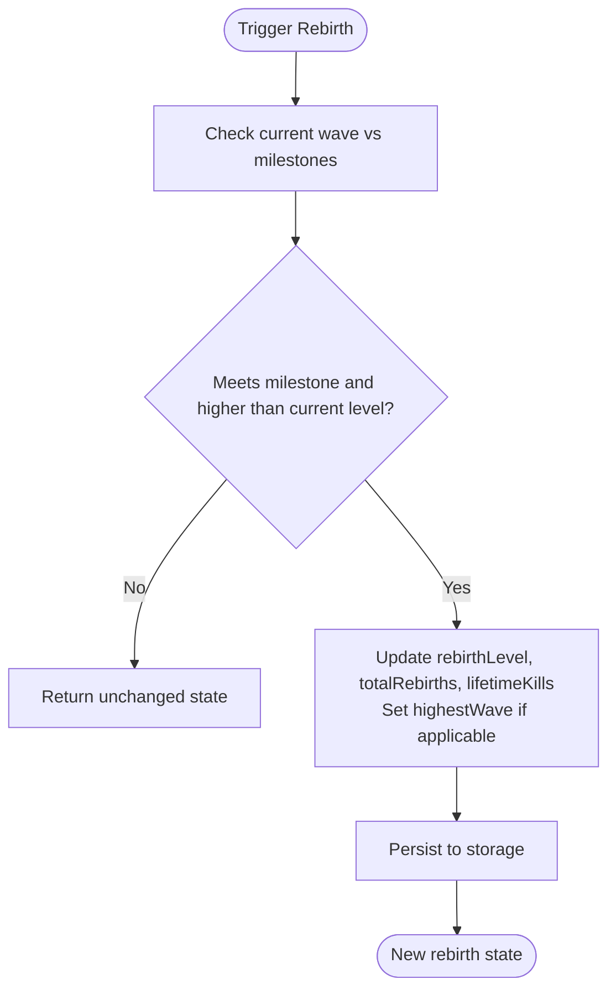
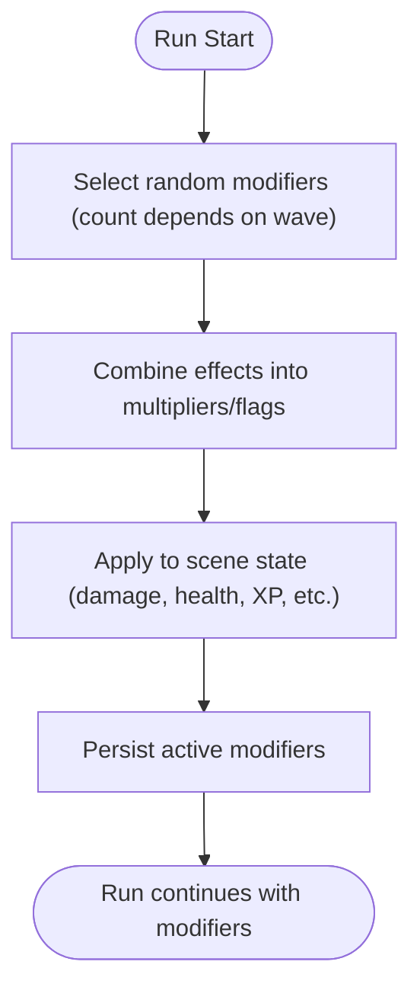
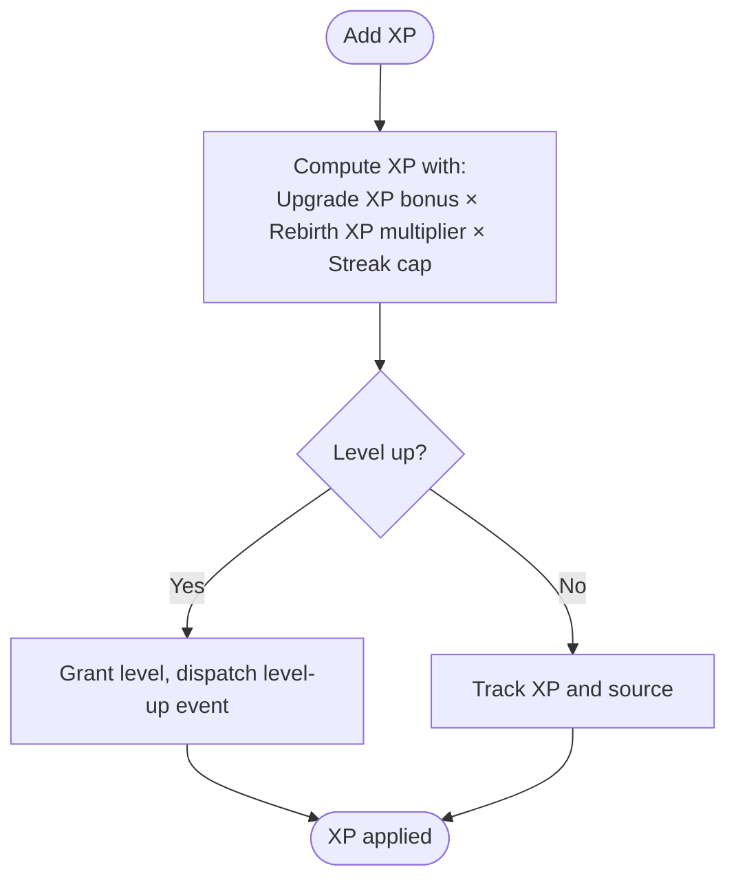
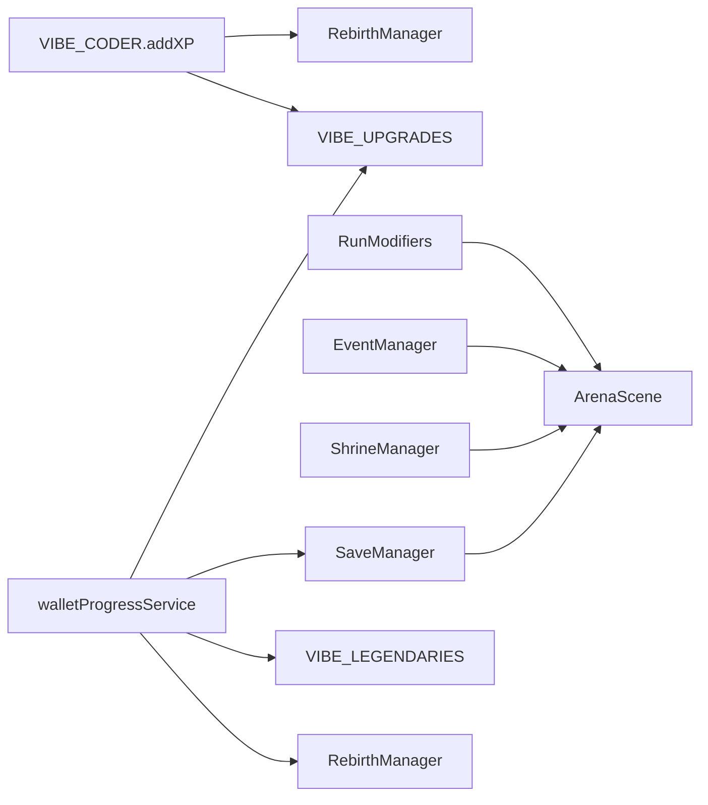

# Progression System

<cite>
**Referenced Files in This Document**
- [RebirthManager.js](file://src/systems/RebirthManager.js)
- [RunModifiers.js](file://src/systems/RunModifiers.js)
- [SaveManager.js](file://src/systems/SaveManager.js)
- [ShrineManager.js](file://src/systems/ShrineManager.js)
- [EventManager.js](file://src/systems/EventManager.js)
- [walletProgressService.js](file://src/utils/walletProgressService.js)
- [main.js](file://src/main.js)
- [balance.js](file://src/config/balance.js)
- [ArenaScene.js](file://src/scenes/ArenaScene.js)
</cite>

## Table of Contents
1. [Introduction](#introduction)
2. [Project Structure](#project-structure)
3. [Core Components](#core-components)
4. [Architecture Overview](#architecture-overview)
5. [Detailed Component Analysis](#detailed-component-analysis)
6. [Dependency Analysis](#dependency-analysis)
7. [Performance Considerations](#performance-considerations)
8. [Troubleshooting Guide](#troubleshooting-guide)
9. [Conclusion](#conclusion)

## Introduction
This document explains Vibe-Coder’s progression system: how permanent upgrades persist across runs, how legendary weapons provide lasting power, how rebirth grants permanent stat increases and run modifier effects, and how progression points are earned and converted into meaningful upgrades. It also clarifies how current run performance feeds into long-term benefits, with concrete examples from RebirthManager.js and RunModifiers.js.

## Project Structure
The progression system spans several core modules:
- Persistent upgrades and currency managed in the global state and saved to a wallet-backed API
- Legendary weapon collection that persists across runs
- Rebirth system that grants permanent bonuses and resets run progress
- Run modifiers that alter difficulty and rewards at run start
- Save system for continue functionality
- Shrine and event systems that influence run performance and rewards

**Diagram sources**
- [main.js](file://src/main.js#L40-L106)
- [RebirthManager.js](file://src/systems/RebirthManager.js#L1-L173)
- [RunModifiers.js](file://src/systems/RunModifiers.js#L1-L185)
- [SaveManager.js](file://src/systems/SaveManager.js#L1-L187)
- [EventManager.js](file://src/systems/EventManager.js#L1-L393)
- [ShrineManager.js](file://src/systems/ShrineManager.js#L1-L658)
- [walletProgressService.js](file://src/utils/walletProgressService.js#L1-L140)

**Section sources**
- [main.js](file://src/main.js#L40-L106)
- [RebirthManager.js](file://src/systems/RebirthManager.js#L1-L173)
- [RunModifiers.js](file://src/systems/RunModifiers.js#L1-L185)
- [SaveManager.js](file://src/systems/SaveManager.js#L1-L187)
- [EventManager.js](file://src/systems/EventManager.js#L1-L393)
- [ShrineManager.js](file://src/systems/ShrineManager.js#L1-L658)
- [walletProgressService.js](file://src/utils/walletProgressService.js#L1-L140)

## Core Components
- Meta-progression upgrades: Persistent across runs, purchased with lifetime currency, applied to stats and XP gain
- Legendary weapons: Rare, permanent unlocks that persist across runs and can be equipped
- Rebirth system: Milestones that grant permanent bonuses and reset run progress
- Run modifiers: Randomly selected at run start, altering difficulty and rewards
- Save system: Allows continuing from checkpoints
- Shrine and event systems: Provide risk/reward mechanics and mid-run variance

**Section sources**
- [main.js](file://src/main.js#L40-L106)
- [walletProgressService.js](file://src/utils/walletProgressService.js#L1-L140)
- [RebirthManager.js](file://src/systems/RebirthManager.js#L1-L173)
- [RunModifiers.js](file://src/systems/RunModifiers.js#L1-L185)
- [SaveManager.js](file://src/systems/SaveManager.js#L1-L187)
- [ShrineManager.js](file://src/systems/ShrineManager.js#L1-L658)
- [EventManager.js](file://src/systems/EventManager.js#L1-L393)

## Architecture Overview
The progression pipeline integrates runtime XP gains, rebirth bonuses, and persistent upgrades. Wallet-backed persistence ensures upgrades and legendaries survive logout/logback in.

**Diagram sources**
- [main.js](file://src/main.js#L323-L379)
- [RebirthManager.js](file://src/systems/RebirthManager.js#L118-L121)
- [walletProgressService.js](file://src/utils/walletProgressService.js#L110-L114)

## Detailed Component Analysis

### Meta-progression Upgrades (Persistent Across Runs)
- Purpose: Permanent stat and XP gain boosts that persist across runs
- Currency: Lifetime currency accumulated at the end of runs
- Purchasing: Costs scale exponentially; purchases update global state and persist via wallet API
- Application: Applied to damage, health, speed, attack rate, XP gain, critical chance, and weapon duration

Key behaviors:
- Upgrade definitions include name, description, max level, cost base/scale, and effect scalar
- Costs computed with exponential scaling
- Bonuses computed as 1 + (level × effect)
- Persistence handled by saving upgrades and currency to the wallet-backed API

**Section sources**
- [main.js](file://src/main.js#L40-L106)
- [walletProgressService.js](file://src/utils/walletProgressService.js#L66-L84)

### Legendary Weapons Collection
- Purpose: Rare, permanent weapon unlocks that persist across runs
- Unlocking: Through in-game drops with extremely low probabilities
- Equipping: One legendary can be equipped at a time, adding unique stats and mechanics
- Persistence: Unlocks and equipped state saved to wallet-backed API

Examples of legendary definitions include high damage, orbital mechanics, and specialized visuals.

**Section sources**
- [main.js](file://src/main.js#L112-L210)
- [walletProgressService.js](file://src/utils/walletProgressService.js#L22-L58)

### Rebirth System Mechanics
- Milestones: Reach specific waves to unlock permanent bonuses
- Bonuses: All stats, XP gain, and starting weapon count increase per rebirth level
- Calculation: Multipliers derived from current rebirth level
- Effects: Grants permanent stat increases and additional starting weapons

**Diagram sources**
- [RebirthManager.js](file://src/systems/RebirthManager.js#L83-L103)

**Section sources**
- [RebirthManager.js](file://src/systems/RebirthManager.js#L1-L173)

### Run Modifiers (Run Start Mutators)
- Selection: Random modifiers chosen at run start; count increases after milestone waves
- Effects: Combine into a single effects object with multipliers and flags
- Persistence: Active modifiers saved to local storage for the run

Modifier categories include vampiric enemies, glass cannon, weapon frenzy, bullet hell, and marathon.

**Diagram sources**
- [RunModifiers.js](file://src/systems/RunModifiers.js#L72-L84)
- [RunModifiers.js](file://src/systems/RunModifiers.js#L91-L121)

**Section sources**
- [RunModifiers.js](file://src/systems/RunModifiers.js#L1-L185)

### Shrine System (Risk/Reward)
- Shrines offer temporary buffs, random outcomes, instant level-ups, invincibility, or chaos effects
- Costs vary (health loss, XP payment, weapon loss)
- Effects applied immediately and tracked with timers; buffs removed when expired

**Section sources**
- [ShrineManager.js](file://src/systems/ShrineManager.js#L1-L658)

### Event System (Mid-Wave Variance)
- Random events occur with a chance per wave after a minimum wave threshold
- Effects include boss incoming, double XP, curse, jackpot (rare drops), and swarm
- Events modify scene state temporarily and are cleared on end

**Section sources**
- [EventManager.js](file://src/systems/EventManager.js#L1-L393)

### Save System (Continue Functionality)
- Auto-saves at wave completion
- Allows resuming from last checkpoint with player stats, weapons, modifiers, and run seed
- Persists locally with age checks and supports restoration from wallet-backed data

**Section sources**
- [SaveManager.js](file://src/systems/SaveManager.js#L1-L187)

### Progression Point Earnings and Conversion
- XP is earned during gameplay and scaled by:
  - Upgrade XP gain bonus
  - Rebirth XP multiplier
  - Streak cap applied to prevent excessive scaling
- At the end of a run, currency is added to VIBE_UPGRADES for future purchases
- Run modifiers and events influence XP rates and drop quality during the run

**Diagram sources**
- [main.js](file://src/main.js#L337-L364)
- [RebirthManager.js](file://src/systems/RebirthManager.js#L118-L121)

**Section sources**
- [main.js](file://src/main.js#L323-L379)
- [balance.js](file://src/config/balance.js#L84-L96)

## Dependency Analysis
- VIBE_CODER.addXP integrates RebirthManager and VIBE_UPGRADES to compute XP multipliers
- RunModifiers combine into scene effects; EventManager modifies XP and enemy speed; ShrineManager applies temporary buffs
- SaveManager coordinates with ArenaScene to restore state; walletProgressService persists upgrades, legendaries, and save state

**Diagram sources**
- [main.js](file://src/main.js#L323-L379)
- [RebirthManager.js](file://src/systems/RebirthManager.js#L1-L173)
- [RunModifiers.js](file://src/systems/RunModifiers.js#L1-L185)
- [EventManager.js](file://src/systems/EventManager.js#L1-L393)
- [ShrineManager.js](file://src/systems/ShrineManager.js#L1-L658)
- [SaveManager.js](file://src/systems/SaveManager.js#L1-L187)
- [walletProgressService.js](file://src/utils/walletProgressService.js#L1-L140)

**Section sources**
- [main.js](file://src/main.js#L323-L379)
- [RebirthManager.js](file://src/systems/RebirthManager.js#L1-L173)
- [RunModifiers.js](file://src/systems/RunModifiers.js#L1-L185)
- [EventManager.js](file://src/systems/EventManager.js#L1-L393)
- [ShrineManager.js](file://src/systems/ShrineManager.js#L1-L658)
- [SaveManager.js](file://src/systems/SaveManager.js#L1-L187)
- [walletProgressService.js](file://src/utils/walletProgressService.js#L1-L140)

## Performance Considerations
- Exponential cost scaling prevents runaway progression costs while maintaining challenge
- Streak caps cap XP scaling to avoid extreme late-game dominance
- Modifier combinations multiply or merge flags; keep effect sets minimal to reduce computation
- Shrine and event timers are lightweight; ensure cleanup on scene shutdown to avoid memory leaks

## Troubleshooting Guide
- Rebirth not triggering: Verify milestone thresholds and that the current wave meets the next milestone and exceeds the current rebirth level
- XP not applying multipliers: Confirm VIBE_UPGRADES.getBonus('xpGain') and RebirthManager.getXPMultiplier() are both invoked and that streak cap is not limiting
- Wallet persistence failing: Check walletProgressService load/save flows and ensure wallet is connected before attempting to persist
- Run modifiers not applied: Confirm RunModifiers.selectModifiers and getCombinedEffects are called at run start and saved to storage

**Section sources**
- [RebirthManager.js](file://src/systems/RebirthManager.js#L63-L75)
- [main.js](file://src/main.js#L344-L348)
- [walletProgressService.js](file://src/utils/walletProgressService.js#L22-L58)
- [RunModifiers.js](file://src/systems/RunModifiers.js#L72-L121)

## Conclusion
Vibe-Coder’s progression system blends short-term run mechanics with long-term, persistent growth. Meta-progression upgrades and legendary weapons provide meaningful, lasting improvements. Rebirth offers permanent stat increases and additional starting weapons, while run modifiers and events shape difficulty and rewards. XP is earned through gameplay and converted into upgrades and legendaries, with wallet-backed persistence ensuring continuity across sessions.