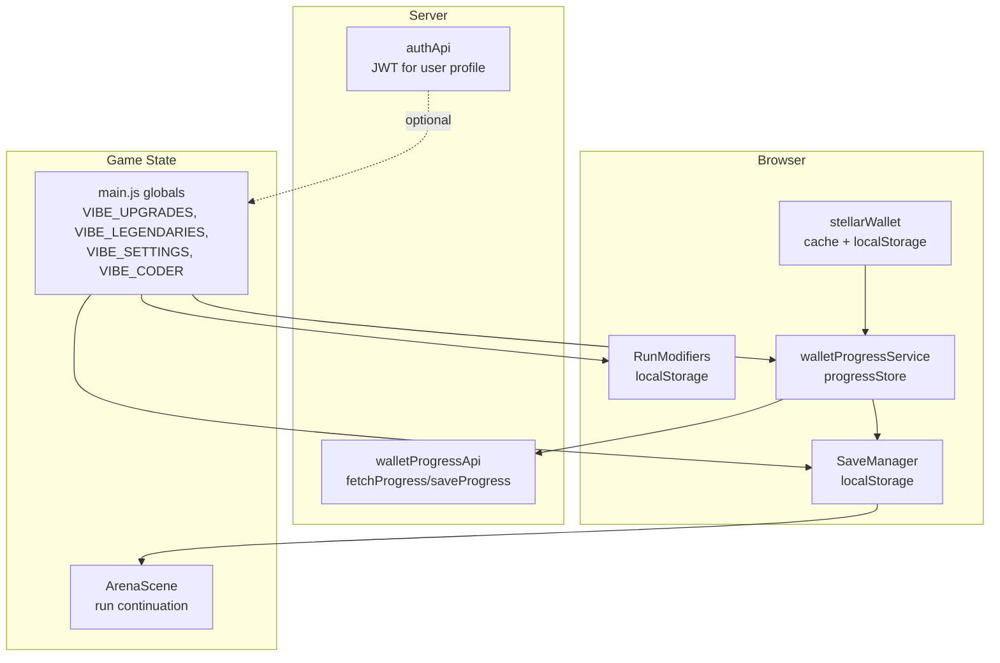
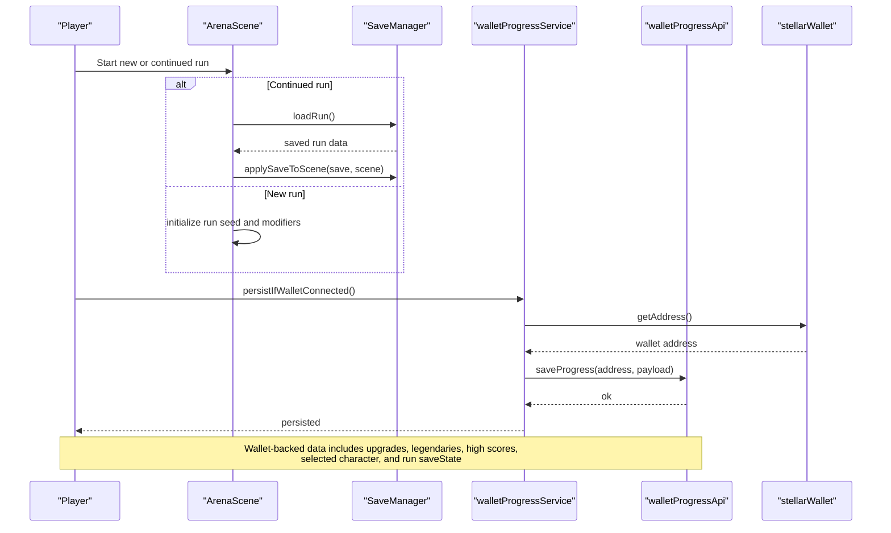
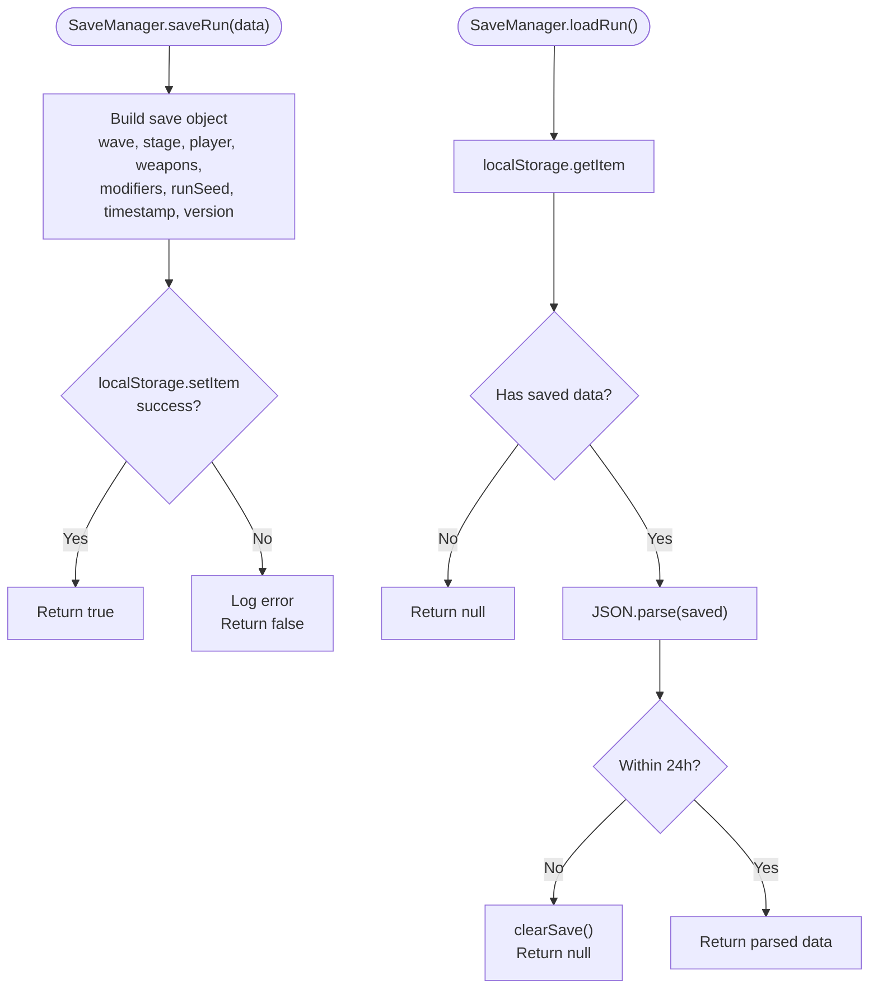
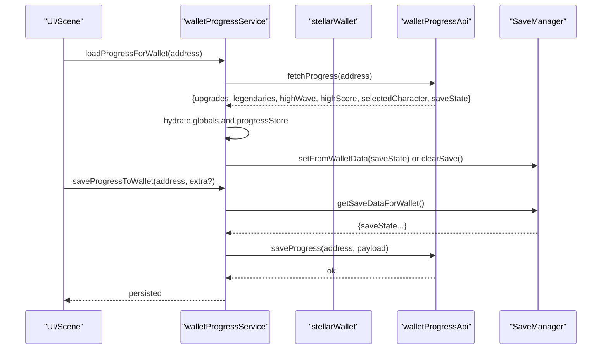
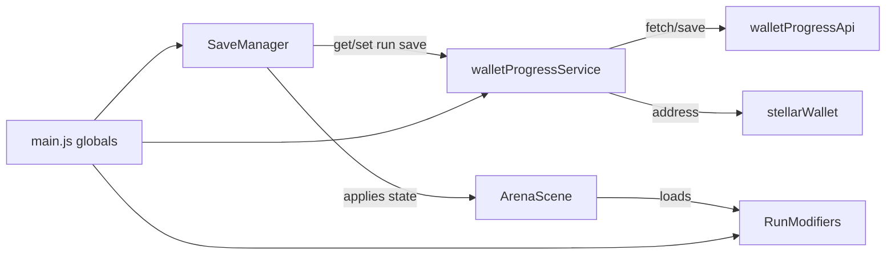

# Save System

<cite>
**Referenced Files in This Document**
- [SaveManager.js](file://src/systems/SaveManager.js)
- [walletProgressService.js](file://src/utils/walletProgressService.js)
- [walletProgressApi.js](file://src/utils/walletProgressApi.js)
- [stellarWallet.js](file://src/utils/stellarWallet.js)
- [main.js](file://src/main.js)
- [ArenaScene.js](file://src/scenes/ArenaScene.js)
- [RunModifiers.js](file://src/systems/RunModifiers.js)
- [SaveManager.test.js](file://src/__tests__/SaveManager.test.js)
- [authApi.js](file://src/utils/authApi.js)
</cite>

## Table of Contents
1. [Introduction](#introduction)
2. [Project Structure](#project-structure)
3. [Core Components](#core-components)
4. [Architecture Overview](#architecture-overview)
5. [Detailed Component Analysis](#detailed-component-analysis)
6. [Dependency Analysis](#dependency-analysis)
7. [Performance Considerations](#performance-considerations)
8. [Troubleshooting Guide](#troubleshooting-guide)
9. [Conclusion](#conclusion)

## Introduction
This document explains Vibe-Coder’s save system and progress persistence. It covers:
- Local save mechanism for run progress, settings, and unlockable content
- Wallet-backed progress system integrated with the Stellar blockchain for persistent character data
- Save data structure (player stats, weapon collections, progression)
- Sync mechanisms between local storage and blockchain-backed API
- Backup, restoration, and migration considerations
- Examples from SaveManager.js and walletProgressService.js showing serialization, storage, and retrieval across sessions

## Project Structure
The save system spans three layers:
- Local persistence: run progress and modifiers saved to browser localStorage
- Wallet-backed persistence: upgrades, legendaries, high scores, selected character, and run save state synchronized via a server API keyed by wallet address
- Global state: shared across scenes and systems via window globals

**Diagram sources**
- [SaveManager.js](file://src/systems/SaveManager.js#L1-L187)
- [walletProgressService.js](file://src/utils/walletProgressService.js#L1-L140)
- [walletProgressApi.js](file://src/utils/walletProgressApi.js#L1-L46)
- [stellarWallet.js](file://src/utils/stellarWallet.js#L1-L115)
- [main.js](file://src/main.js#L40-L317)
- [RunModifiers.js](file://src/systems/RunModifiers.js#L1-L185)
- [ArenaScene.js](file://src/scenes/ArenaScene.js#L368-L396)
- [authApi.js](file://src/utils/authApi.js#L1-L184)

**Section sources**
- [SaveManager.js](file://src/systems/SaveManager.js#L1-L187)
- [walletProgressService.js](file://src/utils/walletProgressService.js#L1-L140)
- [walletProgressApi.js](file://src/utils/walletProgressApi.js#L1-L46)
- [stellarWallet.js](file://src/utils/stellarWallet.js#L1-L115)
- [main.js](file://src/main.js#L40-L317)
- [RunModifiers.js](file://src/systems/RunModifiers.js#L1-L185)
- [ArenaScene.js](file://src/scenes/ArenaScene.js#L368-L396)
- [authApi.js](file://src/utils/authApi.js#L1-L184)

## Core Components
- SaveManager: serializes run state to localStorage, handles expiry, and applies saved state to ArenaScene
- walletProgressService: orchestrates wallet-backed persistence, hydration of global state, and synchronization with the server
- walletProgressApi: low-level fetch-based API to load/save progress keyed by wallet address
- stellarWallet: wallet connection and caching layer for Freighter
- main.js globals: persistent game state (upgrades, legendaries, settings, coder stats)
- RunModifiers: run-start modifiers persisted to localStorage
- ArenaScene: continues runs by applying saved state and initializing run seed

**Section sources**
- [SaveManager.js](file://src/systems/SaveManager.js#L5-L187)
- [walletProgressService.js](file://src/utils/walletProgressService.js#L10-L140)
- [walletProgressApi.js](file://src/utils/walletProgressApi.js#L7-L46)
- [stellarWallet.js](file://src/utils/stellarWallet.js#L9-L115)
- [main.js](file://src/main.js#L40-L317)
- [RunModifiers.js](file://src/systems/RunModifiers.js#L64-L166)
- [ArenaScene.js](file://src/scenes/ArenaScene.js#L368-L396)

## Architecture Overview
The system supports two complementary persistence modes:
- Local-only: run progress and modifiers survive page reloads
- Wallet-backed: upgrades, legendaries, high scores, selected character, and run save state are synced to a server keyed by wallet address

**Diagram sources**
- [ArenaScene.js](file://src/scenes/ArenaScene.js#L368-L396)
- [SaveManager.js](file://src/systems/SaveManager.js#L48-L185)
- [walletProgressService.js](file://src/utils/walletProgressService.js#L110-L114)
- [walletProgressApi.js](file://src/utils/walletProgressApi.js#L29-L45)
- [stellarWallet.js](file://src/utils/stellarWallet.js#L61-L71)

## Detailed Component Analysis

### SaveManager: Local Run Persistence
Responsibilities:
- Serialize run state (wave, stage, player stats, weapons, modifiers, run seed, timestamp, version)
- Save to localStorage with a fixed key
- Load and validate saves (including expiry)
- Provide summaries and time-ago formatting
- Apply saved state to ArenaScene and restore run seed
- Bridge between local and wallet-backed saves

Key behaviors:
- Expiry: automatic removal of saves older than 24 hours
- Versioning: includes a version field to support future migrations
- Safety: JSON parse/ stringify with try/catch to avoid crashes
- Integration: setFromWalletData and getSaveDataForWallet enable seamless sync with wallet-backed API

**Diagram sources**
- [SaveManager.js](file://src/systems/SaveManager.js#L12-L67)

**Section sources**
- [SaveManager.js](file://src/systems/SaveManager.js#L5-L187)
- [SaveManager.test.js](file://src/__tests__/SaveManager.test.js#L48-L212)

### walletProgressService: Wallet-Backed Progress
Responsibilities:
- Hydrate global state from wallet-backed API (upgrades, legendaries, high scores, selected character, run save)
- Persist current state to API when wallet is connected
- Reset progress on disconnect
- Character selection and cycling

Data flow:
- loadProgressForWallet(address): fetches and hydrates VIBE_UPGRADES, VIBE_LEGENDARIES, progressStore, and optionally restores run save via SaveManager
- saveProgressToWallet(address, extra?): builds payload from globals and current SaveManager state, then posts to API
- persistIfWalletConnected(): convenience wrapper to persist when wallet is available
- resetProgressForDisconnect(): clears upgrades, legendaries, high scores, resets selected character, and clears local run save

**Diagram sources**
- [walletProgressService.js](file://src/utils/walletProgressService.js#L22-L84)
- [walletProgressApi.js](file://src/utils/walletProgressApi.js#L15-L45)
- [SaveManager.js](file://src/systems/SaveManager.js#L107-L128)

**Section sources**
- [walletProgressService.js](file://src/utils/walletProgressService.js#L10-L140)
- [walletProgressApi.js](file://src/utils/walletProgressApi.js#L7-L46)
- [SaveManager.js](file://src/systems/SaveManager.js#L107-L128)

### walletProgressApi: Server Interaction
Responsibilities:
- Resolve API base URL from runtime config or environment
- Fetch progress for a wallet address
- Save progress payload for a wallet address

Behavior:
- URL construction supports multiple configuration sources
- Robust error handling with warnings on failures
- Payload includes upgrades, legendaries, high scores, selected character, and run save state

**Section sources**
- [walletProgressApi.js](file://src/utils/walletProgressApi.js#L7-L46)

### stellarWallet: Wallet Connection and Caching
Responsibilities:
- Check Freighter availability
- Connect and cache wallet address
- Retrieve cached address from localStorage
- Sign transactions with Freighter
- Disconnect and clear cache

Integration:
- Used by walletProgressService to gate persistence
- Used by auth flows (outside save scope)

**Section sources**
- [stellarWallet.js](file://src/utils/stellarWallet.js#L9-L115)

### Global State and Run Modifiers
Global state:
- VIBE_UPGRADES: persistent upgrades and currency
- VIBE_LEGENDARIES: unlocked and equipped legendaries
- VIBE_SETTINGS: UI/audio preferences persisted to localStorage
- VIBE_CODER: current run stats (XP, level, kills, streak)

RunModifiers:
- Selected at run start and persisted to localStorage
- Loaded when continuing runs to maintain challenge context

**Section sources**
- [main.js](file://src/main.js#L40-L317)
- [RunModifiers.js](file://src/systems/RunModifiers.js#L64-L166)

### ArenaScene: Continuation and Seed Management
Responsibilities:
- Detect continued runs and load saves
- Apply saved state to scene (wave, stage, player stats, weapons, run seed)
- Initialize run seed when not continuing
- Integrate with modifiers and global state

**Section sources**
- [ArenaScene.js](file://src/scenes/ArenaScene.js#L368-L396)

## Dependency Analysis
- SaveManager depends on localStorage and window.VIBE_CODER for applying state
- walletProgressService depends on SaveManager for run state, stellarWallet for address, and walletProgressApi for server communication
- ArenaScene depends on SaveManager for continuation and on global state for run context
- RunModifiers persists to localStorage independently and integrates with ArenaScene via load/save

**Diagram sources**
- [SaveManager.js](file://src/systems/SaveManager.js#L149-L185)
- [walletProgressService.js](file://src/utils/walletProgressService.js#L22-L84)
- [walletProgressApi.js](file://src/utils/walletProgressApi.js#L15-L45)
- [stellarWallet.js](file://src/utils/stellarWallet.js#L61-L71)
- [RunModifiers.js](file://src/systems/RunModifiers.js#L140-L159)
- [ArenaScene.js](file://src/scenes/ArenaScene.js#L368-L396)
- [main.js](file://src/main.js#L40-L317)

**Section sources**
- [SaveManager.js](file://src/systems/SaveManager.js#L149-L185)
- [walletProgressService.js](file://src/utils/walletProgressService.js#L22-L84)
- [walletProgressApi.js](file://src/utils/walletProgressApi.js#L15-L45)
- [stellarWallet.js](file://src/utils/stellarWallet.js#L61-L71)
- [RunModifiers.js](file://src/systems/RunModifiers.js#L140-L159)
- [ArenaScene.js](file://src/scenes/ArenaScene.js#L368-L396)
- [main.js](file://src/main.js#L40-L317)

## Performance Considerations
- Local saves are lightweight JSON operations; expiry checks add minimal overhead
- Wallet sync occurs on demand (e.g., after purchases or on scene transitions) to minimize network usage
- Run seeds and modifiers are small payloads; their persistence avoids recomputation on continuation
- Consider throttling frequent saves to reduce API churn

## Troubleshooting Guide
Common issues and resolutions:
- Save fails silently
  - Cause: localStorage quota exceeded or permission denied
  - Resolution: Check browser storage quotas; clear caches; retry
  - Evidence: SaveManager returns false on failure
- Expired save ignored
  - Cause: save older than 24 hours
  - Resolution: Continue a new run; re-save after completing a wave
  - Evidence: SaveManager clears expired saves automatically
- Wallet not connected during persistence
  - Cause: No cached address or Freighter unavailable
  - Resolution: Connect wallet; ensure Freighter is installed and authorized
  - Evidence: persistIfWalletConnected returns false when no address
- Corrupted save data
  - Cause: malformed JSON in localStorage
  - Resolution: Clear save; start a new run
  - Evidence: SaveManager.loadRun returns null on parse errors
- Disconnection clears progress
  - Cause: Designed behavior to reset upgrades/legendaries/high scores on disconnect
  - Resolution: Reconnect wallet to reload progress
  - Evidence: resetProgressForDisconnect clears globals and local run save

**Section sources**
- [SaveManager.js](file://src/systems/SaveManager.js#L35-L42)
- [SaveManager.js](file://src/systems/SaveManager.js#L55-L67)
- [walletProgressService.js](file://src/utils/walletProgressService.js#L110-L114)
- [walletProgressService.js](file://src/utils/walletProgressService.js#L89-L105)

## Conclusion
Vibe-Coder’s save system combines resilient local persistence for runs and modifiers with a wallet-backed synchronization layer for upgrades, legendaries, high scores, selected character, and run save state. SaveManager ensures continuity across sessions, while walletProgressService and walletProgressApi provide secure, blockchain-keyed persistence. Together, they deliver a robust, portable gaming experience that respects user ownership and minimizes friction across devices.