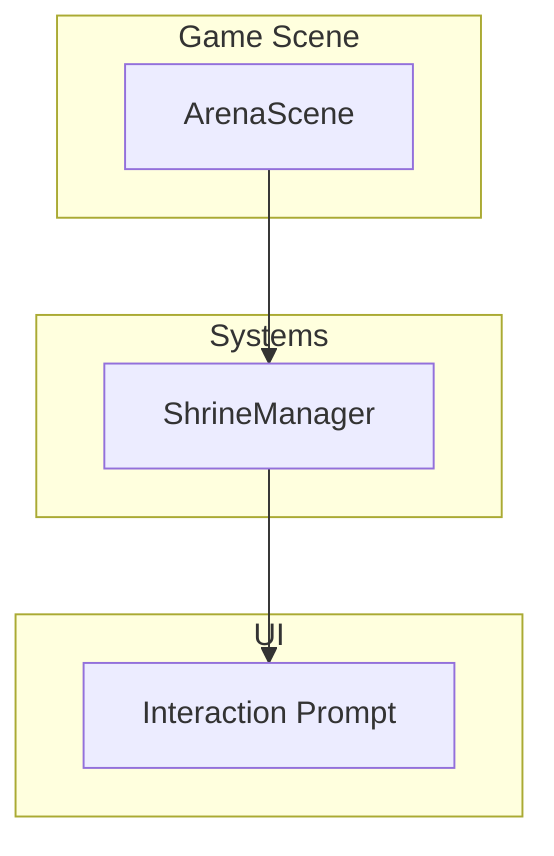
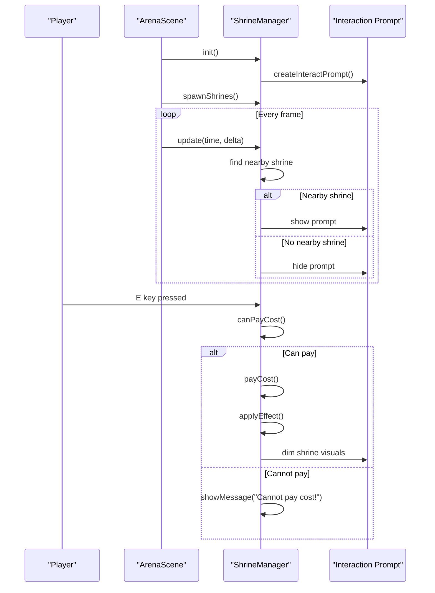
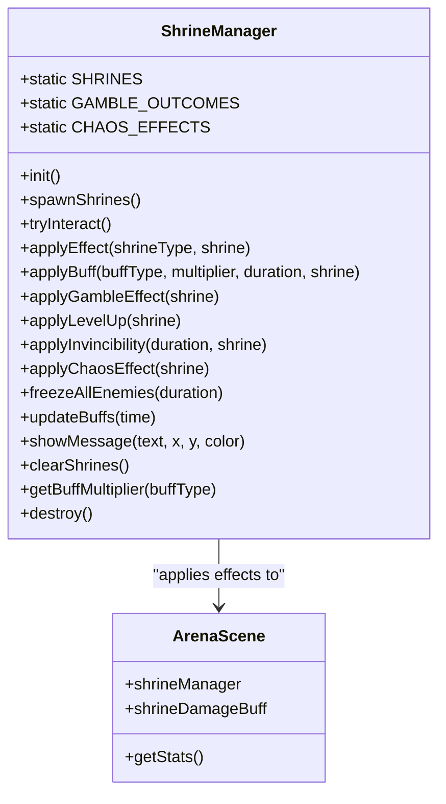
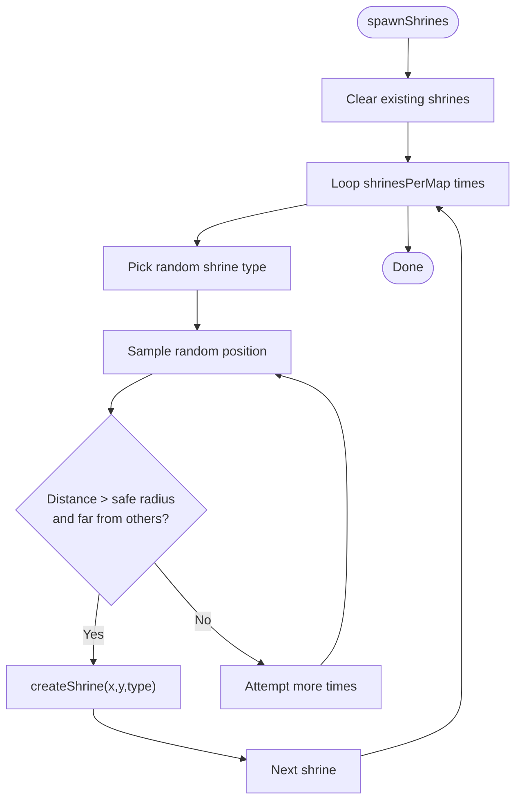
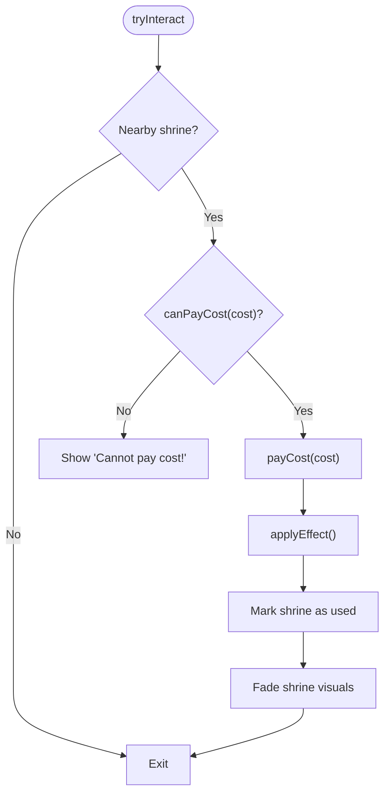
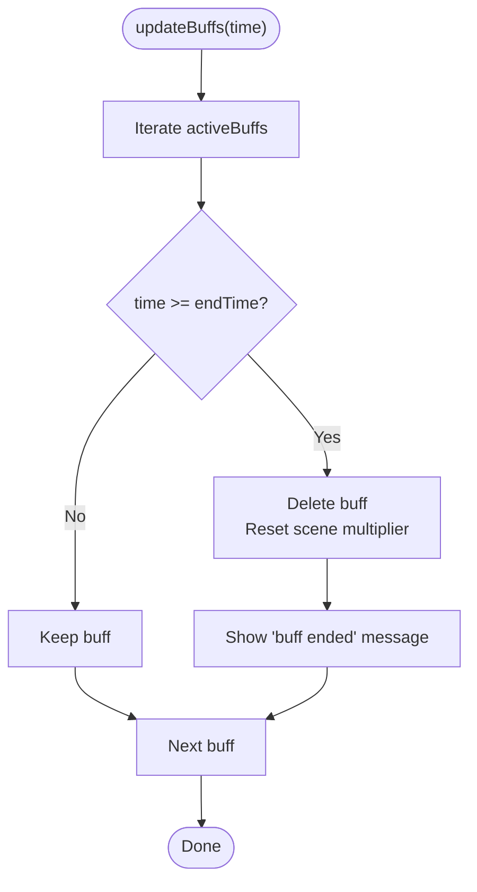
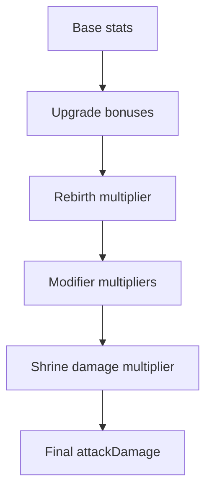
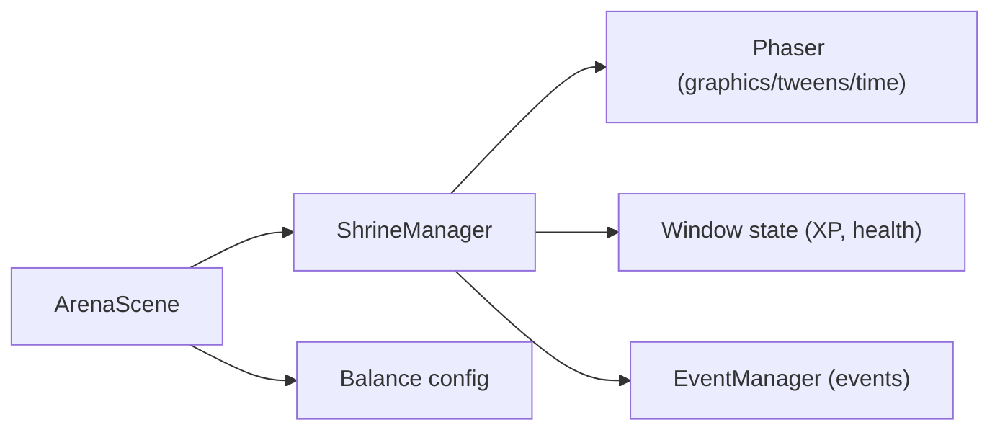

# Shrine System

<cite>
**Referenced Files in This Document**
- [ShrineManager.js](file://src/systems/ShrineManager.js)
- [ArenaScene.js](file://src/scenes/ArenaScene.js)
- [balance.js](file://src/config/balance.js)
- [ShrineManager.test.js](file://src/__tests__/ShrineManager.test.js)
- [GameMechanics.test.js](file://src/__tests__/GameMechanics.test.js)
</cite>

## Table of Contents
1. [Introduction](#introduction)
2. [Project Structure](#project-structure)
3. [Core Components](#core-components)
4. [Architecture Overview](#architecture-overview)
5. [Detailed Component Analysis](#detailed-component-analysis)
6. [Dependency Analysis](#dependency-analysis)
7. [Performance Considerations](#performance-considerations)
8. [Troubleshooting Guide](#troubleshooting-guide)
9. [Conclusion](#conclusion)

## Introduction
This document explains Vibe-Coder’s shrine system mechanics: risk/reward encounters that appear randomly on the map, offering temporary benefits or challenges in exchange for meaningful costs. It covers shrine types, selection and placement mechanics, effect durations, player decision-making factors, and how shrine outcomes integrate into the overall game flow. It also documents balance mechanisms that ensure choices remain meaningful without being exploitative, and provides examples from ShrineManager.js showing how shrine effects are applied and managed during gameplay.

## Project Structure
The shrine system is implemented as a dedicated system integrated into the arena scene. It spawns interactive objects on the map, manages player interactions, applies effects, tracks active buffs, and cleans up visuals and state.

**Diagram sources**
- [ArenaScene.js](file://src/scenes/ArenaScene.js#L422-L425)
- [ShrineManager.js](file://src/systems/ShrineManager.js#L102-L109)

**Section sources**
- [ArenaScene.js](file://src/scenes/ArenaScene.js#L422-L425)
- [ShrineManager.js](file://src/systems/ShrineManager.js#L1-L15)

## Core Components
- ShrineManager: Central class managing shrine definitions, spawning, interactions, costs, effects, and buff tracking.
- ArenaScene: Host scene that initializes and integrates ShrineManager, and applies shrine effects to player stats.

Key responsibilities:
- Define shrine types and outcomes.
- Spawn shrines at valid positions away from the player spawn and other shrines.
- Handle player proximity and interaction prompts.
- Enforce shrine costs and apply effects.
- Manage active buff timers and clean up visuals.

**Section sources**
- [ShrineManager.js](file://src/systems/ShrineManager.js#L17-L78)
- [ShrineManager.js](file://src/systems/ShrineManager.js#L144-L168)
- [ShrineManager.js](file://src/systems/ShrineManager.js#L269-L302)
- [ArenaScene.js](file://src/scenes/ArenaScene.js#L165-L167)

## Architecture Overview
ShrineManager is initialized by ArenaScene and runs alongside the main game loop. It updates proximity detection, renders an interaction prompt, checks costs, applies effects, and manages active buffs.

**Diagram sources**
- [ArenaScene.js](file://src/scenes/ArenaScene.js#L422-L425)
- [ShrineManager.js](file://src/systems/ShrineManager.js#L102-L109)
- [ShrineManager.js](file://src/systems/ShrineManager.js#L144-L168)
- [ShrineManager.js](file://src/systems/ShrineManager.js#L269-L302)
- [ShrineManager.js](file://src/systems/ShrineManager.js#L307-L340)

## Detailed Component Analysis

### Shrine Types and Outcomes
There are five shrine types, each with a distinct risk/reward profile:

- Power Shrine
  - Risk: Health cost (25% of max health).
  - Reward: Temporary damage buff (+50% damage for 30 seconds).
  - Effect type: Timed buff.
  - Duration: 30 seconds.

- Fortune Shrine (Gamble)
  - Risk: Free to interact.
  - Reward: Random outcome selected by weighted probabilities.
  - Outcomes include:
    - Jackpot XP (10 weight): Large XP gain.
    - Weapon Drop (20 weight): Spawns a weapon drop.
    - Full Heal (15 weight): Restore to max health.
    - Curse (25 weight): Spawns multiple enemies over time.
    - Nothing (30 weight): No effect.
  - Effect type: Random weighted outcome.

- Wisdom Shrine (XP)
  - Risk: XP cost (500 XP).
  - Reward: Instant level up.
  - Effect type: Level-up.

- Protection Shrine (Shield)
  - Risk: Lose current weapon (swap to basic).
  - Reward: Temporary invincibility (10 seconds).
  - Effect type: Invincibility.

- Chaos Shrine
  - Risk: Health cost (10% of max health).
  - Reward: Random chaos effect selected uniformly.
  - Effects include:
    - Double XP: Triggers a temporary XP multiplier via event manager.
    - Speed Boost: Temporarily increases movement speed.
    - Invincibility: Short invincibility period.
    - Enemy Freeze: Freezes all enemies for a short time.
    - Random Curse: Triggers a curse event.
    - Spawn Boss: Spawns a mini boss.
  - Effect type: Uniformly random chaos effect.

**Diagram sources**
- [ShrineManager.js](file://src/systems/ShrineManager.js#L17-L78)
- [ShrineManager.js](file://src/systems/ShrineManager.js#L394-L414)
- [ShrineManager.js](file://src/systems/ShrineManager.js#L419-L433)
- [ShrineManager.js](file://src/systems/ShrineManager.js#L438-L477)
- [ShrineManager.js](file://src/systems/ShrineManager.js#L482-L493)
- [ShrineManager.js](file://src/systems/ShrineManager.js#L498-L513)
- [ShrineManager.js](file://src/systems/ShrineManager.js#L518-L553)
- [ArenaScene.js](file://src/scenes/ArenaScene.js#L837-L869)

**Section sources**
- [ShrineManager.js](file://src/systems/ShrineManager.js#L17-L78)
- [ShrineManager.js](file://src/systems/ShrineManager.js#L80-L97)
- [ShrineManager.js](file://src/systems/ShrineManager.js#L394-L414)

### Shrine Selection and Placement
- Number per map: Two shrines are spawned per map.
- Safe zone: Shrines are placed outside a circular safe zone around the player spawn.
- Spacing: Additional distance checks prevent shrines from appearing too close to each other.
- Position sampling: Random sampling with bounded attempts to find valid locations.

**Diagram sources**
- [ShrineManager.js](file://src/systems/ShrineManager.js#L144-L168)
- [ShrineManager.js](file://src/systems/ShrineManager.js#L173-L200)
- [ShrineManager.js](file://src/systems/ShrineManager.js#L208-L262)

**Section sources**
- [ShrineManager.js](file://src/systems/ShrineManager.js#L144-L168)
- [ShrineManager.js](file://src/systems/ShrineManager.js#L173-L200)
- [ShrineManager.js](file://src/systems/ShrineManager.js#L208-L262)

### Interaction Mechanics and Costs
- Proximity detection: The system continuously checks player distance to nearby unused shrines within a fixed radius.
- Interaction prompt: A pulsing prompt appears near the nearest usable shrine.
- Cost checks:
  - Health cost: Requires player health strictly greater than the cost threshold.
  - XP cost: Requires sufficient total XP.
  - Weapon cost: Requires a non-basic weapon to be equipped.
- Payment:
  - Health: Deducts a percentage of max health and updates HUD.
  - XP: Deducts XP from the global state.
  - Weapon: Swaps current weapon to the basic type.
- Visual feedback: Shrines visually dim after use.

**Diagram sources**
- [ShrineManager.js](file://src/systems/ShrineManager.js#L307-L340)
- [ShrineManager.js](file://src/systems/ShrineManager.js#L347-L363)
- [ShrineManager.js](file://src/systems/ShrineManager.js#L369-L387)

**Section sources**
- [ShrineManager.js](file://src/systems/ShrineManager.js#L269-L299)
- [ShrineManager.js](file://src/systems/ShrineManager.js#L307-L340)
- [ShrineManager.js](file://src/systems/ShrineManager.js#L347-L363)
- [ShrineManager.js](file://src/systems/ShrineManager.js#L369-L387)

### Buff Management and Duration
- Active buffs are tracked by type with end times.
- On expiration, the system removes the buff and resets scene state (e.g., damage multiplier).
- Buffs are applied to the scene’s damage multiplier for integration with player stats.

**Diagram sources**
- [ShrineManager.js](file://src/systems/ShrineManager.js#L583-L598)
- [ShrineManager.js](file://src/systems/ShrineManager.js#L419-L433)

**Section sources**
- [ShrineManager.js](file://src/systems/ShrineManager.js#L583-L598)
- [ShrineManager.js](file://src/systems/ShrineManager.js#L419-L433)

### Integration with Player Stats
Shrine effects integrate into the player’s computed stats. The scene’s damage calculation multiplies by the shrine damage multiplier, which is updated when a damage buff is active.

**Diagram sources**
- [ArenaScene.js](file://src/scenes/ArenaScene.js#L837-L869)

**Section sources**
- [ArenaScene.js](file://src/scenes/ArenaScene.js#L837-L869)

### Examples from ShrineManager.js
- Applying a damage buff: [applyBuff](file://src/systems/ShrineManager.js#L419-L433)
- Applying a gamble effect: [applyGambleEffect](file://src/systems/ShrineManager.js#L438-L477)
- Applying level-up: [applyLevelUp](file://src/systems/ShrineManager.js#L482-L493)
- Applying invincibility: [applyInvincibility](file://src/systems/ShrineManager.js#L498-L513)
- Applying chaos effect: [applyChaosEffect](file://src/systems/ShrineManager.js#L518-L553)
- Freezing enemies: [freezeAllEnemies](file://src/systems/ShrineManager.js#L558-L578)

**Section sources**
- [ShrineManager.js](file://src/systems/ShrineManager.js#L419-L433)
- [ShrineManager.js](file://src/systems/ShrineManager.js#L438-L477)
- [ShrineManager.js](file://src/systems/ShrineManager.js#L482-L493)
- [ShrineManager.js](file://src/systems/ShrineManager.js#L498-L513)
- [ShrineManager.js](file://src/systems/ShrineManager.js#L518-L553)
- [ShrineManager.js](file://src/systems/ShrineManager.js#L558-L578)

## Dependency Analysis
- ArenaScene depends on ShrineManager for shrine lifecycle and effects.
- ShrineManager depends on:
  - Phaser for rendering and animations.
  - Window state for XP and health.
  - EventManager for triggering events (e.g., double XP, curses).
- Balance configuration influences overall game difficulty and indirectly shapes the value of shrine choices.

**Diagram sources**
- [ArenaScene.js](file://src/scenes/ArenaScene.js#L12-L19)
- [ShrineManager.js](file://src/systems/ShrineManager.js#L102-L109)
- [balance.js](file://src/config/balance.js#L1-L96)

**Section sources**
- [ArenaScene.js](file://src/scenes/ArenaScene.js#L12-L19)
- [ShrineManager.js](file://src/systems/ShrineManager.js#L102-L109)
- [balance.js](file://src/config/balance.js#L1-L96)

## Performance Considerations
- Rendering: Shrines use simple geometric primitives and animated tweens; performance impact is minimal.
- Updates: Proximity checks iterate over active shrines each frame; keep the number of shrines per map reasonable.
- Buff tracking: Active buffs are stored in a small dictionary keyed by type; lookups are O(1).
- Cleanup: Properly destroys tweens and containers on scene shutdown to prevent memory leaks.

[No sources needed since this section provides general guidance]

## Troubleshooting Guide
Common issues and resolutions:
- Cannot pay cost messages:
  - Verify player health meets the 25% threshold for Power Shrine.
  - Ensure sufficient XP for Wisdom Shrine.
  - Confirm a non-basic weapon is equipped for Protection Shrine.
- Shrine not spawning:
  - Check safe zone and spacing constraints; ensure valid positions are found within the maximum attempts.
- Buff not expiring:
  - Ensure updateBuffs is called regularly and time comparisons are correct.
- Visual artifacts:
  - Confirm shrine visuals are cleared and tweens are stopped on scene destroy.

**Section sources**
- [ShrineManager.js](file://src/systems/ShrineManager.js#L314-L317)
- [ShrineManager.js](file://src/systems/ShrineManager.js#L173-L200)
- [ShrineManager.js](file://src/systems/ShrineManager.js#L583-L598)
- [ShrineManager.js](file://src/systems/ShrineManager.js#L646-L656)

## Conclusion
The shrine system introduces meaningful risk/reward decisions into Vibe-Coder’s gameplay. By balancing costs against short-term benefits and introducing randomized outcomes, it encourages strategic play without being exploitative. The system integrates cleanly with player stats and the broader game flow, enhancing replayability and tactical depth.