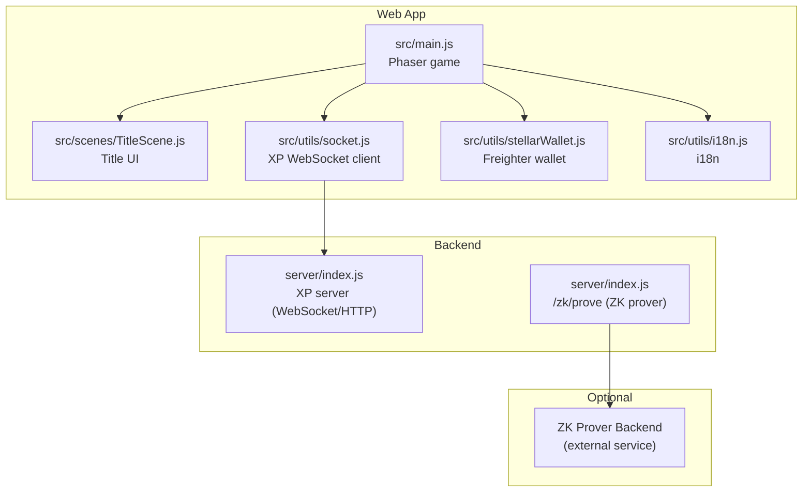
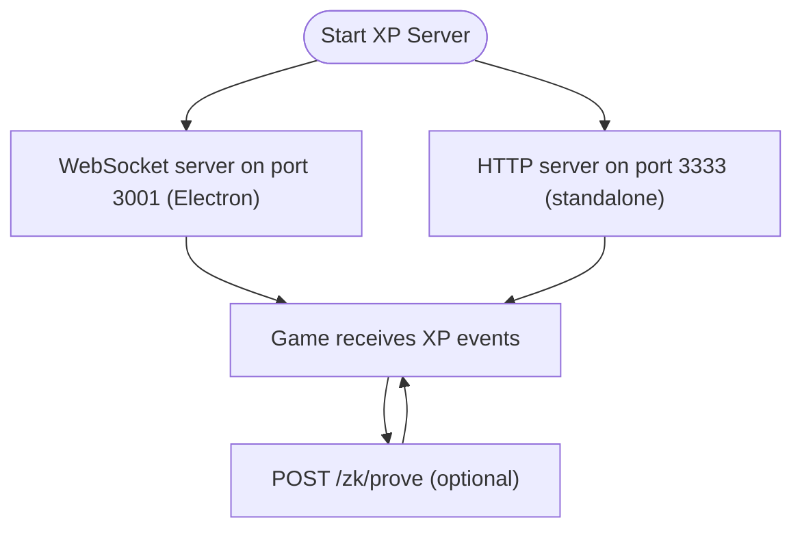
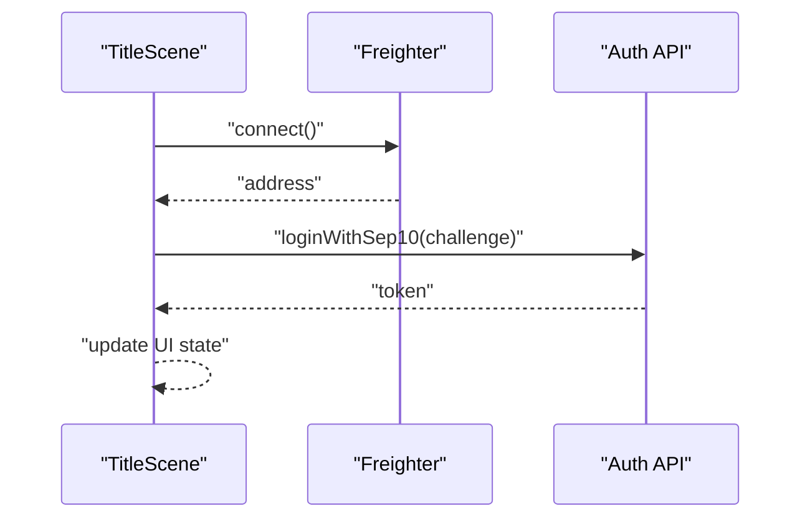
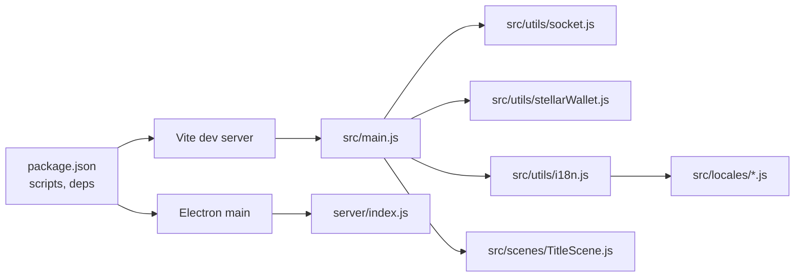

# Getting Started

<cite>
**Referenced Files in This Document**
- [README.md](file://README.md)
- [SETUP.md](file://SETUP.md)
- [package.json](file://package.json)
- [vite.config.js](file://vite.config.js)
- [.env.example](file://.env.example)
- [index.html](file://index.html)
- [src/main.js](file://src/main.js)
- [src/utils/socket.js](file://src/utils/socket.js)
- [src/utils/stellarWallet.js](file://src/utils/stellarWallet.js)
- [src/scenes/TitleScene.js](file://src/scenes/TitleScene.js)
- [src/utils/i18n.js](file://src/utils/i18n.js)
- [src/locales/en.js](file://src/locales/en.js)
- [src/locales/es.js](file://src/locales/es.js)
- [server/index.js](file://server/index.js)
- [docs/DEPLOY_ZK_STEPS.md](file://docs/DEPLOY_ZK_STEPS.md)
- [electron/main.js](file://electron/main.js)
</cite>

## Table of Contents
1. [Introduction](#introduction)
2. [Project Structure](#project-structure)
3. [Core Components](#core-components)
4. [Architecture Overview](#architecture-overview)
5. [Detailed Component Analysis](#detailed-component-analysis)
6. [Dependency Analysis](#dependency-analysis)
7. [Performance Considerations](#performance-considerations)
8. [Troubleshooting Guide](#troubleshooting-guide)
9. [Conclusion](#conclusion)
10. [Appendices](#appendices)

## Introduction
This guide helps you quickly set up and play Vibe-Coder (formerly Cosmic Coder). You can play immediately in the browser or run the project locally for development and optional XP/prover features. The game integrates with Freighter wallet for on-chain ranked submissions and includes a WebSocket-based XP server for live coding rewards.

## Project Structure
At a high level, the project consists of:
- A web-based game built with Phaser 3 and Vite
- A backend XP server (optional) exposing WebSocket and HTTP endpoints
- An optional ZK prover backend for on-chain ranked runs
- Electron packaging for a desktop app variant



**Diagram sources**
- [src/main.js](file://src/main.js#L448-L464)
- [src/scenes/TitleScene.js](file://src/scenes/TitleScene.js#L499-L536)
- [src/utils/socket.js](file://src/utils/socket.js#L18-L104)
- [src/utils/stellarWallet.js](file://src/utils/stellarWallet.js#L39-L53)
- [src/utils/i18n.js](file://src/utils/i18n.js#L19-L26)
- [server/index.js](file://server/index.js#L58-L125)
- [server/index.js](file://server/index.js#L196-L216)

**Section sources**
- [README.md](file://README.md#L115-L135)
- [package.json](file://package.json#L7-L22)

## Core Components
- Game engine: Phaser 3 with Vite dev server
- Wallet integration: Freighter extension for Stellar Testnet
- XP pipeline: WebSocket server broadcasting XP events to the game
- Optional ZK prover: Generates Groth16 proofs for on-chain ranked submissions
- Desktop app: Electron wrapper with built-in XP server and window modes

**Section sources**
- [README.md](file://README.md#L139-L146)
- [package.json](file://package.json#L31-L43)
- [electron/main.js](file://electron/main.js#L128-L144)

## Architecture Overview
The runtime architecture ties together the browser game, optional XP server, optional ZK prover, and wallet authentication.

```mermaid
sequenceDiagram
participant Browser as "Browser Game"
participant Title as "TitleScene UI"
participant Wallet as "Freighter Wallet"
participant Auth as "Auth API"
participant XP as "XP Server"
participant ZK as "ZK Prover"
Browser->>Title : "Load title screen"
Title->>Wallet : "Connect wallet"
Wallet-->>Title : "Address"
Title->>Auth : "SEP-10 challenge/sign/token"
Auth-->>Title : "Session token"
Title-->>Browser : "Connected state"
Browser->>XP : "WebSocket connect (localhost)"
XP-->>Browser : "Broadcast XP events"
Browser->>ZK : "POST /zk/prove (ranked runs)"
ZK-->>Browser : "Proof + verification key"
```

**Diagram sources**
- [src/scenes/TitleScene.js](file://src/scenes/TitleScene.js#L514-L527)
- [src/utils/stellarWallet.js](file://src/utils/stellarWallet.js#L39-L53)
- [src/utils/socket.js](file://src/utils/socket.js#L18-L104)
- [server/index.js](file://server/index.js#L196-L216)

## Detailed Component Analysis

### Prerequisites
- Node.js 18+ and npm
- A modern browser with WebSocket support
- Optional: Rust toolchain for building contracts (if you plan to deploy ZK contracts)
- Optional: Freighter extension for wallet connectivity

**Section sources**
- [SETUP.md](file://SETUP.md#L19-L23)
- [README.md](file://README.md#L23-L36)

### Quick Start: Play in the Browser
- Play instantly without installing anything: https://klorenn.github.io/Cosmic-Coder-/
- On mobile, rotate to landscape and connect Freighter wallet on the title screen.

**Section sources**
- [README.md](file://README.md#L25-L28)

### Quick Start: Local Development
- Install dependencies and run the dev server:
  - npm install
  - npm run dev
- Open http://localhost:3000
- Optional: npm run server for the XP WebSocket server (port 3333)

**Section sources**
- [README.md](file://README.md#L30-L36)
- [SETUP.md](file://SETUP.md#L24-L47)
- [vite.config.js](file://vite.config.js#L13-L25)

### Optional: XP Server and Prover Backend
- XP server: Runs on ws://localhost:3001 (Electron built-in) or http://localhost:3333 (standalone). It exposes:
  - WebSocket: Broadcasts XP events to the game
  - HTTP: Accepts events and CLI endpoints for XP injection
- ZK prover: Exposes POST /zk/prove for generating Groth16 proofs for ranked runs



**Diagram sources**
- [electron/main.js](file://electron/main.js#L128-L144)
- [server/index.js](file://server/index.js#L58-L125)
- [server/index.js](file://server/index.js#L196-L216)

**Section sources**
- [server/index.js](file://server/index.js#L58-L125)
- [server/index.js](file://server/index.js#L196-L216)
- [src/utils/socket.js](file://src/utils/socket.js#L18-L104)

### Initial Configuration
- Frontend environment:
  - Copy .env.example to .env and set:
    - VITE_SHADOW_ASCENSION_CONTRACT_ID (for on-chain ranked)
    - VITE_ZK_PROVER_URL (point to your prover backend)
    - VITE_API_URL (for auth/progress endpoints)
- Backend environment (optional):
  - Configure SEP-10 auth, signing keys, JWT secrets, and Supabase credentials as needed

**Section sources**
- [.env.example](file://.env.example#L5-L37)
- [docs/DEPLOY_ZK_STEPS.md](file://docs/DEPLOY_ZK_STEPS.md#L70-L79)

### Wallet Connection Process
- From the title screen, click the wallet button to connect Freighter.
- The game authenticates via SEP-10 challenge/sign/token with the backend.
- After successful authentication, your wallet address is cached and used for on-chain actions.



**Diagram sources**
- [src/scenes/TitleScene.js](file://src/scenes/TitleScene.js#L514-L527)
- [src/utils/stellarWallet.js](file://src/utils/stellarWallet.js#L39-L53)

**Section sources**
- [src/scenes/TitleScene.js](file://src/scenes/TitleScene.js#L514-L536)
- [src/utils/stellarWallet.js](file://src/utils/stellarWallet.js#L39-L53)

### First Run Walkthrough
- On first launch, you may be prompted to set a username.
- Select your character and configure settings (language, sound, auto-move).
- Start a run and watch XP increase either from manual actions or live XP events.

**Section sources**
- [src/scenes/TitleScene.js](file://src/scenes/TitleScene.js#L604-L703)
- [src/main.js](file://src/main.js#L232-L317)

### Language Settings and Basic Controls
- Language: English and Spanish. Change in Settings → LANGUAGE.
- Controls:
  - WASD/Arrows: Move
  - SPACE: Manual XP (when XP server is offline)
  - M: Toggle music
  - ESC/P: Pause

**Section sources**
- [src/utils/i18n.js](file://src/utils/i18n.js#L19-L26)
- [src/locales/en.js](file://src/locales/en.js#L118-L124)
- [src/locales/es.js](file://src/locales/es.js#L117-L123)
- [src/locales/en.js](file://src/locales/en.js#L89-L99)
- [src/locales/es.js](file://src/locales/es.js#L88-L98)

### Desktop App (Electron)
- The Electron app bundles the game and can run a built-in XP server.
- Window modes and always-on-top are configurable via tray menu and settings.

**Section sources**
- [electron/main.js](file://electron/main.js#L128-L144)
- [electron/main.js](file://electron/main.js#L95-L110)

## Dependency Analysis
High-level dependencies and entry points:



**Diagram sources**
- [package.json](file://package.json#L7-L22)
- [vite.config.js](file://vite.config.js#L11-L33)
- [src/main.js](file://src/main.js#L1-L15)
- [src/utils/socket.js](file://src/utils/socket.js#L1-L12)
- [src/utils/stellarWallet.js](file://src/utils/stellarWallet.js#L1-L12)
- [src/utils/i18n.js](file://src/utils/i18n.js#L1-L12)
- [src/locales/en.js](file://src/locales/en.js#L1-L10)
- [src/locales/es.js](file://src/locales/es.js#L1-L10)
- [electron/main.js](file://electron/main.js#L1-L12)
- [server/index.js](file://server/index.js#L1-L12)

**Section sources**
- [package.json](file://package.json#L31-L43)
- [vite.config.js](file://vite.config.js#L11-L33)

## Performance Considerations
- Use the dev server for iteration; production builds are optimized for distribution.
- Keep assets organized under public/assets to avoid bundling overhead.
- Disable debug features in production builds.

[No sources needed since this section provides general guidance]

## Troubleshooting Guide
Common issues and resolutions:
- XP server not running:
  - Ensure the XP server is started (npm run server) and accessible on ws://localhost:3001 or http://localhost:3333.
- XP not appearing:
  - Confirm the hook is executable and the game is connected (status indicator).
- Character not auto-moving:
  - Auto-move requires XP events from the XP server; otherwise use SPACE for manual XP.
- Assets missing on title screen:
  - Verify required sprite files exist and restart the dev server.
- Game not loading:
  - Use npm run dev (not a static file server), clear cache, and check browser console.
- Wallet connection errors:
  - Install Freighter and try connecting again; on mobile, use the Freighter app browser.

**Section sources**
- [SETUP.md](file://SETUP.md#L109-L143)
- [src/utils/socket.js](file://src/utils/socket.js#L18-L104)
- [src/utils/stellarWallet.js](file://src/utils/stellarWallet.js#L39-L53)

## Conclusion
You now have the essentials to play Vibe-Coder in the browser and run it locally for development. Connect your wallet, optionally run the XP server, and explore ranked submissions with the ZK prover backend when configured.

[No sources needed since this section summarizes without analyzing specific files]

## Appendices

### Verification Steps
- Confirm the dev server is running at http://localhost:3000.
- Verify the title screen shows a live/offline status indicator.
- Connect Freighter and authenticate via SEP-10.
- Optionally start the XP server and confirm XP events arrive in the game.
- For ranked runs, ensure VITE_SHADOW_ASCENSION_CONTRACT_ID and VITE_ZK_PROVER_URL are set and the prover responds to /zk/prove.

**Section sources**
- [README.md](file://README.md#L30-L36)
- [src/scenes/TitleScene.js](file://src/scenes/TitleScene.js#L514-L536)
- [server/index.js](file://server/index.js#L196-L216)
- [.env.example](file://.env.example#L5-L11)