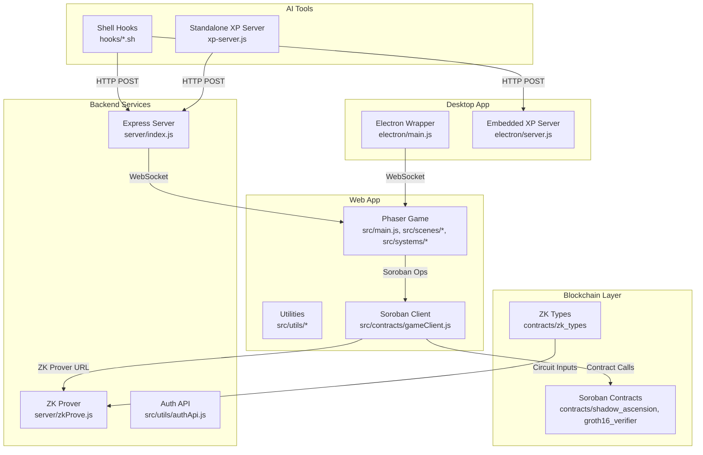
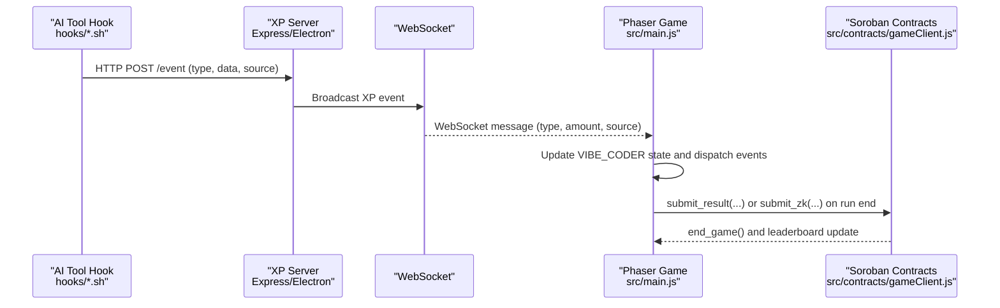
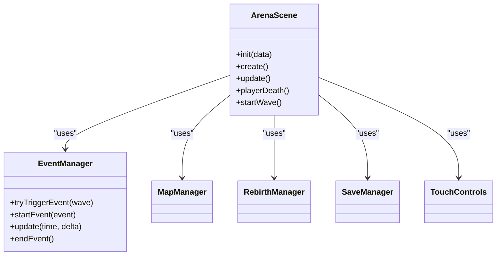
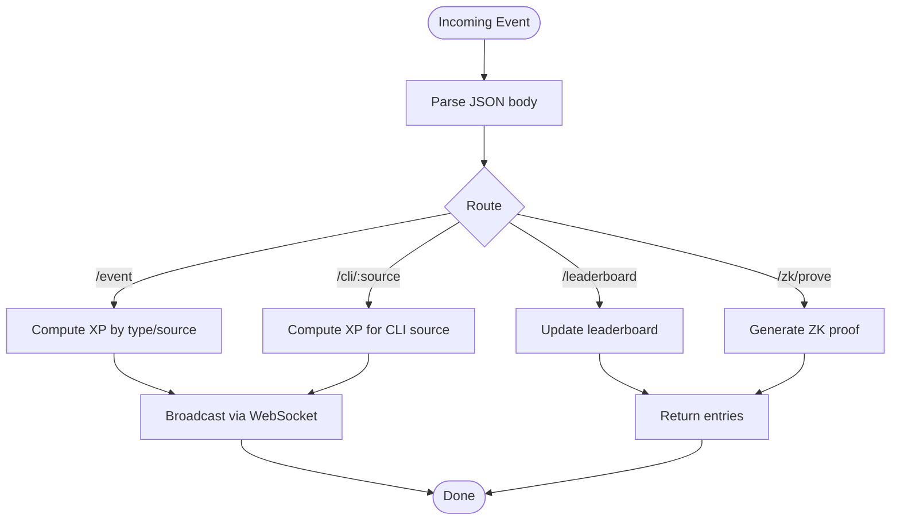
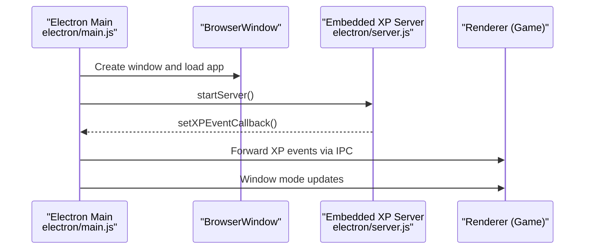
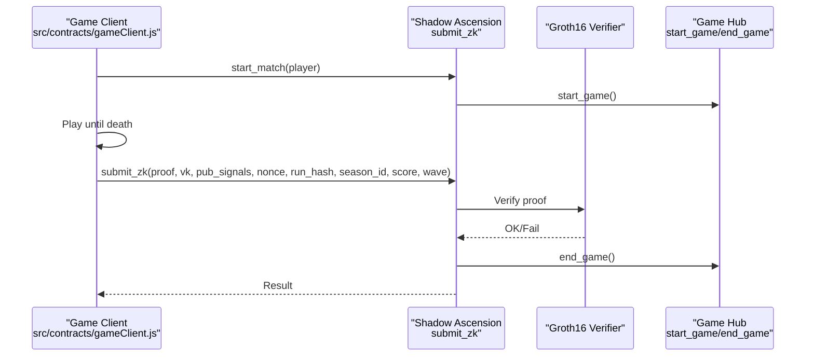
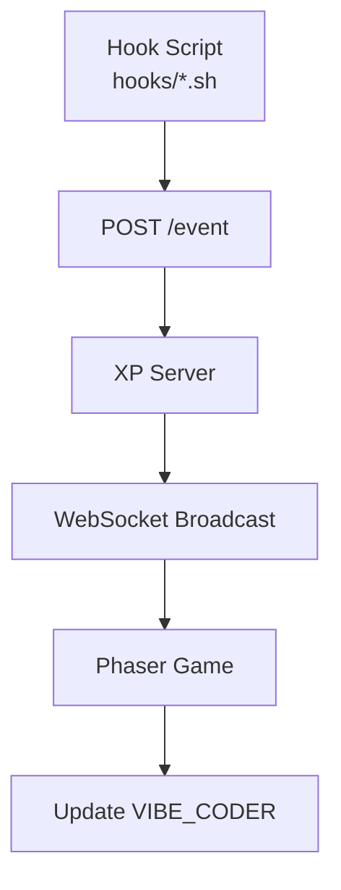
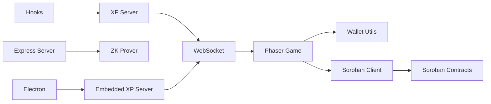

# Architecture Overview

<cite>
**Referenced Files in This Document**
- [package.json](file://package.json)
- [README.md](file://README.md)
- [src/main.js](file://src/main.js)
- [src/scenes/ArenaScene.js](file://src/scenes/ArenaScene.js)
- [src/systems/EventManager.js](file://src/systems/EventManager.js)
- [src/utils/socket.js](file://src/utils/socket.js)
- [src/utils/walletProgressService.js](file://src/utils/walletProgressService.js)
- [src/utils/authApi.js](file://src/utils/authApi.js)
- [src/utils/stellarWallet.js](file://src/utils/stellarWallet.js)
- [src/utils/device.js](file://src/utils/device.js)
- [src/contracts/gameClient.js](file://src/contracts/gameClient.js)
- [src/zk/gameProof.js](file://src/zk/gameProof.js)
- [server/index.js](file://server/index.js)
- [server/zkProve.js](file://server/zkProve.js)
- [electron/main.js](file://electron/main.js)
- [electron/server.js](file://electron/server.js)
- [xp-server.js](file://xp-server.js)
- [hooks/vibe-coder-hook.sh](file://hooks/vibe-coder-hook.sh)
</cite>

## Table of Contents
1. [Introduction](#introduction)
2. [Project Structure](#project-structure)
3. [Core Components](#core-components)
4. [Architecture Overview](#architecture-overview)
5. [Detailed Component Analysis](#detailed-component-analysis)
6. [Dependency Analysis](#dependency-analysis)
7. [Performance Considerations](#performance-considerations)
8. [Troubleshooting Guide](#troubleshooting-guide)
9. [Conclusion](#conclusion)
10. [Appendices](#appendices)

## Introduction
This document describes the Vibe-Coder system architecture across four main layers:
- Frontend game engine (Phaser 3)
- Backend services (Express server and optional Electron-built XP server)
- Blockchain layer (Soroban contracts and zero-knowledge proofs)
- AI tool integration layer (IDE/AI hooks feeding XP events)

It explains how AI tool activities are captured, streamed via WebSocket to the game, and translated into real-time XP accumulation. It also documents the event-driven architecture, plugin-style hooks, modular scalability, cross-platform support, and the role of zero-knowledge proofs in maintaining system integrity.

## Project Structure
The repository is organized into distinct areas:
- src: Phaser-based game logic, scenes, systems, utilities, and contracts
- server: Express server exposing APIs for auth, XP broadcasting, leaderboard, and ZK proof generation
- electron: Desktop app wrapper with an embedded XP server and tray integration
- hooks: Shell scripts to integrate AI/IDE tools with the XP pipeline
- circuits and contracts: ZK circuit and Rust-based Soroban contracts
- public/dist: Web assets and built distribution

**Diagram sources**
- [src/main.js](file://src/main.js#L1-L464)
- [src/scenes/ArenaScene.js](file://src/scenes/ArenaScene.js#L1-L800)
- [src/systems/EventManager.js](file://src/systems/EventManager.js#L1-L393)
- [src/utils/socket.js](file://src/utils/socket.js#L1-L121)
- [src/utils/walletProgressService.js](file://src/utils/walletProgressService.js#L1-L140)
- [src/utils/authApi.js](file://src/utils/authApi.js#L1-L184)
- [src/utils/stellarWallet.js](file://src/utils/stellarWallet.js#L1-L115)
- [src/contracts/gameClient.js](file://src/contracts/gameClient.js#L1-L401)
- [src/zk/gameProof.js](file://src/zk/gameProof.js#L1-L78)
- [server/index.js](file://server/index.js#L1-L246)
- [server/zkProve.js](file://server/zkProve.js#L1-L68)
- [electron/main.js](file://electron/main.js#L1-L274)
- [electron/server.js](file://electron/server.js#L1-L183)
- [xp-server.js](file://xp-server.js#L1-L106)
- [hooks/vibe-coder-hook.sh](file://hooks/vibe-coder-hook.sh#L1-L24)

**Section sources**
- [package.json](file://package.json#L1-L135)
- [README.md](file://README.md#L1-L158)

## Core Components
- Frontend game engine (Phaser 3): Initializes scenes, manages XP state, event listeners, and integrates with WebSocket XP server. It also coordinates with Soroban contracts for blockchain operations and ZK proof submission.
- Backend services (Express): Provides auth endpoints, XP broadcasting, leaderboard, and ZK proof generation. It supports optional CORS and health checks.
- Desktop app (Electron): Wraps the web app, embeds an XP server, and exposes tray controls and window modes.
- Blockchain layer (Soroban): Implements game lifecycle and leaderboard via contract calls, and validates ZK proofs using a Groth16 verifier.
- AI tool integration: Shell hooks capture AI/IDE events and POST them to the XP server(s), enabling real-time XP streaming.

**Section sources**
- [src/main.js](file://src/main.js#L1-L464)
- [server/index.js](file://server/index.js#L1-L246)
- [electron/main.js](file://electron/main.js#L1-L274)
- [src/contracts/gameClient.js](file://src/contracts/gameClient.js#L1-L401)
- [hooks/vibe-coder-hook.sh](file://hooks/vibe-coder-hook.sh#L1-L24)

## Architecture Overview
The system follows an event-driven architecture:
- AI tool hooks emit events to the XP server(s) via HTTP POST.
- The XP server broadcasts events over WebSocket to connected clients.
- The Phaser game listens for WebSocket messages, updates XP state, and triggers UI reactions.
- On run completion, the game submits either a casual result or a ZK-ranked result to the Soroban contracts, with optional backend ZK proof generation.

**Diagram sources**
- [hooks/vibe-coder-hook.sh](file://hooks/vibe-coder-hook.sh#L1-L24)
- [server/index.js](file://server/index.js#L99-L125)
- [electron/server.js](file://electron/server.js#L99-L133)
- [src/utils/socket.js](file://src/utils/socket.js#L54-L72)
- [src/main.js](file://src/main.js#L337-L364)
- [src/contracts/gameClient.js](file://src/contracts/gameClient.js#L85-L95)

## Detailed Component Analysis

### Frontend Game Engine (Phaser)
- Scene orchestration: Boot, Title, and Arena scenes manage initialization, menus, and gameplay.
- Event-driven XP: Listens for WebSocket messages and updates XP, streaks, and level-ups.
- Systems integration: EventManager, MapManager, RebirthManager, ShrineManager, and others coordinate gameplay mechanics.
- Wallet-backed persistence: Progress is loaded/saved via wallet-backed APIs and stored in the browser.

**Diagram sources**
- [src/scenes/ArenaScene.js](file://src/scenes/ArenaScene.js#L21-L800)
- [src/systems/EventManager.js](file://src/systems/EventManager.js#L1-L393)

**Section sources**
- [src/main.js](file://src/main.js#L1-L464)
- [src/scenes/ArenaScene.js](file://src/scenes/ArenaScene.js#L1-L800)
- [src/systems/EventManager.js](file://src/systems/EventManager.js#L1-L393)
- [src/utils/walletProgressService.js](file://src/utils/walletProgressService.js#L1-L140)

### Backend Services (Express)
- Auth endpoints: Challenge and token exchange via SEP-10, with compatibility fallbacks.
- XP broadcasting: Accepts events from hooks and broadcasts via WebSocket.
- Leaderboard: Stores and serves top entries.
- ZK proof generation: Accepts run hashes and produces Groth16-compatible proof payloads.

**Diagram sources**
- [server/index.js](file://server/index.js#L99-L216)

**Section sources**
- [server/index.js](file://server/index.js#L1-L246)
- [server/zkProve.js](file://server/zkProve.js#L1-L68)

### Desktop App (Electron)
- Embeds the web app and an XP server.
- Tray integration, window modes, and global shortcuts.
- IPC bridge to expose server state and control to the renderer.

**Diagram sources**
- [electron/main.js](file://electron/main.js#L1-L274)
- [electron/server.js](file://electron/server.js#L1-L183)

**Section sources**
- [electron/main.js](file://electron/main.js#L1-L274)
- [electron/server.js](file://electron/server.js#L1-L183)

### Blockchain Layer (Soroban)
- Policy contract: start_match, submit_result, submit_zk, leaderboard queries.
- Verifier contract: BN254 Groth16 verification.
- ZK types and circuit: Public inputs include run hash, score, wave, nonce, season_id.

**Diagram sources**
- [src/contracts/gameClient.js](file://src/contracts/gameClient.js#L76-L95)
- [src/contracts/gameClient.js](file://src/contracts/gameClient.js#L213-L273)
- [README.md](file://README.md#L40-L85)

**Section sources**
- [src/contracts/gameClient.js](file://src/contracts/gameClient.js#L1-L401)
- [README.md](file://README.md#L40-L85)

### AI Tool Integration Layer
- Shell hooks capture AI/IDE events and POST them to the XP server(s).
- Supports multiple sources with differentiated XP values.
- Standalone XP server available for local development.

**Diagram sources**
- [hooks/vibe-coder-hook.sh](file://hooks/vibe-coder-hook.sh#L1-L24)
- [xp-server.js](file://xp-server.js#L20-L70)
- [src/utils/socket.js](file://src/utils/socket.js#L54-L72)

**Section sources**
- [hooks/vibe-coder-hook.sh](file://hooks/vibe-coder-hook.sh#L1-L24)
- [xp-server.js](file://xp-server.js#L1-L106)
- [src/utils/socket.js](file://src/utils/socket.js#L1-L121)

## Dependency Analysis
- Frontend depends on:
  - WebSocket utilities for XP streaming
  - Wallet utilities for Freighter and SEP-10 auth
  - Soroban client for contract interactions
- Backend depends on:
  - ZK prover for generating Groth16 proofs
  - Configurable contract IDs and prover URLs
- Electron adds an embedded XP server and IPC bridges.

**Diagram sources**
- [src/utils/socket.js](file://src/utils/socket.js#L1-L121)
- [src/utils/stellarWallet.js](file://src/utils/stellarWallet.js#L1-L115)
- [src/contracts/gameClient.js](file://src/contracts/gameClient.js#L1-L401)
- [server/index.js](file://server/index.js#L1-L246)
- [electron/server.js](file://electron/server.js#L1-L183)

**Section sources**
- [package.json](file://package.json#L31-L42)
- [src/utils/device.js](file://src/utils/device.js#L1-L25)

## Performance Considerations
- WebSocket broadcasting is lightweight and scales with client count; ensure clients properly clean up on disconnect.
- ZK proof generation is CPU-intensive; offload to a dedicated backend or use the embedded XP server for development.
- CORS and health endpoints reduce overhead for load balancers and monitoring.
- Phaser scenes should minimize DOM updates and use efficient collision detection (SpatialHash) to maintain smooth gameplay.

## Troubleshooting Guide
- WebSocket connection failures: The game only connects to the XP server on localhost to avoid errors in deployed environments. Confirm the XP server is running and reachable.
- XP server offline: The game logs a friendly message when the XP server is unavailable; ensure the server is started and ports are open.
- Auth issues: Verify the backend’s stellar.toml endpoint and ensure the correct network passphrase and web auth domain are configured.
- ZK submission errors: Ensure the circuit inputs are valid and the prover is configured; confirm the contract IDs and prover URL are set.

**Section sources**
- [src/utils/socket.js](file://src/utils/socket.js#L18-L104)
- [server/index.js](file://server/index.js#L30-L51)
- [src/utils/authApi.js](file://src/utils/authApi.js#L14-L24)

## Conclusion
Vibe-Coder’s architecture cleanly separates concerns across four layers: a responsive Phaser game, an Express backend, a desktop wrapper, and a blockchain layer with ZK verification. The event-driven design enables real-time XP streaming from AI tools, while the modular structure allows independent scaling and cross-platform deployment. Zero-knowledge proofs ensure ranked submissions remain provably fair without compromising privacy.

## Appendices

### Cross-Platform Support
- Web: Runs in browsers and on GitHub Pages.
- Desktop: Electron wrapper supports multiple window modes and tray integration.
- Mobile: Responsive layout and orientation handling for landscape mode.

**Section sources**
- [src/main.js](file://src/main.js#L403-L446)
- [src/utils/device.js](file://src/utils/device.js#L1-L25)
- [electron/main.js](file://electron/main.js#L1-L274)

### Zero-Knowledge Proofs and System Integrity
- Public inputs: run_hash, score, wave, nonce, season_id.
- Anti-replay: Nonce per player and season prevents replay attacks.
- On-chain verification: Groth16 verifier validates proofs before updating leaderboards.

**Section sources**
- [README.md](file://README.md#L80-L85)
- [src/zk/gameProof.js](file://src/zk/gameProof.js#L1-L78)
- [src/contracts/gameClient.js](file://src/contracts/gameClient.js#L213-L273)