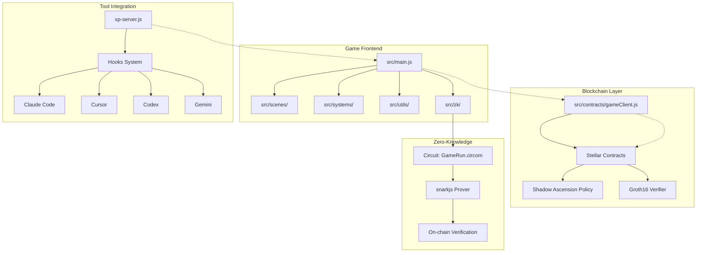
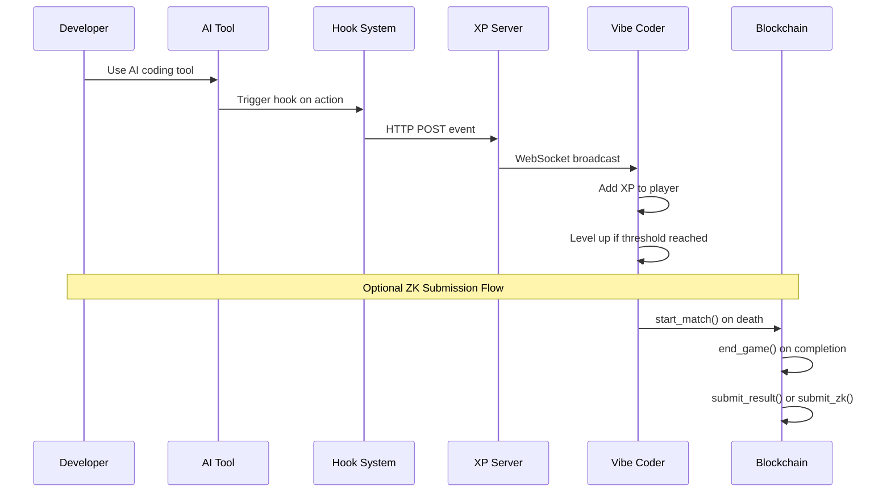
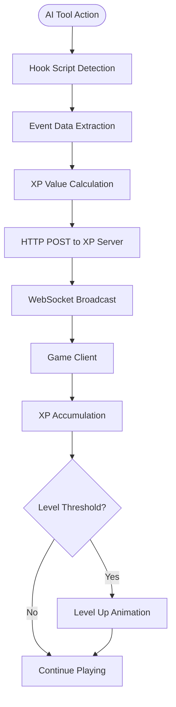
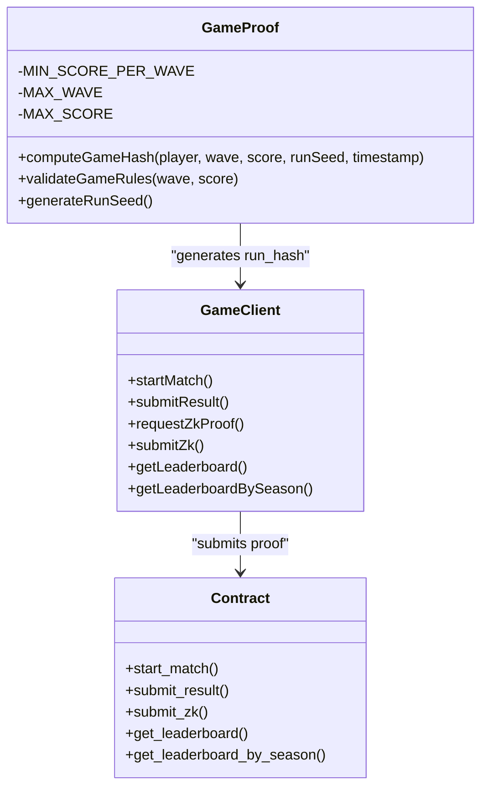
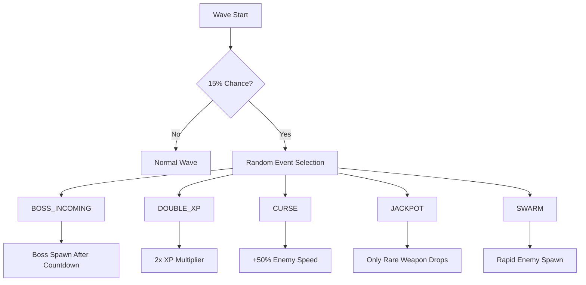
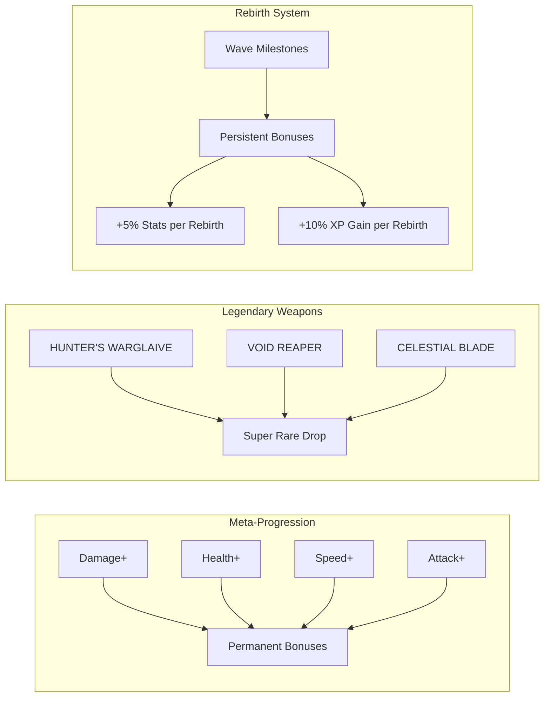
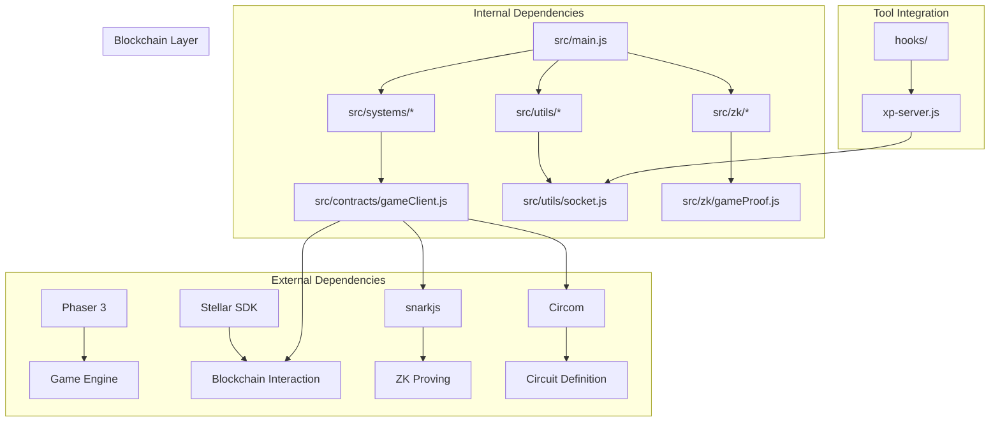

# Introduction and Core Concepts

<cite>
**Referenced Files in This Document**
- [README.md](file://README.md)
- [SETUP.md](file://SETUP.md)
- [src/main.js](file://src/main.js)
- [src/systems/EventManager.js](file://src/systems/EventManager.js)
- [src/systems/RebirthManager.js](file://src/systems/RebirthManager.js)
- [src/systems/ShrineManager.js](file://src/systems/ShrineManager.js)
- [src/zk/gameProof.js](file://src/zk/gameProof.js)
- [src/contracts/gameClient.js](file://src/contracts/gameClient.js)
- [src/utils/socket.js](file://src/utils/socket.js)
- [xp-server.js](file://xp-server.js)
- [server/db/schema.sql](file://server/db/schema.sql)
</cite>

## Table of Contents
1. [Introduction](#introduction)
2. [Project Structure](#project-structure)
3. [Core Components](#core-components)
4. [Architecture Overview](#architecture-overview)
5. [Detailed Component Analysis](#detailed-component-analysis)
6. [Dependency Analysis](#dependency-analysis)
7. [Performance Considerations](#performance-considerations)
8. [Troubleshooting Guide](#troubleshooting-guide)
9. [Conclusion](#conclusion)

## Introduction
Vibe-Coder (formerly Cosmic Coder) is a Vampire Survivors-style idle game where your actual coding activity powers your in-game character. The system gamifies productivity by rewarding developers for real AI tool interactions, converting them into in-game XP that fuels progression. The unique value proposition lies in combining entertainment with authentic productivity measurement: every XP earned reflects genuine coding effort captured from your development tools.

The game operates primarily off-chain for performance and responsiveness, with only match lifecycle and leaderboard interactions touching the blockchain. This approach ensures smooth gameplay while maintaining verifiable, provably fair competition through zero-knowledge proofs and on-chain leaderboards.

## Project Structure
The project follows a modular architecture with clear separation between game logic, blockchain integration, and tool integration layers:

**Diagram sources**
- [src/main.js](file://src/main.js#L1-L50)
- [src/contracts/gameClient.js](file://src/contracts/gameClient.js#L1-L50)
- [xp-server.js](file://xp-server.js#L1-L50)

**Section sources**
- [README.md](file://README.md#L115-L135)
- [src/main.js](file://src/main.js#L1-L50)

## Core Components
The system comprises several interconnected subsystems that work together to create the gamified coding experience:

### Game Mechanics Engine
The core game logic centers around a Vampire Survivors-inspired combat system with automatic movement, weapon progression, and permanent character upgrades. The engine manages XP accumulation, level progression, and real-time combat mechanics while maintaining a persistent upgrade system that carries across runs.

### AI Tool Integration System
A sophisticated hook-based system captures real coding activity from popular AI development tools. The system monitors tool interactions and converts them into in-game XP, enabling seamless integration with Claude Code, Cursor, Codex, and Gemini without disrupting the coding workflow.

### Blockchain Verification Layer
The system provides two submission modes for competitive play: casual submissions for legacy leaderboards and ZK-ranked submissions for provably fair competition. The ZK system ensures that only valid runs enter the ranked leaderboard through cryptographic proof verification.

### Progression and Persistence System
Permanent character upgrades and rebirth mechanics create long-term engagement through meaningful choices between immediate gains and permanent improvements. The system balances accessibility with depth, allowing players to customize their playstyle while maintaining competitive integrity.

**Section sources**
- [src/main.js](file://src/main.js#L39-L106)
- [src/systems/RebirthManager.js](file://src/systems/RebirthManager.js#L1-L50)
- [src/systems/ShrineManager.js](file://src/systems/ShrineManager.js#L17-L78)

## Architecture Overview
The system employs a hybrid architecture that separates concerns between real-time gameplay, tool integration, and blockchain verification:

**Diagram sources**
- [src/utils/socket.js](file://src/utils/socket.js#L18-L72)
- [xp-server.js](file://xp-server.js#L20-L70)
- [src/contracts/gameClient.js](file://src/contracts/gameClient.js#L76-L95)

The architecture ensures that coding activity is captured in real-time while maintaining the integrity of the gaming experience. The blockchain layer remains lightweight, handling only essential lifecycle events and leaderboard updates.

## Detailed Component Analysis

### AI Tool Integration and XP System
The XP system transforms AI tool interactions into meaningful in-game rewards through a carefully designed hook mechanism:

**Diagram sources**
- [xp-server.js](file://xp-server.js#L12-L17)
- [src/utils/socket.js](file://src/utils/socket.js#L54-L72)

The system supports multiple AI tools with different XP values, encouraging diverse coding workflows while maintaining consistent reward mechanisms. The hook system operates independently of the main game loop, ensuring minimal performance impact.

**Section sources**
- [SETUP.md](file://SETUP.md#L48-L83)
- [src/utils/socket.js](file://src/utils/socket.js#L18-L72)
- [xp-server.js](file://xp-server.js#L12-L17)

### Zero-Knowledge Proof System
The ZK system provides provably fair competition through cryptographic verification:

**Diagram sources**
- [src/zk/gameProof.js](file://src/zk/gameProof.js#L15-L78)
- [src/contracts/gameClient.js](file://src/contracts/gameClient.js#L76-L273)

The system uses a SHA-256 commitment scheme to bind game results to cryptographic proofs, ensuring that leaderboard entries cannot be spoofed. The Groth16 verification process validates that the run meets all game rules while preserving privacy.

**Section sources**
- [src/zk/gameProof.js](file://src/zk/gameProof.js#L19-L78)
- [src/contracts/gameClient.js](file://src/contracts/gameClient.js#L213-L273)

### Core Game Systems
The game incorporates traditional Vampire Survivors mechanics with unique coding-themed elements:

#### Event System
Mid-wave chaos events add strategic depth through temporary modifiers and challenges:

**Diagram sources**
- [src/systems/EventManager.js](file://src/systems/EventManager.js#L80-L97)

#### Shrine System
Risk/reward interactions provide meaningful choices that affect gameplay:

| Shrine Type | Risk | Reward | Effect |
|-------------|------|--------|---------|
| Power | Low | Medium | +50% Damage for 30s |
| Gamble | Medium | Variable | Random outcome (10-30% chance) |
| Wisdom | High | High | Instant Level Up |
| Protection | Medium | Low | 10s Invincibility |
| Chaos | High | Random | Unknown random effect |

**Section sources**
- [src/systems/EventManager.js](file://src/systems/EventManager.js#L17-L73)
- [src/systems/ShrineManager.js](file://src/systems/ShrineManager.js#L18-L78)

### Progression and Character Development
The permanent upgrade system creates lasting investment in the game:

**Diagram sources**
- [src/main.js](file://src/main.js#L40-L106)
- [src/main.js](file://src/main.js#L112-L210)
- [src/systems/RebirthManager.js](file://src/systems/RebirthManager.js#L8-L22)

**Section sources**
- [src/main.js](file://src/main.js#L40-L106)
- [src/main.js](file://src/main.js#L112-L210)
- [src/systems/RebirthManager.js](file://src/systems/RebirthManager.js#L8-L22)

## Dependency Analysis
The system exhibits clean architectural separation with well-defined boundaries:

**Diagram sources**
- [src/main.js](file://src/main.js#L1-L10)
- [src/contracts/gameClient.js](file://src/contracts/gameClient.js#L25-L42)
- [xp-server.js](file://xp-server.js#L5-L6)

The dependency structure ensures that each component has a single responsibility while maintaining loose coupling between major subsystems. This design facilitates testing, maintenance, and future enhancements.

**Section sources**
- [src/main.js](file://src/main.js#L1-L10)
- [src/contracts/gameClient.js](file://src/contracts/gameClient.js#L25-L42)

## Performance Considerations
The system prioritizes performance through strategic off-chain processing and efficient resource management:

- **Off-chain gameplay**: All core game mechanics run locally for optimal responsiveness
- **Selective blockchain touches**: Only match lifecycle and leaderboard updates interact with the blockchain
- **Efficient ZK verification**: Groth16 proofs enable fast on-chain validation without re-executing game logic
- **Resource streaming**: Assets load progressively to minimize initial startup time
- **Memory management**: Proper cleanup of game objects prevents memory leaks during extended play sessions

## Troubleshooting Guide
Common issues and their solutions:

### Connection Issues
- **XP server not responding**: Verify the XP server is running (`npm run server`) and accessible on port 3333
- **WebSocket connection failures**: Check firewall settings and ensure the game can reach localhost:3333
- **Hook script problems**: Confirm the hook file is executable and properly configured in the AI tool

### Blockchain Integration Problems
- **Contract ID missing**: Ensure `VITE_SHADOW_ASCENSION_CONTRACT_ID` is properly configured in the runtime config
- **ZK prover connectivity**: Verify the prover backend is running and accessible when attempting ranked submissions
- **Wallet authentication**: Confirm the Stellar wallet is properly connected and has sufficient network fees

### Game Performance Issues
- **Low frame rates**: Reduce visual effects or adjust graphics settings in the game options
- **Memory usage**: Close unused browser tabs and restart the game if memory consumption becomes excessive
- **Asset loading**: Clear browser cache if sprites or audio fail to load properly

**Section sources**
- [SETUP.md](file://SETUP.md#L109-L143)
- [src/utils/socket.js](file://src/utils/socket.js#L18-L104)

## Conclusion
Vibe-Coder represents a novel approach to gamifying coding productivity by creating a seamless bridge between real development work and engaging gameplay. The system's strength lies in its authentic reward mechanism—only genuine AI tool interactions translate to meaningful in-game progression. Through careful architectural design, the project achieves both performance and integrity, offering developers a compelling way to enhance their coding experience while maintaining the authenticity of their efforts.

The combination of Vampire Survivors mechanics, AI tool integration, and blockchain verification creates a unique ecosystem where productivity and entertainment converge naturally. As developers engage with their tools, they simultaneously progress in the game, creating a positive feedback loop that encourages sustained coding activity while providing immediate, tangible rewards for their efforts.