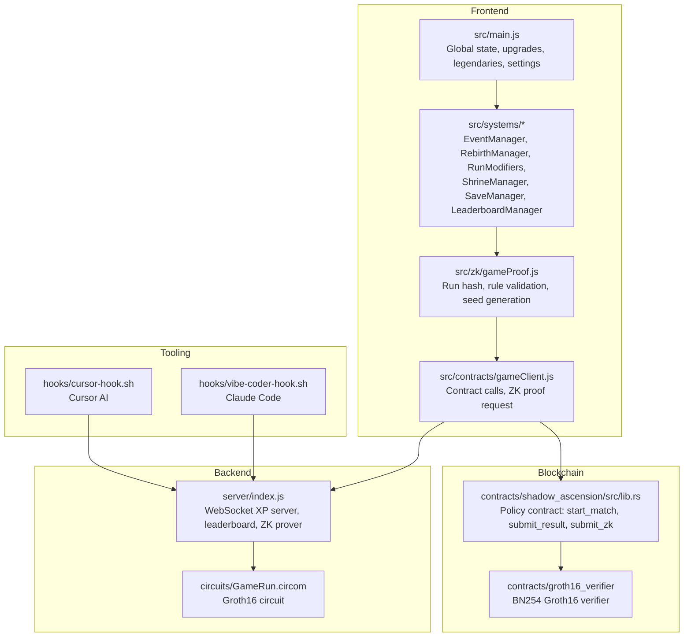
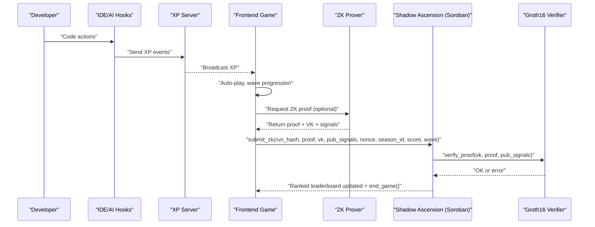
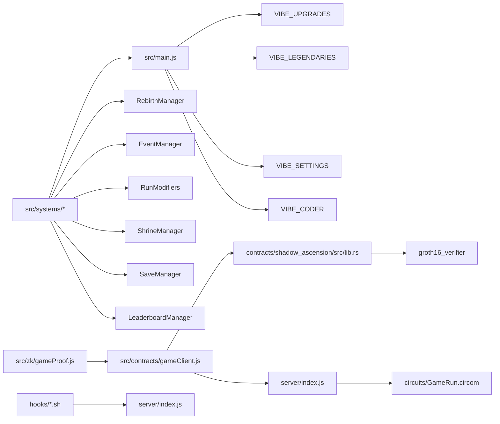

# Key Features and Benefits

<cite>
**Referenced Files in This Document**
- [README.md](file://README.md)
- [src/main.js](file://src/main.js)
- [src/systems/EventManager.js](file://src/systems/EventManager.js)
- [src/systems/RebirthManager.js](file://src/systems/RebirthManager.js)
- [src/systems/RunModifiers.js](file://src/systems/RunModifiers.js)
- [src/systems/ShrineManager.js](file://src/systems/ShrineManager.js)
- [src/systems/LeaderboardManager.js](file://src/systems/LeaderboardManager.js)
- [src/systems/SaveManager.js](file://src/systems/SaveManager.js)
- [src/zk/gameProof.js](file://src/zk/gameProof.js)
- [src/contracts/gameClient.js](file://src/contracts/gameClient.js)
- [contracts/shadow_ascension/src/lib.rs](file://contracts/shadow_ascension/src/lib.rs)
- [circuits/GameRun.circom](file://circuits/GameRun.circom)
- [server/index.js](file://server/index.js)
- [hooks/vibe-coder-hook.sh](file://hooks/vibe-coder-hook.sh)
- [hooks/cursor-hook.sh](file://hooks/cursor-hook.sh)
</cite>

## Table of Contents
1. [Introduction](#introduction)
2. [Project Structure](#project-structure)
3. [Core Components](#core-components)
4. [Architecture Overview](#architecture-overview)
5. [Detailed Component Analysis](#detailed-component-analysis)
6. [Dependency Analysis](#dependency-analysis)
7. [Performance Considerations](#performance-considerations)
8. [Troubleshooting Guide](#troubleshooting-guide)
9. [Conclusion](#conclusion)

## Introduction
This document presents the key features and benefits of Vibe-Coder, a vampire-survivors-style idle game that gamifies productivity by rewarding real coding activity. It blends wave-based combat, weapon progression, permanent rebirth, dynamic mid-wave events, and anti-replay protections powered by zero-knowledge proofs on Stellar. Developers benefit from measurable productivity gains, skill-building through weapon mastery, social competition via on-chain leaderboards, and persistent character progression. The system supports auto-play during coding sessions and integrates blockchain for verifiable achievements and immutable records.

## Project Structure
At a high level, Vibe-Coder consists of:
- Frontend game logic and systems (Phaser 3) under src/
- Blockchain integration via Soroban contracts and a Groth16 verifier
- ZK circuit and prover backend
- Hooks to capture coding activity from AI tools and IDEs
- Local XP server for live XP streaming and leaderboard persistence

**Diagram sources**
- [src/main.js](file://src/main.js#L1-L464)
- [src/systems/EventManager.js](file://src/systems/EventManager.js#L1-L393)
- [src/systems/RebirthManager.js](file://src/systems/RebirthManager.js#L1-L173)
- [src/systems/RunModifiers.js](file://src/systems/RunModifiers.js#L1-L185)
- [src/systems/ShrineManager.js](file://src/systems/ShrineManager.js#L1-L658)
- [src/systems/LeaderboardManager.js](file://src/systems/LeaderboardManager.js#L1-L135)
- [src/systems/SaveManager.js](file://src/systems/SaveManager.js#L1-L187)
- [src/zk/gameProof.js](file://src/zk/gameProof.js#L1-L78)
- [src/contracts/gameClient.js](file://src/contracts/gameClient.js#L1-L401)
- [contracts/shadow_ascension/src/lib.rs](file://contracts/shadow_ascension/src/lib.rs#L1-L314)
- [circuits/GameRun.circom](file://circuits/GameRun.circom#L1-L34)
- [server/index.js](file://server/index.js#L1-L246)
- [hooks/vibe-coder-hook.sh](file://hooks/vibe-coder-hook.sh#L1-L24)
- [hooks/cursor-hook.sh](file://hooks/cursor-hook.sh#L1-L24)

**Section sources**
- [README.md](file://README.md#L115-L158)
- [src/main.js](file://src/main.js#L1-L464)
- [src/contracts/gameClient.js](file://src/contracts/gameClient.js#L1-L401)
- [server/index.js](file://server/index.js#L1-L246)

## Core Components
- Wave-based combat system: Players fight waves of enemies while coding continues in the background. The game runs entirely off-chain except for session lifecycle and leaderboard updates.
- Weapon progression: 30+ weapons across melee, ranged, and orbital categories. Weapons drop during runs and can evolve into stronger forms. Legendary weapons are permanently unlocked and persist across runs.
- Permanent rebirth system: Milestones at major waves grant permanent stat and XP multipliers, plus starting weapon bonuses that carry forward.
- Dynamic mid-wave chaos events: Randomly triggered events add tension and variety, such as boss spawns, double XP, curses, jackpot weapon drops, and swarm waves.
- Anti-replay protection: Zero-knowledge proofs bind run outcomes to a run hash and enforce game rules on-chain, preventing replays and ensuring fair ranked leaderboards.
- Auto-play capabilities: Continuous gameplay during coding sessions via live XP streaming from AI tools and IDEs.
- Blockchain integration: On-chain session lifecycle, ranked leaderboard via Groth16 verification, and verifiable achievements.

**Section sources**
- [README.md](file://README.md#L9-L21)
- [src/main.js](file://src/main.js#L224-L230)
- [src/systems/RebirthManager.js](file://src/systems/RebirthManager.js#L8-L22)
- [src/systems/EventManager.js](file://src/systems/EventManager.js#L17-L73)
- [src/zk/gameProof.js](file://src/zk/gameProof.js#L15-L17)
- [src/contracts/gameClient.js](file://src/contracts/gameClient.js#L213-L249)
- [server/index.js](file://server/index.js#L99-L125)

## Architecture Overview
The end-to-end flow ties together frontend, backend, and blockchain:

**Diagram sources**
- [server/index.js](file://server/index.js#L99-L125)
- [server/index.js](file://server/index.js#L196-L216)
- [src/contracts/gameClient.js](file://src/contracts/gameClient.js#L213-L249)
- [src/zk/gameProof.js](file://src/zk/gameProof.js#L29-L42)
- [contracts/shadow_ascension/src/lib.rs](file://contracts/shadow_ascension/src/lib.rs#L159-L264)
- [circuits/GameRun.circom](file://circuits/GameRun.circom#L8-L33)

## Detailed Component Analysis

### Wave-Based Combat System
- Off-chain gameplay with automatic movement and combat while coding is detected.
- XP is awarded based on coding activity, with bonuses from upgrades and rebirth multipliers.
- Auto-move behavior is controlled by settings and coding activity timeouts.

Benefits:
- Continuous engagement during coding sessions.
- Immediate feedback loop between productivity and game progression.

**Section sources**
- [src/main.js](file://src/main.js#L322-L379)
- [src/main.js](file://src/main.js#L232-L317)
- [server/index.js](file://server/index.js#L99-L125)

### Weapon Progression (Melee/Ranged/Orbital)
- Melee weapons include sword, spear, boomerang, and kunai with distinct stats.
- Orbital and ranged mechanics are integrated into the weapon system and persist across runs.
- Legendary weapons are permanently unlocked and equipped via wallet-backed progress.

Benefits:
- Encourages experimentation and mastery of different weapon archetypes.
- Persistent unlocks provide long-term motivation and customization.

**Section sources**
- [src/main.js](file://src/main.js#L224-L230)
- [src/main.js](file://src/main.js#L111-L210)
- [src/utils/walletProgressService.js](file://src/utils/walletProgressService.js#L22-L58)

### Permanent Rebirth System
- Milestones at waves 50, 100, 150, 200, and 250 grant permanent bonuses:
  - +5% all stats per rebirth
  - +10% XP gain per rebirth
  - Starting weapon bonus (up to 3)
- Bonuses persist across runs and influence future playthroughs.

Benefits:
- Long-term retention and meaningful progression.
- Encourages higher-risk, higher-reward play styles.

**Section sources**
- [src/systems/RebirthManager.js](file://src/systems/RebirthManager.js#L8-L22)
- [src/systems/RebirthManager.js](file://src/systems/RebirthManager.js#L108-L130)
- [src/main.js](file://src/main.js#L344-L347)

### Dynamic Mid-Wave Chaos Events
- Randomly triggered events after wave 5 with 15% chance each wave:
  - Boss incoming (mini-boss after countdown)
  - Double XP
  - Curse (enemy speed boost)
  - Jackpot (only rare weapon drops)
  - Swarm (rapid enemy spawns)
- Events modify scene state and display a HUD with a countdown timer.

Benefits:
- Adds excitement and strategic depth.
- Keeps gameplay fresh and unpredictable.

**Section sources**
- [src/systems/EventManager.js](file://src/systems/EventManager.js#L17-L73)
- [src/systems/EventManager.js](file://src/systems/EventManager.js#L80-L97)
- [src/systems/EventManager.js](file://src/systems/EventManager.js#L103-L128)

### Anti-Replay Protection via Zero-Knowledge Proofs
- Run hash binds player, wave, score, run seed, and timestamp.
- Groth16 circuit enforces score ≥ wave × 10.
- On-chain submission verifies the proof, prevents replays via (player, nonce, season_id), and updates the ranked leaderboard.

Benefits:
- Provably fair ranked leaderboards.
- Immutable records of achievements.

**Section sources**
- [src/zk/gameProof.js](file://src/zk/gameProof.js#L29-L42)
- [src/zk/gameProof.js](file://src/zk/gameProof.js#L51-L63)
- [src/contracts/gameClient.js](file://src/contracts/gameClient.js#L213-L249)
- [contracts/shadow_ascension/src/lib.rs](file://contracts/shadow_ascension/src/lib.rs#L159-L264)
- [circuits/GameRun.circom](file://circuits/GameRun.circom#L8-L33)

### Auto-Play Capabilities
- Live XP streaming from AI coding tools and IDEs via WebSocket server.
- Hooks for Claude Code, Cursor, Gemini, Codex, and generic integrations.
- Frontend listens for XP events and increases XP, levels up, and triggers auto-movement.

Benefits:
- Seamless productivity gamification without manual input.
- Developer-friendly integration with popular tools.

**Section sources**
- [server/index.js](file://server/index.js#L99-L125)
- [hooks/vibe-coder-hook.sh](file://hooks/vibe-coder-hook.sh#L1-L24)
- [hooks/cursor-hook.sh](file://hooks/cursor-hook.sh#L1-L24)
- [src/main.js](file://src/main.js#L448-L461)

### Blockchain Integration Benefits
- Session lifecycle managed on-chain via Game Hub.
- Casual leaderboard via policy contract; ranked leaderboard via Groth16 verification.
- Verifiable achievements and immutable records for competitive play.

Benefits:
- Trustless, transparent leaderboards.
- Social competition with cryptographic guarantees.

**Section sources**
- [README.md](file://README.md#L40-L96)
- [src/contracts/gameClient.js](file://src/contracts/gameClient.js#L278-L327)
- [src/contracts/gameClient.js](file://src/contracts/gameClient.js#L333-L389)
- [contracts/shadow_ascension/src/lib.rs](file://contracts/shadow_ascension/src/lib.rs#L76-L119)
- [contracts/shadow_ascension/src/lib.rs](file://contracts/shadow_ascension/src/lib.rs#L159-L264)

### Run Modifiers and Shrines
- Run modifiers at start introduce variety (e.g., glass cannon, weapon frenzy, bullet hell, marathon).
- Shrines offer risk/reward choices (power, fortune, wisdom, protection, chaos) with temporary buffs and randomized outcomes.

Benefits:
- Strategic depth and replayability.
- Player agency in shaping difficulty and rewards.

**Section sources**
- [src/systems/RunModifiers.js](file://src/systems/RunModifiers.js#L6-L62)
- [src/systems/RunModifiers.js](file://src/systems/RunModifiers.js#L86-L121)
- [src/systems/ShrineManager.js](file://src/systems/ShrineManager.js#L17-L78)
- [src/systems/ShrineManager.js](file://src/systems/ShrineManager.js#L394-L414)

### Persistent Character Selection and Progression
- Character selection persists via wallet-backed progress.
- Upgrades, legendaries, high scores, and save states are stored on-chain keyed by wallet address.

Benefits:
- Seamless cross-session continuity.
- Ownership of progression and achievements.

**Section sources**
- [src/utils/walletProgressService.js](file://src/utils/walletProgressService.js#L22-L58)
- [src/utils/walletProgressService.js](file://src/utils/walletProgressService.js#L66-L84)
- [src/main.js](file://src/main.js#L215-L222)

### Save System (Continue Functionality)
- Auto-save at wave completion with a 24-hour validity window.
- Restore progress seamlessly from saved state.

Benefits:
- Reduced friction for extended coding sessions.
- Safety net against unexpected interruptions.

**Section sources**
- [src/systems/SaveManager.js](file://src/systems/SaveManager.js#L12-L42)
- [src/systems/SaveManager.js](file://src/systems/SaveManager.js#L48-L67)
- [src/systems/SaveManager.js](file://src/systems/SaveManager.js#L149-L185)

## Dependency Analysis
The following diagram highlights key dependencies among components:

**Diagram sources**
- [src/main.js](file://src/main.js#L40-L106)
- [src/systems/RebirthManager.js](file://src/systems/RebirthManager.js#L1-L173)
- [src/systems/EventManager.js](file://src/systems/EventManager.js#L1-L393)
- [src/systems/RunModifiers.js](file://src/systems/RunModifiers.js#L1-L185)
- [src/systems/ShrineManager.js](file://src/systems/ShrineManager.js#L1-L658)
- [src/systems/SaveManager.js](file://src/systems/SaveManager.js#L1-L187)
- [src/systems/LeaderboardManager.js](file://src/systems/LeaderboardManager.js#L1-L135)
- [src/zk/gameProof.js](file://src/zk/gameProof.js#L1-L78)
- [src/contracts/gameClient.js](file://src/contracts/gameClient.js#L1-L401)
- [contracts/shadow_ascension/src/lib.rs](file://contracts/shadow_ascension/src/lib.rs#L1-L314)
- [server/index.js](file://server/index.js#L1-L246)
- [circuits/GameRun.circom](file://circuits/GameRun.circom#L1-L34)
- [hooks/vibe-coder-hook.sh](file://hooks/vibe-coder-hook.sh#L1-L24)
- [hooks/cursor-hook.sh](file://hooks/cursor-hook.sh#L1-L24)

**Section sources**
- [src/main.js](file://src/main.js#L1-L464)
- [src/contracts/gameClient.js](file://src/contracts/gameClient.js#L1-L401)
- [server/index.js](file://server/index.js#L1-L246)

## Performance Considerations
- Off-chain gameplay minimizes blockchain interactions; only session lifecycle and leaderboard updates touch the chain.
- ZK verification occurs off-chain (backend prover) and is submitted on-chain for final validation, reducing gas costs and latency.
- WebSocket-based XP streaming avoids polling and reduces server overhead.
- Local caching of settings and saves improves responsiveness.

[No sources needed since this section provides general guidance]

## Troubleshooting Guide
Common issues and resolutions:
- Contract not configured: Ensure the Shadow Ascension contract ID and ZK prover URL are set; otherwise ranked submissions are disabled.
- ZK prover errors: Verify the prover backend is reachable and returns a valid proof payload.
- Game rules invalid: Ensure score meets the minimum threshold per wave before submitting ranked runs.
- Wallet disconnect: Progress resets to defaults; reconnect to restore wallet-backed state.

**Section sources**
- [src/contracts/gameClient.js](file://src/contracts/gameClient.js#L392-L400)
- [src/contracts/gameClient.js](file://src/contracts/gameClient.js#L103-L121)
- [src/zk/gameProof.js](file://src/zk/gameProof.js#L51-L63)
- [src/utils/walletProgressService.js](file://src/utils/walletProgressService.js#L89-L105)

## Conclusion
Vibe-Coder transforms coding into a persistent, gamified experience with robust systems for productivity enhancement, skill development, and social competition. Its wave-based combat, weapon mastery, permanent rebirth, dynamic events, and ZK-powered anti-replay protection deliver a compelling blend of fun and measurable outcomes. The auto-play capabilities and blockchain integration further strengthen developer engagement, ownership, and trust in competitive records.