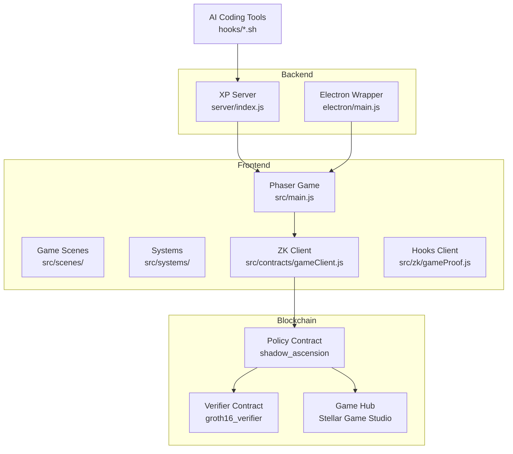
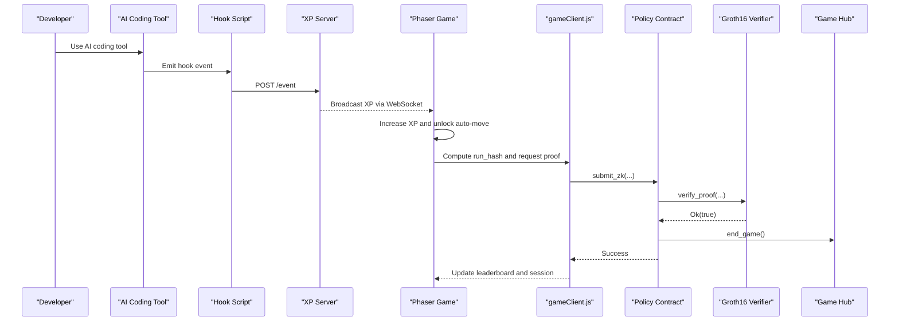
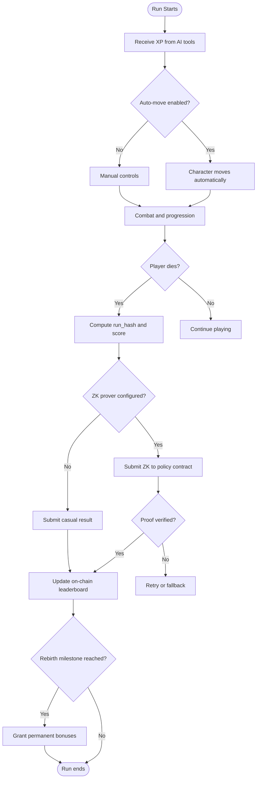
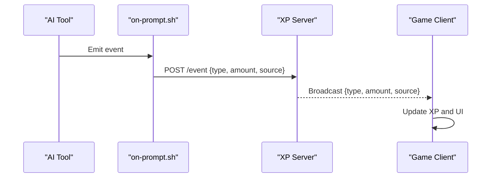
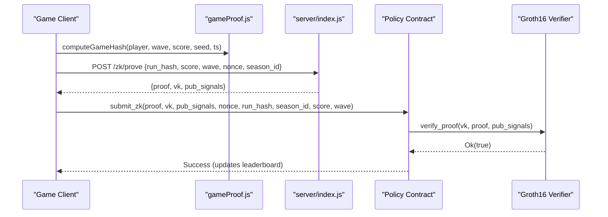
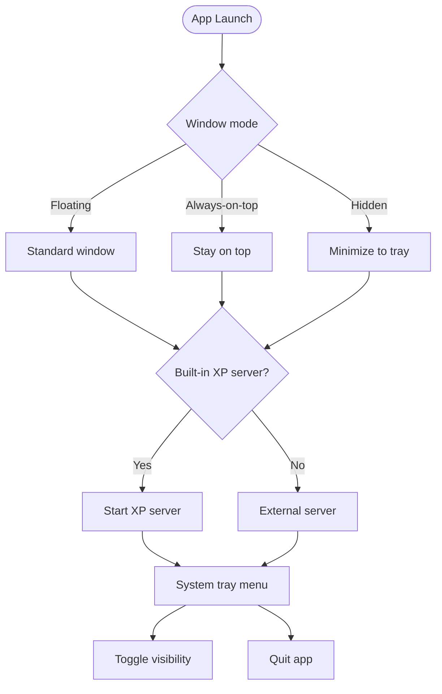
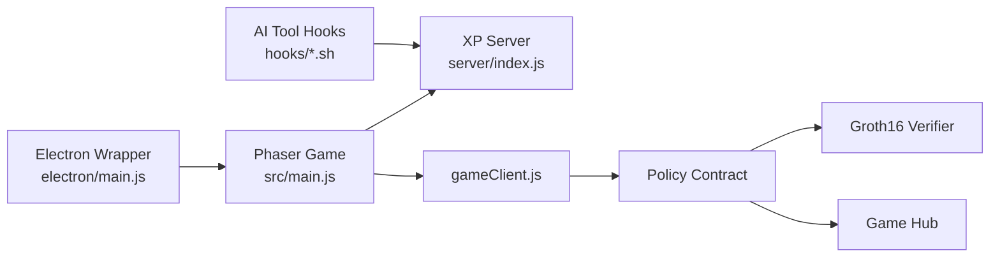

# Project Overview

<cite>
**Referenced Files in This Document**
- [README.md](file://README.md)
- [SETUP.md](file://SETUP.md)
- [package.json](file://package.json)
- [docs/TECHNICAL_DOCUMENTATION.md](file://docs/TECHNICAL_DOCUMENTATION.md)
- [src/main.js](file://src/main.js)
- [src/contracts/gameClient.js](file://src/contracts/gameClient.js)
- [server/index.js](file://server/index.js)
- [hooks/vibe-coder-hook.sh](file://hooks/vibe-coder-hook.sh)
- [circuits/GameRun.circom](file://circuits/GameRun.circom)
- [src/systems/RebirthManager.js](file://src/systems/RebirthManager.js)
- [src/systems/EventManager.js](file://src/systems/EventManager.js)
- [src/zk/gameProof.js](file://src/zk/gameProof.js)
- [electron/main.js](file://electron/main.js)
</cite>

## Table of Contents
1. [Introduction](#introduction)
2. [Project Structure](#project-structure)
3. [Core Components](#core-components)
4. [Architecture Overview](#architecture-overview)
5. [Detailed Component Analysis](#detailed-component-analysis)
6. [Dependency Analysis](#dependency-analysis)
7. [Performance Considerations](#performance-considerations)
8. [Troubleshooting Guide](#troubleshooting-guide)
9. [Conclusion](#conclusion)

## Introduction
Cosmic Coder is a Vampire Survivors-style idle game that gamifies real-world coding productivity. The project rewards developers for actual coding activity by combining:
- A Phaser-based off-chain game engine that runs in the browser or as a desktop app
- Real-time XP accumulation from AI coding tools via a WebSocket/HTTP XP server
- Blockchain-verified runs using Stellar and zero-knowledge proofs for on-chain leaderboards

Key value propositions:
- Auto-play modes: Hunt, evade, and idle modes automatically move your character as XP streams in
- Weapon progression system: 30+ weapons, evolved combos, and legendary items
- Rebirth mechanics: Permanent prestige that grants lasting stat and XP bonuses
- On-chain leaderboard with zero-knowledge proof verification: Ranked submissions are cryptographically verified and recorded on Stellar

Target audience: developers and coding enthusiasts who want to increase productivity through gamification and reward real coding effort.

Use cases:
- Productivity enhancement: Earn XP while coding to power your astronaut
- Gamification of coding: Turn routine tasks into an engaging survival experience
- Social competition: Compete on-chain with verifiable runs

## Project Structure
The project is organized into modular areas:
- Frontend game: Phaser scenes, systems, UI, and ZK integration
- Backend services: XP server, ZK prover, and optional Electron desktop wrapper
- Blockchain integration: Soroban contracts for session lifecycle and leaderboard
- AI tool hooks: Scripts to stream XP from Claude Code, Cursor, Gemini, and others

**Diagram sources**
- [src/main.js](file://src/main.js#L1-L464)
- [src/contracts/gameClient.js](file://src/contracts/gameClient.js#L1-L401)
- [server/index.js](file://server/index.js#L1-L246)
- [electron/main.js](file://electron/main.js#L1-L274)

**Section sources**
- [README.md](file://README.md#L115-L135)
- [package.json](file://package.json#L1-L135)

## Core Components
- Off-chain game engine (Phaser): Runs entirely in the browser, handling rendering, input, combat, and progression systems. It computes run outcomes (wave, score) and triggers on-chain submissions when appropriate.
- XP server and hooks: Provides WebSocket and HTTP endpoints for real-time XP streaming from AI coding tools. Hooks forward events to the XP server, which broadcasts them to the game.
- ZK proof generation: A Circom circuit defines the run statement; a backend prover produces Groth16 proofs consumed by the frontend client.
- Blockchain integration: A policy contract orchestrates session lifecycle and leaderboard updates; a Groth16 verifier validates ZK proofs on-chain; a Game Hub manages start/end game events.
- Electron desktop wrapper: Optional desktop app that embeds the game, manages window modes, and can run the XP server internally.

Practical example: When you use Claude Code, the on-prompt hook posts an event to the XP server. The XP server broadcasts it to the game, which increases your XP and unlocks auto-move. When you die, the game computes a run hash and requests a ZK proof from the backend. The frontend submits the proof to the policy contract, which verifies it via the verifier and updates the on-chain leaderboard.

**Section sources**
- [README.md](file://README.md#L9-L20)
- [README.md](file://README.md#L99-L112)
- [docs/TECHNICAL_DOCUMENTATION.md](file://docs/TECHNICAL_DOCUMENTATION.md#L19-L40)
- [src/main.js](file://src/main.js#L322-L379)
- [server/index.js](file://server/index.js#L63-L125)
- [hooks/vibe-coder-hook.sh](file://hooks/vibe-coder-hook.sh#L1-L24)

## Architecture Overview
The system separates concerns across layers:
- Frontend game: Phaser engine, UI, and ZK client
- Backend services: XP server and optional prover
- Blockchain: Policy contract, verifier, and Game Hub
- AI tool hooks: Stream XP events to the XP server

**Diagram sources**
- [hooks/vibe-coder-hook.sh](file://hooks/vibe-coder-hook.sh#L1-L24)
- [server/index.js](file://server/index.js#L99-L125)
- [src/main.js](file://src/main.js#L322-L379)
- [src/contracts/gameClient.js](file://src/contracts/gameClient.js#L76-L273)
- [docs/TECHNICAL_DOCUMENTATION.md](file://docs/TECHNICAL_DOCUMENTATION.md#L41-L86)

## Detailed Component Analysis

### Game Mechanics and Progression
- XP accumulation: Real-time XP from AI tools increases your character’s XP and unlocks auto-move. XP gains are multiplied by upgrades and rebirth bonuses.
- Auto-play modes: When XP is received, the character moves and attacks automatically, reducing friction for continuous coding.
- Weapon progression: Drop and evolve weapons; legendary items provide powerful, permanent bonuses.
- Rebirth system: Milestones grant permanent stat and XP bonuses, increasing long-term power scaling.

**Diagram sources**
- [src/main.js](file://src/main.js#L322-L379)
- [src/systems/RebirthManager.js](file://src/systems/RebirthManager.js#L83-L103)
- [src/contracts/gameClient.js](file://src/contracts/gameClient.js#L213-L273)

**Section sources**
- [src/main.js](file://src/main.js#L322-L379)
- [src/systems/RebirthManager.js](file://src/systems/RebirthManager.js#L8-L173)
- [src/systems/EventManager.js](file://src/systems/EventManager.js#L16-L73)

### AI Tool Integration and XP Streaming
- Hook system: AI tools emit events that are forwarded to the XP server via HTTP or WebSocket.
- XP values: Different tools and actions yield varying XP amounts, encouraging sustained coding activity.
- Client integration: The game listens for XP events and updates its internal state accordingly.

**Diagram sources**
- [hooks/vibe-coder-hook.sh](file://hooks/vibe-coder-hook.sh#L1-L24)
- [server/index.js](file://server/index.js#L99-L125)
- [SETUP.md](file://SETUP.md#L48-L106)

**Section sources**
- [SETUP.md](file://SETUP.md#L48-L106)
- [server/index.js](file://server/index.js#L78-L125)

### Zero-Knowledge Proof Workflow
- Circuit: The GameRun.circom template binds run_hash, score, wave, nonce, and season_id, enforcing score >= wave * MIN_SCORE_PER_WAVE.
- Client-side validation: The frontend validates game rules and computes run_hash before requesting a proof.
- Backend prover: Generates Groth16 proof and returns contract-ready artifacts.
- On-chain verification: The policy contract calls the verifier, enforces anti-replay, and updates the leaderboard.

**Diagram sources**
- [src/zk/gameProof.js](file://src/zk/gameProof.js#L29-L75)
- [server/index.js](file://server/index.js#L196-L216)
- [src/contracts/gameClient.js](file://src/contracts/gameClient.js#L103-L273)
- [circuits/GameRun.circom](file://circuits/GameRun.circom#L1-L34)
- [docs/TECHNICAL_DOCUMENTATION.md](file://docs/TECHNICAL_DOCUMENTATION.md#L19-L40)

**Section sources**
- [docs/TECHNICAL_DOCUMENTATION.md](file://docs/TECHNICAL_DOCUMENTATION.md#L95-L237)
- [circuits/GameRun.circom](file://circuits/GameRun.circom#L1-L34)
- [src/zk/gameProof.js](file://src/zk/gameProof.js#L1-L78)

### Desktop Application (Electron)
- Window modes: Floating, always-on-top, and hidden modes for different workflows.
- Built-in XP server: Optional internal XP server with IPC to the renderer.
- Tray integration: System tray menu for quick toggles and status.

**Diagram sources**
- [electron/main.js](file://electron/main.js#L95-L158)
- [electron/main.js](file://electron/main.js#L174-L203)

**Section sources**
- [electron/main.js](file://electron/main.js#L1-L274)

## Dependency Analysis
High-level dependencies:
- Frontend depends on Phaser for rendering and game logic, and on the XP server for real-time XP.
- The game client integrates with Stellar SDK to invoke policy contract methods and manage ZK submissions.
- The backend provides XP streaming and ZK proof generation.
- Blockchain contracts depend on each other for session lifecycle and verification.

**Diagram sources**
- [src/main.js](file://src/main.js#L1-L464)
- [src/contracts/gameClient.js](file://src/contracts/gameClient.js#L1-L401)
- [server/index.js](file://server/index.js#L1-L246)
- [electron/main.js](file://electron/main.js#L1-L274)

**Section sources**
- [package.json](file://package.json#L31-L51)
- [docs/TECHNICAL_DOCUMENTATION.md](file://docs/TECHNICAL_DOCUMENTATION.md#L19-L40)

## Performance Considerations
- Off-chain gameplay: Phaser runs entirely off-chain, minimizing blockchain interactions to session start/end and leaderboard updates.
- ZK verification cost: Groth16 verification costs are bounded and occur on-chain; simulations help estimate gas usage.
- Anti-replay: Replay keys prevent repeated submissions, avoiding redundant computations.
- Scalability: Leaderboard updates are per-season and bounded by design; storage growth is controlled.

[No sources needed since this section provides general guidance]

## Troubleshooting Guide
Common issues and resolutions:
- XP server connectivity: Ensure the XP server is running and reachable; check port 3333 and firewall settings.
- Hook configuration: Verify hook permissions and test execution; confirm the game shows a live connection status.
- Mobile orientation: Rotate to landscape on mobile devices; the game locks orientation for optimal play.
- Electron window modes: Use tray menu to toggle visibility and modes; ensure global shortcuts are configured.

**Section sources**
- [SETUP.md](file://SETUP.md#L109-L143)
- [src/main.js](file://src/main.js#L416-L446)
- [electron/main.js](file://electron/main.js#L160-L171)

## Conclusion
Cosmic Coder blends a Vampire Survivors-style game with real-time XP from AI coding tools and blockchain-verified runs. Its layered architecture keeps gameplay responsive while enabling provably fair, verifiable rankings on Stellar. Developers can enhance productivity, enjoy gamification, and compete on-chain with cryptographic guarantees.

[No sources needed since this section summarizes without analyzing specific files]