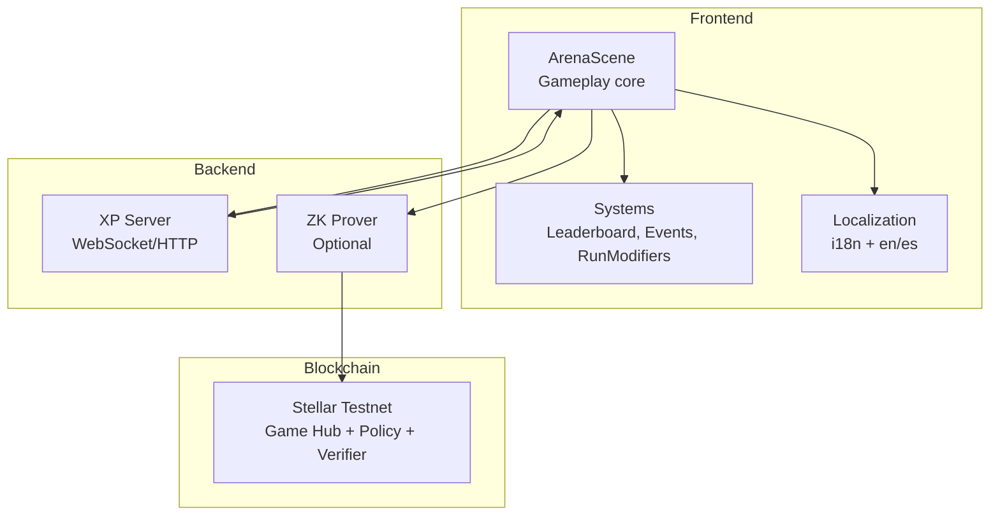
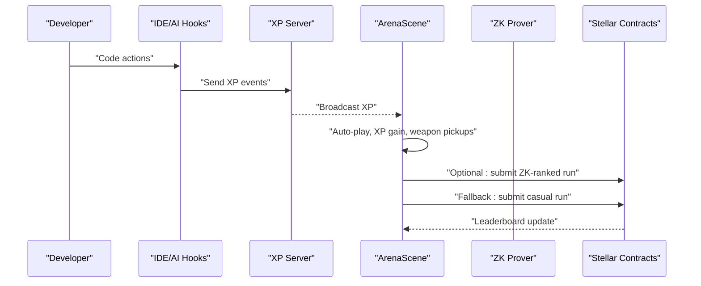
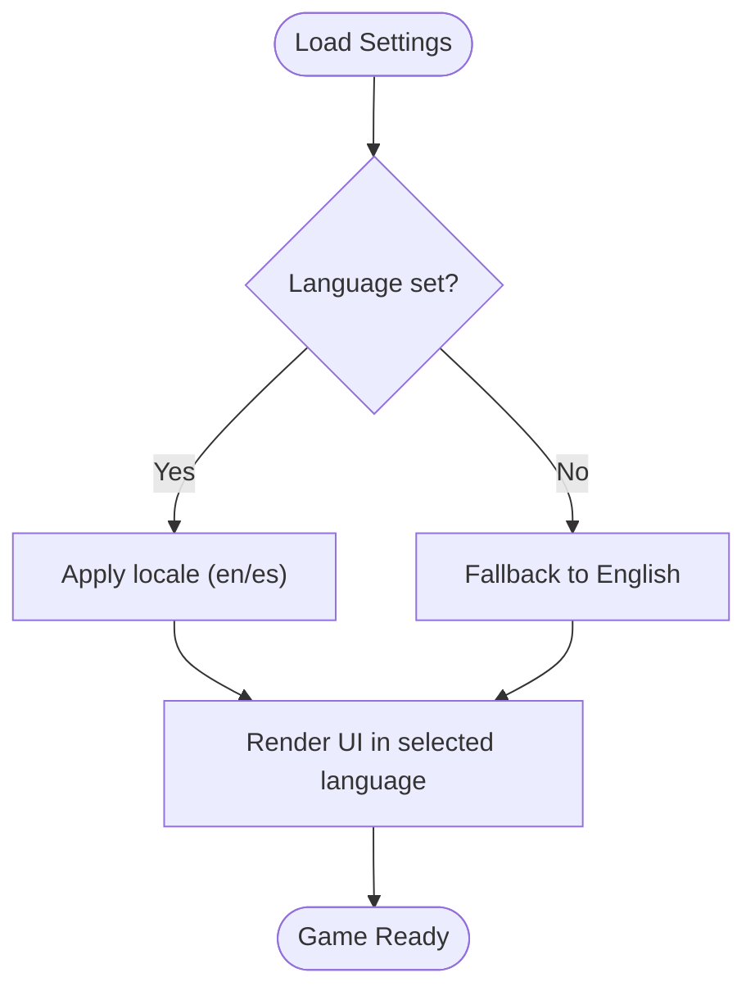
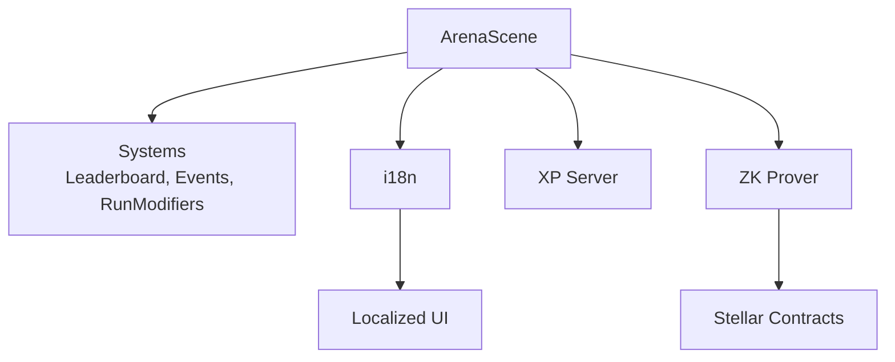

# Target Audience and Use Cases

<cite>
**Referenced Files in This Document**
- [README.md](file://README.md)
- [package.json](file://package.json)
- [SETUP.md](file://SETUP.md)
- [docs/COSMIC_CODER_GUIDE.md](file://docs/COSMIC_CODER_GUIDE.md)
- [docs/HACKATHON_DO_THIS.md](file://docs/HACKATHON_DO_THIS.md)
- [src/locales/en.js](file://src/locales/en.js)
- [src/locales/es.js](file://src/locales/es.js)
- [src/utils/i18n.js](file://src/utils/i18n.js)
- [src/systems/LeaderboardManager.js](file://src/systems/LeaderboardManager.js)
- [src/systems/EventManager.js](file://src/systems/EventManager.js)
- [src/systems/RunModifiers.js](file://src/systems/RunModifiers.js)
- [src/scenes/ArenaScene.js](file://src/scenes/ArenaScene.js)
</cite>

## Table of Contents
1. [Introduction](#introduction)
2. [Project Structure](#project-structure)
3. [Core Components](#core-components)
4. [Architecture Overview](#architecture-overview)
5. [Detailed Component Analysis](#detailed-component-analysis)
6. [Dependency Analysis](#dependency-analysis)
7. [Performance Considerations](#performance-considerations)
8. [Troubleshooting Guide](#troubleshooting-guide)
9. [Conclusion](#conclusion)
10. [Appendices](#appendices)

## Introduction
Cosmic Coder is a Vampire Survivors-style idle game where your coding activity powers your astronaut. It blends productivity gamification with blockchain-backed ranked competition. Players can enjoy casual runs, master weapon systems, and optionally compete on-chain with verifiable zero-knowledge proofs. The project emphasizes accessibility, internationalization, and flexible deployment for individuals, teams, hackathons, and educational institutions.

## Project Structure
Cosmic Coder is a browser-based game built with Phaser 3, integrated with a WebSocket XP server and optional on-chain submission via Stellar and ZK. The repository includes:
- Frontend game logic and UI (Phaser scenes, systems, localization)
- Backend XP server and optional ZK prover
- Smart contracts and circuits for on-chain ranked submissions
- Electron packaging for desktop distribution
- Documentation and deployment guides

**Diagram sources**
- [src/scenes/ArenaScene.js](file://src/scenes/ArenaScene.js#L1-L120)
- [src/systems/LeaderboardManager.js](file://src/systems/LeaderboardManager.js#L1-L135)
- [src/systems/EventManager.js](file://src/systems/EventManager.js#L1-L120)
- [src/systems/RunModifiers.js](file://src/systems/RunModifiers.js#L1-L120)
- [src/utils/i18n.js](file://src/utils/i18n.js#L1-L45)
- [SETUP.md](file://SETUP.md#L1-L120)

**Section sources**
- [README.md](file://README.md#L115-L158)
- [package.json](file://package.json#L1-L135)

## Core Components
- Gameplay and progression: ArenaScene orchestrates waves, enemies, weapons, stages, and autoscroll mechanics. It integrates XP hooks, modifiers, events, and shrine mechanics.
- Leaderboards: Local fallback and on-chain submission via a dedicated API, supporting anonymous and wallet-backed identities.
- Internationalization: English and Spanish locales with runtime language switching.
- On-chain ranked mode: Optional ZK submission to a Stellar Testnet leaderboard using a Groth16 verifier and a policy contract.

**Section sources**
- [src/scenes/ArenaScene.js](file://src/scenes/ArenaScene.js#L1-L200)
- [src/systems/LeaderboardManager.js](file://src/systems/LeaderboardManager.js#L1-L135)
- [src/utils/i18n.js](file://src/utils/i18n.js#L1-L45)
- [README.md](file://README.md#L40-L96)

## Architecture Overview
Cosmic Coder separates concerns between off-chain gameplay and optional on-chain verification:
- Off-chain gameplay runs in the browser with Phaser.
- XP hooks feed real coding activity into the game via WebSocket/HTTP.
- Optional ZK flow generates a proof off-chain and submits it on-chain for verification.
- Leaderboard APIs support both local and on-chain rankings.

**Diagram sources**
- [SETUP.md](file://SETUP.md#L66-L106)
- [src/scenes/ArenaScene.js](file://src/scenes/ArenaScene.js#L360-L470)
- [README.md](file://README.md#L40-L96)

## Detailed Component Analysis

### Target Audience and Personas
- Casual developers: Seek motivation and light productivity gains through idle gameplay and XP hooks.
- Serious programmers: Value skill tracking, weapon mastery, and optional ranked competition with verifiable on-chain proofs.
- Educators and trainers: Want engaging, gamified learning environments to teach coding fundamentals and teamwork.
- Competitive players: Enjoy ranked leaderboards, run modifiers, and event-driven challenges.

These personas are supported by:
- Flexible play modes (casual vs ZK-ranked)
- Extensible weapon and upgrade systems
- Leaderboard visibility (local and on-chain)
- Multi-language support

**Section sources**
- [README.md](file://README.md#L9-L37)
- [docs/COSMIC_CODER_GUIDE.md](file://docs/COSMIC_CODER_GUIDE.md#L1-L70)
- [src/locales/en.js](file://src/locales/en.js#L1-L120)
- [src/locales/es.js](file://src/locales/es.js#L1-L120)

### Use Cases and Value Propositions
- Daily coding productivity enhancement
  - Real XP from IDE/AI hooks encourages sustained coding sessions.
  - Auto-play keeps progress flowing while you focus on tasks.
  - Local leaderboard fosters friendly competition.

- Skill development through weapon mastery
  - Over 30 weapons with distinct mechanics and evolution paths.
  - Legendary weapons persist and offer long-term customization.
  - Upgrades increase base stats for permanent improvements.

- Competitive programming through ranked leaderboards
  - ZK-ranked mode submits verifiable runs to a per-season leaderboard.
  - Anti-replay and run binding ensure fairness.
  - Optional desktop app and continuous background play.

- Gamified learning environments
  - Classroom or mentorship settings can use local leaderboards and shared XP servers.
  - Run modifiers and events add variety and challenge.
  - Multi-language UI supports diverse learners.

**Section sources**
- [README.md](file://README.md#L38-L96)
- [docs/COSMIC_CODER_GUIDE.md](file://docs/COSMIC_CODER_GUIDE.md#L59-L139)
- [src/systems/RunModifiers.js](file://src/systems/RunModifiers.js#L1-L185)
- [src/systems/EventManager.js](file://src/systems/EventManager.js#L1-L120)

### International Appeal and Cross-Cultural Design
- Multi-language support: English and Spanish locales with runtime switching.
- Cultural adaptation: Titles, menus, and messages reflect localized language and tone.
- Accessibility: Controls and UI adapt to keyboard and touch devices.

**Diagram sources**
- [src/utils/i18n.js](file://src/utils/i18n.js#L1-L45)
- [src/locales/en.js](file://src/locales/en.js#L1-L120)
- [src/locales/es.js](file://src/locales/es.js#L1-L120)

**Section sources**
- [src/utils/i18n.js](file://src/utils/i18n.js#L1-L45)
- [src/locales/en.js](file://src/locales/en.js#L1-L120)
- [src/locales/es.js](file://src/locales/es.js#L1-L120)

### Deployment Contexts and Scenarios
- Individual use
  - Play in the browser or run the desktop app.
  - Connect an XP server for live XP or use manual XP.
  - Optional ZK-ranked mode requires a prover and wallet.

- Team building exercises
  - Share a local XP server for synchronized XP.
  - Use run modifiers and events to create dynamic challenges.
  - Compare local leaderboards to encourage collaboration.

- Hackathon participation
  - Follow the hackathon setup guide to deploy contracts and a prover.
  - Configure GitHub secrets for production builds with on-chain features.
  - Use ranked mode to showcase verifiable performance.

- Educational institutions
  - Integrate with IDE/AI hooks to reward student activity.
  - Use run modifiers to adjust difficulty for different skill levels.
  - Leverage multi-language UI for inclusive classrooms.

**Section sources**
- [README.md](file://README.md#L23-L96)
- [docs/HACKATHON_DO_THIS.md](file://docs/HACKATHON_DO_THIS.md#L1-L113)
- [SETUP.md](file://SETUP.md#L1-L120)

### Adapting to Different User Needs
- Casual developers
  - Prefer auto-play and manual XP for low friction.
  - Use local leaderboard and simple controls.
- Serious programmers
  - Focus on weapon mastery, upgrades, and optional ZK-ranked mode.
  - Benefit from persistent progress and shrine mechanics.
- Educators
  - Manage shared XP servers and local leaderboards.
  - Customize run modifiers to align with curriculum goals.
- Competitive players
  - Use ranked leaderboards and ZK verification for fair competition.
  - Explore run modifiers and events to optimize strategies.

**Section sources**
- [docs/COSMIC_CODER_GUIDE.md](file://docs/COSMIC_CODER_GUIDE.md#L59-L139)
- [src/systems/RunModifiers.js](file://src/systems/RunModifiers.js#L1-L185)
- [src/systems/EventManager.js](file://src/systems/EventManager.js#L1-L120)
- [src/systems/LeaderboardManager.js](file://src/systems/LeaderboardManager.js#L1-L135)

## Dependency Analysis
Cosmic Coder’s runtime dependencies include Phaser for rendering, Stellar SDK for wallet and contract interactions, and optional ZK tooling for verifiable runs. The frontend communicates with the XP server and optionally the ZK prover and Stellar contracts.

**Diagram sources**
- [src/scenes/ArenaScene.js](file://src/scenes/ArenaScene.js#L1-L120)
- [src/systems/LeaderboardManager.js](file://src/systems/LeaderboardManager.js#L1-L135)
- [src/systems/EventManager.js](file://src/systems/EventManager.js#L1-L120)
- [src/systems/RunModifiers.js](file://src/systems/RunModifiers.js#L1-L120)
- [src/utils/i18n.js](file://src/utils/i18n.js#L1-L45)
- [README.md](file://README.md#L139-L146)

**Section sources**
- [package.json](file://package.json#L31-L51)
- [README.md](file://README.md#L139-L146)

## Performance Considerations
- Off-chain gameplay ensures smooth performance without blockchain latency.
- Optional ZK submission occurs only on run completion, minimizing impact on gameplay.
- Leaderboard queries and XP broadcasting are lightweight, reducing server overhead.
- Desktop app packaging enables background play and reduced resource contention.

[No sources needed since this section provides general guidance]

## Troubleshooting Guide
Common issues and resolutions:
- XP server connectivity
  - Ensure the XP server is running and accessible.
  - Verify hook execution and WebSocket status indicators.
- Wallet and on-chain submission
  - Connect a compatible wallet and confirm contract configuration.
  - Check for signature rejection or network errors.
- Localization and UI
  - Confirm language settings and locale availability.
  - Refresh the page to apply language changes.

**Section sources**
- [SETUP.md](file://SETUP.md#L109-L143)
- [src/systems/LeaderboardManager.js](file://src/systems/LeaderboardManager.js#L80-L99)
- [src/utils/i18n.js](file://src/utils/i18n.js#L19-L26)

## Conclusion
Cosmic Coder delivers a versatile, internationally accessible gaming experience that bridges coding productivity and competitive play. Its flexible deployment, multi-language support, and optional ZK-ranked mode serve diverse audiences—from casual developers to educators and competitive players—while maintaining a strong focus on skill-building and engagement.

[No sources needed since this section summarizes without analyzing specific files]

## Appendices

### Appendix A: Quick Links and References
- Live demo and setup: [README.md](file://README.md#L23-L37)
- Full XP hook integration: [SETUP.md](file://SETUP.md#L48-L106)
- ZK and on-chain architecture: [README.md](file://README.md#L40-L96)
- Hackathon deployment guide: [docs/HACKATHON_DO_THIS.md](file://docs/HACKATHON_DO_THIS.md#L1-L113)
- Game guide and ZK deep-dive: [docs/COSMIC_CODER_GUIDE.md](file://docs/COSMIC_CODER_GUIDE.md#L1-L139)

[No sources needed since this section aggregates links without analysis]