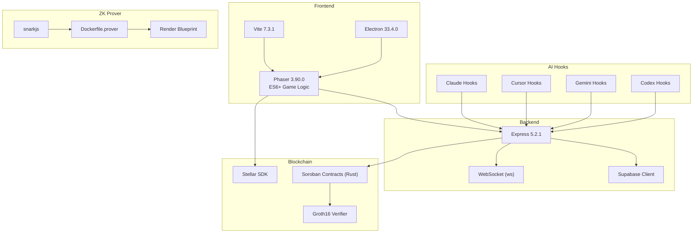
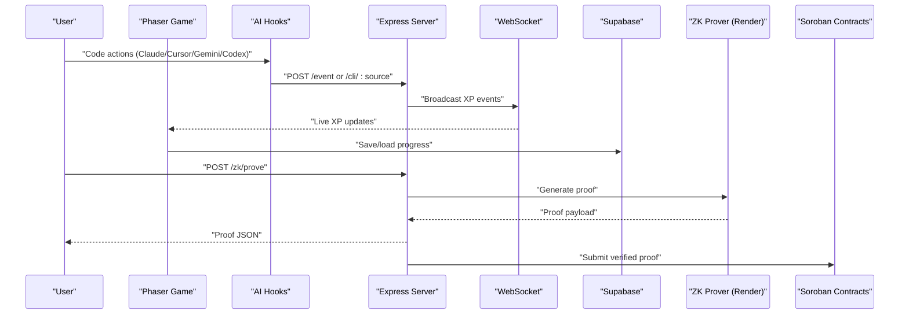
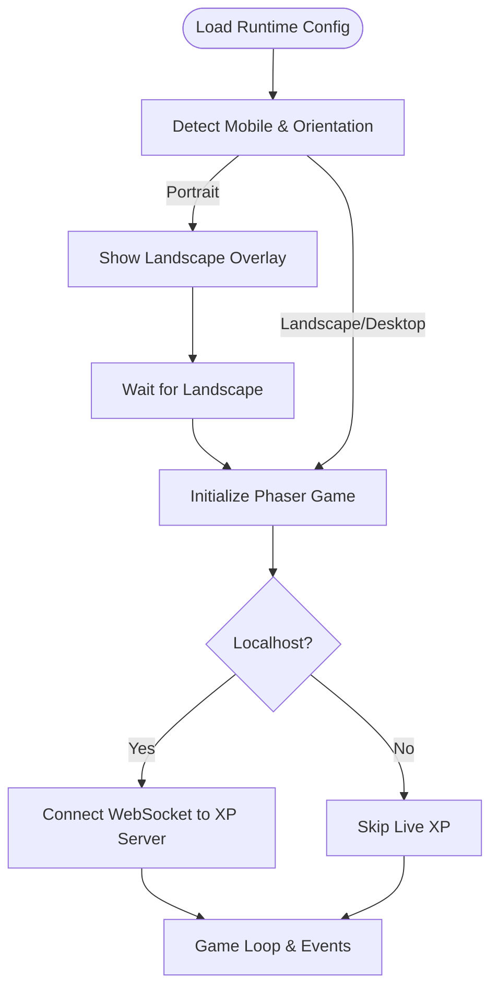
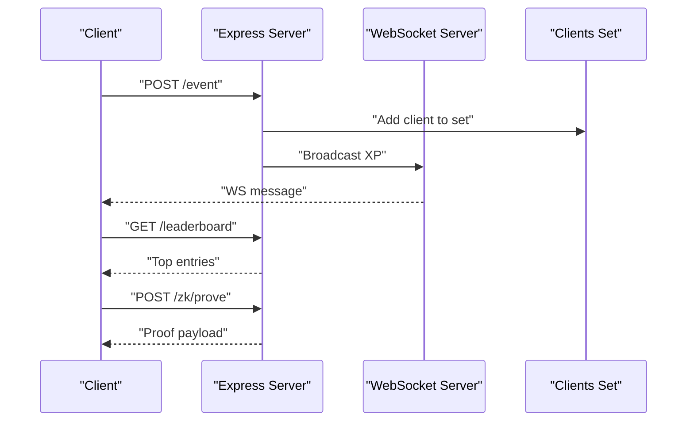
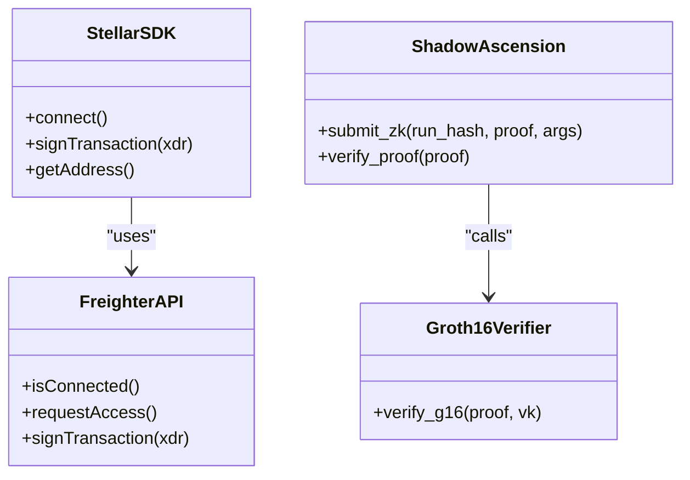
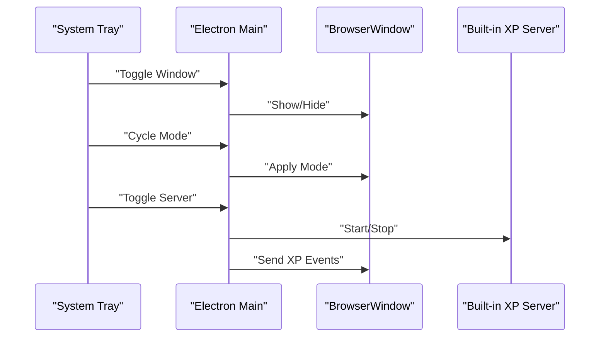
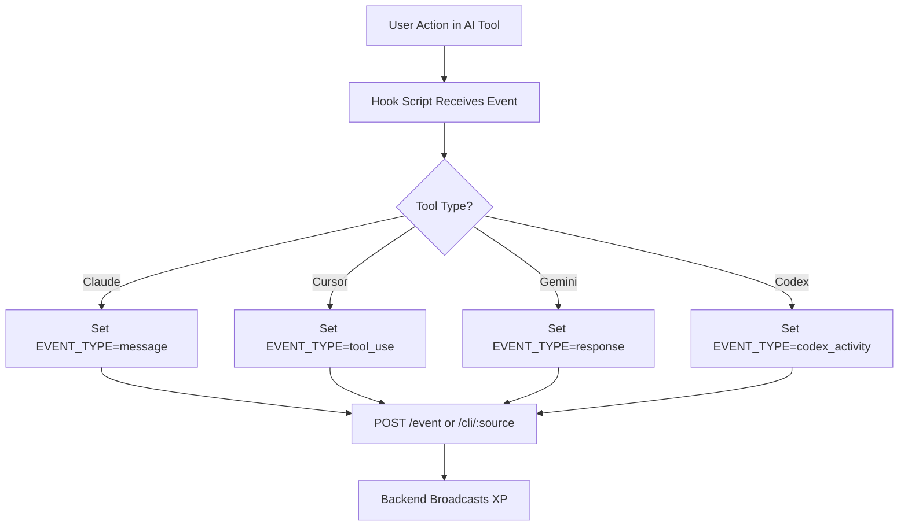
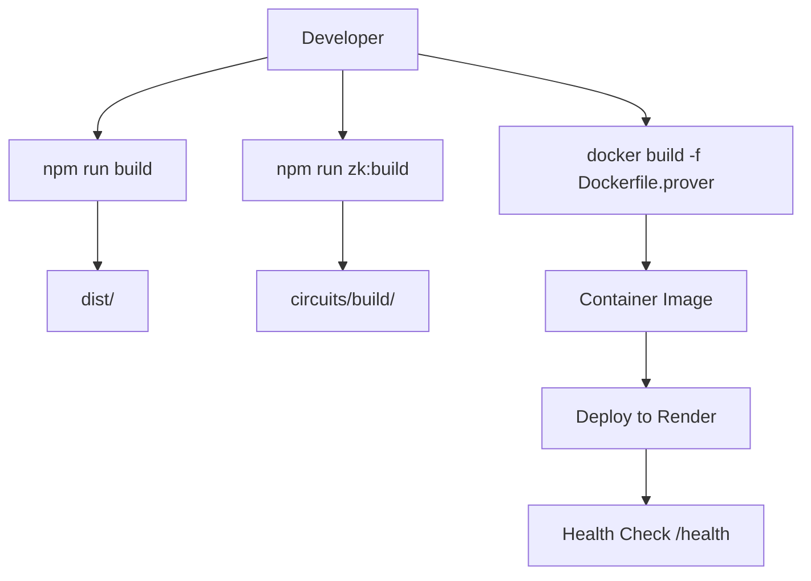
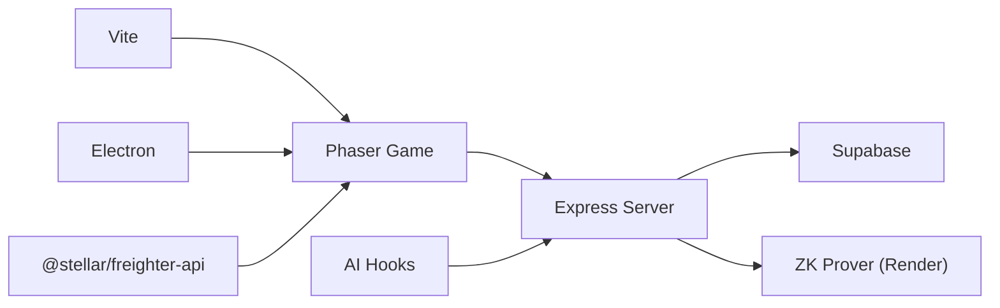

# Technology Stack

<cite>
**Referenced Files in This Document**
- [package.json](file://package.json)
- [vite.config.js](file://vite.config.js)
- [server/index.js](file://server/index.js)
- [src/main.js](file://src/main.js)
- [src/utils/socket.js](file://src/utils/socket.js)
- [src/utils/stellarWallet.js](file://src/utils/stellarWallet.js)
- [server/db/supabase.js](file://server/db/supabase.js)
- [hooks/vibe-coder-hook.sh](file://hooks/vibe-coder-hook.sh)
- [hooks/codex-hook.sh](file://hooks/codex-hook.sh)
- [hooks/on-message.sh](file://hooks/on-message.sh)
- [hooks/on-prompt.sh](file://hooks/on-prompt.sh)
- [electron/main.js](file://electron/main.js)
- [Dockerfile.prover](file://Dockerfile.prover)
- [render.yaml](file://render.yaml)
- [contracts/shadow_ascension/Cargo.toml](file://contracts/shadow_ascension/Cargo.toml)
- [contracts/groth16_verifier/Cargo.toml](file://contracts/groth16_verifier/Cargo.toml)
</cite>

## Table of Contents
1. [Introduction](#introduction)
2. [Project Structure](#project-structure)
3. [Core Components](#core-components)
4. [Architecture Overview](#architecture-overview)
5. [Detailed Component Analysis](#detailed-component-analysis)
6. [Dependency Analysis](#dependency-analysis)
7. [Performance Considerations](#performance-considerations)
8. [Troubleshooting Guide](#troubleshooting-guide)
9. [Conclusion](#conclusion)
10. [Appendices](#appendices)

## Introduction
This document presents the Vibe-Coder technology stack, detailing the frontend, backend, blockchain, desktop, AI integration, build and deployment, and database layers. It explains version choices, compatibility, and the rationale behind each technology selection to ensure maintainability, performance, and extensibility.

## Project Structure
The repository is organized into distinct layers:
- Frontend: Phaser 3 game with ES6+ logic, Vite for dev/build, and Electron for desktop packaging
- Backend: Express server with WebSocket broadcasting and REST endpoints
- Blockchain: Soroban smart contracts in Rust and Groth16 verifier, plus Stellar SDK for wallet/signing
- Zero-Knowledge: Circom circuits and snarkjs-based prover containerized for Render
- AI Integration: Shell hooks for Claude, Cursor, Gemini, and Codex
- Database: Supabase client for user and progress data
- Build and Deployment: Vite, Docker, and Render blueprint

**Diagram sources**
- [package.json](file://package.json#L31-L51)
- [vite.config.js](file://vite.config.js#L11-L33)
- [server/index.js](file://server/index.js#L1-L246)
- [src/main.js](file://src/main.js#L1-L464)
- [src/utils/stellarWallet.js](file://src/utils/stellarWallet.js#L1-L115)
- [server/db/supabase.js](file://server/db/supabase.js#L1-L23)
- [Dockerfile.prover](file://Dockerfile.prover#L1-L26)
- [render.yaml](file://render.yaml#L1-L15)
- [hooks/vibe-coder-hook.sh](file://hooks/vibe-coder-hook.sh#L1-L24)
- [hooks/codex-hook.sh](file://hooks/codex-hook.sh#L1-L27)

**Section sources**
- [package.json](file://package.json#L1-L135)
- [vite.config.js](file://vite.config.js#L1-L34)
- [server/index.js](file://server/index.js#L1-L246)
- [src/main.js](file://src/main.js#L1-L464)
- [src/utils/stellarWallet.js](file://src/utils/stellarWallet.js#L1-L115)
- [server/db/supabase.js](file://server/db/supabase.js#L1-L23)
- [Dockerfile.prover](file://Dockerfile.prover#L1-L26)
- [render.yaml](file://render.yaml#L1-L15)
- [hooks/vibe-coder-hook.sh](file://hooks/vibe-coder-hook.sh#L1-L24)
- [hooks/codex-hook.sh](file://hooks/codex-hook.sh#L1-L27)

## Core Components
- Frontend: Phaser 3.90.0 for 2D rendering, ES6+ game logic, and Vite for fast dev/build
- Backend: Express 5.2.1 with WebSocket broadcasting and REST endpoints for auth, progress, leaderboard, and ZK proof generation
- Blockchain: Stellar SDK for wallet connectivity and signing; Soroban contracts in Rust; Groth16 verifier
- Desktop: Electron 33.4.0 for cross-platform desktop app with tray, window modes, and built-in XP server
- AI Integration: Shell scripts to forward Claude, Cursor, Gemini, and Codex events to the backend
- Database: Supabase client for user management and progress storage
- ZK Prover: Dockerized snarkjs-based prover containerized for Render hosting
- Build and Deploy: Vite for frontend bundling, Docker for ZK prover, Render for hosting

**Section sources**
- [package.json](file://package.json#L31-L51)
- [server/index.js](file://server/index.js#L1-L246)
- [src/main.js](file://src/main.js#L1-L464)
- [electron/main.js](file://electron/main.js#L1-L274)
- [Dockerfile.prover](file://Dockerfile.prover#L1-L26)
- [render.yaml](file://render.yaml#L1-L15)
- [server/db/supabase.js](file://server/db/supabase.js#L1-L23)

## Architecture Overview
The system integrates a Phaser-based idle game with a Node.js backend, WebSocket streaming, and blockchain verification. The desktop app embeds the frontend and exposes a built-in XP server. AI tools feed events via shell hooks to the backend, which broadcasts XP to the game. ZK proofs are generated by a dedicated prover container hosted on Render.

**Diagram sources**
- [src/utils/socket.js](file://src/utils/socket.js#L1-L121)
- [server/index.js](file://server/index.js#L99-L216)
- [server/db/supabase.js](file://server/db/supabase.js#L1-L23)
- [Dockerfile.prover](file://Dockerfile.prover#L1-L26)
- [contracts/shadow_ascension/Cargo.toml](file://contracts/shadow_ascension/Cargo.toml#L1-L30)

**Section sources**
- [src/utils/socket.js](file://src/utils/socket.js#L1-L121)
- [server/index.js](file://server/index.js#L1-L246)
- [src/main.js](file://src/main.js#L1-L464)

## Detailed Component Analysis

### Frontend Technologies
- Phaser 3.90.0: 2D game engine with Arcade Physics, pixel-art scaling, and scene management
- ES6+ JavaScript: Modular game logic, systems, managers, and utilities
- Modern build tools: Vite 7.3.1 for dev server, asset optimization, and production builds

**Diagram sources**
- [src/main.js](file://src/main.js#L421-L464)
- [src/utils/socket.js](file://src/utils/socket.js#L18-L104)

**Section sources**
- [src/main.js](file://src/main.js#L1-L464)
- [vite.config.js](file://vite.config.js#L1-L34)
- [src/utils/socket.js](file://src/utils/socket.js#L1-L121)

### Backend Stack
- Express 5.2.1: REST API for auth, progress, leaderboard, and ZK proof generation
- WebSocket (ws): Broadcast XP events to the game
- Node.js runtime: Server-side logic and integrations

**Diagram sources**
- [server/index.js](file://server/index.js#L53-L216)

**Section sources**
- [server/index.js](file://server/index.js#L1-L246)

### Blockchain Integration
- Stellar SDK: Wallet connectivity and transaction signing via Freighter
- Soroban smart contracts: Game hub and provably fair verification in Rust
- Groth16 verifier: Cryptographic verification library for ZK proofs

**Diagram sources**
- [src/utils/stellarWallet.js](file://src/utils/stellarWallet.js#L1-L115)
- [contracts/shadow_ascension/Cargo.toml](file://contracts/shadow_ascension/Cargo.toml#L1-L30)
- [contracts/groth16_verifier/Cargo.toml](file://contracts/groth16_verifier/Cargo.toml#L1-L22)

**Section sources**
- [src/utils/stellarWallet.js](file://src/utils/stellarWallet.js#L1-L115)
- [contracts/shadow_ascension/Cargo.toml](file://contracts/shadow_ascension/Cargo.toml#L1-L30)
- [contracts/groth16_verifier/Cargo.toml](file://contracts/groth16_verifier/Cargo.toml#L1-L22)

### Desktop Application Framework
- Electron 33.4.0: Cross-platform desktop app with tray, window modes, and built-in XP server
- IPC bridge: Settings, window controls, and game state synchronization

**Diagram sources**
- [electron/main.js](file://electron/main.js#L1-L274)

**Section sources**
- [electron/main.js](file://electron/main.js#L1-L274)

### AI Integration Layer
- Shell script hooks: Forward Claude, Cursor, Gemini, and Codex events to the backend
- Non-blocking delivery: Asynchronous curl requests with timeouts

**Diagram sources**
- [hooks/vibe-coder-hook.sh](file://hooks/vibe-coder-hook.sh#L1-L24)
- [hooks/codex-hook.sh](file://hooks/codex-hook.sh#L1-L27)
- [hooks/on-message.sh](file://hooks/on-message.sh#L1-L5)
- [hooks/on-prompt.sh](file://hooks/on-prompt.sh#L1-L5)

**Section sources**
- [hooks/vibe-coder-hook.sh](file://hooks/vibe-coder-hook.sh#L1-L24)
- [hooks/codex-hook.sh](file://hooks/codex-hook.sh#L1-L27)
- [hooks/on-message.sh](file://hooks/on-message.sh#L1-L5)
- [hooks/on-prompt.sh](file://hooks/on-prompt.sh#L1-L5)

### Build and Deployment Technologies
- Vite: Fast dev server and optimized production builds
- Docker: Containerized ZK prover with snarkjs
- Render: Hosts the ZK prover service with health checks

**Diagram sources**
- [vite.config.js](file://vite.config.js#L26-L33)
- [Dockerfile.prover](file://Dockerfile.prover#L1-L26)
- [render.yaml](file://render.yaml#L1-L15)

**Section sources**
- [vite.config.js](file://vite.config.js#L1-L34)
- [Dockerfile.prover](file://Dockerfile.prover#L1-L26)
- [render.yaml](file://render.yaml#L1-L15)

### Database Layer
- Supabase client: Provides user and progress persistence
- Environment-based keys: URL and either anonymous or service role key

**Section sources**
- [server/db/supabase.js](file://server/db/supabase.js#L1-L23)

## Dependency Analysis
The frontend depends on the backend for live XP and progress storage, while the backend integrates with Supabase and optionally the ZK prover. The desktop app embeds the frontend and can host a built-in XP server. AI hooks depend on the backend’s REST endpoints.

**Diagram sources**
- [package.json](file://package.json#L31-L51)
- [server/index.js](file://server/index.js#L1-L246)
- [src/utils/stellarWallet.js](file://src/utils/stellarWallet.js#L1-L115)

**Section sources**
- [package.json](file://package.json#L31-L51)
- [server/index.js](file://server/index.js#L1-L246)

## Performance Considerations
- Frontend: Phaser pixel-art and Arcade Physics tuned for smooth 2D gameplay; Vite’s optimizeDeps includes Stellar SDK for faster dev startup
- Backend: WebSocket broadcasting uses a Set for efficient client tracking; JSON payloads are small and typed for minimal overhead
- ZK Prover: Containerized with production Node runtime and pre-built circuit artifacts to reduce cold-start latency
- Desktop: Built-in XP server minimizes network hops for local development; tray-based lifecycle reduces resource usage

[No sources needed since this section provides general guidance]

## Troubleshooting Guide
- WebSocket connection fails on non-localhost: The frontend intentionally skips connections outside localhost to avoid “WebSocket connection failed” errors
- ZK prover missing artifacts: The Dockerfile validates presence of pre-built circuit files; ensure circuits/build/ is committed or built locally
- Supabase client initialization: Requires either service role or anonymous key; verify environment variables are set
- AI hooks timeout: Scripts use short connect/max timeouts; ensure the backend is reachable on localhost

**Section sources**
- [src/utils/socket.js](file://src/utils/socket.js#L13-L26)
- [Dockerfile.prover](file://Dockerfile.prover#L19-L21)
- [server/db/supabase.js](file://server/db/supabase.js#L8-L20)
- [hooks/vibe-coder-hook.sh](file://hooks/vibe-coder-hook.sh#L14-L20)

## Conclusion
Vibe-Coder combines a performant Phaser 3 game with a modern Node.js backend, robust AI integration via shell hooks, and a secure blockchain layer using Stellar and Soroban. The stack emphasizes developer productivity (Vite, Electron), scalability (Render-hosted ZK prover), and verifiability (Groth16 + snarkjs). Version choices reflect stability, performance, and ecosystem maturity.

[No sources needed since this section summarizes without analyzing specific files]

## Appendices

### Version Compatibility and Rationale
- Phaser 3.90.0: Stable 2D engine with strong community and performance for idle/action games
- ES6+ JavaScript: Enables modular architecture and modern tooling
- Express 5.2.1: Latest major with improved performance and middleware ergonomics
- WebSocket (ws): Lightweight, widely adopted for real-time features
- Electron 33.4.0: Latest desktop framework with cross-platform support and tray/window modes
- Vite 7.3.1: Fast dev server and optimized builds for modern JS apps
- Supabase client: Mature Postgres-backed backend-as-a-service for user and progress data
- Stellar SDK and Freighter: Industry-standard wallet connectivity and signing on Stellar
- Soroban contracts (Rust): Performant, auditable smart contracts for ZK verification
- snarkjs + Circom: Established ZK toolchain for Groth16 proofs
- Render: Simplified deployment pipeline for the ZK prover

**Section sources**
- [package.json](file://package.json#L31-L51)
- [server/index.js](file://server/index.js#L1-L246)
- [src/main.js](file://src/main.js#L1-L464)
- [electron/main.js](file://electron/main.js#L1-L274)
- [Dockerfile.prover](file://Dockerfile.prover#L1-L26)
- [render.yaml](file://render.yaml#L1-L15)
- [src/utils/stellarWallet.js](file://src/utils/stellarWallet.js#L1-L115)
- [contracts/shadow_ascension/Cargo.toml](file://contracts/shadow_ascension/Cargo.toml#L1-L30)
- [contracts/groth16_verifier/Cargo.toml](file://contracts/groth16_verifier/Cargo.toml#L1-L22)