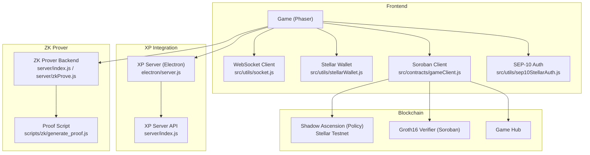
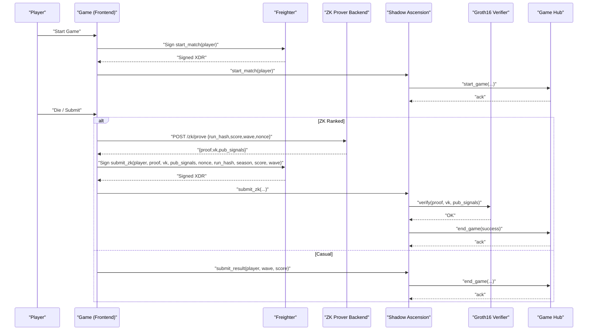
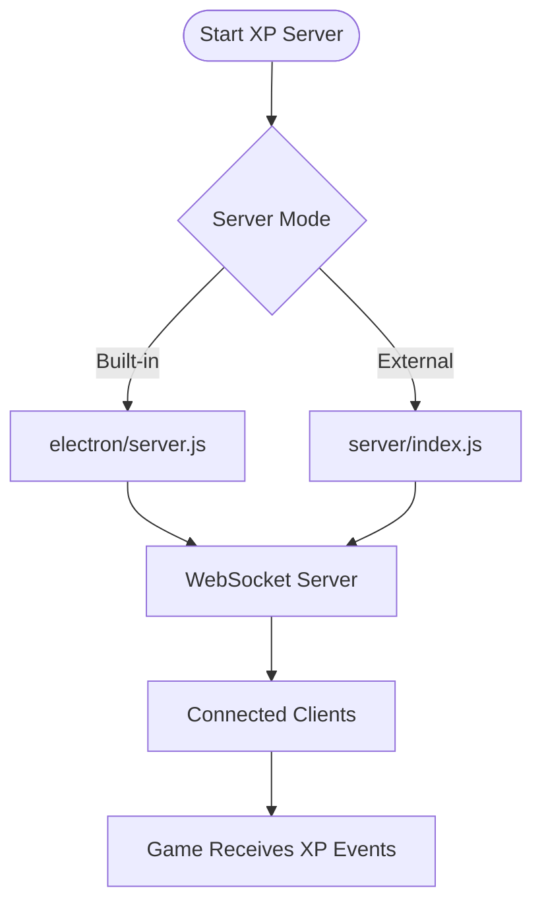
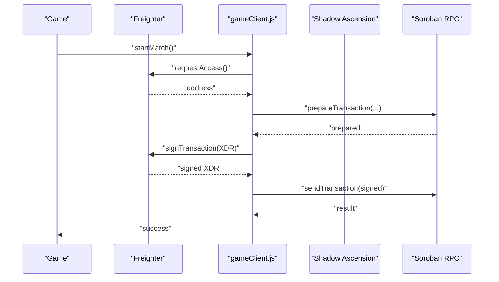
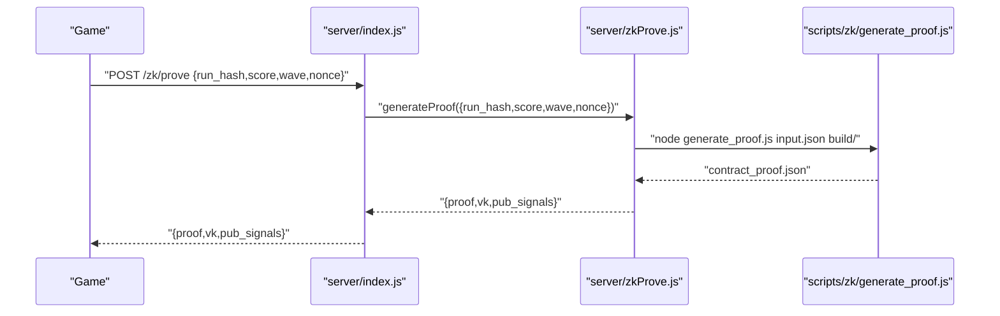
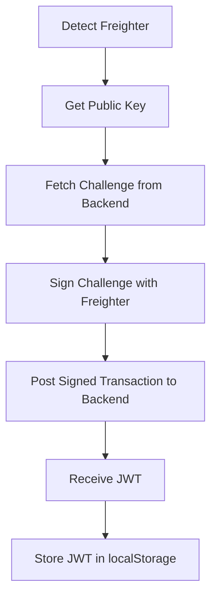
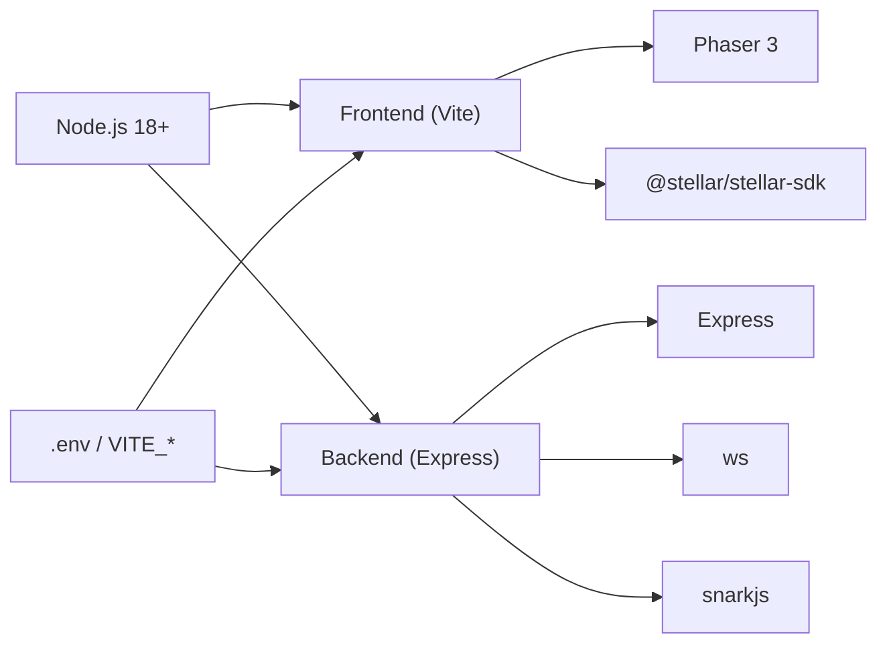

# Troubleshooting and FAQ

<cite>
**Referenced Files in This Document**
- [README.md](file://README.md)
- [SETUP.md](file://SETUP.md)
- [package.json](file://package.json)
- [.env.example](file://.env.example)
- [server/index.js](file://server/index.js)
- [src/utils/socket.js](file://src/utils/socket.js)
- [src/utils/stellarWallet.js](file://src/utils/stellarWallet.js)
- [src/contracts/gameClient.js](file://src/contracts/gameClient.js)
- [src/zk/gameProof.js](file://src/zk/gameProof.js)
- [electron/main.js](file://electron/main.js)
- [electron/server.js](file://electron/server.js)
- [src/utils/sep10StellarAuth.js](file://src/utils/sep10StellarAuth.js)
- [docs/DEPLOY_ZK_STEPS.md](file://docs/DEPLOY_ZK_STEPS.md)
- [docs/DEPLOY_PROVER.md](file://docs/DEPLOY_PROVER.md)
- [server/zkProve.js](file://server/zkProve.js)
- [scripts/zk/generate_proof.js](file://scripts/zk/generate_proof.js)
</cite>

## Table of Contents
1. [Introduction](#introduction)
2. [Project Structure](#project-structure)
3. [Core Components](#core-components)
4. [Architecture Overview](#architecture-overview)
5. [Detailed Component Analysis](#detailed-component-analysis)
6. [Dependency Analysis](#dependency-analysis)
7. [Performance Considerations](#performance-considerations)
8. [Troubleshooting Guide](#troubleshooting-guide)
9. [FAQ](#faq)
10. [Conclusion](#conclusion)
11. [Appendices](#appendices)

## Introduction
This document provides comprehensive troubleshooting guidance and a focused FAQ for Vibe-Coder. It covers installation and setup issues, runtime problems (WebSocket, AI tool integration, blockchain connectivity), performance tuning, debugging techniques, and step-by-step diagnostics. It also includes escalation paths for unresolved issues.

## Project Structure
Vibe-Coder is a browser-based idle game with optional Electron desktop packaging, an XP server for AI tool integration, and a backend ZK prover. Blockchain interactions leverage Stellar Testnet and Soroban contracts. The frontend connects to a WebSocket XP server, and optionally requests ZK proofs from a backend prover.

**Diagram sources**
- [src/utils/socket.js](file://src/utils/socket.js#L1-L121)
- [src/utils/stellarWallet.js](file://src/utils/stellarWallet.js#L1-L115)
- [src/contracts/gameClient.js](file://src/contracts/gameClient.js#L1-L401)
- [src/utils/sep10StellarAuth.js](file://src/utils/sep10StellarAuth.js#L1-L219)
- [electron/server.js](file://electron/server.js#L1-L183)
- [server/index.js](file://server/index.js#L1-L246)
- [server/zkProve.js](file://server/zkProve.js#L1-L68)
- [scripts/zk/generate_proof.js](file://scripts/zk/generate_proof.js#L1-L46)

**Section sources**
- [README.md](file://README.md#L115-L158)
- [SETUP.md](file://SETUP.md#L1-L221)
- [package.json](file://package.json#L1-L135)

## Core Components
- WebSocket XP server: Provides real-time XP events to the game via WebSocket and HTTP endpoints. Supports Electron-built-in server and external server modes.
- Blockchain client: Handles contract interactions (start_match, submit_result, submit_zk) and leaderboard queries using Soroban SDK.
- Wallet integration: Freighter-based wallet connection and transaction signing for Testnet.
- ZK prover: Generates Groth16 proofs for ranked submissions using Circom and snarkjs.
- Authentication: SEP-10 challenge/response flow with Freighter and JWT persistence.

**Section sources**
- [electron/server.js](file://electron/server.js#L1-L183)
- [server/index.js](file://server/index.js#L1-L246)
- [src/contracts/gameClient.js](file://src/contracts/gameClient.js#L1-L401)
- [src/utils/stellarWallet.js](file://src/utils/stellarWallet.js#L1-L115)
- [src/zk/gameProof.js](file://src/zk/gameProof.js#L1-L78)
- [src/utils/sep10StellarAuth.js](file://src/utils/sep10StellarAuth.js#L1-L219)

## Architecture Overview
The game connects to a WebSocket XP server (local or external). For ranked submissions, it computes a run hash, optionally requests a ZK proof from a prover backend, and submits to the policy contract on Testnet. The policy contract validates rules and interacts with the Game Hub and verifier.

**Diagram sources**
- [src/contracts/gameClient.js](file://src/contracts/gameClient.js#L76-L273)
- [server/index.js](file://server/index.js#L196-L216)
- [server/zkProve.js](file://server/zkProve.js#L46-L67)
- [README.md](file://README.md#L58-L67)

## Detailed Component Analysis

### WebSocket XP Server (Electron and Standalone)
- Electron built-in server listens on port 3001 and exposes WebSocket and HTTP endpoints.
- Standalone XP server listens on port 3333 and provides the same endpoints.
- The game’s WebSocket client connects only on localhost and retries on close.

**Diagram sources**
- [electron/server.js](file://electron/server.js#L75-L151)
- [server/index.js](file://server/index.js#L53-L125)
- [src/utils/socket.js](file://src/utils/socket.js#L18-L104)

**Section sources**
- [electron/server.js](file://electron/server.js#L1-L183)
- [server/index.js](file://server/index.js#L1-L246)
- [src/utils/socket.js](file://src/utils/socket.js#L1-L121)

### Blockchain Integration (Soroban)
- Contract IDs and prover URL are resolved from environment variables.
- Wallet signing uses Freighter; transactions are built, signed, and sent via Soroban RPC.
- Ranked submission requires a valid Groth16 proof and passes rule validation.

**Diagram sources**
- [src/contracts/gameClient.js](file://src/contracts/gameClient.js#L76-L95)
- [src/utils/stellarWallet.js](file://src/utils/stellarWallet.js#L39-L53)

**Section sources**
- [src/contracts/gameClient.js](file://src/contracts/gameClient.js#L1-L401)
- [src/utils/stellarWallet.js](file://src/utils/stellarWallet.js#L1-L115)

### ZK Prover Flow
- The frontend requests a ZK proof from the prover backend with run metadata.
- The backend builds an input, runs the proof generation script, and returns a contract-ready payload.
- The frontend converts the payload to ScVal and submits to the policy contract.

**Diagram sources**
- [src/contracts/gameClient.js](file://src/contracts/gameClient.js#L103-L121)
- [server/index.js](file://server/index.js#L196-L216)
- [server/zkProve.js](file://server/zkProve.js#L46-L67)
- [scripts/zk/generate_proof.js](file://scripts/zk/generate_proof.js#L1-L46)

**Section sources**
- [src/contracts/gameClient.js](file://src/contracts/gameClient.js#L97-L121)
- [server/index.js](file://server/index.js#L196-L216)
- [server/zkProve.js](file://server/zkProve.js#L1-L68)
- [scripts/zk/generate_proof.js](file://scripts/zk/generate_proof.js#L1-L46)

### SEP-10 Authentication
- Detects Freighter availability, obtains a public key, requests a challenge, signs it, exchanges for a JWT, and stores it for authenticated requests.

**Diagram sources**
- [src/utils/sep10StellarAuth.js](file://src/utils/sep10StellarAuth.js#L65-L164)

**Section sources**
- [src/utils/sep10StellarAuth.js](file://src/utils/sep10StellarAuth.js#L1-L219)

## Dependency Analysis
- Node.js version: The setup guide requires Node.js 18+.
- Frontend dependencies include Phaser, Stellar SDK, and Electron for desktop packaging.
- Backend depends on Express, ws, and snarkjs for ZK proof generation.
- Environment variables define contract IDs, prover URL, and backend API base URL.

**Diagram sources**
- [SETUP.md](file://SETUP.md#L19-L22)
- [package.json](file://package.json#L31-L51)
- [.env.example](file://.env.example#L1-L37)

**Section sources**
- [SETUP.md](file://SETUP.md#L19-L22)
- [package.json](file://package.json#L1-L135)
- [.env.example](file://.env.example#L1-L37)

## Performance Considerations
- Slow game performance:
  - Reduce asset sizes and ensure textures are loaded properly.
  - Disable unnecessary effects or animations during heavy frames.
  - Use the production build for distribution.
- High memory usage:
  - Clear browser cache and avoid multiple tabs running the game.
  - Ensure the game is served via the dev server and not static file hosting.
- ZK proof generation delays:
  - Ensure the prover backend is reachable and responsive.
  - Verify snarkjs and circuit artifacts are present and built correctly.
  - Consider deploying the prover to a cloud provider to avoid cold-start latency.

[No sources needed since this section provides general guidance]

## Troubleshooting Guide

### Installation and Setup Issues
- Node.js version conflicts:
  - Ensure Node.js 18+ is installed as required by the setup guide.
  - Use a version manager to switch versions if necessary.
- Dependency installation problems:
  - Run a clean install and ensure platform-specific binaries are built (e.g., Rust targets for contracts).
  - Verify that snarkjs and Circom are available in PATH for ZK tasks.
- Environment variable configuration:
  - Set VITE_SHADOW_ASCENSION_CONTRACT_ID and VITE_ZK_PROVER_URL for local or deployed environments.
  - Confirm backend environment variables for SEP-10 and Supabase if using authentication features.

**Section sources**
- [SETUP.md](file://SETUP.md#L19-L22)
- [package.json](file://package.json#L31-L51)
- [.env.example](file://.env.example#L5-L14)

### Runtime Issues

#### WebSocket Connection Failures
- Symptoms:
  - Status shows CONNECTING or OFFLINE.
  - XP does not appear in the game.
- Diagnostics:
  - Confirm the XP server is running (Electron built-in or external).
  - Check that the game is running on localhost; the WebSocket client only connects on localhost.
  - Inspect browser console for WebSocket errors.
- Fixes:
  - Start the XP server in a separate terminal.
  - Ensure firewall or proxy is not blocking the port.
  - Clear browser cache and hard refresh.

**Section sources**
- [SETUP.md](file://SETUP.md#L109-L124)
- [src/utils/socket.js](file://src/utils/socket.js#L18-L104)
- [electron/server.js](file://electron/server.js#L75-L151)
- [server/index.js](file://server/index.js#L53-L125)

#### AI Tool Integration Problems
- Symptoms:
  - Hooks not triggering XP events.
  - XP server logs show no activity.
- Diagnostics:
  - Verify hook file permissions and executability.
  - Manually test the hook script to ensure it executes without errors.
  - Confirm the XP server is reachable at the expected port.
- Fixes:
  - Make the hook executable and copy it to the appropriate hooks directory.
  - Adjust tool-specific configurations to match supported event types.

**Section sources**
- [SETUP.md](file://SETUP.md#L48-L83)
- [SETUP.md](file://SETUP.md#L109-L124)

#### Blockchain Connectivity Issues
- Symptoms:
  - Wallet connection fails or shows as disconnected.
  - Contract calls fail with missing contract ID or invalid arguments.
- Diagnostics:
  - Confirm VITE_SHADOW_ASCENSION_CONTRACT_ID is set.
  - Ensure Freighter is installed and accessible.
  - Verify Testnet passphrase and RPC endpoint.
- Fixes:
  - Set the correct contract ID in environment variables.
  - Reconnect the wallet and retry the operation.
  - Check that the policy contract is initialized with Game Hub and verifier.

**Section sources**
- [src/contracts/gameClient.js](file://src/contracts/gameClient.js#L11-L20)
- [src/utils/stellarWallet.js](file://src/utils/stellarWallet.js#L26-L53)
- [docs/DEPLOY_ZK_STEPS.md](file://docs/DEPLOY_ZK_STEPS.md#L70-L79)

#### ZK Setup and Proof Generation Issues
- Symptoms:
  - “ZK prover unavailable” or “Could not submit to chain.”
  - Prover returns errors or timeouts.
- Diagnostics:
  - Confirm VITE_ZK_PROVER_URL points to a deployed prover.
  - Verify circuits/build artifacts exist and are built.
  - Check that snarkjs is installed and accessible.
- Fixes:
  - Deploy the prover backend and update the frontend URL.
  - Rebuild the circuit and ensure zkey and wasm artifacts are present.
  - Increase timeouts or retry after initial cold start.

**Section sources**
- [docs/DEPLOY_PROVER.md](file://docs/DEPLOY_PROVER.md#L15-L18)
- [docs/DEPLOY_ZK_STEPS.md](file://docs/DEPLOY_ZK_STEPS.md#L81-L90)
- [server/zkProve.js](file://server/zkProve.js#L46-L67)
- [scripts/zk/generate_proof.js](file://scripts/zk/generate_proof.js#L23-L30)

### Debugging Techniques
- Frontend debugging:
  - Open browser DevTools and monitor the WebSocket connection and XP events.
  - Check for errors in the console related to missing assets or network issues.
- Backend debugging:
  - Review server logs for XP broadcast and error responses.
  - Use health endpoints to confirm service status.
- Blockchain integration debugging:
  - Verify contract IDs and prover URL resolution.
  - Simulate contract calls to inspect return values and errors.

**Section sources**
- [src/utils/socket.js](file://src/utils/socket.js#L54-L72)
- [server/index.js](file://server/index.js#L218-L224)
- [src/contracts/gameClient.js](file://src/contracts/gameClient.js#L278-L327)

### Step-by-Step Diagnostic Procedures
- WebSocket diagnostics:
  1. Confirm the XP server is running.
  2. Open the game on localhost and observe connection status.
  3. Check browser console for WebSocket errors.
  4. If offline, start the XP server and refresh.
- ZK diagnostics:
  1. Verify VITE_ZK_PROVER_URL and that the prover responds to health checks.
  2. Ensure circuits/build contains required artifacts.
  3. Test the prover endpoint with a minimal request payload.
- Blockchain diagnostics:
  1. Confirm VITE_SHADOW_ASCENSION_CONTRACT_ID is set.
  2. Connect the wallet and verify address retrieval.
  3. Attempt a simple contract read (leaderboard) to validate RPC connectivity.

**Section sources**
- [src/utils/socket.js](file://src/utils/socket.js#L18-L104)
- [server/index.js](file://server/index.js#L196-L216)
- [src/contracts/gameClient.js](file://src/contracts/gameClient.js#L278-L327)

### Escalation Paths
- For unresolved issues, gather logs and environment details, then open an issue with:
  - Node.js and package versions
  - OS and browser details
  - Logs from the XP server and browser console
  - Steps to reproduce and expected vs. actual behavior

**Section sources**
- [SETUP.md](file://SETUP.md#L212-L217)

## FAQ

### Wallet Connection Problems
- Q: The wallet does not connect.
  - Ensure Freighter is installed and accessible. Try reconnecting and confirming the extension prompts.
- Q: After connecting, the game still shows disconnected.
  - Clear local storage and reconnect. Confirm the address is cached and displayed.

**Section sources**
- [src/utils/stellarWallet.js](file://src/utils/stellarWallet.js#L26-L88)

### ZK Setup Issues
- Q: The prover is unreachable.
  - Verify VITE_ZK_PROVER_URL points to a deployed service. Check CORS and health endpoints.
- Q: Prover returns “circuit not built.”
  - Ensure npm run zk:build completes and circuits/build contains the final zkey and wasm.

**Section sources**
- [docs/DEPLOY_PROVER.md](file://docs/DEPLOY_PROVER.md#L15-L18)
- [server/zkProve.js](file://server/zkProve.js#L49-L54)

### Cross-Platform Compatibility
- Q: The game runs differently on macOS vs. Windows.
  - Use the Electron desktop app for consistent behavior across platforms.
  - Ensure the same Node.js version and dependencies are installed.

**Section sources**
- [README.md](file://README.md#L149-L154)
- [package.json](file://package.json#L52-L133)

### Why does the game not connect to the XP server?
- The WebSocket client only connects when running on localhost. If using a static file server or remote host, the client will not attempt a connection.

**Section sources**
- [src/utils/socket.js](file://src/utils/socket.js#L18-L21)

### How do I configure the frontend for local development?
- Set VITE_SHADOW_ASCENSION_CONTRACT_ID and VITE_ZK_PROVER_URL in your environment. Restart the dev server to pick up changes.

**Section sources**
- [.env.example](file://.env.example#L5-L14)
- [SETUP.md](file://SETUP.md#L70-L79)

## Conclusion
This guide consolidates actionable steps to resolve common installation, runtime, and performance issues in Vibe-Coder. By validating environment variables, ensuring server connectivity, and verifying blockchain and ZK configurations, most problems can be quickly diagnosed and fixed. For persistent issues, escalate with detailed logs and reproduction steps.

## Appendices

### Environment Variables Reference
- VITE_SHADOW_ASCENSION_CONTRACT_ID: Policy contract ID on Testnet.
- VITE_ZK_PROVER_URL: URL to the ZK prover backend.
- VITE_API_URL: Base URL for backend APIs.

**Section sources**
- [.env.example](file://.env.example#L5-L14)

### Backend Endpoints Reference
- GET /: Health check for load balancers.
- GET /.well-known/stellar.toml: SEP-10 TOML discovery.
- POST /event: Broadcast XP events to clients.
- POST /cli/:source: CLI-specific XP events.
- GET /health: Server health and client count.
- POST /zk/prove: Generate ZK proof for ranked submission.

**Section sources**
- [server/index.js](file://server/index.js#L22-L24)
- [server/index.js](file://server/index.js#L30-L51)
- [server/index.js](file://server/index.js#L99-L125)
- [server/index.js](file://server/index.js#L218-L224)
- [server/index.js](file://server/index.js#L196-L216)